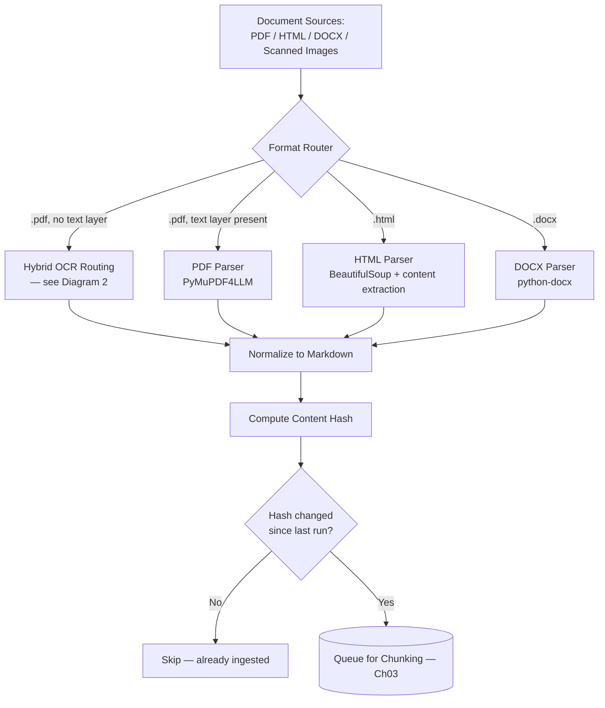
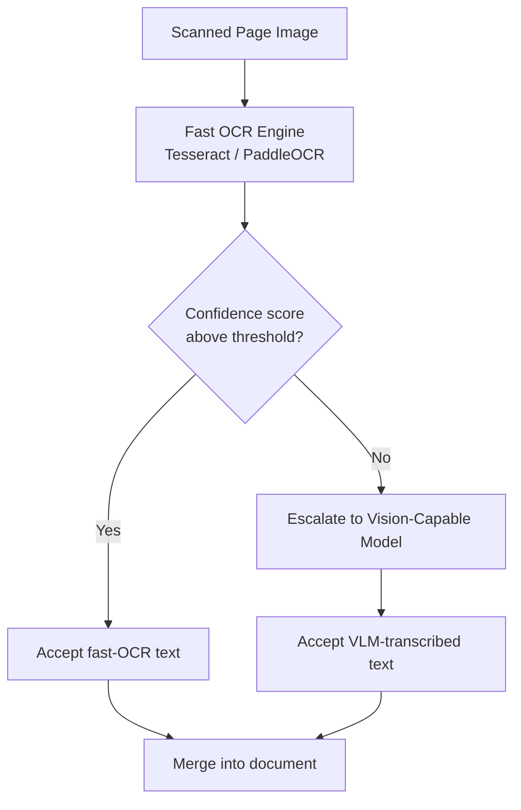
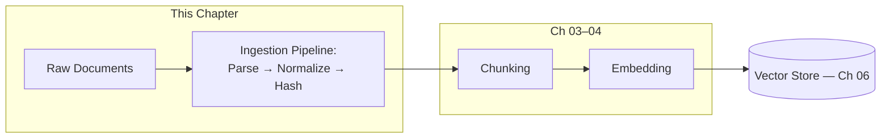
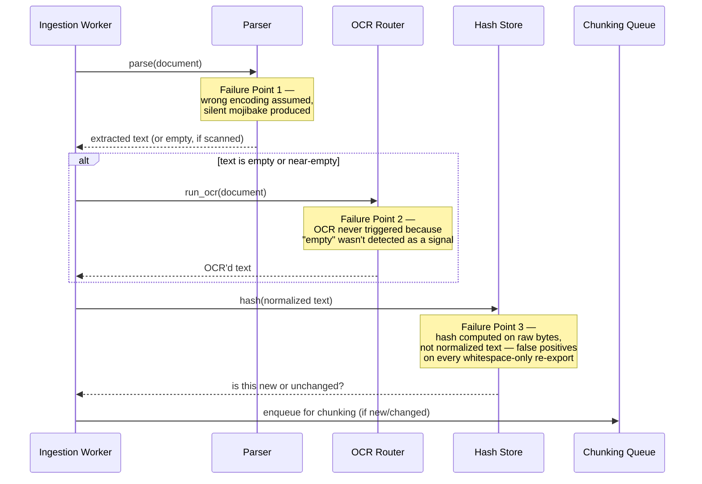
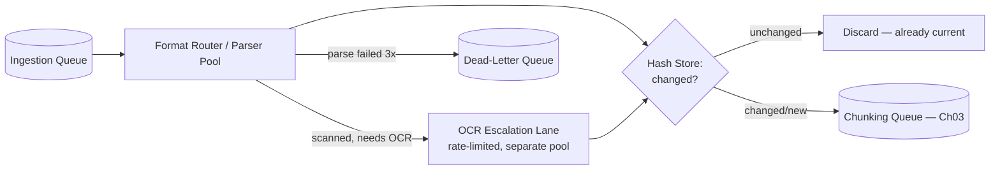
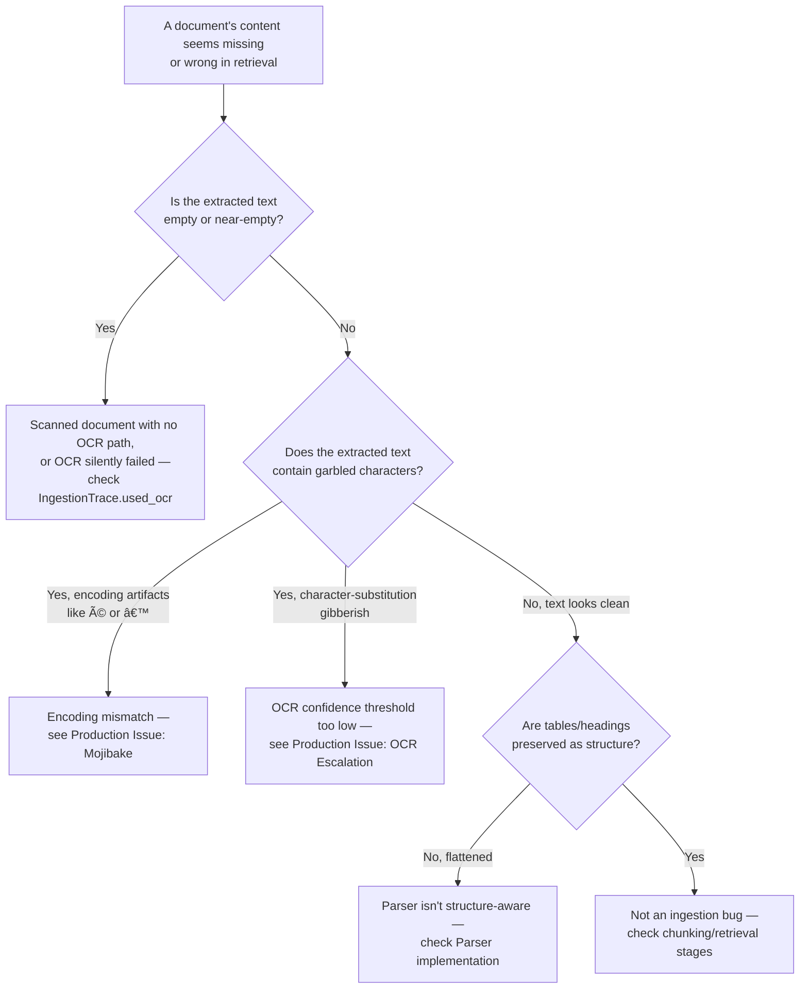

# Chapter 02 — Document Ingestion at Scale

> "A RAG system has never once retrieved the wrong answer from a document it never actually read correctly in the first place."

**Learning Objectives**

By the end of this chapter, you will be able to:

- Explain why parsing quality is a retrieval-quality problem — not preprocessing busywork — and trace a garbled parse back to a specific Chapter 01 failure mode.
- Choose the right parsing tool for a given document type instead of reaching for one library for everything.
- Build a hybrid OCR pipeline that routes clean scans to a fast, cheap engine and escalates only the messy pages to a vision-capable model.
- Design an ingestion pipeline that keeps parsing, normalization, and chunking as separate, independently testable stages.
- Implement change-aware incremental ingestion using content hashing, so re-running ingestion doesn't re-embed documents that haven't changed.
- Preserve document structure — headings, lists, tables — through parsing, so it survives into the chunking stage that Chapter 03 builds on.
- Handle a mixed corpus (PDF + HTML + DOCX + scanned images) through one unified ingestion interface.
- Diagnose a broken or empty parse and localize it to encoding, layout, or missing-OCR failure — before assuming retrieval or the model is at fault.

**Prerequisites**

- Chapter 01 (RAG Architecture Deep Dive) completed — this chapter builds directly on the `PipelineTrace` pattern and the Protocol-based interface style introduced there.
- Comfortable Python, including dataclasses and basic `async`/`await`.
- `pip install pymupdf4llm beautifulsoup4 python-docx pytesseract pillow opencv-python` in your virtual environment. `pytesseract` additionally requires the Tesseract OCR binary installed on your system (`brew install tesseract` on macOS, `apt install tesseract-ocr` on Debian/Ubuntu). `opencv-python` is required for `pymupdf4llm`'s own built-in OCR path (used in the Intermediate Implementation) — the Advanced Implementation's hybrid routing bypasses it and uses `pytesseract` directly.
- An OpenAI-compatible vision-capable chat model (for the hybrid OCR escalation path) or willingness to substitute any vision LLM you have access to.

**Estimated Reading Time:** 80–90 minutes
**Estimated Hands-on Time:** 3–4 hours

---

## ⚡ Fast Read

> **Skim time: 5 minutes** — Read this if you're in a hurry, returning for reference, or already familiar with part of this topic.

- **What it is:** How to turn a messy, multi-format pile of real documents — PDFs, HTML pages, Word docs, scanned images — into clean, structure-preserving text that's actually safe to chunk and embed.
- **Why it matters:** Chapter 01's failure taxonomy has an entire category, "Missed Top Documents," whose most common real-world cause isn't a weak embedding model — it's that the document was never parsed correctly in the first place, so there was never any usable text to embed.
- **Key insight:** Running OCR on every scanned page with the most powerful (and most expensive) vision model available is not the 2026 best practice — the production pattern is **hybrid routing**: a fast, cheap OCR engine handles clean scans, and only pages it's unsure about get escalated to a vision-capable model.
- **What you build:** A unified ingestion pipeline — one interface, multiple format-specific parsers underneath — with hybrid OCR routing and change-aware incremental re-ingestion via content hashing.
- **Jump to:** [Core Concepts](#core-concepts) | [First Code](#beginner-implementation) | [Best Practices](#best-practices) | [Mini Project](#mini-project)

---

## Why This Topic Exists

Chapter 01's naive pipeline started with `DOCUMENTS`, a Python list of three clean, hand-written strings. That was a deliberate simplification to isolate the *architecture* of RAG from the *mess* of real documents — but it hid the single most common source of production RAG failures: real documents are not clean strings.

A real corpus is a landfill of formats. Some PDFs are clean, single-column, digitally generated text — trivial to extract. Others are two-column academic-style layouts where naive extraction interleaves the columns into nonsense. Some are scanned photocopies of typed pages — no text layer at all, just pixels. Some are scanned *handwritten* forms. HTML pages come wrapped in navigation bars, cookie banners, and ad scripts that have nothing to do with the actual content. Word documents carry tracked changes, embedded comments, and revision history alongside the real text. And behind all of it sits the quietest failure of all: character encoding — a document parsed with the wrong encoding doesn't error out, it just silently produces garbage characters (called **mojibake**) that get embedded and retrieved with total confidence.

None of this is exotic. It's the default condition of every real document corpus larger than a demo. And every failure in this chapter happens *before* Chapter 01's pipeline even starts — which means no amount of better chunking, better embeddings, or better re-ranking can fix a document that was never read correctly in the first place. This chapter is where "Ingestion" in Chapter 01's Diagram 2 stops being a single unlabeled box and becomes a real, production-grade pipeline stage.

---

## Real-World Analogy

**The Intake Clerk at a Multilingual Records Office**

Picture a government records office that accepts documents from the public in any format: a clean typed form, a handwritten note, a photocopy of a photocopy, a fax with half the page cut off, a bound multi-page report. The intake clerk's job isn't just "read the document" — it's to convert every one of these wildly different physical objects into the *same* standardized case file format before anyone downstream ever sees it.

A clean typed form gets transcribed directly — fast, cheap, no ambiguity. A photocopy that's still legible gets read by a junior clerk trained to recognize standard printed fonts quickly. But a barely-legible handwritten note or a smudged fax gets pulled aside and handed to the senior clerk — slower, more expensive, but far more likely to get it right. Critically, the office doesn't send *every* document to the senior clerk "just to be safe" — that would make the whole office grind to a halt. It routes based on how much confidence the fast path has in what it read.

And every case file that comes out of intake carries a stamped receipt number and a fingerprint of the original document, so that if the same document shows up again next year unchanged, the office doesn't re-process it from scratch — it just checks the fingerprint and says "already on file." That fingerprint is exactly what content hashing does for your ingestion pipeline later in this chapter.

---

## Core Concepts

### Document Parsing

- **Technical definition:** The process of extracting text content and structural metadata (headings, lists, tables, reading order) from a source file format into a normalized, machine-usable representation.
- **Simple definition:** Turning a PDF, HTML page, or Word doc into plain text (ideally with its structure kept intact) that a computer can actually work with.
- **Analogy:** The intake clerk's transcription step — converting a physical object into a standardized case file.

### Layout-Aware Parsing vs. Naive Text Extraction

- **Technical definition:** Naive text extraction reads characters in the order they appear in the underlying file's internal structure, which for multi-column or table-heavy documents does not match visual reading order. Layout-aware parsing uses the document's geometric layout (column boundaries, table grid lines) to reconstruct the correct reading order before extracting text.
- **Simple definition:** Naive extraction can read a two-column page left-to-right straight across both columns, mashing two unrelated sentences together. Layout-aware parsing reads down one column, then the next — like a human would.
- **Analogy:** Reading a newspaper by scanning straight across the whole page, ignoring the column breaks, versus reading it the way it was actually meant to be read.

### Optical Character Recognition (OCR)

- **Technical definition:** The process of converting an image of text (a scanned page, a photograph of a document) into machine-readable character data, since a scanned page has no underlying text layer — only pixels.
- **Simple definition:** Teaching the computer to "read" a picture of text, the way a human reads a photocopy.
- **Analogy:** The difference between handing someone a typed letter (they just read it) versus handing them a photograph of a letter (they have to visually recognize each word from the image first).

### Hybrid OCR Routing

- **Technical definition:** An ingestion pattern that classifies each scanned page by extraction confidence, sending high-confidence pages through a fast, low-cost OCR engine, and escalating only low-confidence pages to a slower, more accurate (and more expensive) vision-capable model.
- **Simple definition:** Don't use the expensive, powerful tool on every single scanned page — only on the ones the cheap tool struggled with.
- **Analogy:** The intake office routing only the illegible handwriting to the senior clerk, not every single document that comes through the door.

### Structure Preservation

- **Technical definition:** Retaining a document's semantic structure — heading levels, list boundaries, table rows/columns — through the parsing step, typically by converting into a structure-aware format like Markdown rather than flattening everything into one undifferentiated block of text.
- **Simple definition:** Keeping "this is a heading," "this is a table," and "this is a bullet list" information intact, instead of just dumping every word onto one long line.
- **Analogy:** The difference between photocopying a filing cabinet's folders with their labels and dividers intact versus dumping every page from every folder into one giant unsorted pile.

### Content Hashing (Change Detection)

- **Technical definition:** Computing a deterministic fingerprint (typically a cryptographic hash like SHA-256) of a document's normalized content, stored alongside its ingested chunks, so a re-ingestion run can compare the current hash to the stored one and skip re-processing unchanged documents.
- **Simple definition:** A fingerprint that lets the pipeline instantly tell "this document hasn't changed since last time" without re-reading the whole thing.
- **Analogy:** The records office's receipt-number stamp — check the stamp before re-filing something that's already on record.

### Document Normalization

- **Technical definition:** Converting parsed output from many different source formats into one single canonical representation (commonly Markdown) so that every downstream pipeline stage — chunking, embedding — only ever has to handle one format.
- **Simple definition:** No matter what came in — PDF, HTML, DOCX — what comes out the other side looks the same.
- **Analogy:** The records office's standardized case-file template — whatever format the original document arrived in, the case file itself always looks the same.

### Ingestion Pipeline

- **Technical definition:** The offline, asynchronous subsystem responsible for taking raw source documents through parsing, normalization, structure extraction, and content hashing, and handing normalized output to the chunking stage — architecturally distinct from the online query path (Chapter 01, Diagram 3).
- **Simple definition:** The assembly line that turns a folder of messy files into clean, ready-to-chunk documents.
- **Analogy:** The records office's entire intake department, not just one clerk.

---

## Architecture Diagrams

### Diagram 1 — Multi-Format Ingestion Pipeline



### Diagram 2 — Hybrid OCR Routing



The entire point of this diagram: most production documents don't need the expensive path. A pipeline that sends every page straight to a vision model is both needlessly expensive and, at scale, needlessly slow — the routing decision in the middle is what keeps hybrid OCR economical.

### Diagram 3 — Where Ingestion Sits in the Full System



This is the same "Ingestion" box from Chapter 01's Diagram 1 and Diagram 2, expanded. Everything in this chapter happens **before** a single chunk is ever created — chunking (Chapter 03) operates on the clean, normalized Markdown this chapter produces, never on raw PDF bytes.

---

## Flow Diagrams

### The Lifecycle of a Single Document Through Ingestion — With Failure Points



---

## Beginner Implementation

We'll start with the two easiest cases: a clean, digitally-generated PDF and a real HTML page — no OCR needed yet. This directly replaces Chapter 01's hardcoded `DOCUMENTS` list with real parsing.

```python
# Learning example — beginner_ingestion.py
# Parses one clean PDF and one HTML page into normalized Markdown.

import pymupdf4llm
from bs4 import BeautifulSoup
import requests

def parse_pdf(path: str) -> str:
    """
    pymupdf4llm.to_markdown() does three things naive text extraction
    doesn't: it respects multi-column layout, it reconstructs tables as
    Markdown tables (not flattened text), and it converts headings into
    Markdown '#' syntax using font-size heuristics. For a clean, digitally
    generated PDF, this is close to a one-line solution.

    NOTE: to_markdown() defaults to use_ocr=True — it already runs OCR
    automatically on any page with too little extractable text. We pass
    use_ocr=False here on purpose, to see what pure text-layer extraction
    looks like on its own. The Advanced Implementation later explains why
    a production pipeline usually wants to take over OCR itself instead of
    relying on this built-in default.
    """
    return pymupdf4llm.to_markdown(path, use_ocr=False)

def parse_html(html: str) -> str:
    """
    NAIVE-BUT-HONEST: raw HTML is full of content that has nothing to do
    with the document — nav bars, footers, cookie banners, <script> tags.
    We deliberately strip the most common noise elements before extracting
    text. This is a heuristic, not a guarantee — Intermediate below shows
    a more robust content-extraction approach.
    """
    soup = BeautifulSoup(html, "html.parser")
    for tag in soup(["script", "style", "nav", "footer", "header", "aside"]):
        tag.decompose()
    # get_text with a separator prevents words from adjacent tags from
    # being jammed together with no space, a very common naive-parsing bug.
    text = soup.get_text(separator="\n", strip=True)
    return text

if __name__ == "__main__":
    pdf_markdown = parse_pdf("aperture_api_reference.pdf")
    print(pdf_markdown[:500])

    response = requests.get("https://docs.aperturecloud.example/export-endpoint")
    html_text = parse_html(response.text)
    print(html_text[:500])
```

**Walking through what's actually happening:**

- `pymupdf4llm.to_markdown` is doing real layout analysis under the hood — it isn't just "extract all the characters." Run it on a two-column PDF and compare the output to `pypdf`'s naive `extract_text()` on the same file; the naive version interleaves the two columns into nonsense, while `pymupdf4llm` produces the correct reading order. This single library choice prevents an entire class of "Missed Top Documents" failures from Chapter 01's taxonomy, before you've written a line of chunking code.
- **Important library behavior:** by default, `to_markdown()` already runs OCR automatically (`use_ocr=True`) whenever a page lacks enough extractable text — you don't have to ask for it. That's genuinely convenient for a quick script. But it's a single fixed OCR engine applied uniformly to every page that needs it, with no way to tell afterward *which* pages were OCR'd, how confident the OCR was, or to selectively send only the hardest pages to a more accurate (and more expensive) model. That gap — not "PDF parsing forgets about scanned documents" — is the real problem the Advanced Implementation below solves. We pass `use_ocr=False` here specifically to isolate what pure text-layer extraction looks like on a scanned page: an empty or near-empty string, since there's no OCR step to fall back on and no text layer to read. That silent-empty-string behavior is exactly Failure Point 2 in this chapter's sequence diagram.
- `parse_html`'s tag-stripping list (`script`, `style`, `nav`, `footer`, `header`, `aside`) is a heuristic that works for a lot of real sites but not all of them — a page with content inside a `<div class="sidebar">` full of unrelated links will still pollute your corpus. This is a real, common source of "vocabulary mismatch" retrieval failures: junk text diluting a chunk's embedding.

---

## Intermediate Implementation

Now we unify PDF, HTML, and DOCX parsing behind one interface — following the same `Protocol`-based pattern Chapter 01 used for `Retriever`/`Reranker`/`Generator` — and add content hashing for change detection.

```python
# Learning example — intermediate_ingestion.py
# A unified Parser interface across formats, plus content-hash-based
# change detection so re-running ingestion doesn't redo unchanged work.

from __future__ import annotations
from dataclasses import dataclass
from pathlib import Path
from typing import Protocol
import hashlib

import pymupdf4llm
from bs4 import BeautifulSoup
import docx  # python-docx

@dataclass
class ParsedDocument:
    text: str            # normalized Markdown
    source: str           # original file path or URL
    content_hash: str     # fingerprint of the normalized text

class Parser(Protocol):
    """Every format-specific parser satisfies this, mirroring Ch01's
    Retriever/Reranker/Generator Protocol pattern — new formats plug in
    without touching the dispatcher below."""
    def can_parse(self, path: Path) -> bool: ...
    def parse(self, path: Path) -> str: ...  # returns normalized Markdown

class PdfParser:
    def can_parse(self, path: Path) -> bool:
        return path.suffix.lower() == ".pdf"

    def parse(self, path: Path) -> str:
        # Left at its default here (use_ocr=True) — the library's built-in,
        # single-tier OCR is a reasonable default for a straightforward
        # unified parser. The Advanced Implementation later replaces this
        # with explicit hybrid routing when confidence-aware OCR matters.
        return pymupdf4llm.to_markdown(str(path))

class HtmlParser:
    def can_parse(self, path: Path) -> bool:
        return path.suffix.lower() in (".html", ".htm")

    def parse(self, path: Path) -> str:
        soup = BeautifulSoup(path.read_text(encoding="utf-8", errors="replace"), "html.parser")
        for tag in soup(["script", "style", "nav", "footer", "header", "aside"]):
            tag.decompose()
        # Preserve heading structure as Markdown instead of flattening —
        # this is what lets Ch03's structure-aware chunker split on
        # section boundaries instead of guessing from raw text alone.
        lines = []
        for el in soup.find_all(["h1", "h2", "h3", "p", "li"]):
            if el.name.startswith("h"):
                level = int(el.name[1])
                lines.append(f"{'#' * level} {el.get_text(strip=True)}")
            else:
                lines.append(el.get_text(strip=True))
        return "\n\n".join(line for line in lines if line)

class DocxParser:
    def can_parse(self, path: Path) -> bool:
        return path.suffix.lower() == ".docx"

    def parse(self, path: Path) -> str:
        document = docx.Document(str(path))
        lines = []
        for para in document.paragraphs:
            if not para.text.strip():
                continue
            # python-docx exposes the Word "style" (Heading 1, Heading 2,
            # Normal, ...) — this is how we recover structure instead of
            # treating every paragraph as equally flat text.
            style = para.style.name if para.style else "Normal"
            if style.startswith("Heading"):
                level = style.replace("Heading ", "") or "1"
                lines.append(f"{'#' * int(level)} {para.text.strip()}")
            else:
                lines.append(para.text.strip())
        return "\n\n".join(lines)

PARSERS: list[Parser] = [PdfParser(), HtmlParser(), DocxParser()]

def route_and_parse(path: Path) -> str:
    for parser in PARSERS:
        if parser.can_parse(path):
            return parser.parse(path)
    raise ValueError(f"No parser registered for {path.suffix}")

def content_hash(text: str) -> str:
    """
    Hash the NORMALIZED text, not the raw file bytes. Hashing raw bytes
    means a PDF re-exported by a different tool with byte-for-byte
    different metadata — but identical visible content — registers as
    "changed" and triggers a wasted, expensive re-embed. Hashing the
    normalized Markdown output means only actual content changes count.
    """
    return hashlib.sha256(text.encode("utf-8")).hexdigest()

def ingest_document(path: Path, known_hashes: dict[str, str]) -> ParsedDocument | None:
    text = route_and_parse(path)
    h = content_hash(text)
    if known_hashes.get(str(path)) == h:
        return None  # unchanged since last ingestion run — skip
    return ParsedDocument(text=text, source=str(path), content_hash=h)
```

**What changed, and why each change matters:**

1. **The `Parser` Protocol** is the exact same architectural pattern as Chapter 01's `Retriever`. Adding support for a new format (say, PowerPoint) later means writing one new class and adding it to `PARSERS` — nothing else in the pipeline changes.
2. **Structure preservation in `HtmlParser` and `DocxParser`** — both now emit Markdown headings (`#`, `##`) instead of flat paragraphs. This is not cosmetic: Chapter 03's structure-aware chunking depends entirely on headings surviving into this output. A parser that flattens structure here makes good chunking architecturally impossible later, no matter how sophisticated the chunker is.
3. **Hashing normalized text, not raw bytes** — this single design decision is the difference between an incremental ingestion pipeline that actually skips unchanged work and one that silently re-embeds your entire corpus every single run because of harmless export-tool metadata differences.
4. **`route_and_parse` still says nothing about scanned PDFs** — `PdfParser` will happily return a near-empty string for a scanned document, exactly like the Beginner version. We fix that properly next.

---

## Advanced Implementation

Production ingestion needs the hybrid OCR routing from Diagram 2, plus the observability pattern from Chapter 01's `PipelineTrace`, applied to the ingestion side of the system.

As noted above, `pymupdf4llm.to_markdown()` already runs its own OCR by default — but as one fixed engine applied uniformly, with no confidence score, no escalation path, and no record of which pages needed it. To get the routing behavior from Diagram 2, this implementation explicitly turns the built-in OCR **off** (`use_ocr=False`) and takes over that responsibility itself, page by page.

```python
# Production example — advanced_ingestion.py
# Adds: hybrid OCR routing (fast engine → vision-model escalation),
# an IngestionTrace mirroring Ch01's PipelineTrace, and explicit
# handling of the "empty extraction = probably scanned" signal.

from __future__ import annotations
from dataclasses import dataclass, field
from pathlib import Path
import base64
import logging
import time
import uuid

import pymupdf4llm
import fitz  # PyMuPDF, used here to rasterize pages to images for OCR
import pytesseract
from PIL import Image
from openai import OpenAI

logger = logging.getLogger("ingestion_pipeline")
client = OpenAI()

EMPTY_TEXT_THRESHOLD = 20       # characters — below this, assume "scanned, no text layer"
OCR_CONFIDENCE_THRESHOLD = 60   # pytesseract's 0-100 confidence score

@dataclass
class IngestionTrace:
    """Mirrors Ch01's PipelineTrace — same reasoning: every field here is
    exactly what you need later to answer 'why did this document ingest
    wrong' without re-running the whole pipeline."""
    trace_id: str = field(default_factory=lambda: str(uuid.uuid4()))
    source: str = ""
    stage_timings_ms: dict[str, float] = field(default_factory=dict)
    used_ocr: bool = False
    ocr_escalated_pages: list[int] = field(default_factory=list)
    content_hash: str | None = None
    skipped_unchanged: bool = False

def fast_ocr(image: Image.Image) -> tuple[str, float]:
    """Tesseract, run in structured-output mode so we get a confidence
    score, not just text — the confidence score is what makes routing
    possible at all."""
    data = pytesseract.image_to_data(image, output_type=pytesseract.Output.DICT)
    words = [w for w in data["text"] if w.strip()]
    confidences = [int(c) for c, w in zip(data["conf"], data["text"]) if w.strip() and c != "-1"]
    avg_confidence = sum(confidences) / len(confidences) if confidences else 0.0
    return " ".join(words), avg_confidence

def vlm_ocr(image: Image.Image) -> str:
    """Escalation path: a vision-capable chat model reads the page image
    directly. Slower and more expensive per page than Tesseract, which is
    exactly why this only runs on pages that failed the fast path —
    calling this for every page in a large corpus is the single most
    common way an ingestion pipeline's budget gets blown."""
    import io
    buf = io.BytesIO()
    image.save(buf, format="PNG")
    b64_image = base64.b64encode(buf.getvalue()).decode()

    response = client.chat.completions.create(
        model="gpt-4o-mini",  # any vision-capable chat model works here
        messages=[{
            "role": "user",
            "content": [
                {"type": "text", "text": "Transcribe all text in this scanned page exactly as written. Output only the transcription."},
                {"type": "image_url", "image_url": {"url": f"data:image/png;base64,{b64_image}"}},
            ],
        }],
    )
    return response.choices[0].message.content

def ocr_pdf_page(page: fitz.Page) -> tuple[str, bool]:
    """Renders a page to an image, tries fast OCR first, escalates only
    if confidence is below threshold. Returns (text, was_escalated)."""
    pix = page.get_pixmap(dpi=200)
    image = Image.frombytes("RGB", (pix.width, pix.height), pix.samples)

    text, confidence = fast_ocr(image)
    if confidence >= OCR_CONFIDENCE_THRESHOLD and text.strip():
        return text, False

    logger.info("page confidence %.1f below threshold, escalating to VLM", confidence)
    return vlm_ocr(image), True

def ingest_pdf(path: Path) -> tuple[str, IngestionTrace]:
    trace = IngestionTrace(source=str(path))

    t0 = time.perf_counter()
    # use_ocr=False: we want pure text-layer extraction here, and to make
    # our own OCR decision per page below — not the library's single-tier
    # built-in OCR, which can't tell us confidence or which pages it used.
    text = pymupdf4llm.to_markdown(str(path), use_ocr=False)
    trace.stage_timings_ms["direct_extract"] = (time.perf_counter() - t0) * 1000

    # This check is the fix for Failure Point 2 in this chapter's sequence
    # diagram: an empty or near-empty extraction is treated as a SIGNAL
    # that OCR is needed, not silently accepted as "the document is short."
    if len(text.strip()) < EMPTY_TEXT_THRESHOLD:
        trace.used_ocr = True
        t0 = time.perf_counter()
        doc = fitz.open(str(path))
        pages_text = []
        for i, page in enumerate(doc):
            page_text, escalated = ocr_pdf_page(page)
            pages_text.append(page_text)
            if escalated:
                trace.ocr_escalated_pages.append(i)
        text = "\n\n".join(pages_text)
        trace.stage_timings_ms["ocr"] = (time.perf_counter() - t0) * 1000

    logger.info(
        "trace_id=%s used_ocr=%s escalated_pages=%d stages=%s",
        trace.trace_id, trace.used_ocr, len(trace.ocr_escalated_pages),
        {k: round(v, 1) for k, v in trace.stage_timings_ms.items()},
    )
    return text, trace
```

**Why this shape earns its complexity:**

- **Turning off the built-in OCR is a deliberate trade.** We give up the convenience of a one-line auto-OCR call in exchange for per-page confidence scores and an explicit escalation record — worth it the moment cost, accuracy visibility, or a mixed-quality scan batch matters, which in production, it usually does.
- **The empty-text check is a guard, not a footnote.** It is the ingestion-side equivalent of Chapter 01's relevance-threshold guard: a specific, structural check that turns a silent failure (empty content flowing downstream as if it were normal) into an explicit, handled branch.
- **Confidence-based routing, not format-based routing.** Notice the decision to escalate is based on Tesseract's *actual confidence score* on *this specific page*, not a blanket "all scanned PDFs go to the VLM" rule. A single scanned PDF can have some clean pages and some smudged ones — this pipeline treats each page independently, which is what keeps the average cost per document low.
- **`IngestionTrace` mirrors `PipelineTrace` from Chapter 01 on purpose.** `ocr_escalated_pages` alone answers "why did this document cost more to ingest than expected" without re-running anything — exactly the debugging value Chapter 01 established for the query path, now applied to ingestion.

---

## Production Architecture

Extending Chapter 01's Diagram 3 (Production Deployment Topology), the **Ingestion Worker Pool** box expands into:

- **Format router + parser pool** — stateless workers pulling documents off a queue, running the `Parser` dispatch from the Intermediate implementation. Horizontally scalable — more workers, more parsing throughput, with no shared state between them.
- **OCR escalation as a separate, rate-limited lane.** Vision-model API calls have their own latency and rate-limit characteristics distinct from local Tesseract calls — production systems typically run OCR escalation through its own worker pool with its own concurrency limits, so a burst of scanned documents can't starve the fast-path parsing lane of resources.
- **A hash store** (a simple key-value store — Redis, or a table in your primary database — mapping `source_path → content_hash`) that every ingestion run checks before doing any parsing work at all. This is what makes "re-run ingestion nightly" cheap instead of a full corpus re-embed every time.
- **A dead-letter queue** for documents that fail to parse after retries — corrupt PDFs, password-protected files, unsupported formats. These should be surfaced to a human, not silently dropped or endlessly retried.



> **Currency Note:** The specific tool recommendations in this chapter — PyMuPDF4LLM as the default PDF-to-Markdown path, hybrid OCR routing over "always use a VLM" — reflect the document-parsing and OCR landscape as verified in mid-2026. This space has moved meaningfully even in the two years prior (vision-LLM-based OCR overtaking traditional OCR engines on messy documents is itself a recent shift) and will likely keep moving. What's stable is the *pattern* — route by confidence, preserve structure, hash to avoid redundant work — regardless of which specific library implements each stage.

---

## Best Practices

1. **Never assume a `.pdf` extension means "has a text layer."** Always check extracted text length as a signal, exactly as the Advanced implementation does — a scanned PDF and a digitally generated PDF share a file extension and nothing else.
2. **Preserve structure through every parsing stage**, even when it feels like extra work. A parser that flattens headings and tables into undifferentiated text is quietly making Chapter 03's job impossible.
3. **Hash normalized output, not raw file bytes.** Raw-byte hashing produces false "changed" positives on every harmless re-export or metadata touch.
4. **Route OCR by per-page confidence, not by document type.** A single scanned document is rarely uniformly clean or uniformly messy.
5. **Log an `IngestionTrace` for every document, success or failure.** A spike in OCR escalation rate is a leading indicator of a new, messier document source before anyone notices retrieval quality dropping.
6. **Treat encoding explicitly.** Read files with `errors="replace"` or a proper encoding-detection library rather than assuming UTF-8 — a wrong assumption doesn't crash, it silently produces mojibake that gets embedded and retrieved with total confidence (see the Production Issue below).
7. **Keep a dead-letter path for unparseable documents.** Silent drops mean a document permanently vanishes from your corpus with no record it ever existed.
8. **Separate the OCR escalation lane's concurrency limits from the fast-path parser pool's.** They have entirely different cost and rate-limit profiles; sharing a worker pool means a burst of scanned documents can starve unrelated clean-PDF ingestion.

---

## Production Issue: Silent Mojibake From an Encoding Mismatch

**Symptoms**
Support engineers report the assistant occasionally answers with garbled text like `é` where an `é` should be, or fragments like `don’t` instead of `don't`, embedded directly inside otherwise-correct answers. No errors appear anywhere in the logs.

**Root Cause**
A batch of HTML documents was authored in Windows-1252 encoding but the ingestion pipeline read every file assuming UTF-8 (a common default). UTF-8 decoding of Windows-1252 bytes doesn't raise an error for most byte sequences — it just maps them to the wrong Unicode characters. The corrupted text is syntactically valid Unicode, so it parses, chunks, embeds, and retrieves completely normally. Nothing in the pipeline ever had a reason to fail.

**How to Diagnose It**
1. Pull a sample of retrieved chunks from the affected document(s) directly out of the vector store and visually inspect for encoding artifacts (`é`, `’`, `â€"` are classic Windows-1252-read-as-UTF-8 signatures).
2. Check the original source file's actual encoding: `file -i suspect_document.html` on the raw file (before ingestion) will report its detected encoding.
3. Confirm the ingestion code's file-reading step: search for `.read_text(encoding="utf-8")` or `open(path, encoding="utf-8")` without any encoding-detection step in front of it.

**How to Fix It**
```python
# Wrong: assumes UTF-8 unconditionally
text = path.read_text(encoding="utf-8")

# Right: detect encoding before decoding
import chardet
raw_bytes = path.read_bytes()
detected = chardet.detect(raw_bytes)
text = raw_bytes.decode(detected["encoding"] or "utf-8", errors="replace")
```
Re-ingest the affected documents after the fix — the content hash from the Intermediate implementation will correctly detect the corrected text as "changed" and trigger re-embedding.

**How to Prevent It in Future**
Run encoding detection as a mandatory first step for every text-based format (HTML, plain text, CSV) in the ingestion pipeline, never assume a single encoding for an entire corpus. Add an ingestion-time validation check that flags any document whose extracted text contains a high ratio of non-printable or suspicious replacement characters, so encoding problems surface as a dead-letter-queue entry instead of silently poisoning the corpus.

---

## Production Issue: OCR Escalation Never Triggers on a Batch of Low-Contrast Scans

**Symptoms**
A batch of scanned warehouse inventory sheets was ingested overnight. The next morning, queries about anything in that batch return "I don't have information about that" even though the documents were confirmed present in the source folder.

**Root Cause**
The scans were low-contrast (a slightly faded photocopy), and Tesseract's fast-path OCR ran without erroring, producing a low but non-zero confidence score — just above the `OCR_CONFIDENCE_THRESHOLD` cutoff, but the actual extracted text was still largely garbled ("lnv3nt0ry Sh33t" instead of "Inventory Sheet"). Because the confidence score technically cleared the bar, escalation to the vision model never triggered, and the garbled text was accepted as-is.

**How to Diagnose It**
1. Check `IngestionTrace.used_ocr` and `ocr_escalated_pages` for the affected documents — if `used_ocr=True` but the page isn't in `ocr_escalated_pages`, the fast path was trusted.
2. Pull the actual extracted text for those pages directly and visually inspect it against the source scan — garbled-but-plausible-looking text (character substitutions, not empty output) is the signature of this specific failure, distinct from the empty-extraction case the pipeline already handles.
3. Check the confidence distribution across a larger OCR'd sample — if legitimately garbled pages are clustering just above your threshold, the threshold itself is miscalibrated for this document source's scan quality.

**How to Fix It**
```python
# Wrong: confidence threshold alone, no sanity check on the text itself
if confidence >= OCR_CONFIDENCE_THRESHOLD and text.strip():
    return text, False

# Right: add a lightweight dictionary/language-plausibility check as a
# second signal alongside raw OCR confidence
from wordfreq import zipf_frequency

def looks_like_real_text(text: str, min_valid_word_ratio: float = 0.6) -> bool:
    words = text.split()
    if not words:
        return False
    valid = sum(1 for w in words if zipf_frequency(w.lower(), "en") > 0)
    return (valid / len(words)) >= min_valid_word_ratio

if confidence >= OCR_CONFIDENCE_THRESHOLD and looks_like_real_text(text):
    return text, False
```

**How to Prevent It in Future**
Treat OCR confidence as one signal, not the only signal — combine it with a language-plausibility check on the actual output text. Periodically sample a small percentage of "accepted, not escalated" pages for human spot-checking, especially when a new document source (different scanner, different paper quality) enters the pipeline for the first time.

---

## Cost Considerations

| Component | Free / self-hosted option | Paid option | Where cost shows up |
|---|---|---|---|
| Clean PDF parsing | PyMuPDF4LLM (AGPL/free tier) — compute only | Commercial PyMuPDF license (for closed-source distribution) | One-time per document at ingestion |
| Layout/table-heavy parsing | Docling (self-hosted) — compute only | LlamaParse (hosted, VLM-based) — per-page pricing | Scales with document complexity, not just page count |
| Fast-path OCR | Tesseract / PaddleOCR — compute only | — (rarely worth paying for the "easy" pages) | Scales with scanned-page volume |
| Escalation-path OCR | — | Vision-capable LLM API, or a dedicated OCR API (Mistral OCR being notably cheap per research, sub-$0.01/page) | Scales with the number of *low-confidence* pages only, if routing is implemented correctly |
| Managed document AI | — | Azure AI Document Intelligence, AWS Textract, Google Document AI — per-page, with Azure currently the cheapest of the three per public pricing | Worth it when you need vendor SLAs, compliance certifications, or lack ML infra to self-host |

The architecturally important point, consistent with Chapter 01's cost framing: **hybrid OCR routing isn't just a latency optimization — it's the entire cost model.** A pipeline that sends every scanned page straight to a vision-model API pays vision-model pricing on every page, including the 90%+ that a five-cent-per-thousand-pages OCR engine would have handled correctly. The routing decision in Diagram 2 is where most of this chapter's cost savings actually live.

---

## Common Mistakes

**Mistake 1 — Trusting the library's built-in single-tier OCR blindly in a cost- or accuracy-sensitive pipeline.**
```python
# Wrong: relies on to_markdown()'s default use_ocr=True with no visibility
# into which pages needed OCR or how confident it was — every scanned
# page gets the same fixed treatment, and a bad OCR read looks identical
# to a good one downstream.
text = pymupdf4llm.to_markdown(path)
chunks = chunk(text)

# Right: take over OCR explicitly so you get per-page confidence and a
# routing decision you can log, tune, and audit.
text = pymupdf4llm.to_markdown(path, use_ocr=False)
if len(text.strip()) < EMPTY_TEXT_THRESHOLD:
    text, trace = run_hybrid_ocr_pipeline(path)  # fast engine + confidence-based escalation
chunks = chunk(text)
```

**Mistake 2 — Sending every scanned page to the most expensive OCR option "to be safe."**
```python
# Wrong: no routing, maximum cost on every page
text = vlm_ocr(page_image)

# Right: fast path first, escalate only when needed
text, confidence = fast_ocr(page_image)
if confidence < THRESHOLD:
    text = vlm_ocr(page_image)
```

**Mistake 3 — Hashing raw file bytes for change detection.**
```python
# Wrong: re-exporting the same PDF with a different tool changes the hash
h = hashlib.sha256(path.read_bytes()).hexdigest()

# Right: hash the normalized output, immune to irrelevant byte-level differences
h = hashlib.sha256(normalized_text.encode("utf-8")).hexdigest()
```

**Mistake 4 — Flattening tables into space-separated text during parsing.**
```python
# Wrong: table structure is gone, numbers lose their row/column association
text = " ".join(cell.text for row in table.rows for cell in row.cells)

# Right: preserve as a Markdown table, structure intact for Ch03's chunker
rows = ["| " + " | ".join(c.text for c in row.cells) + " |" for row in table.rows]
text = "\n".join(rows)
```

**Mistake 5 — No dead-letter handling for parse failures.**
```python
# Wrong: a corrupt or password-protected file silently vanishes
try:
    text = route_and_parse(path)
except Exception:
    pass  # document is now permanently missing from the corpus, unnoticed

# Right: failures are visible and actionable
try:
    text = route_and_parse(path)
except Exception as e:
    dead_letter_queue.push(path, error=str(e))
    logger.error("parse failed for %s: %s", path, e)
```

---

## Debugging Guide



| Symptom | Likely cause | First thing to check |
|---|---|---|
| Retrieval returns nothing for a document you know exists | Empty extraction from a scanned PDF, OCR never triggered | `IngestionTrace.used_ocr` for that document |
| Answer contains `é`, `’`, or similar artifacts | Encoding mismatch | Detected encoding of the raw source file vs. what the parser assumed |
| Answer contains plausible-looking but wrong words | OCR confidence threshold too permissive | Confidence score distribution for that document's pages |
| Table-based question fails despite the table being visibly present in the source | Table flattened to unstructured text during parsing | Parser output — is the table still a Markdown table, or one long string? |
| Re-running ingestion re-embeds the entire corpus every time | Hashing raw bytes instead of normalized text | `content_hash` implementation |
| A document is missing entirely, no error visible anywhere | Silent parse failure, no dead-letter handling | Ingestion logs for exceptions swallowed by a bare `except: pass` |

---

## Performance Optimisation

| Technique | What it improves | Illustrative gain* | Trade-off |
|---|---|---|---|
| Hybrid OCR routing (fast engine + escalation) | Cost and latency of the OCR stage | Escalation-path calls limited to roughly the fraction of pages that are actually low-confidence, instead of 100% | Requires a well-tuned confidence threshold, and a secondary plausibility check (see Production Issue above) |
| Content-hash-based skip on unchanged documents | Ingestion throughput on repeat runs | Near-zero work on a corpus where most documents are unchanged since the last run | Requires a durable hash store and correct normalization before hashing |
| Layout-aware parsing over naive extraction | Retrieval quality (fewer garbled/interleaved chunks) | Directly reduces the "Missed Top Documents" failure category from Ch01 | Layout-aware parsers are slower per-document than the fastest naive extractors |
| Parallel worker pool for the parsing stage | Ingestion wall-clock time for large batches | Scales roughly linearly with worker count for CPU-bound parsing (not for the rate-limited OCR-escalation lane) | Requires the queue-driven architecture from Diagram 3, not a single-process script |
| Separate concurrency limits for OCR-escalation lane | Prevents a burst of scanned documents from starving clean-PDF ingestion | Fast-path throughput stays stable regardless of the scanned-document mix in a given batch | Additional operational complexity — two pools to monitor instead of one |

*As in Chapter 01, these are architectural, not vendor-pinned — actual numbers depend on which specific libraries and models you plug into each stage.

---

## Technology Comparison — Choosing a Parser

| Tool | Self-hosted? | Speed | Table fidelity | Built-in OCR | Best for |
|---|---|---|---|---|---|
| PyMuPDF4LLM | Yes | Fast | Good | Auto-invokes local OCR on scanned pages | Default choice for clean-to-moderately-complex PDFs |
| Docling (IBM) | Yes | Moderate | Best-in-class table/layout structure | Yes, via layout model | Table- and layout-heavy documents where fidelity matters more than speed |
| `unstructured` | Yes | Moderate | Good | Pluggable | Mixed-format corpora needing semantic element labeling to drive downstream chunking logic |
| LlamaParse | No (hosted) | Fast (hosted) | Good, VLM-based | Yes | Teams already on LlamaIndex who prefer a hosted API over self-hosting |
| Microsoft MarkItDown | Yes | Fast | Moderate | Pluggable | Simple multi-format (15+ types) single-call ergonomics — note it is pre-1.0 with breaking changes between releases, verify pinned version before production use |
| Cloud Document AI (Azure/AWS/Google) | No (hosted) | Fast (hosted) | Best for standardized forms | Yes | Regulatory/compliance requirements needing a vendor SLA, or teams without ML infra to self-host anything |

---

## Decision Framework — Which Parsing Path for a Given Document?

| Situation | Recommended path |
|---|---|
| Clean, digitally generated PDF | PyMuPDF4LLM direct extraction |
| PDF with complex tables/multi-column layout, fidelity matters more than speed | Docling |
| Scanned PDF, mixed quality | Hybrid OCR routing (fast engine + confidence-based VLM escalation) |
| HTML page from a known, consistent site template | Targeted BeautifulSoup extraction, tuned to that template's DOM structure |
| HTML from many different unknown sites | `unstructured`'s more general content-extraction heuristics |
| Word documents with tracked changes/comments | python-docx, explicitly filtering out revision/comment elements |
| Large, mixed-format corpus, need one unified interface | `unstructured` or a custom `Parser` Protocol dispatcher (Intermediate Implementation) |
| Regulatory requirement for a vendor-backed processing SLA | Managed cloud Document AI (Azure/AWS/Google) |

---

## Interview Questions

1. **"A user says a document you know is in the corpus never gets retrieved. Where do you look first?"** — Expect: check whether it was ever parsed correctly at all — `IngestionTrace`, extracted text length — before looking at embeddings or retrieval.
2. **"Why would you NOT send every scanned page straight to the most powerful OCR model available?"** — Expect: hybrid routing, cost/latency at scale, most pages don't need it.
3. **"How do you avoid re-embedding your entire corpus every time you re-run ingestion?"** — Expect: content hashing on normalized text, skip-if-unchanged.
4. **"Why hash normalized text instead of raw file bytes?"** — Expect: raw bytes change on harmless re-exports/metadata touches, causing false-positive re-ingestion.
5. **"What's the risk of flattening a table into plain text during parsing?"** — Expect: loses row/column association, numeric values become ambiguous or wrong when later retrieved out of context.
6. **"How would you diagnose a document that's producing garbled retrieved text?"** — Expect: distinguish encoding mismatch (structured artifacts like `é`) from OCR misread (plausible-looking gibberish), different root causes, different fixes.

---

## Exercises

1. **(15 min)** Run `pymupdf4llm.to_markdown()` on a real multi-column PDF (any public one) and compare its output to `pypdf`'s naive `extract_text()` on the same file. Find a spot where naive extraction interleaves the columns incorrectly.
2. **(30 min)** Deliberately save a small HTML/text file in Windows-1252 encoding with a few accented characters, then read it assuming UTF-8. Reproduce the mojibake from this chapter's Production Issue, then fix it using encoding detection.
3. **(45 min)** Implement the `Parser` Protocol for one additional format not covered in this chapter (e.g., plain `.txt`, `.epub`, or `.pptx`) and register it in `PARSERS` without modifying `route_and_parse`.
4. **(45 min)** Build the content-hash skip logic end-to-end: ingest a small folder of documents, record hashes, re-run ingestion with no changes, and confirm (via logging) that every document was skipped. Then modify one document and confirm only that one gets re-processed.
5. **(60 min, harder)** Implement the hybrid OCR routing pipeline against 5–10 scanned images of varying quality (deliberately include at least one low-contrast or slightly blurred scan). Log the confidence score and escalation decision for each, and manually verify the escalated ones were genuinely the hardest to read.

---

## Quiz

1. **Why is a garbled parse a retrieval-quality problem, not just a preprocessing detail?**
   *Because it directly causes the "Missed Top Documents" failure from Ch01's taxonomy — no downstream retrieval or generation technique can recover content that was never correctly extracted.*
2. **What's the difference between naive text extraction and layout-aware parsing?**
   *Naive extraction reads characters in raw file order, which can scramble multi-column/table layouts; layout-aware parsing uses geometric structure to reconstruct correct reading order.*
3. **Why does hybrid OCR routing matter for cost, not just accuracy?**
   *Sending every page to an expensive vision model wastes cost on the majority of pages a cheap OCR engine could handle correctly; routing by confidence limits expensive calls to genuinely hard pages.*
4. **What's the risk of hashing raw file bytes instead of normalized text for change detection?**
   *Harmless re-exports or metadata-only changes alter the raw bytes, causing false "changed" positives and wasted re-embedding.*
5. **Why should tables be preserved as structured Markdown rather than flattened text during parsing?**
   *Flattening destroys row/column association, so numeric or categorical values lose the context that makes them meaningful.*
6. **What are two distinct signatures that help you tell an encoding-mismatch bug apart from an OCR-misread bug?**
   *Encoding mismatch produces structured artifacts like `é`/`’`; OCR misread produces plausible-looking character-substitution gibberish (e.g., "lnv3ntory").*
7. **Why is an empty extracted-text string treated as a signal, not just accepted as "a short document"?**
   *Because it's the primary indicator that a PDF has no text layer and needs OCR — silently accepting it produces silently empty retrieval for that entire document.*
8. **What's the architectural benefit of a `Parser` Protocol over one big if/elif function for format handling?**
   *New formats can be added as independent classes without modifying the dispatcher or any existing parser — the same modularity benefit as Ch01's Retriever/Reranker/Generator interfaces.*
9. **Why should the OCR-escalation lane have separate concurrency limits from the fast-path parser pool?**
   *They have different cost/latency/rate-limit profiles; sharing a pool lets a burst of scanned documents starve unrelated clean-document parsing.*
10. **Why does this chapter insist ingestion and chunking remain separate stages?**
    *Chunking (Ch03) depends on structure that must already be preserved by parsing; conflating the two makes it impossible to test or improve either stage independently — consistent with Ch01's modular-pipeline philosophy.*

---

## Mini Project

**Build:** An ingestion pipeline over a small (10–15 document), mixed-format corpus of your choosing (a few PDFs, an HTML page or two, a DOCX file) — include at least one scanned or image-based document.

**Acceptance criteria:**
- [ ] A single `route_and_parse`-style dispatcher handles all formats via the `Parser` Protocol pattern.
- [ ] At least one document triggers the empty-text-detection → OCR path, and you can show the OCR output in logs.
- [ ] Headings and at least one table survive parsing as recognizable Markdown structure, not flattened text.
- [ ] Content hashing correctly skips re-processing on a second run with no source changes, and correctly re-processes after you edit one document.
- [ ] An `IngestionTrace`-style record is logged per document, including whether OCR was used.

**Time estimate:** 2–3 hours.

---

## Production Project

**Build:** Extend the Mini Project into a queue-driven pipeline with hybrid OCR routing and a dead-letter path.

**Acceptance criteria:**
- [ ] Ingestion runs as workers pulling from a queue (an actual message queue, or a simple database-backed job table is acceptable for local development).
- [ ] Hybrid OCR routing is implemented: a fast local OCR engine runs first, with confidence-based escalation to a vision-capable model, and you can point to at least one document where escalation correctly triggered and one where it correctly did not.
- [ ] A dead-letter queue captures at least one deliberately-broken document (corrupt file, unsupported format) with a visible, actionable error record — not a silent drop.
- [ ] A hash store persists across runs (not just in-memory) and correctly distinguishes new, changed, and unchanged documents across multiple ingestion runs.
- [ ] A short `RUNBOOK.md` documenting: how to add a new document format's parser, how to diagnose a document with missing/garbled content (referencing this chapter's Debugging Guide), and how to re-process a document after fixing an encoding or OCR issue.

**Time estimate:** 1–2 days.

---

## Key Takeaways

- Parsing failures are retrieval failures wearing a different name — a document that's never correctly read can't be correctly retrieved, no matter how good the rest of the pipeline is.
- There is no single "best" parser — the right tool depends on document type, layout complexity, and whether table fidelity or speed matters more.
- Hybrid OCR routing (fast engine first, confidence-based escalation) is the 2026 production default — not "always use the most powerful OCR available," and not "Tesseract for everything" either.
- An empty or near-empty extraction is a signal to act on, not a fact to silently accept.
- Structure preservation (headings, tables) during parsing is a hard prerequisite for the structure-aware chunking Chapter 03 builds — it cannot be recovered after the fact.
- Content hashing must run on normalized output, not raw file bytes, or incremental ingestion silently degrades into full re-ingestion every run.
- Encoding mismatches and OCR misreads produce visually distinguishable failure signatures — learn both so you can diagnose which one you're looking at in under a minute.
- Ingestion and chunking are separate pipeline stages for the same reason retrieval and generation are separate in Chapter 01 — each needs to be independently testable and independently debuggable.
- A dead-letter queue for unparseable documents is not optional in production — silent drops mean permanent, invisible gaps in your corpus.

---

## Chapter Summary

| Concept | Key Takeaway |
|---|---|
| Document Parsing | Converts raw formats into normalized, structure-preserving text — the true starting point of RAG quality |
| Layout-Aware Parsing | Correct reading order for multi-column/table documents; naive extraction silently scrambles it |
| Hybrid OCR Routing | Fast engine first, confidence-based escalation to a vision model — the 2026 cost/accuracy default |
| Structure Preservation | Headings and tables must survive parsing as Markdown structure for Ch03's chunker to work |
| Content Hashing | Fingerprint normalized text, not raw bytes, to make incremental ingestion actually incremental |
| Encoding Mismatch | A silent failure mode — produces valid-looking but garbled Unicode with no errors anywhere |

---

## Resources

- [PyMuPDF / PyMuPDF4LLM documentation](https://pymupdf.readthedocs.io/) — the primary PDF parsing library used in this chapter's examples.
- [Docling (IBM)](https://github.com/DS4SD/docling) — layout- and table-structure-aware document parsing.
- [unstructured.io documentation](https://docs.unstructured.io/) — multi-format parsing with semantic element labeling.
- [Tesseract OCR](https://github.com/tesseract-ocr/tesseract) — the fast-path OCR engine used in the hybrid routing example.
- [Microsoft MarkItDown](https://github.com/microsoft/markitdown) — simple multi-format-to-Markdown conversion (verify pinned version — pre-1.0, breaking changes between releases as of this writing).
- Volume 1, Chapter 09 — the naive RAG implementation whose hardcoded `DOCUMENTS` list this chapter finally replaces with real parsing.

---

## Glossary Terms Introduced

| Term | One-line definition |
|---|---|
| Document Parsing | Extracting normalized text and structure from a source file format |
| Layout-Aware Parsing | Parsing that respects a document's visual/geometric structure for correct reading order |
| OCR (Optical Character Recognition) | Converting an image of text into machine-readable text |
| Hybrid OCR Routing | Fast OCR engine first, confidence-based escalation to a vision model only when needed |
| Structure Preservation | Retaining headings/lists/tables through parsing rather than flattening to plain text |
| Content Hashing | A deterministic fingerprint of normalized content, used to detect unchanged documents |
| Document Normalization | Converting all source formats into one canonical representation (typically Markdown) |
| Mojibake | Garbled but syntactically valid text produced by decoding with the wrong character encoding |

---

## See Also

| Chapter | Why it's relevant |
|---|---|
| Vol 3, Ch 01 — RAG Architecture Deep Dive | The `PipelineTrace`/Protocol-interface pattern this chapter's `IngestionTrace`/`Parser` directly extends to the ingestion side |
| Vol 3, Ch 03 — Chunking Strategies | Consumes this chapter's normalized, structure-preserved Markdown output directly |
| Vol 3, Ch 09 — RAG Over Structured Documents | Goes far deeper on table extraction fidelity than this chapter's introductory treatment |
| Vol 3, Ch 14 — Production RAG Ops | Full treatment of incremental re-indexing and the hash-store pattern introduced here |
| Volume 2, Ch 14 — Deploying MCP Servers at Scale | The queue-driven worker pool deployment discipline this chapter's Production Architecture applies to ingestion |

---

## Preparation for Next Chapter

Chapter 03 (Chunking Strategies for Real Documents) takes this chapter's clean, structure-preserved Markdown output and splits it into retrieval-sized chunks — correctly, this time, unlike Chapter 01's deliberately naive fixed-size chunking.

**Technical checklist:**
- [ ] Have this chapter's Mini Project output on hand — a folder of normalized Markdown files with headings and tables intact.
- [ ] Confirm `pip install` for `tiktoken` (token counting) ahead of time — Chapter 03 uses it to size chunks by token count, not character count.

**Conceptual check:**
- Why does a chunker need to know where a heading is, not just where a sentence ends?
- What specifically would go wrong in Chapter 03 if this chapter's `HtmlParser` had flattened all headings into plain paragraphs?

**Optional challenge:** Take one of your ingested documents with a table in it, and manually think through where you'd want chunk boundaries to fall so the table never gets split mid-row. You'll see exactly this problem solved properly in Chapter 03.
