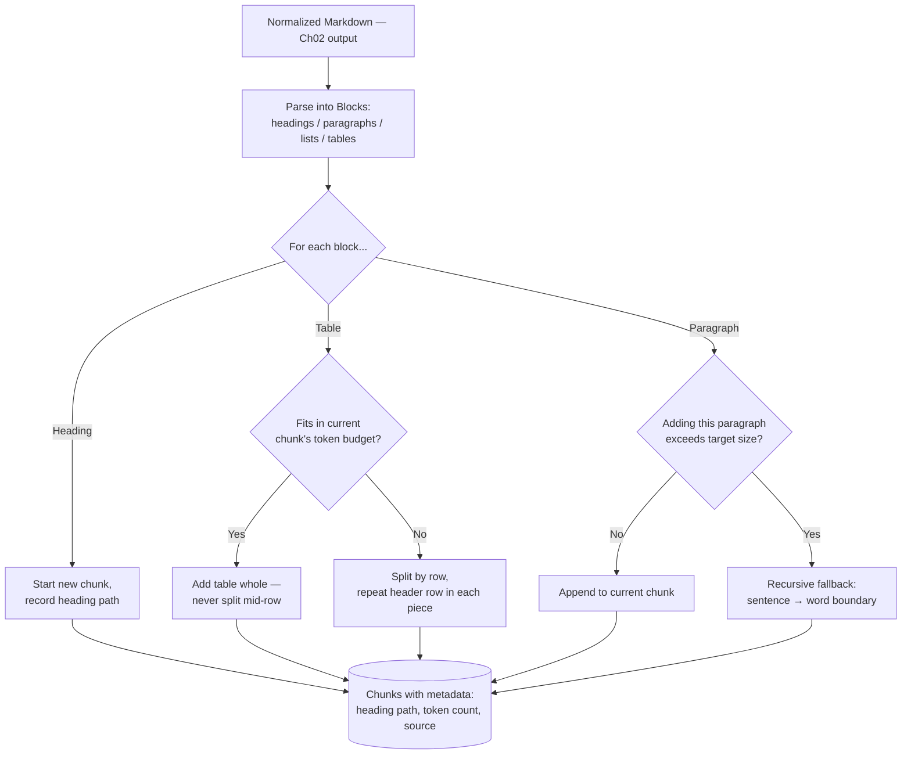
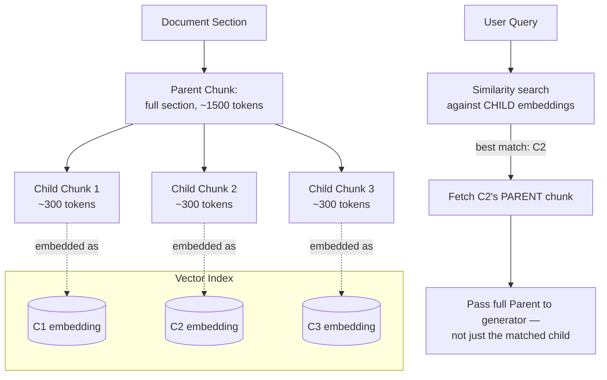
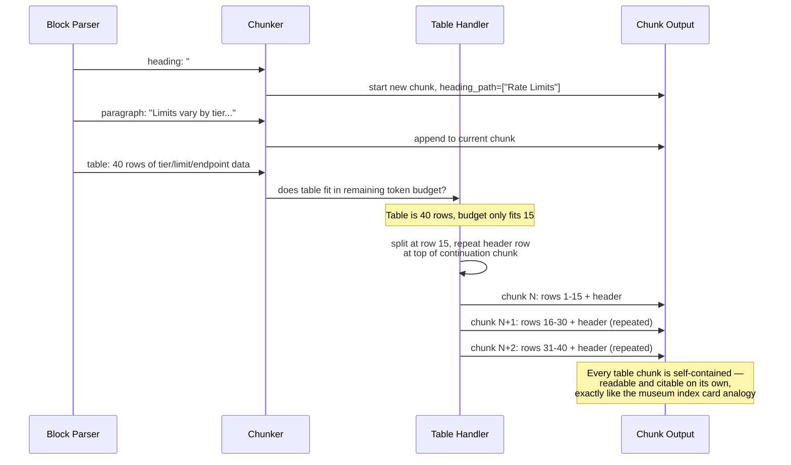
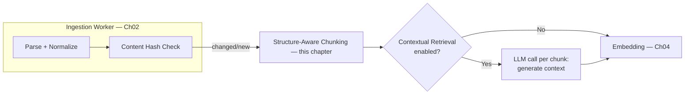
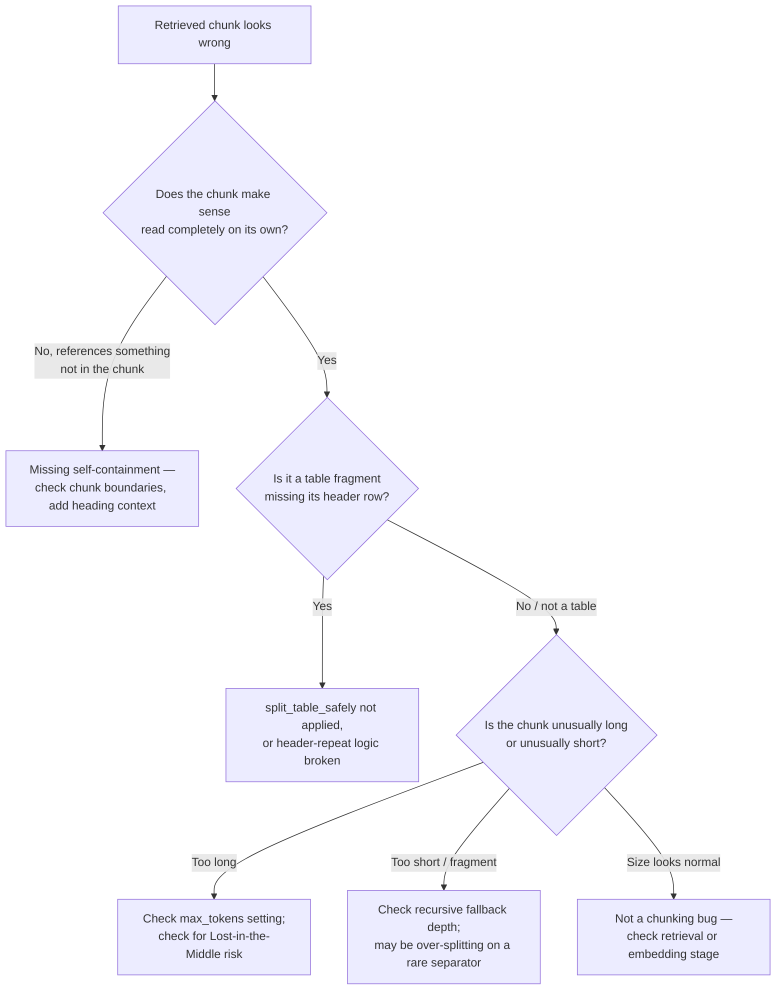

# Chapter 03 — Chunking Strategies for Real Documents

> "A chunk boundary is a decision about what your retrieval system is and isn't allowed to find in one piece — you make that decision whether you think about it or not."

**Learning Objectives**

By the end of this chapter, you will be able to:

- Explain exactly how a bad chunk boundary produces a specific, named Chapter 01 failure — not just "worse results."
- Implement fixed-size, recursive, and semantic chunking, and know from evidence (not intuition) when each one actually wins.
- Build a structure-aware chunker that never splits a table mid-row and never orphans a heading from its content.
- Choose a chunk size and overlap value deliberately, and know when overlap is worth its cost and when it measurably isn't.
- Implement hierarchical (parent-child) chunking to get retrieval precision and generation context from the same pipeline.
- Describe — and know when to reach for — the two leading 2026 advanced techniques: Anthropic's Contextual Retrieval and Jina-style late chunking.
- Count tokens correctly and consistently, and know why "tokens" isn't one universal unit across model providers.
- Diagnose a chunk-boundary bug (split sentence, orphaned heading, broken table) directly from a retrieved chunk, without re-running the whole pipeline.

**Prerequisites**

- Chapter 01 (RAG Architecture Deep Dive) and Chapter 02 (Document Ingestion at Scale) completed — this chapter takes Chapter 02's normalized, structure-preserved Markdown as its input.
- Comfortable Python, dataclasses, basic regular expressions.
- `pip install tiktoken chonkie` in your virtual environment.

**Estimated Reading Time:** 80–90 minutes
**Estimated Hands-on Time:** 3–4 hours

---

## ⚡ Fast Read

> **Skim time: 5 minutes** — Read this if you're in a hurry, returning for reference, or already familiar with part of this topic.

- **What it is:** How to split a clean, structure-preserved document (Chapter 02's output) into retrieval-sized pieces without destroying the meaning, structure, or self-containment of any individual piece.
- **Why it matters:** Chunk boundaries directly cause two of Chapter 01's named failures — cut too aggressively and you get "Missed Top Documents" (the fact exists but got severed from its context); cut too loosely and you get "Buried in Context" (the fact is technically present but drowned in irrelevant text).
- **Key insight:** Semantic chunking — splitting wherever consecutive sentence embeddings diverge — sounds like it should always beat naive fixed-size chunking. A 2026 50-paper benchmark found the opposite: plain 512-token recursive chunking beat semantic chunking on retrieval accuracy (69% vs. 54%). And a separate study found chunk overlap, the default in almost every tutorial, provided no measurable benefit at all on its own test set. Chunking wisdom you've absorbed from tutorials deserves to be tested, not assumed.
- **What you build:** A structure-aware, table-safe chunker that produces self-contained chunks with heading-path metadata, plus a hierarchical parent-child variant for combining precision and context.
- **Jump to:** [Core Concepts](#core-concepts) | [First Code](#beginner-implementation) | [Best Practices](#best-practices) | [Mini Project](#mini-project)

---

## Why This Topic Exists

Chapter 01's naive pipeline chunked text every 200 characters, no matter what was there — and we watched it split a sentence about a 429 status code clean in half. Chapter 02 fixed the *input* to chunking: instead of raw PDF bytes, the chunker now receives clean, structure-preserved Markdown with headings and tables intact. But having good input doesn't solve the chunking problem — it just means the chunker finally has enough information to solve it well, if you write it to actually use that information.

Chunking is the single decision in the entire RAG pipeline most directly responsible for two of Chapter 01's named failures. Cut chunks too small, or in the wrong place, and you get **Missed Top Documents** — a fact that technically exists in the corpus but got severed from the sentence that explains what it refers to ("It supports up to 12 concurrent connections" is useless once "it" has been chunked away). Cut chunks too large, or fail to respect structure, and you get **Buried in Context** — the fact is present, but diluted inside a chunk so large and unfocused that its embedding barely resembles the query, or so long that Lost-in-the-Middle buries it once it's in the prompt.

This chapter also exists to correct a specific kind of folklore. A huge amount of RAG tutorial content treats "semantic chunking is more sophisticated, therefore better" and "always use chunk overlap" as settled facts. Neither one holds up under measurement, and you're about to see the actual numbers.

---

## Real-World Analogy

**The Museum Docent Cutting a Script Into Index Cards**

A museum docent has a long, well-written article about an exhibit hall and needs to cut it into index cards, so that any substitute guide can grab a single card and read it aloud to answer one visitor's question — without ever seeing the rest of the article.

A bad cut leaves a card that says "It has twelve legs and can regenerate a lost one within six weeks" with no indication anywhere on the card of what "it" refers to. A visitor asking about the sculpture in the east wing gets handed a card about a spider crab from the aquarium wing, and nobody notices until it's too late — because the retrieval system that fetched the card had no way to know it was incomplete.

A good cut keeps a complete idea on one card — and when a table of exhibit measurements is longer than one card can hold, the docent repeats the exhibit's name and the column headers ("Exhibit: Blue Whale Skeleton | Length | Weight | Age") at the top of every card that continues the table, so that *any single card*, grabbed alone, out of order, still makes sense on its own. That self-containment requirement — every chunk must make sense without its neighbors — is the organizing principle behind almost everything in this chapter.

---

## Core Concepts

### Fixed-Size Chunking

- **Technical definition:** Splitting text into segments of a constant length (measured in characters or tokens), with no awareness of sentence, paragraph, or document structure.
- **Simple definition:** Cut every N characters or tokens, no matter what's there — the approach Chapter 01 deliberately used to demonstrate what breaks.
- **Analogy:** Cutting a length of rope every foot, whether or not that happens to land in the middle of a knot.

### Recursive Chunking

- **Technical definition:** Splitting text using a prioritized list of separators (paragraph breaks, then sentence breaks, then word breaks), recursively falling back to a finer-grained separator only when a chunk still exceeds the target size after trying a coarser one.
- **Simple definition:** Try to cut on a paragraph break first; if that piece is still too big, try a sentence break; if that's still too big, fall back to just cutting at a word boundary.
- **Analogy:** The docent cutting along the article's natural paragraph breaks first, only resorting to a mid-paragraph cut when a single paragraph is simply too long for one card.

### Semantic Chunking

- **Technical definition:** Splitting text at points where the embedding similarity between consecutive sentences (or small groups of sentences) drops below a threshold, on the theory that a large similarity drop marks a topic boundary.
- **Simple definition:** Use the meaning of the text itself, not just punctuation, to decide where one idea ends and the next begins.
- **Analogy:** The docent listening for a change of subject in the article's flow, rather than mechanically counting sentences.

### Structure-Aware Chunking

- **Technical definition:** Chunking that uses a document's explicit structural markers (heading levels, list boundaries, table boundaries) — preserved by the ingestion pipeline in Chapter 02 — as primary, high-priority split points, and that treats certain structures (a table) as atomic units not to be arbitrarily divided.
- **Simple definition:** Cut along the document's own sections and never saw a table in half.
- **Analogy:** The docent's index cards following the exhibit hall's own room-by-room layout, not slicing through the middle of a display case.

### Chunk Overlap

- **Technical definition:** Duplicating a small amount of text (typically 10–20% of chunk size) at the boundary between adjacent chunks, intended to preserve context that might otherwise be severed by a cut landing mid-idea.
- **Simple definition:** Let neighboring cards share a little bit of text at their edges, so a cut doesn't sever an idea that happened to straddle the boundary.
- **Analogy:** Two adjoining index cards each repeating the last sentence of the previous card, just in case that sentence mattered to the next one.

### Hierarchical (Parent-Child) Chunking

- **Technical definition:** A two-tier chunking scheme where small "child" chunks are embedded and indexed for precise retrieval matching, but each child chunk links back to a larger "parent" chunk (a full section, or several child chunks combined) that gets passed to the generator for fuller context once a child chunk is retrieved.
- **Simple definition:** Search with small, precise pieces; answer with the bigger piece those small pieces belong to.
- **Analogy:** The docent's index card system having a short, precise summary card for quick lookup, each one stapled to a longer, fuller page for whoever needs the complete story.

### Late Chunking

- **Technical definition:** An embedding technique that reverses the usual order of operations — instead of chunking text first and then embedding each chunk independently, the entire document is embedded first (token-level) using a long-context embedding model, and chunk-level vectors are produced afterward by pooling the relevant token embeddings for each chunk's span. Because each token's embedding was computed with the full document as context, the resulting chunk vectors retain awareness of the whole document, not just their own isolated text.
- **Simple definition:** Read the whole document first so every sentence understands its context, *then* decide where the chunk boundaries go — instead of deciding boundaries first and having each chunk embedded in isolation, blind to everything around it.
- **Analogy:** The docent reading the entire exhibit article once, cover to cover, before cutting a single index card — so even the card about "it has twelve legs" is written with full awareness of what "it" refers to, because the docent understood the whole article before cutting anything.

### Contextual Retrieval (Chunk Context Prepending)

- **Technical definition:** A technique (introduced by Anthropic) where a short, LLM-generated summary of how each chunk relates to the whole document is prepended to that chunk's text before embedding and indexing — giving the chunk's embedding access to document-level context it wouldn't otherwise have, at the cost of one LLM call per chunk during ingestion.
- **Simple definition:** Before embedding a chunk, ask a model to write one or two sentences explaining what this chunk is about *in the context of the whole document*, and glue that explanation onto the front of the chunk.
- **Analogy:** The docent stapling a one-line note to the top of each index card — "This card is from the section on regeneration in the invertebrate wing" — so the card carries a hint of where it came from even when read completely on its own.

---

## Architecture Diagrams

### Diagram 1 — The Structure-Aware Chunking Pipeline



### Diagram 2 — Hierarchical (Parent-Child) Chunking



The point of this diagram: search happens against small, precise child chunks (good for matching a specific query), but generation happens against the larger parent (good for having enough context to actually answer well). This directly answers the tension between retrieval precision and generation context without picking just one chunk size.

---

## Flow Diagrams

### Chunking a Document With a Table That Spans a Boundary



---

## Beginner Implementation

We start with fixed-size chunking (Chapter 01's version, properly labeled) and recursive chunking — the most common real upgrade from it — using `tiktoken` to count actual tokens instead of characters, since token count is what actually determines whether a chunk fits inside a model's limits or an embedding model's input window.

```python
# Learning example — beginner_chunking.py
# Fixed-size (Ch01's naive version, for comparison) vs. recursive chunking,
# both measured in TOKENS, not characters.

import tiktoken

# cl100k_base is the tokenizer used by GPT-4-family models. Using a real
# tokenizer instead of len(text) matters because token count, not character
# count, is what determines whether a chunk fits an embedding model's
# input limit or eats into an LLM's context window.
encoding = tiktoken.get_encoding("cl100k_base")

def count_tokens(text: str) -> int:
    return len(encoding.encode(text))

def chunk_fixed_size(text: str, chunk_size_tokens: int = 400) -> list[str]:
    """
    This is Chapter 01's naive chunk_naive(), corrected to split on TOKEN
    boundaries instead of raw characters — but still just as blind to
    sentence or paragraph structure. Included here specifically so you can
    compare its output directly against chunk_recursive() below on the
    exact same text.
    """
    tokens = encoding.encode(text)
    chunks = []
    for i in range(0, len(tokens), chunk_size_tokens):
        chunk_tokens = tokens[i:i + chunk_size_tokens]
        chunks.append(encoding.decode(chunk_tokens))
    return chunks

SEPARATORS = ["\n\n", "\n", ". ", " "]  # coarsest to finest — tried in order

def chunk_recursive(text: str, chunk_size_tokens: int = 400, depth: int = 0) -> list[str]:
    """
    Tries the coarsest separator first (paragraph breaks). If a resulting
    piece is still too big, it recurses using the NEXT separator in the
    list — never jumping straight to word-level cutting unless every
    coarser option has already failed to produce a small-enough piece.
    """
    if count_tokens(text) <= chunk_size_tokens or depth >= len(SEPARATORS):
        return [text]

    separator = SEPARATORS[depth]
    pieces = text.split(separator)

    chunks = []
    current = ""
    for piece in pieces:
        candidate = current + separator + piece if current else piece
        if count_tokens(candidate) <= chunk_size_tokens:
            current = candidate
        else:
            if current:
                chunks.append(current)
            # This single piece alone might STILL be too big (e.g. one
            # enormous paragraph) — recurse to the next finer separator
            # only for the piece that actually needs it.
            if count_tokens(piece) > chunk_size_tokens:
                chunks.extend(chunk_recursive(piece, chunk_size_tokens, depth + 1))
                current = ""
            else:
                current = piece
    if current:
        chunks.append(current)
    return chunks

if __name__ == "__main__":
    sample = """The /export endpoint is rate-limited to 100 requests per minute
per API key on the Free tier, and 1000 requests per minute on the Pro tier.

Requests beyond the limit receive a 429 status code with a Retry-After header
indicating how many seconds to wait before retrying."""

    print("--- Fixed-size (token-aware, still structure-blind) ---")
    for c in chunk_fixed_size(sample, chunk_size_tokens=25):
        print(repr(c[:80]))

    print("\n--- Recursive (respects paragraph/sentence boundaries) ---")
    for c in chunk_recursive(sample, chunk_size_tokens=25):
        print(repr(c[:80]))
```

**Walking through what's actually happening:**

- `count_tokens` uses `tiktoken`, the real tokenizer OpenAI-family models use — not `len(text)`. A chunk sized "400 characters" and a chunk sized "400 tokens" can differ by a factor of 3-4x depending on the text's language and punctuation density; sizing chunks by character count is sizing them by the wrong unit entirely.
- `chunk_fixed_size` is Chapter 01's naive chunker, corrected only to respect token boundaries — it is still completely blind to sentences or paragraphs, which is exactly why it's included here: run both functions on the sample text above and look at where each one cuts. The fixed-size version will, more often than not, cut mid-sentence; the recursive version, using `SEPARATORS`, tries hard not to.
- `chunk_recursive`'s core idea is the recursion in `depth`: it doesn't jump straight to word-level splitting. It tries paragraph breaks, and *only* recurses to sentence breaks for the specific piece that's still too big after that — most real paragraphs never need to fall further than the first or second separator.
- Neither function here is structure-aware yet — feed either one a Markdown table and it will still cut straight through the middle of a row, exactly like Chapter 01's original naive chunker. That's what the Intermediate implementation fixes.

---

## Intermediate Implementation

Now we chunk Chapter 02's actual normalized Markdown output — respecting headings and never splitting a table mid-row, and attaching heading-path metadata to every chunk so a retrieved chunk can always be traced back to exactly where it came from.

```python
# Learning example — intermediate_chunking.py
# Structure-aware chunking over Markdown: respects headings, keeps tables
# intact (or splits them safely, repeating the header row), and records
# a heading path on every chunk for citation and debugging.

from __future__ import annotations
from dataclasses import dataclass, field
import re

@dataclass
class Chunk:
    text: str
    heading_path: list[str] = field(default_factory=list)
    token_count: int = 0
    is_table_fragment: bool = False

def parse_blocks(markdown: str) -> list[dict]:
    """
    Splits normalized Markdown into typed blocks: headings, paragraphs,
    and tables. This is deliberately simple regex-based parsing — it
    relies entirely on Ch02's parsers having already normalized structure
    into standard Markdown syntax (# headings, | table | rows |).
    """
    blocks = []
    current_table_lines: list[str] = []

    def flush_table():
        if current_table_lines:
            blocks.append({"type": "table", "lines": list(current_table_lines)})
            current_table_lines.clear()

    for line in markdown.split("\n"):
        heading_match = re.match(r"^(#{1,6})\s+(.*)", line)
        if line.strip().startswith("|"):
            current_table_lines.append(line)
        elif heading_match:
            flush_table()
            blocks.append({"type": "heading", "level": len(heading_match.group(1)), "text": heading_match.group(2)})
        elif line.strip():
            flush_table()
            blocks.append({"type": "paragraph", "text": line.strip()})
        else:
            flush_table()
    flush_table()
    return blocks

def split_table_safely(lines: list[str], max_tokens: int, count_tokens) -> list[str]:
    """
    Markdown tables are: header row, separator row (|---|---|), then data
    rows. If the whole table fits, keep it whole — a table is the clearest
    case of "don't cut this in the middle" from this chapter's analogy.
    If it doesn't fit, split by data row, but REPEAT the header row and
    separator row at the top of every continuation piece, so each piece
    is self-contained and readable without the others.
    """
    full_table = "\n".join(lines)
    if count_tokens(full_table) <= max_tokens:
        return [full_table]

    header, separator, *data_rows = lines
    pieces, current_rows = [], []
    for row in data_rows:
        candidate = "\n".join([header, separator] + current_rows + [row])
        if count_tokens(candidate) <= max_tokens:
            current_rows.append(row)
        else:
            if current_rows:
                pieces.append("\n".join([header, separator] + current_rows))
            current_rows = [row]
    if current_rows:
        pieces.append("\n".join([header, separator] + current_rows))
    return pieces

def chunk_markdown(markdown: str, count_tokens, max_tokens: int = 400) -> list[Chunk]:
    blocks = parse_blocks(markdown)
    chunks: list[Chunk] = []
    heading_stack: list[str] = []  # e.g. ["API Reference", "Rate Limits"]
    current_text = ""

    def flush_chunk(is_table_fragment: bool = False):
        nonlocal current_text
        if current_text.strip():
            chunks.append(Chunk(
                text=current_text.strip(),
                heading_path=list(heading_stack),
                token_count=count_tokens(current_text),
                is_table_fragment=is_table_fragment,
            ))
        current_text = ""

    for block in blocks:
        if block["type"] == "heading":
            # A new heading starts a fresh chunk — this is what prevents
            # content from one section bleeding into the next one's chunk,
            # and keeps heading_path accurate for every chunk that follows.
            flush_chunk()
            level = block["level"]
            heading_stack = heading_stack[: level - 1] + [block["text"]]
        elif block["type"] == "table":
            flush_chunk()
            for piece in split_table_safely(block["lines"], max_tokens, count_tokens):
                chunks.append(Chunk(
                    text=piece,
                    heading_path=list(heading_stack),
                    token_count=count_tokens(piece),
                    is_table_fragment=True,
                ))
        else:  # paragraph
            candidate = f"{current_text}\n\n{block['text']}" if current_text else block["text"]
            if count_tokens(candidate) <= max_tokens:
                current_text = candidate
            else:
                flush_chunk()
                current_text = block["text"]
    flush_chunk()
    return chunks
```

**What changed, and why each change matters:**

1. **`parse_blocks` treats headings, paragraphs, and tables as distinct types**, not undifferentiated text — this is only possible because Chapter 02's parsers preserved Markdown structure in the first place. Feed this function flat, unstructured text (Chapter 01's original `DOCUMENTS` strings) and it degrades to treating everything as one giant paragraph — proof that good chunking is architecturally downstream of good parsing.
2. **`heading_stack` gives every chunk a `heading_path`** like `["API Reference", "Rate Limits", "/export endpoint"]`. This isn't cosmetic — it's what lets Chapter 01's citation requirement actually work at the section level, not just the document level, and it's invaluable when debugging *why* a chunk was retrieved for a given query.
3. **`split_table_safely` is the direct code implementation of this chapter's museum-card analogy** — a table is never cut mid-row, and every continuation piece repeats the header row, so a chunk containing rows 16–30 of a rate-limit table is still fully readable and citable entirely on its own, without needing the chunk before it.
4. **A new heading always flushes the current chunk.** This prevents the common bug where a paragraph from one section and a paragraph from the next section end up mashed into a single chunk just because they happened to fit the token budget together — structurally unrelated content should never share a chunk, even if there's room.

---

## Advanced Implementation

Production chunking adds two things: a **hierarchical parent-child** structure for combining retrieval precision with generation context, and an implementation of **Anthropic's Contextual Retrieval** technique for chunks that benefit from document-level framing.

```python
# Production example — advanced_chunking.py
# Hierarchical (parent-child) chunking + Contextual Retrieval, following
# Ch01's Protocol/Trace pattern for consistency with the rest of the pipeline.

from __future__ import annotations
from dataclasses import dataclass, field
from typing import Protocol
import uuid

from openai import OpenAI

client = OpenAI()

@dataclass
class ChildChunk:
    id: str = field(default_factory=lambda: str(uuid.uuid4()))
    text: str = ""                 # what actually gets embedded
    parent_id: str = ""
    heading_path: list[str] = field(default_factory=list)

@dataclass
class ParentChunk:
    id: str = field(default_factory=lambda: str(uuid.uuid4()))
    text: str = ""                 # what gets passed to the generator
    heading_path: list[str] = field(default_factory=list)

class ChunkingStrategy(Protocol):
    """Same Protocol pattern as Ch01's Retriever/Reranker — any chunking
    strategy that implements this can be swapped in without touching the
    ingestion pipeline that calls it."""
    def chunk(self, document_markdown: str) -> tuple[list[ParentChunk], list[ChildChunk]]: ...

def build_hierarchy(
    document_markdown: str,
    count_tokens,
    parent_max_tokens: int = 1500,
    child_max_tokens: int = 300,
) -> tuple[list[ParentChunk], list[ChildChunk]]:
    """
    Parents are built first, using the SAME structure-aware chunk_markdown
    logic from the Intermediate Implementation at a larger token budget.
    Each parent is then further divided into children at a smaller budget
    — children get embedded and searched; parents get handed to the
    generator once a child is matched.
    """
    parent_blocks = chunk_markdown(document_markdown, count_tokens, max_tokens=parent_max_tokens)
    parents, children = [], []

    for block in parent_blocks:
        parent = ParentChunk(text=block.text, heading_path=block.heading_path)
        parents.append(parent)

        child_blocks = chunk_markdown(block.text, count_tokens, max_tokens=child_max_tokens)
        for cb in child_blocks:
            children.append(ChildChunk(text=cb.text, parent_id=parent.id, heading_path=block.heading_path))

    return parents, children

def add_context(chunk_text: str, full_document: str, model: str = "gpt-4o-mini") -> str:
    """
    Anthropic's Contextual Retrieval: ask a model to write a short,
    situating sentence for this specific chunk, using the FULL document
    as context — then prepend it to the chunk before embedding. This
    costs one LLM call per chunk at INGESTION time, never at query time,
    which is why it's viable even though it's not free.
    """
    prompt = f"""<document>
{full_document}
</document>

Here is a chunk from the document above:
<chunk>
{chunk_text}
</chunk>

Write a short (1-2 sentence) context that situates this chunk within the
overall document, to improve search retrieval of this chunk. Answer only
with the succinct context, nothing else."""

    response = client.chat.completions.create(
        model=model,
        messages=[{"role": "user", "content": prompt}],
        max_tokens=100,
    )
    context = response.choices[0].message.content.strip()
    return f"{context}\n\n{chunk_text}"

def prepare_children_for_embedding(
    children: list[ChildChunk], full_document: str, use_contextual_retrieval: bool = True
) -> list[str]:
    """
    Returns the TEXT that should actually be embedded for each child —
    with Contextual Retrieval applied if enabled. Note this is a separate
    step from ChildChunk.text, which stays as the original, uncontextualized
    text — you generally don't want the LLM-generated context string
    showing up verbatim in what gets shown to the end user.
    """
    if not use_contextual_retrieval:
        return [c.text for c in children]
    return [add_context(c.text, full_document) for c in children]
```

**Why this shape earns its complexity:**

- **Parents and children are built with the *same* structure-aware chunker, just at two different token budgets.** There's no separate "parent logic" and "child logic" — this reuse is deliberate, and it's exactly the kind of leverage a well-designed, reusable `chunk_markdown` function buys you.
- **Contextual Retrieval is applied to a *copy* of the child chunk's text, not the chunk itself.** `ChildChunk.text` stays clean for citation and display; `prepare_children_for_embedding` produces the (LLM-context-prepended) version that actually gets embedded. Conflating these two is a common, avoidable production bug — a user reading a citation shouldn't see "This chunk describes the Pro-tier rate limit exception process, as referenced in the broader API governance section" glued onto the front of their answer.
- **The cost of Contextual Retrieval is paid once, at ingestion, per chunk — never at query time.** This is worth restating because it's the detail that makes an LLM call per chunk economically reasonable instead of alarming: it scales with corpus size and update frequency, not with query volume.
- **Late chunking is deliberately not implemented here.** It requires a long-context embedding model with token-level output access — a capability this chapter hasn't introduced yet, since embedding models are Chapter 04's subject. The concept is fully explained above in Core Concepts; Chapter 04 and Chapter 06 return to it with a concrete implementation once you have the right embedding model in hand.

---

## Production Architecture

Chunking sits as a pure, stateless transform between Chapter 02's ingestion output and Chapter 04's embedding stage — it belongs in the same worker pool as ingestion (Chapter 02, Diagram 3), not as a separate service, since it has no external dependencies of its own beyond CPU (and, if Contextual Retrieval is enabled, an LLM API call per chunk).



One operational detail worth calling out explicitly: **a change in chunking strategy or parameters (chunk size, overlap, whether Contextual Retrieval is on) must be treated exactly like the embedding-model-version mismatch failure from Chapter 01's taxonomy (#8).** If you change `parent_max_tokens` from 1500 to 1000, every previously-ingested document's chunks are now inconsistent with newly-ingested ones — mixed chunk granularities in the same index, silently. Version your chunking configuration alongside your embedding model version, and treat a chunking-strategy change as a trigger for full re-ingestion, not an incremental update.

> **Currency Note:** The specific benchmark numbers cited in this chapter (recursive chunking beating semantic chunking 69% to 54%; overlap showing no measurable benefit in a particular study) reflect research published in the months leading up to mid-2026 and are cited as evidence that chunking folklore should be tested, not as universal constants — your own corpus and query distribution may behave differently. What's stable is the discipline this chapter teaches: measure your chunking strategy against your own evaluation set (Chapter 12) rather than assuming any one technique is categorically superior.

---

## Best Practices

1. **Size chunks in tokens, not characters**, using the tokenizer that actually matches your embedding model — a character-based size target is sizing against the wrong unit.
2. **Never let a table be split mid-row.** If it must span multiple chunks, repeat the header row in every continuation piece.
3. **Never let a heading become orphaned** — a heading with no content chunk directly following it (because the content got pushed to a different chunk by a size boundary) is a citation and comprehension dead end.
4. **Treat chunk overlap as a hypothesis to test, not a default to apply.** Measure retrieval quality with and without it on your own evaluation set (Chapter 12) before committing to a nonzero overlap value.
5. **Attach heading-path metadata to every chunk.** It is the cheapest debugging tool in this entire chapter — when a chunk gets retrieved for a strange query, `heading_path` tells you instantly where it came from.
6. **Use hierarchical (parent-child) chunking when your generator needs more context than your retriever needs for accurate matching** — which, in practice, is most of the time for documents with any real depth.
7. **Version your chunking configuration and treat a change as a re-ingestion trigger**, exactly as you would an embedding model upgrade.
8. **Prefer recursive or structure-aware chunking as your default**, and reach for semantic chunking or late chunking deliberately, for documents where topic boundaries genuinely don't align with structural markers — not as a blanket upgrade.

---

## Security Considerations

Two chunking-specific issues, distinct from the broader RAG security topics Chapter 13 covers in depth:

- **Access-control label inheritance across a split.** If a source document mixes content at different sensitivity levels within a single table or section (a common pattern in loosely organized internal wikis), every chunk produced from it must inherit the *most restrictive* applicable label, not the document's overall default. A chunking pipeline that assigns permissions purely at the document level, ignoring the possibility of mixed-sensitivity content within one document, can under-restrict a chunk that should have been locked down.
- **Contextual Retrieval sends full document content to an LLM API.** If your documents are sensitive and your LLM provider is a third-party hosted API, this is a data-residency and data-handling consideration exactly like any other third-party API call — self-hosting the context-generation model, or skipping Contextual Retrieval for the most sensitive document tiers, are both reasonable mitigations depending on your compliance requirements (this becomes directly relevant once Module 3 of this course starts working with regulated document domains).

---

## Cost Considerations

| Technique | Free / self-hosted cost | Paid cost | Where it scales |
|---|---|---|---|
| Fixed-size / recursive / structure-aware chunking | CPU only | — | Corpus size, one-time per ingestion |
| Semantic chunking | Requires an embedding model call per sentence-boundary check (can be a free local model) | Hosted embedding API — per-token | Corpus size × sentence count |
| Hierarchical (parent-child) | CPU only for the chunking itself | — | Slightly higher storage (parent chunks stored alongside children) |
| Contextual Retrieval | — | One LLM call per chunk, at ingestion — Anthropic reports this is cheap using prompt caching on the full document; using a smaller model (e.g. `gpt-4o-mini`-class) keeps this affordable at scale | Corpus size × chunk count, one-time per ingestion (not per query) |
| Late chunking | Requires a long-context embedding model — often the same or similar cost to standard embedding calls, but bounded by that model's context window | — | Document size (must fit the embedding model's context window) |

The consistent theme from Chapter 01 and Chapter 02 continues here: **every chunking-stage cost in this table is paid once, at ingestion, and never scales with query volume.** This is precisely why Contextual Retrieval and late chunking are viable at all despite involving extra model calls — the expensive step happens far less often than a live user query does.

---

## Common Mistakes

**Mistake 1 — Sizing chunks by character count instead of tokens.**
```python
# Wrong: 500 characters is NOT 500 tokens — the actual token count
# depends heavily on the text's language, punctuation, and content
chunks = [text[i:i+500] for i in range(0, len(text), 500)]

# Right: size by actual tokens, using the tokenizer that matches
# your embedding model
tokens = encoding.encode(text)
chunks = [encoding.decode(tokens[i:i+500]) for i in range(0, len(tokens), 500)]
```

**Mistake 2 — Splitting a table mid-row.**
```python
# Wrong: a naive character-based split has no idea it just cut a table
# in half, leaving one row's cells split across two chunks
chunk_1, chunk_2 = table_markdown[:1000], table_markdown[1000:]

# Right: split only at row boundaries, repeat the header row
pieces = split_table_safely(table_lines, max_tokens=400, count_tokens=count_tokens)
```

**Mistake 3 — Orphaning a heading.**
```python
# Wrong: a size-based split doesn't know "## Rate Limits" with nothing
# after it is a useless, uncitable chunk on its own
chunks = chunk_fixed_size(markdown_with_headings, chunk_size_tokens=400)

# Right: a new heading always starts a fresh chunk, never gets stranded
# at the tail end of the previous one
chunks = chunk_markdown(markdown_with_headings, count_tokens, max_tokens=400)
```

**Mistake 4 — Applying overlap by default, without measuring whether it helps.**
```python
# Wrong: overlap treated as a free, obviously-beneficial default
chunks = recursive_split(text, chunk_size=400, overlap=50)

# Right: measure retrieval quality with and without overlap on YOUR
# evaluation set (Ch12) before deciding — the benefit is not universal
chunks_no_overlap = recursive_split(text, chunk_size=400, overlap=0)
chunks_with_overlap = recursive_split(text, chunk_size=400, overlap=50)
# ...evaluate both against a labeled test set before choosing
```

**Mistake 5 — Discarding heading-path metadata.**
```python
# Wrong: chunks are stored as bare strings, with no record of where
# in the document structure they came from
vector_store.add(texts=[c.text for c in chunks])

# Right: heading path travels with the chunk as metadata, for citation
# AND for debugging why a chunk got retrieved
vector_store.add(
    texts=[c.text for c in chunks],
    metadatas=[{"heading_path": " > ".join(c.heading_path)} for c in chunks],
)
```

---

## Debugging Guide



| Symptom | Likely cause | First thing to check |
|---|---|---|
| Chunk references "it" / "this" / "the above" with no antecedent | Structure-blind split severed a sentence from its context | Was structure-aware chunking actually used for this document? |
| Table chunk has data rows but no column headers | Header-repeat logic missing or broken | `split_table_safely` output for that specific table |
| A heading appears alone with no chunk containing its content | New-heading-flushes-chunk logic not applied, or content pushed past a size boundary | `chunk_markdown`'s heading-handling branch |
| Retrieved chunk is much larger than expected | `max_tokens` misconfigured, or hierarchical parent returned instead of child | Which chunk tier (parent vs. child) is actually being searched vs. returned |
| Chunk count for a document is far higher than expected | Recursive fallback triggering too often — check for unusually long paragraphs with no internal punctuation | Depth reached in `chunk_recursive` for that document |
| Citations point to the wrong section | `heading_path` not attached, or stale from before a heading update | Whether `heading_path` metadata exists and is current on the chunk |

---

## Performance Optimisation

| Technique | What it improves | Illustrative finding* | Trade-off |
|---|---|---|---|
| Recursive / structure-aware chunking over semantic chunking, as the default | Retrieval accuracy AND ingestion speed | A 2026 50-paper benchmark found 512-token recursive chunking beat semantic chunking, 69% vs. 54%, on the datasets tested | Semantic chunking may still win on documents where topic shifts genuinely don't align with paragraph structure — test, don't assume |
| Skipping chunk overlap unless measured to help | Ingestion cost (fewer duplicated tokens to embed) and index size | A Jan-2026 study found no measurable retrieval benefit from overlap on its test set | Some corpora with high inter-sentence dependency may still benefit — measure on your own evaluation set |
| Hierarchical (parent-child) chunking | Balances retrieval precision (small children) against generation quality (larger parent context) | N/A — architectural benefit, not a single benchmark number | Slightly more storage and ingestion complexity than flat chunking |
| Late chunking (Chapter 04/06) | Chunk embeddings retain whole-document context | Jina AI reports nDCG@10 improvements on BEIR benchmark datasets, with the gain generally increasing as document length increases — no single universal percentage, unlike the other rows in this table | Requires a long-context embedding model; bounded by that model's context window |
| Contextual Retrieval | Retrieval accuracy via document-aware chunk embeddings | Anthropic reports 35% fewer failed retrievals alone, up to 67% combined with contextual BM25 and re-ranking | One LLM call per chunk at ingestion — real but one-time cost |

*As with prior chapters, these are cited findings from specific studies/benchmarks, not universal guarantees — verify against your own evaluation harness (Chapter 12) before committing to any one technique at scale.

---

## Decision Framework — Choosing a Chunking Strategy

| Situation | Recommended strategy |
|---|---|
| Well-structured document (has real headings, tables, lists) | Structure-aware chunking, as the primary strategy |
| Structure-aware chunk still exceeds token budget | Recursive fallback within that chunk |
| Free-flowing prose with weak/no structural markers (transcripts, narrative text) | Semantic chunking, or recursive as a solid simpler default — test both |
| Need both precise retrieval and rich generation context | Hierarchical parent-child chunking |
| High-value corpus, ingestion cost is not the bottleneck, retrieval accuracy is critical | Add Contextual Retrieval on top of structure-aware chunking |
| Long, context-dependent documents where isolated chunks lose too much meaning even with good boundaries | Late chunking (once you have a long-context embedding model — Chapter 04/06) |
| Uncertain which approach is best for your corpus | Build the evaluation harness from Chapter 12 first, then A/B the strategies against it — don't guess |

---

## Interview Questions

1. **"Why might semantic chunking underperform simple recursive chunking, even though it sounds more sophisticated?"** — Expect: reference to the 2026 benchmark finding; semantic chunking's topic-boundary detection can be noisier than clean structural/paragraph boundaries on many real corpora.
2. **"When would you use hierarchical parent-child chunking instead of a single flat chunk size?"** — Expect: tension between retrieval precision (favors small chunks) and generation context (favors larger chunks) — hierarchy gets both.
3. **"Walk me through what happens to your index if you change your chunk size after already ingesting a large corpus."** — Expect: comparison to embedding-model-version mismatch (Ch01 failure #8); requires full re-ingestion, not incremental.
4. **"Why does Contextual Retrieval only cost money at ingestion time, never at query time?"** — Expect: the LLM call happens once per chunk during ingestion; queries only hit the already-embedded, already-contextualized chunks.
5. **"What's a concrete example of a chunk that would fail to make sense read on its own, and how would structure-aware chunking prevent it?"** — Expect: table row without header, or a pronoun without its antecedent; prevention via heading-attachment and table-integrity rules.
6. **"Should you always use chunk overlap?"** — Expect: no — cite the Jan-2026 finding of no measurable benefit in at least one real study; the correct answer is "measure it," not "yes" or "no" unconditionally.

---

## Exercises

1. **(15 min)** Run this chapter's `chunk_fixed_size` and `chunk_recursive` on the same multi-paragraph sample text at a small token budget (e.g. 30 tokens) and find a spot where the fixed-size version cuts mid-sentence but the recursive version doesn't.
2. **(30 min)** Take one of your Chapter 02 ingestion outputs containing a table, and run it through `chunk_markdown`. Confirm every resulting table-fragment chunk still has its header row.
3. **(30 min)** Deliberately set `max_tokens` very small (e.g. 50) on a document with several headings, and observe how many chunks end up as orphaned or near-empty headings. Then check whether your implementation correctly avoids this.
4. **(45 min)** Implement `build_hierarchy` on a real document, and manually verify: does searching against a child chunk's embedding and then fetching its parent actually give you meaningfully more context than the child alone?
5. **(60 min, harder)** Implement Contextual Retrieval's `add_context` end-to-end on 5–10 chunks from a real document, and manually compare embedding similarity scores for a few test queries with and without the prepended context. Do you observe any improvement, and is it worth the added ingestion cost for your use case?

---

## Quiz

1. **Name the two Chapter 01 failure modes most directly caused by bad chunking, and explain how each one happens.**
   *Missed Top Documents (a fact severed from its context by a bad cut) and Buried in Context (an oversized or unfocused chunk diluting relevance / triggering Lost-in-the-Middle).*
2. **Why should chunks be sized in tokens rather than characters?**
   *Token count, not character count, determines what actually fits in an embedding model's input window or an LLM's context — the two units aren't proportional across languages/content types.*
3. **What did a 2026 benchmark find when comparing semantic chunking to plain recursive chunking?**
   *Recursive chunking (512-token) outperformed semantic chunking on retrieval accuracy, 69% vs. 54%, on the datasets tested — semantic chunking isn't an automatic upgrade.*
4. **What's the correct way to handle a table too large to fit in one chunk?**
   *Split only at row boundaries, and repeat the header row (and separator row) at the top of every continuation piece so each is self-contained.*
5. **What is hierarchical (parent-child) chunking, and what problem does it solve?**
   *Small child chunks are embedded/searched for precision; each links to a larger parent chunk passed to the generator for fuller context — solves the tension between retrieval precision and generation context.*
6. **Describe late chunking in one or two sentences.**
   *The whole document is embedded first (token-level) using a long-context embedding model, and chunk vectors are produced afterward by pooling the relevant token embeddings — so each chunk's embedding retains whole-document context.*
7. **What does Anthropic's Contextual Retrieval technique add to each chunk, and when does its cost get paid?**
   *A short LLM-generated situating context prepended before embedding; cost is paid once per chunk at ingestion time, never at query time.*
8. **Why should a chunking-strategy change be treated like an embedding-model-version change?**
   *Both make previously-ingested chunks inconsistent with newly-ingested ones if not handled with full re-ingestion — silently mixing chunk granularities or embedding spaces in one index.*
9. **What did a January 2026 study find about chunk overlap?**
   *No measurable retrieval benefit on its test set — overlap should be measured on your own evaluation data, not applied as an unquestioned default.*
10. **Why must a chunk inherit the most restrictive access-control label from its source content, not just the document's default?**
    *A document can mix sensitivity levels within one section or table; assigning permissions only at the document level can under-restrict a chunk that should have been locked down.*

---

## Mini Project

**Build:** A structure-aware chunker over a small (5–10 document) corpus of your own normalized Markdown (reuse your Chapter 02 Mini Project output), including at least one document with a table.

**Acceptance criteria:**
- [ ] Chunks are sized by token count using `tiktoken`, not character count.
- [ ] At least one table in your corpus is confirmed never split mid-row, and if it does span multiple chunks, every continuation piece includes the repeated header row.
- [ ] Every chunk carries `heading_path` metadata, and you can point to at least 3 examples where it correctly reflects the source section.
- [ ] No chunk in your output is an orphaned heading with no following content.
- [ ] You've run both `chunk_fixed_size` and `chunk_markdown` on the same document and can point to at least one specific difference in where each one cut.

**Time estimate:** 2–3 hours.

---

## Production Project

**Build:** Extend the Mini Project into hierarchical (parent-child) chunking with optional Contextual Retrieval, wired into your Chapter 02 ingestion pipeline.

**Acceptance criteria:**
- [ ] Parent and child chunks are both produced and stored, with each child correctly linked to its parent via `parent_id`.
- [ ] A test query demonstrates the full hierarchical flow: search matches a child chunk, and the system correctly fetches and would pass along that child's parent, not just the child, for generation.
- [ ] Contextual Retrieval is implemented and can be toggled on/off; you've compared chunk embeddings (or at least visually compared the contextualized vs. plain chunk text) for at least 3 chunks.
- [ ] Chunking configuration (chunk size, overlap setting, whether Contextual Retrieval is enabled) is versioned/recorded alongside each ingestion run, and you can explain what would need to happen if that configuration changed.
- [ ] A short `RUNBOOK.md` documenting: how to change chunk size safely (referencing the re-ingestion requirement), how to diagnose an orphaned-heading or split-table bug (referencing this chapter's Debugging Guide), and when to reach for semantic chunking, hierarchical chunking, or Contextual Retrieval versus the structure-aware default.

**Time estimate:** 1–2 days.

---

## Key Takeaways

- Chunk boundaries directly cause two specific, named Chapter 01 failures — this isn't an abstract quality concern, it's a traceable cause-and-effect relationship.
- Size chunks in tokens, using the tokenizer that matches your embedding model — character count is the wrong unit.
- Structure-aware chunking, built on Chapter 02's preserved headings and tables, should be your default — never split a table mid-row, never orphan a heading.
- Semantic chunking is not an automatic upgrade over recursive chunking — measured evidence in 2026 shows it can underperform on real corpora.
- Chunk overlap is a hypothesis to test against your own evaluation set, not a default to apply blindly — recent research found it can provide no measurable benefit at all.
- Hierarchical (parent-child) chunking resolves the tension between retrieval precision (favoring small chunks) and generation context (favoring larger chunks) by using both.
- Late chunking and Contextual Retrieval are legitimate, production-adopted 2026 techniques — not experimental fringe ideas — but both come with real costs and require the embedding-model depth Chapter 04 covers next.
- A chunking-strategy change is architecturally equivalent to an embedding-model-version change: version it, and treat it as a full re-ingestion trigger, not an incremental update.
- Every chunk should be self-containable — readable and citable entirely on its own, with no missing antecedents, no orphaned headings, no broken tables.

---

## Chapter Summary

| Concept | Key Takeaway |
|---|---|
| Fixed-Size Chunking | Structure-blind; useful only as a baseline to compare against |
| Recursive Chunking | Coarsest-to-finest separator fallback; a strong, simple default |
| Semantic Chunking | Not an automatic upgrade — measured evidence shows mixed results |
| Structure-Aware Chunking | Uses headings/tables as primary split points; the recommended default over well-structured documents |
| Chunk Overlap | Test, don't assume — recent research found no guaranteed benefit |
| Hierarchical Chunking | Small children for search precision, large parents for generation context |
| Late Chunking | Whole-document embedding first, chunk-level pooling after — retains full-document context |
| Contextual Retrieval | LLM-generated context prepended before embedding; one-time ingestion cost |

---

## Resources

- Anthropic, ["Introducing Contextual Retrieval"](https://www.anthropic.com/news/contextual-retrieval) — the technique implemented in this chapter's Advanced Implementation.
- Jina AI, ["Late Chunking in Long-Context Embedding Models"](https://jina.ai/news/late-chunking-in-long-context-embedding-models/) — the technical basis for this chapter's late chunking description.
- [Chonkie documentation](https://github.com/chonkie-inc/chonkie) — a lightweight, framework-agnostic chunking library worth exploring for production use beyond this chapter's hand-rolled examples.
- [tiktoken documentation](https://github.com/openai/tiktoken) — the tokenizer used throughout this chapter's code.
- Volume 1, Chapter 09 — the naive fixed-size chunking this chapter deliberately revisits and replaces.

---

## Glossary Terms Introduced

| Term | One-line definition |
|---|---|
| Fixed-Size Chunking | Splitting at a constant length, blind to structure |
| Recursive Chunking | Coarsest-to-finest separator fallback splitting |
| Semantic Chunking | Splitting at embedding-similarity drops between sentences |
| Structure-Aware Chunking | Splitting that uses a document's own headings/tables as primary boundaries |
| Chunk Overlap | Duplicated text at adjacent chunk boundaries |
| Hierarchical (Parent-Child) Chunking | Small indexed children linked to larger parents used for generation |
| Late Chunking | Whole-document embedding first, chunk vectors pooled afterward |
| Contextual Retrieval | LLM-generated context prepended to a chunk before embedding |

---

## See Also

| Chapter | Why it's relevant |
|---|---|
| Vol 3, Ch 01 — RAG Architecture Deep Dive | The Missed Top Documents and Buried in Context failures this chapter directly addresses |
| Vol 3, Ch 02 — Document Ingestion at Scale | The source of this chapter's normalized, structure-preserved Markdown input |
| Vol 3, Ch 04 — Embedding Models | Needed to implement late chunking with a real long-context embedding model |
| Vol 3, Ch 06 — Dense Retrieval | Where child-chunk embeddings from hierarchical chunking actually get indexed and searched |
| Vol 3, Ch 09 — RAG Over Structured Documents | A much deeper treatment of table-aware chunking for complex regulatory/financial tables |
| Vol 3, Ch 12 — RAG Evaluation | The evaluation harness this chapter repeatedly points to for testing chunking strategies against real data |

---

## Preparation for Next Chapter

Chapter 04 (Embedding Models) takes this chapter's chunks and turns them into vectors — including revisiting late chunking with a concrete, current embedding model.

**Technical checklist:**
- [ ] Have this chapter's Mini Project chunk output on hand, with `heading_path` metadata intact.
- [ ] Note your current chunk size and whether you're using hierarchical chunking — Chapter 04 will ask you to benchmark embedding quality against exactly this chunk set.

**Conceptual check:**
- Why does a chunk's *self-containment* matter more for embedding quality than its raw length?
- What would go wrong in Chapter 04 if this chapter's `heading_path` metadata had been silently dropped?

**Optional challenge:** Pick one document from your corpus and manually chunk it two different ways — once with a small `max_tokens` and once with a large one. Read both sets of chunks and predict, before Chapter 04, which set you'd expect to retrieve more accurately for a specific, narrow test question — you'll get to actually test that prediction once embeddings are covered.
