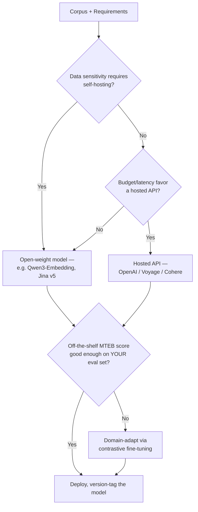
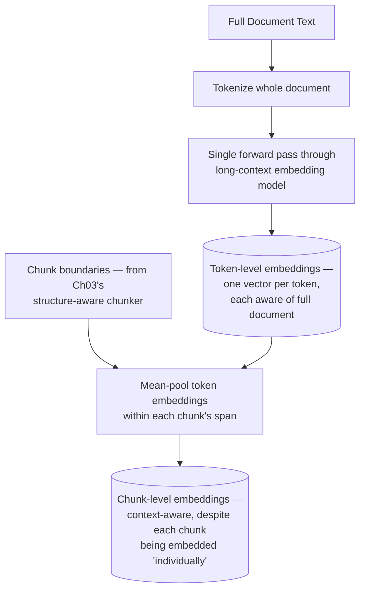
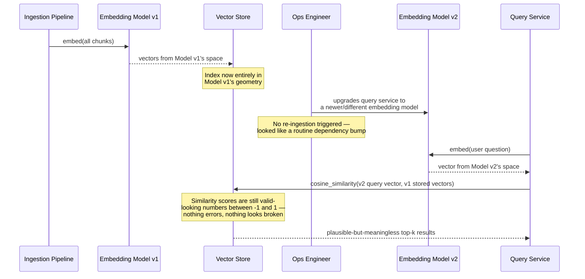
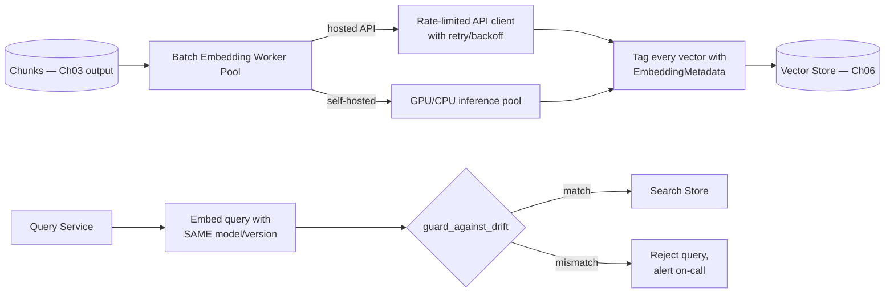
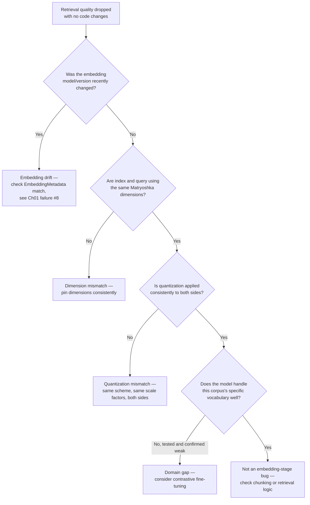

# Chapter 04 — Embedding Models: Choosing, Benchmarking, Domain Adaptation

> "An embedding model doesn't discover meaning — it decides, once, how to distort it. Every retrieval you ever run inherits that decision."

**Learning Objectives**

By the end of this chapter, you will be able to:

- Explain what an embedding model actually optimizes for, and why topping a leaderboard doesn't guarantee it's the right choice for your specific corpus.
- Read an MTEB leaderboard correctly — including the versioning trap that silently invalidates naive score comparisons.
- Choose between a proprietary embedding API and a self-hosted open-weight model using cost, latency, and data-sensitivity trade-offs, not vibes.
- Use Matryoshka Representation Learning to trade dimensionality for storage and speed with controlled, measurable quality loss.
- Apply embedding quantization for large-scale storage and speed savings, and know which quantization scheme fits which use case.
- Domain-adapt (fine-tune) an embedding model with contrastive learning when an off-the-shelf model underperforms on your corpus's vocabulary.
- Implement late chunking end-to-end with a real, current long-context embedding model — completing the concept Chapter 03 introduced.
- Diagnose an embedding-model-version mismatch (Chapter 01's failure #8) from symptoms alone, before it's had time to quietly degrade retrieval for weeks.

**Prerequisites**

- Chapters 01–03 completed — this chapter turns Chapter 03's chunks into the vectors Chapter 06 will index and search.
- Comfortable Python, basic familiarity with PyTorch tensors (you won't need to write training loops from scratch, but you'll read some).
- `pip install openai sentence-transformers transformers torch numpy` in your virtual environment. A GPU is helpful but not required for this chapter's examples at small scale.

**Estimated Reading Time:** 85–95 minutes
**Estimated Hands-on Time:** 4–5 hours

---

## ⚡ Fast Read

> **Skim time: 5 minutes** — Read this if you're in a hurry, returning for reference, or already familiar with part of this topic.

- **What it is:** How to choose, benchmark, size, and — when necessary — adapt the embedding model that turns Chapter 03's chunks into the vectors your entire retrieval system will be built on.
- **Why it matters:** Every retrieval decision downstream — what counts as "similar," what gets found, what gets missed — is inherited from a single upstream choice made once, at ingestion time, and Chapter 01's failure #8 (Embedding Model Mismatch) is what happens when that choice silently changes without anyone noticing.
- **Key insight:** You don't have to choose between a smaller, cheaper embedding and a larger, more accurate one — Matryoshka Representation Learning lets one model produce embeddings at multiple dimensions, so you can truncate down for storage and speed with controlled, measured quality loss, using the *same* model and the *same* training.
- **What you build:** A production-shaped, swappable embedding layer with model-version tracking, quantization, and a full working implementation of late chunking using a real long-context embedding model.
- **Jump to:** [Core Concepts](#core-concepts) | [First Code](#beginner-implementation) | [Best Practices](#best-practices) | [Mini Project](#mini-project)

---

## Why This Topic Exists

Every chapter so far has been building toward this moment: Chapter 02 gave you clean text, Chapter 03 cut it into well-formed, self-contained chunks. None of that produces a *searchable* system — that requires turning each chunk into a vector, and the properties of that vector are entirely determined by which embedding model produced it.

This is a bigger decision than it looks like on the surface. Chapter 01's failure taxonomy has an entry, **Embedding Model Mismatch**, sitting quietly at position #8, described as "retrieval quality silently degrades after a model upgrade." That single line hides an enormous amount of operational risk: two different embedding models — or even two different *versions* of what's nominally "the same" model — produce vectors that live in entirely different geometric spaces. A cosine similarity computed between a chunk embedded with Model A and a query embedded with Model B isn't a meaningless number that errors out — it's a *plausible-looking, syntactically valid, semantically nonsensical* number, and nothing in your system will tell you that's what happened.

This chapter also exists to correct a specific instinct: the urge to just pick "whatever's #1 on the leaderboard." MTEB (the Massive Text Embedding Benchmark) is a genuinely useful tool, but it measures average performance across dozens of public, general-purpose datasets — not your corpus, not your query patterns, not your domain's specific vocabulary. The chapter's job is to give you the actual decision framework: how to read a benchmark correctly, when a leaderboard-topping model is the right call, and when it's worth the real cost of domain-adapting or fine-tuning something smaller instead.

---

## Real-World Analogy

**Hiring a Cartographer**

Imagine commissioning a map of a large, unfamiliar country. You hire a cartographer, who makes thousands of small judgment calls about what to include, what to simplify, and — critically — what *projection* to use. Every map projection distorts something: a Mercator projection preserves angles but wildly exaggerates area near the poles; an equal-area projection preserves size but distorts shape. There is no projection that preserves everything. Choosing a projection is choosing what kind of distortion you're willing to live with.

An embedding model is a cartographer for meaning. It doesn't discover some pure, objective notion of "similarity" — it makes a specific, trained set of judgment calls about which texts should end up near each other in its particular vector space, and those judgment calls are shaped entirely by what it was trained on. A model trained heavily on web text and Q&A pairs will project "meaning" differently than one trained on scientific papers or legal text — neither is more "correct," they're different projections, good for different territories.

Now imagine, halfway through a large mapping project, quietly swapping in a *second* cartographer to finish the eastern half of the map — without telling anyone, and without the two cartographers ever comparing notes. The two halves of the map might each look perfectly reasonable on their own. But distances measured *across* the boundary between them are meaningless — the first cartographer's mile and the second cartographer's mile were never the same unit to begin with. That is exactly what happens when a vector store silently mixes embeddings from two different models or model versions — and it's precisely the mechanism behind Chapter 01's failure #8.

---

## Core Concepts

### MTEB (Massive Text Embedding Benchmark)

- **Technical definition:** A standardized benchmark suite evaluating embedding models across multiple task categories (retrieval, classification, clustering, semantic similarity, and others) on dozens of public datasets, producing a single aggregate leaderboard score alongside per-task breakdowns.
- **Simple definition:** A big standardized test that lots of embedding models take, so you can compare them on the same questions.
- **Analogy:** A standardized exam that measures broad general aptitude — useful for comparing candidates, but not the same as measuring how well a specific candidate will do at your specific job.

### Matryoshka Representation Learning (MRL)

- **Technical definition:** A training technique that structures an embedding vector so that its meaningful information is concentrated toward the front of the vector, such that truncating the vector to a shorter length still produces a usable, if slightly less accurate, embedding — without needing a separately trained model for each dimension.
- **Simple definition:** One model that can give you a "full-size" embedding or a "compressed" version of the same embedding, just by keeping only the first N numbers — named after Russian nesting dolls, where a smaller doll is already complete inside the bigger one.
- **Analogy:** A high-resolution photo that still looks recognizable — just less detailed — when you shrink it, versus a photo that turns to unrecognizable noise the moment you resize it. MRL embeddings are trained specifically to behave like the first kind.

### Embedding Quantization

- **Technical definition:** Reducing the numeric precision used to store each dimension of an embedding vector (for example, from 32-bit floating point to 8-bit integers, or even single bits), trading a controlled amount of precision for large reductions in storage size and search speed.
- **Simple definition:** Storing each number in an embedding with less precision — like rounding "$19.97" to "$20" — to save space, accepting a tiny bit of accuracy loss.
- **Analogy:** Compressing a photo to a smaller file size — you lose some fine detail, but the image is still clearly recognizable, and it takes up a fraction of the space.

### Domain Adaptation (Fine-Tuning)

- **Technical definition:** Further training a pre-trained embedding model on data specific to a target domain or corpus, typically using contrastive learning on query-passage or similar-text pairs, to shift the model's notion of "similar" toward what actually matters for that domain.
- **Simple definition:** Taking a general-purpose embedding model and teaching it your specific vocabulary and what counts as "related" in your world, instead of the general internet's.
- **Analogy:** Hiring a cartographer who's mapped many countries generally well, then sending them to spend a month actually living in *your* country before they finish the map — so they learn which local landmarks actually matter to residents, not just what's visible from a satellite.

### Contrastive Fine-Tuning

- **Technical definition:** A training approach that teaches an embedding model by showing it pairs of texts that should be considered similar ("positive pairs," e.g., a real query and its correct answer passage) alongside dissimilar ones ("negative pairs"), adjusting the model so positive pairs end up close together in vector space and negative pairs end up far apart.
- **Simple definition:** Teaching by example — "these two things should end up close together, these two should not" — repeated thousands of times until the model generalizes the pattern.
- **Analogy:** Teaching a new hire your company's product taxonomy by repeatedly showing them "these two support tickets are actually about the same issue" and "these two look similar but are actually unrelated," until they develop the same intuition unprompted.

### Token-Level Embeddings (Late Chunking's Foundation)

- **Technical definition:** Embedding representations produced for each individual token in a document — as an intermediate output of a transformer-based embedding model — before any pooling step condenses them into a single vector for a sentence, chunk, or document.
- **Simple definition:** Instead of getting one number-list for a whole paragraph, you get one number-list *per word*, each aware of the entire surrounding document because of how transformers process context.
- **Analogy:** A translator who reads an entire novel before translating any single sentence, versus one handed only isolated sentences out of order — the token-level embeddings in late chunking are the former: shaped by full-document context, not read in isolation.

### Embedding Drift

- **Technical definition:** The degradation of retrieval quality that occurs when embeddings in an index were produced by a different model, model version, or model configuration (e.g., different Matryoshka truncation) than the one currently used to embed incoming queries.
- **Simple definition:** The index and the live queries are speaking two subtly different "languages" of vector space, without anyone having changed anything that looks obviously wrong.
- **Analogy:** The two-cartographer map from this chapter's opening analogy — nothing looks broken locally, but distances measured across the boundary are meaningless.

### Dimensionality Trade-off

- **Technical definition:** The relationship between an embedding vector's length (dimension count) and its storage cost, search speed, and representational capacity — higher dimensions generally capture more nuance but cost more to store and search.
- **Simple definition:** More numbers per embedding usually means more accuracy, but also more storage and slower search — MRL and quantization both exist specifically to manage this trade-off deliberately, instead of accepting whatever a model's default output size happens to be.
- **Analogy:** A more detailed map takes longer to draw, costs more to print, and is slower to unfold and read — sometimes a simplified map that's faster to use is the better choice, even though it shows less.

---

## Architecture Diagrams

### Diagram 1 — Choosing an Embedding Model



### Diagram 2 — Late Chunking: Token-Level Embedding, Then Pooling



Compare this to standard chunking-then-embedding: there, each chunk is embedded in total isolation, with zero awareness that a "12 concurrent connections" sentence three paragraphs earlier explains what "it" refers to in the current chunk. Late chunking's single full-document forward pass is what preserves that awareness — the chunking boundary is applied *after* the model has already seen everything.

---

## Flow Diagrams

### How Embedding Drift Happens, Step by Step



This is why Chapter 01's Best Practices insisted on versioning your embedding model in your vector store's metadata — it's the only thing standing between "routine dependency upgrade" and a silent, weeks-long retrieval quality regression that produces no errors anywhere.

---

## Beginner Implementation

We start with a hosted API — OpenAI's `text-embedding-3-small`, chosen because it's widely available and, notably, supports Matryoshka truncation via a simple `dimensions` parameter, letting us demonstrate the dimensionality trade-off with almost no extra code.

```python
# Learning example — beginner_embeddings.py
# Embeds Ch03's chunks using a hosted API, demonstrating Matryoshka
# truncation via the `dimensions` parameter.

from openai import OpenAI
import numpy as np

client = OpenAI()

def embed_chunks(texts: list[str], dimensions: int = 1536) -> np.ndarray:
    """
    text-embedding-3-small was trained with Matryoshka Representation
    Learning, meaning it supports a `dimensions` parameter that truncates
    the output vector — 1536 is the model's native size; passing a smaller
    value (e.g. 256) returns a shorter, cheaper-to-store vector from the
    SAME underlying model, not a different, separately trained one.
    """
    response = client.embeddings.create(
        model="text-embedding-3-small",
        input=texts,
        dimensions=dimensions,
    )
    return np.array([item.embedding for item in response.data])

def cosine_similarity(a: np.ndarray, b: np.ndarray) -> float:
    return float(np.dot(a, b) / (np.linalg.norm(a) * np.linalg.norm(b)))

if __name__ == "__main__":
    chunks = [
        "The /export endpoint is rate-limited to 100 requests per minute on the Free tier.",
        "API keys can be rotated from the Account > Security page with no grace period.",
    ]
    query = "What happens if I exceed the export rate limit?"

    # Full-size (1536-dim) embeddings
    full_chunks = embed_chunks(chunks, dimensions=1536)
    full_query = embed_chunks([query], dimensions=1536)[0]

    # Truncated (256-dim) embeddings — same model, same training, shorter vector
    small_chunks = embed_chunks(chunks, dimensions=256)
    small_query = embed_chunks([query], dimensions=256)[0]

    for i, chunk in enumerate(chunks):
        full_sim = cosine_similarity(full_query, full_chunks[i])
        small_sim = cosine_similarity(small_query, small_chunks[i])
        print(f"{chunk[:50]}...")
        print(f"  1536-dim similarity: {full_sim:.4f}")
        print(f"  256-dim similarity:  {small_sim:.4f}  (6x smaller, 6x less storage)")
```

**Walking through what's actually happening:**

- The `dimensions` parameter is doing something more interesting than a generic "resize" — because the model was trained with MRL, the first 256 numbers of its 1536-dimensional output were specifically trained to be a *usable, self-contained* embedding on their own, not just an arbitrary truncated fragment. That's the entire point of MRL, and it's why this works well while naively truncating a *non*-Matryoshka model's output would not.
- Run this and compare the two similarity scores for the same chunk-query pair — they won't be identical, but they should be close, and critically, they should *rank* the two chunks in the same relative order. That relative ranking preservation, not exact score matching, is what actually matters for retrieval.
- Notice both `dimensions=1536` and `dimensions=256` calls hit the same `model="text-embedding-3-small"` — this is one model serving two different storage/speed/accuracy trade-off points, not two models to separately maintain.

---

## Intermediate Implementation

Now we self-host an open-weight embedding model — giving up hosted-API convenience for full data control and zero marginal per-token cost — and apply quantization to control storage size explicitly.

```python
# Learning example — intermediate_embeddings.py
# Self-hosted embedding via sentence-transformers, plus int8 quantization.

from sentence_transformers import SentenceTransformer
import numpy as np

# Any current strong open-weight embedding model works here — self-hosting
# means you control exactly which model and version is running, with no
# risk of a provider silently swapping the model behind a fixed API name.
model = SentenceTransformer("Qwen/Qwen3-Embedding-0.6B")

def embed_chunks_local(texts: list[str]) -> np.ndarray:
    # normalize_embeddings=True makes cosine similarity equivalent to a
    # simple dot product downstream — a common vector-DB-side optimization.
    return model.encode(texts, normalize_embeddings=True, batch_size=32)

def quantize_int8(embeddings: np.ndarray) -> tuple[np.ndarray, np.ndarray, np.ndarray]:
    """
    Scalar (int8) quantization: maps each dimension's float32 range to the
    int8 range [-127, 127], roughly a 4x storage reduction with typically
    minor retrieval-quality impact. Returns the quantized array plus the
    per-dimension min/max needed to de-quantize (or to quantize queries
    consistently, which matters — see this chapter's Common Mistakes).
    """
    mins = embeddings.min(axis=0)
    maxs = embeddings.max(axis=0)
    scale = (maxs - mins) / 254.0
    scale[scale == 0] = 1.0  # avoid divide-by-zero on constant dimensions
    quantized = np.round((embeddings - mins) / scale - 127).astype(np.int8)
    return quantized, mins, scale

def dequantize_int8(quantized: np.ndarray, mins: np.ndarray, scale: np.ndarray) -> np.ndarray:
    return (quantized.astype(np.float32) + 127) * scale + mins

if __name__ == "__main__":
    chunks = [
        "The /export endpoint is rate-limited to 100 requests per minute on the Free tier.",
        "API keys can be rotated from the Account > Security page with no grace period.",
    ]
    embeddings = embed_chunks_local(chunks)
    print(f"Original: {embeddings.nbytes} bytes, dtype={embeddings.dtype}")

    quantized, mins, scale = quantize_int8(embeddings)
    print(f"Quantized: {quantized.nbytes} bytes, dtype={quantized.dtype}")
    print(f"Storage reduction: {embeddings.nbytes / quantized.nbytes:.1f}x")

    # Sanity check: dequantized vectors should closely approximate the originals
    recovered = dequantize_int8(quantized, mins, scale)
    error = np.abs(embeddings - recovered).mean()
    print(f"Mean absolute reconstruction error: {error:.6f}")
```

**What changed, and why each change matters:**

1. **Self-hosting trades a per-token API cost for compute infrastructure you control.** For a large, frequently-re-embedded corpus, or a corpus too sensitive to send to a third party, this trade is often worth it — see this chapter's Cost Considerations for the actual numbers.
2. **`normalize_embeddings=True` is a small detail with real downstream consequences.** Most production vector databases assume normalized vectors for cosine-similarity search; forgetting this step is a common, quietly-wrong source of degraded search quality that never throws an error.
3. **Quantization returns `mins` and `scale` alongside the quantized vectors** because de-quantization — and, just as importantly, *consistently quantizing queries the same way* — requires them. Storing quantized index vectors while embedding queries at full float32 precision without applying the same scale is a real, easy-to-make mistake, covered explicitly in Common Mistakes below.
4. **The reconstruction error check isn't decorative.** It's the concrete, measurable way to confirm quantization is behaving as expected before trusting it in a retrieval pipeline — "storage went down 4x" alone doesn't tell you whether retrieval quality held up.

---

## Advanced Implementation

Production embedding needs three things: a swappable, version-tracked embedding interface (matching this course's established `Protocol` pattern), a real implementation of the late chunking technique Chapter 03 promised, and an explicit guard against the embedding-drift failure from this chapter's sequence diagram.

```python
# Production example — advanced_embeddings.py
# A versioned, Protocol-based Embedder interface, plus a full late-chunking
# implementation using a long-context, token-level-accessible model.

from __future__ import annotations
from dataclasses import dataclass
from typing import Protocol
import numpy as np
import torch
from transformers import AutoTokenizer, AutoModel

@dataclass
class EmbeddingMetadata:
    model_name: str
    model_version: str
    dimensions: int

class Embedder(Protocol):
    """Same Protocol pattern as Ch01's Retriever/Reranker — any embedding
    backend that implements this can be swapped without touching the
    ingestion or query pipeline that calls it."""
    def embed(self, texts: list[str]) -> np.ndarray: ...
    def metadata(self) -> EmbeddingMetadata: ...

class OpenAIEmbedder:
    def __init__(self, model: str = "text-embedding-3-small", dimensions: int = 1536):
        from openai import OpenAI
        self.client = OpenAI()
        self.model = model
        self.dimensions = dimensions

    def embed(self, texts: list[str]) -> np.ndarray:
        response = self.client.embeddings.create(model=self.model, input=texts, dimensions=self.dimensions)
        return np.array([item.embedding for item in response.data])

    def metadata(self) -> EmbeddingMetadata:
        # The version string is what a vector store's metadata check
        # (Ch01 failure #8 guard) compares against on every query —
        # bump this deliberately whenever the model or dimensions change.
        return EmbeddingMetadata(model_name=self.model, model_version=f"{self.model}-d{self.dimensions}", dimensions=self.dimensions)

def guard_against_drift(query_meta: EmbeddingMetadata, index_meta: EmbeddingMetadata) -> None:
    """
    The direct code fix for this chapter's sequence diagram: refuse to
    search at all if the querying embedder's version doesn't match the
    index's recorded version, rather than silently returning plausible-
    looking, meaningless similarity scores.
    """
    if query_meta.model_version != index_meta.model_version:
        raise RuntimeError(
            f"Embedding drift detected: index was built with "
            f"'{index_meta.model_version}' but query used '{query_meta.model_version}'. "
            f"Refusing to search — re-embed the index or match the model version."
        )

class LateChunkingEmbedder:
    """
    Implements late chunking: embed the WHOLE document in a single forward
    pass, THEN pool token embeddings within each chunk's character span —
    so every chunk's vector carries full-document context, unlike standard
    chunk-then-embed, where each chunk is embedded in total isolation.
    """
    def __init__(self, model_name: str = "jinaai/jina-embeddings-v2-base-en"):
        self.tokenizer = AutoTokenizer.from_pretrained(model_name, trust_remote_code=True)
        self.model = AutoModel.from_pretrained(model_name, trust_remote_code=True)
        self.model.eval()

    def embed_with_late_chunking(self, full_document: str, chunk_spans: list[tuple[int, int]]) -> list[np.ndarray]:
        """
        chunk_spans: character (start, end) offsets from Ch03's chunker —
        the SAME chunk boundaries structure-aware chunking already decided,
        just applied to token embeddings after the fact instead of before.
        """
        inputs = self.tokenizer(full_document, return_tensors="pt", return_offsets_mapping=True, truncation=True, max_length=8192)
        offset_mapping = inputs.pop("offset_mapping")[0]  # (num_tokens, 2): char start/end per token

        with torch.no_grad():
            outputs = self.model(**inputs)
        token_embeddings = outputs.last_hidden_state[0]  # (num_tokens, hidden_dim) — one vector PER TOKEN

        chunk_vectors = []
        for start, end in chunk_spans:
            # Find every token whose character span overlaps this chunk's
            # span, then mean-pool exactly those token embeddings — this
            # is the "pool after embedding" step from Diagram 2.
            mask = [(tok_start < end and tok_end > start) for tok_start, tok_end in offset_mapping.tolist()]
            token_indices = [i for i, m in enumerate(mask) if m]
            if not token_indices:
                continue
            pooled = token_embeddings[token_indices].mean(dim=0)
            chunk_vectors.append(pooled.numpy())

        return chunk_vectors
```

**Why this shape earns its complexity:**

- **`guard_against_drift` is the single most important function in this entire chapter.** It converts Chapter 01's failure #8 from "a silent, weeks-long retrieval quality regression" into "an immediate, loud exception at query time" — the difference between an incident that's caught in staging and one that's caught by an angry customer.
- **`LateChunkingEmbedder` reuses Chapter 03's chunk boundaries directly**, rather than inventing new ones. Late chunking isn't a different *chunking* strategy — it's a different *embedding* strategy applied to the same chunks Chapter 03 already decided on. This is why the technique belongs conceptually in Chapter 03 but its concrete implementation belongs here, once you actually have a token-level embedding model in hand.
- **`return_offsets_mapping=True`** is the specific mechanism that makes pooling-by-character-span possible — it's what maps each token back to exactly which characters of the original document it corresponds to, so `chunk_spans` (produced independently by Chapter 03's chunker) can be matched against the right token embeddings after the fact.
- **This implementation self-hosts the embedding model** rather than using a hosted late-chunking API, deliberately — it makes the actual mechanism (one forward pass, then pool) visible and provider-agnostic, rather than hidden behind a single `"late_chunking": true` flag in an API request.

---

## Production Architecture

The embedding stage sits between Chapter 03's chunker and Chapter 06's vector index — a stateless, horizontally scalable batch-processing stage, extending the same worker-pool pattern from Chapter 01 and Chapter 02.



Two operational rules follow directly from this chapter's core lesson: **every vector written to the store must carry its `EmbeddingMetadata`**, and **every query-time embed call must be checked against that metadata before search runs** — not logged and investigated after the fact, but blocked at the point of failure, exactly as `guard_against_drift` does.

> **Currency Note:** This chapter's model names, MTEB scores, and pricing were verified as of this writing. Two things move on genuinely fast timescales here and deserve explicit re-verification before a production decision: (1) MTEB itself has undergone a versioned revision (scores reported as "MTEB v1" vs. "MTEB v2" are not directly comparable — always check which version a cited score refers to), and (2) embedding API pricing and model lineups change on a timescale of months, not years (Voyage, for example, replaced its `voyage-3.1` generation with a new `voyage-4` tiered family — nano/lite/standard/large — within the past several months of this writing). Treat every number in this chapter's Cost Considerations table as a snapshot, not a constant.

---

## Best Practices

1. **Version-tag every embedding with its exact model name, version, and dimensionality** — not just "which model," but the full configuration that determines the vector space it lives in.
2. **Reject, don't warn, on an embedding version mismatch between index and query.** A silent warning buried in logs gets ignored; a raised exception gets fixed.
3. **Evaluate embedding model choice against your own corpus and query set**, not MTEB rank alone — Chapter 12 builds the evaluation harness that makes this rigorous rather than anecdotal.
4. **Use MRL truncation instead of a smaller, separately-trained model when you need to save storage**, when your chosen model supports it — you get a controlled, measured quality trade-off instead of an unrelated model's different biases.
5. **Quantize consistently across index and query.** Quantizing stored vectors while embedding queries at full precision (or with a different quantization scheme) reproduces the exact same silent-mismatch failure as using two different models.
6. **Reach for domain adaptation only after measuring a real gap**, not preemptively — fine-tuning has real cost (data collection, training, evaluation, ongoing maintenance) and an off-the-shelf model is very often good enough.
7. **Batch embedding calls, both hosted and self-hosted**, rather than embedding one chunk at a time — this is nearly free throughput and cost improvement with no downside.
8. **Treat late chunking as a targeted tool for context-dependent documents**, not a default — it requires a long-context embedding model and costs more compute per document than standard chunk-then-embed.

---

## Security Considerations

- **Sending corpus content to a third-party embedding API is a data-residency decision**, exactly like Chapter 03's Contextual Retrieval concern — every chunk you embed via a hosted API leaves your infrastructure. Self-hosting an open-weight model is the direct mitigation for sensitive corpora, at the cost of infrastructure and operational burden.
- **Embedding inversion is a real, published attack class** — research has shown that under certain conditions, an embedding vector can leak enough information to partially reconstruct the source text it was generated from, particularly with query embeddings from a known or guessable vocabulary. This matters most in Module 3 onward, when this course starts working with genuinely sensitive document domains: treat embedding vectors themselves as data that may need access controls, not just the source documents.

---

## Cost Considerations

| Provider / Approach | Price (approximate, verify before production use) | Notes |
|---|---|---|
| OpenAI `text-embedding-3-small` | ~$0.02 per 1M tokens | Native 1536-dim, MRL-truncatable down to 256 |
| Voyage AI `voyage-4` (general-purpose tier — Voyage's Jan-2026 family also includes `voyage-4-nano`, `voyage-4-lite`, and the higher-tier `voyage-4-large`) | ~$0.06 per 1M tokens, first 200M tokens/month free | Superseded the `voyage-3.1` generation — model names and tiers change, verify before committing |
| Cohere `embed-v4.0` | ~$0.12 per 1M text tokens, ~$0.47 per 1M image tokens (multimodal) | 1,536 dimensions, 128K token context window |
| Self-hosted open-weight (e.g. Qwen3-Embedding, Jina v5-small) | Compute infrastructure only, no per-token fee | Requires GPU/CPU capacity planning; full data control |

The consistent theme continues: **quantization and MRL truncation compound.** A documented case study combining both techniques together reported roughly an 80% storage/cost reduction relative to full-precision, full-dimension embeddings — worth pursuing before assuming a large corpus requires a bigger infrastructure budget rather than a smarter storage strategy.

---

## Common Mistakes

**Mistake 1 — Mixing embedding models between index-time and query-time.**
```python
# Wrong: index built with one model, queries embedded with another,
# with nothing checking or recording the mismatch
index_vectors = openai_embed(chunks, model="text-embedding-3-small")
query_vector = local_model.encode([question])  # different model entirely!

# Right: version-tagged, checked before every search
index_meta = index_embedder.metadata()
query_meta = query_embedder.metadata()
guard_against_drift(query_meta, index_meta)  # raises loudly on mismatch
```

**Mistake 2 — Choosing an embedding model purely by MTEB leaderboard rank.**
```python
# Wrong: picks the #1 leaderboard model with no corpus-specific validation
model = load_top_mteb_model()

# Right: validate the top candidates against your OWN labeled evaluation
# set (Ch12) before committing — leaderboard rank is a starting point,
# not a decision
candidates = ["model-a", "model-b", "model-c"]
scores = {m: evaluate_on_corpus_eval_set(m, my_eval_set) for m in candidates}
model = load_model(max(scores, key=scores.get))
```

**Mistake 3 — Inconsistent Matryoshka dimensions between ingestion and query.**
```python
# Wrong: index embedded at 1536 dims, query embedded at 256 — these
# vectors aren't even the same SHAPE, let alone comparable
index_vec = embed_chunks(chunks, dimensions=1536)
query_vec = embed_chunks([question], dimensions=256)[0]

# Right: dimensions is part of the model configuration — pin it once,
# use it everywhere, and record it in EmbeddingMetadata
DIMENSIONS = 1536
index_vec = embed_chunks(chunks, dimensions=DIMENSIONS)
query_vec = embed_chunks([question], dimensions=DIMENSIONS)[0]
```

**Mistake 4 — Quantizing the index but not the query, with different scale factors.**
```python
# Wrong: index vectors are int8, query vector is raw float32 — comparing
# them directly produces meaningless numbers
index_vecs_int8, mins, scale = quantize_int8(index_embeddings)
query_vec = embed_query(question)  # still float32, never quantized

# Right: apply the SAME quantization scheme, using the SAME mins/scale,
# to both index and query vectors
query_vec_int8 = np.round((embed_query(question) - mins) / scale - 127).astype(np.int8)
```

**Mistake 5 — Assuming a general-purpose embedding model handles domain jargon well without checking.**
```python
# Wrong: deploys a general-purpose model on a jargon-heavy corpus with
# no validation that domain-specific terms are handled correctly
model = load_general_purpose_model()
deploy(model)

# Right: test specifically on domain vocabulary before deciding
# fine-tuning is (or isn't) necessary
jargon_test_pairs = [("What's the SLA for a P1 incident?", correct_chunk), ...]
score = evaluate_retrieval(model, jargon_test_pairs)
if score < ACCEPTABLE_THRESHOLD:
    model = fine_tune_on_domain_pairs(model, domain_training_pairs)
```

---

## Debugging Guide



| Symptom | Likely cause | First thing to check |
|---|---|---|
| Retrieval quality dropped suddenly, no code changes visible | Embedding model/version silently changed upstream (dependency bump, API default change) | `EmbeddingMetadata` on both index and query paths |
| Similarity scores look plausible but rankings are consistently wrong | Dimension or quantization mismatch between index and query | Confirm both sides use identical dimensions and quantization scheme |
| Domain-specific queries (jargon, internal terms) underperform general queries | Off-the-shelf model lacks domain adaptation | Run a small labeled domain-vocabulary eval set against the model |
| Self-hosted embedding is much slower than expected | Not batching calls, or missing GPU utilization | Batch size and hardware utilization during embedding runs |
| Storage costs far higher than expected for corpus size | Full-precision, full-dimension vectors with no MRL/quantization applied | Whether truncation or quantization is in use at all |

---

## Performance Optimisation

| Technique | What it improves | Illustrative gain* | Trade-off |
|---|---|---|---|
| Matryoshka truncation (e.g. 1536 → 256 dims) | Storage size and search speed | ~6x smaller vectors, minor measured similarity-ranking impact | Requires a model actually trained with MRL — not safe on arbitrary models |
| Int8 quantization | Storage size | ~4x smaller vectors | Small precision loss; must be applied consistently to index and query |
| Combined MRL + quantization | Storage/cost, compounding | Documented case study: ~80% total cost reduction | Requires careful validation that combined precision loss stays acceptable for your retrieval quality bar |
| Batched embedding calls | Throughput, cost (fewer API round-trips) | Substantial reduction in per-chunk overhead vs. one-at-a-time calls | Requires buffering chunks before flushing a batch |
| Late chunking | Chunk embedding quality on context-dependent documents | Jina reports nDCG@10 improvements on BEIR benchmarks, increasing with document length | Requires a long-context embedding model; more compute per document than standard embedding |

*As with prior chapters, treat these as directional findings to validate against your own evaluation harness (Chapter 12), not universal guarantees.

---

## Decision Framework — Choosing and Sizing an Embedding Model

| Situation | Recommendation |
|---|---|
| Sensitive corpus, cannot send data to a third party | Self-hosted open-weight model (e.g. Qwen3-Embedding, Jina v5-small) |
| Small-to-medium corpus, no infrastructure team, want fastest time-to-production | Hosted API (OpenAI, Voyage, or Cohere), chosen from your own eval set, not leaderboard rank alone |
| Storage or search-speed constrained at large scale | Apply MRL truncation and/or quantization before assuming you need a smaller/worse model |
| Off-the-shelf model measurably underperforms on domain vocabulary (tested, not assumed) | Contrastive fine-tuning / domain adaptation |
| Documents where meaning depends heavily on distant context (long technical documents, cross-referencing sections) | Late chunking, with a long-context embedding model |
| Uncertain which model is actually best for your corpus | Build the Chapter 12 evaluation harness first, then A/B candidate models against it |

---

## Technology Comparison — Embedding Models at a Glance

| Model | Type | Native Dimensions | Max Context | Notes |
|---|---|---|---|---|
| OpenAI `text-embedding-3-small` | Hosted API | 1536 (MRL-truncatable to 256) | 8191 tokens | Cheapest major hosted option; strong general-purpose default |
| Voyage `voyage-4` | Hosted API | Model-specific (verify at write time) | Model-specific | Voyage's general-purpose tier (not the flagship — `voyage-4-large` sits above it); generous free tier |
| Cohere `embed-v4.0` | Hosted API | 1536 | 128,000 tokens | Multimodal (text + image); largest listed context window here |
| Qwen3-Embedding-8B | Open-weight, self-hosted | Model-specific, large | Long-context variant available | Leading open-weight MTEB performer as of this writing |
| Jina v5-text-small | Open-weight, self-hosted | Compact | Long-context | Strong quality-to-size ratio; Jina's embedding family also documents late-chunking support |
| Google Gemini Embedding | Hosted API | 3072, unified across modalities | Long-context | Notable for embedding text/image/video/audio into one shared space |

---

## Interview Questions

1. **"Why can't you just always pick the #1 model on the MTEB leaderboard?"** — Expect: MTEB measures average performance across public general-purpose datasets, not your corpus or query distribution; domain-specific evaluation matters more for production decisions.
2. **"Explain what happens, mechanically, when a vector store mixes embeddings from two different model versions."** — Expect: two different, incompatible vector spaces; cosine similarity still returns valid-looking numbers, but they're meaningless — nothing errors, which is what makes this dangerous.
3. **"What's Matryoshka Representation Learning, and why is it different from just training a smaller model?"** — Expect: one model producing embeddings usable at multiple truncated dimensions, trained specifically so early dimensions carry the most information — not the same as an independently trained smaller model with different learned biases.
4. **"When would you domain-adapt an embedding model instead of using one off-the-shelf?"** — Expect: only after measuring a real, specific performance gap on domain vocabulary — not preemptively, given the real cost of fine-tuning.
5. **"Describe late chunking and explain what problem it solves that standard chunking-then-embedding doesn't."** — Expect: whole-document forward pass first, chunk-level pooling of token embeddings after, preserving full-document context awareness that isolated per-chunk embedding loses.
6. **"How would you detect embedding drift in a production system before a user notices degraded answers?"** — Expect: version metadata tagging on both index and query paths, with an explicit mismatch check/guard, not passive monitoring alone.

---

## Exercises

1. **(20 min)** Run this chapter's Beginner Implementation on a handful of Chapter 03 chunks at both `dimensions=1536` and `dimensions=256`. Confirm the relative ranking of chunks by similarity to a test query stays the same even though the raw scores differ.
2. **(30 min)** Implement and run the int8 quantization/dequantization round-trip from the Intermediate Implementation on real chunk embeddings, and report the mean absolute reconstruction error you observe.
3. **(30 min)** Deliberately reproduce Mistake 3 (inconsistent Matryoshka dimensions between index and query) and observe what actually happens when you try to compute cosine similarity between mismatched-dimension vectors — does it error, or silently produce a wrong answer?
4. **(45 min)** Implement `guard_against_drift` end-to-end: build a small index with one embedder configuration, then attempt a query with a *different* configuration, and confirm the guard raises before any search happens.
5. **(60 min, harder)** Implement the full late-chunking example from the Advanced Implementation on a real multi-paragraph document with a pronoun-dependent sentence (something like Chapter 03's "it has twelve legs" example), and compare the late-chunked embedding of that sentence's chunk against a standard, isolated chunk-then-embed version. Can you find a query where the late-chunked version retrieves more accurately?

---

## Quiz

1. **Why doesn't a wrong embedding-model match throw an error?**
   *Cosine similarity between vectors from different models still returns valid-looking numbers between -1 and 1 — there's no structural reason for it to fail, just semantically meaningless.*
2. **What does Matryoshka Representation Learning actually train differently, compared to a standard embedding model?**
   *It structures training so that early dimensions of the vector carry the most information, making truncation to a shorter vector produce a usable (not just arbitrarily cut) embedding.*
3. **Why is MTEB rank alone not sufficient for choosing a production embedding model?**
   *It measures average performance across public, general-purpose benchmark datasets — not your specific corpus, vocabulary, or query patterns.*
4. **What's the difference between int8 quantization and Matryoshka truncation?**
   *Quantization reduces the numeric precision of each dimension (same vector length, less precise numbers); MRL truncation reduces the number of dimensions itself (shorter vector, each number still full precision).*
5. **Why must quantization be applied identically to both index and query vectors?**
   *Different quantization schemes or scale factors produce vectors that aren't directly comparable, reproducing the same kind of silent mismatch as using two different embedding models.*
6. **What specific problem does late chunking solve that standard chunk-then-embed doesn't?**
   *Standard embedding processes each chunk in isolation, losing context that spans chunk boundaries; late chunking embeds the whole document first, so every chunk's pooled vector retains awareness of the full document.*
7. **When is domain adaptation (fine-tuning) worth its cost?**
   *Only after measuring a real, specific gap in performance on domain-specific vocabulary against a labeled evaluation set — not preemptively.*
8. **What's the concrete architectural fix for embedding drift, beyond "communicate changes better"?**
   *Version-tag every embedding with model name/version/dimensions, and enforce an explicit mismatch check before search runs — the `guard_against_drift` pattern.*
9. **Why does MTEB versioning (v1 vs. v2) matter when comparing scores?**
   *Scores from different MTEB versions aren't directly comparable — a model's "MTEB score" is only meaningful alongside which version of the benchmark produced it.*
10. **What's a security consideration specific to sending corpus content to a hosted embedding API?**
    *Data-residency/third-party exposure of your content, plus the broader risk that embedding vectors themselves can potentially leak information about source text (embedding inversion).*

---

## Mini Project

**Build:** An embedding layer over your Chapter 03 chunk output, using at least one hosted API model and one self-hosted open-weight model.

**Acceptance criteria:**
- [ ] Both embedding paths implement the `Embedder` Protocol from the Advanced Implementation.
- [ ] Every embedding is tagged with `EmbeddingMetadata` (model name, version, dimensions).
- [ ] `guard_against_drift` is implemented and you can demonstrate it correctly raising on a deliberate model/version mismatch.
- [ ] Matryoshka truncation is demonstrated on the hosted model (if it supports it), with a before/after storage-size comparison.
- [ ] int8 quantization is implemented and validated with a reconstruction-error check.

**Time estimate:** 2–3 hours.

---

## Production Project

**Build:** Extend the Mini Project into a full late-chunking pipeline plus a basic domain-adaptation evaluation.

**Acceptance criteria:**
- [ ] The `LateChunkingEmbedder` from the Advanced Implementation runs end-to-end on at least 3 real, multi-paragraph documents from your corpus, using Chapter 03's actual chunk boundaries.
- [ ] You've constructed a small (10–20 pair) domain-vocabulary evaluation set specific to your corpus, and measured your chosen off-the-shelf model's performance against it.
- [ ] Based on that measurement, you've made and documented a specific decision: proceed with the off-the-shelf model, or begin domain adaptation — with your reasoning written down, not just a gut call.
- [ ] Embedding-stage cost is estimated for your corpus size under at least two configurations (e.g., full-precision hosted API vs. quantized self-hosted), with the actual numbers compared.
- [ ] A short `RUNBOOK.md` documenting: how to safely upgrade an embedding model version (referencing the re-ingestion requirement from Ch01/Ch03), how to diagnose a suspected embedding-drift incident (referencing this chapter's Debugging Guide), and when late chunking is worth its added cost for your specific corpus.

**Time estimate:** 1–2 days.

---

## Key Takeaways

- An embedding model doesn't discover objective meaning — it makes a trained, specific set of judgment calls about similarity, and every retrieval decision downstream inherits those calls.
- Embedding drift (mixing model versions between index and query) produces plausible-looking, valid, and completely meaningless similarity scores — it never errors on its own.
- MTEB is a useful starting point, not a production decision — validate top candidates against your own corpus and query patterns before committing.
- Matryoshka Representation Learning lets one model serve multiple dimensionality/storage trade-off points, avoiding the need to separately train and maintain multiple model sizes.
- Quantization and MRL truncation compound — combining both can produce dramatic storage/cost reductions, but both must be applied consistently across index and query paths.
- Domain adaptation is worth its real cost only after measuring a specific, confirmed gap — not as a default first move.
- Late chunking directly solves the context-isolation problem of standard chunk-then-embed, by embedding the full document first and pooling afterward — genuinely useful for context-dependent documents, not a universal upgrade.
- The single highest-leverage defense against embedding drift is an explicit, enforced version-mismatch guard — not documentation, not tribal knowledge, a raised exception.

---

## Chapter Summary

| Concept | Key Takeaway |
|---|---|
| MTEB | Useful for narrowing candidates; not sufficient alone for a production decision |
| Matryoshka Representation Learning | One model, multiple usable dimensionality/storage trade-off points |
| Embedding Quantization | Reduces numeric precision for storage/speed; must match on both index and query sides |
| Domain Adaptation | Contrastive fine-tuning on domain pairs; worth it only after measuring a real gap |
| Late Chunking | Whole-document embedding first, chunk-level pooling after — preserves cross-chunk context |
| Embedding Drift | Silent, error-free retrieval degradation from mismatched model/version/dimensions/quantization |

---

## Resources

- Muennighoff et al., ["MTEB: Massive Text Embedding Benchmark"](https://arxiv.org/abs/2210.07316) — the original benchmark paper this chapter's Core Concepts section is built on.
- Kusupati et al., ["Matryoshka Representation Learning"](https://arxiv.org/abs/2205.13147) — the original MRL paper.
- Jina AI, ["Late Chunking in Long-Context Embedding Models"](https://jina.ai/news/late-chunking-in-long-context-embedding-models/) and the [reference implementation](https://github.com/jina-ai/late-chunking) this chapter's Advanced Implementation is based on.
- [MTEB Leaderboard](https://huggingface.co/spaces/mteb/leaderboard) — verify current rankings before a production model decision; check which MTEB version a score refers to.
- [Sentence-Transformers documentation](https://www.sbert.net/) — the library used for self-hosted embedding and domain adaptation in this chapter.
- Volume 1, Chapter 07 — the embeddings fundamentals this chapter assumes and builds far beyond.

---

## Glossary Terms Introduced

| Term | One-line definition |
|---|---|
| MTEB | Standardized multi-task benchmark suite for comparing embedding models |
| Matryoshka Representation Learning (MRL) | Training technique enabling usable embeddings at multiple truncated dimensions from one model |
| Embedding Quantization | Reducing numeric precision of stored embedding values for storage/speed savings |
| Domain Adaptation | Fine-tuning an embedding model on domain-specific data to improve its notion of similarity for that domain |
| Contrastive Fine-Tuning | Training with similar/dissimilar text pairs to shape an embedding space |
| Token-Level Embeddings | Per-token vector representations produced before pooling into sentence/chunk/document vectors |
| Embedding Drift | Retrieval degradation from mismatched embedding models/versions/configurations between index and query |
| Dimensionality Trade-off | The balance between embedding vector length and storage/speed/accuracy |

---

## See Also

| Chapter | Why it's relevant |
|---|---|
| Volume 1, Ch 07 — Embeddings | The embeddings fundamentals this chapter assumes and extends into production concerns |
| Vol 3, Ch 01 — RAG Architecture Deep Dive | The source of the Embedding Model Mismatch failure (#8) this entire chapter is built around solving |
| Vol 3, Ch 03 — Chunking Strategies | The source of the chunk boundaries this chapter's late-chunking implementation reuses directly |
| Vol 3, Ch 06 — Dense Retrieval | Where the vectors this chapter produces actually get indexed and searched at scale |
| Vol 3, Ch 12 — RAG Evaluation | The rigorous, corpus-specific evaluation harness this chapter repeatedly points to instead of relying on MTEB rank alone |

---

## Preparation for Next Chapter

Chapter 05 (Sparse Retrieval) steps back from dense embeddings entirely to cover keyword-based retrieval (BM25/TF-IDF) — the technique that catches exact terms, codes, and names that dense embeddings can systematically miss, setting up Chapter 07's hybrid search.

**Technical checklist:**
- [ ] Have your Chapter 04 Mini Project's embedded chunks on hand, with `EmbeddingMetadata` intact.
- [ ] Note at least one query from your domain containing an exact code, product name, or identifier (e.g., an endpoint path like `/export`, an error code) — Chapter 05 will show you exactly why dense retrieval alone often struggles with queries like this.

**Conceptual check:**
- Why might a dense embedding model, trained on general semantic similarity, systematically underperform on a query that's really just looking for an exact string match?
- What would `guard_against_drift` need to look like if you were combining results from a dense retriever AND a sparse retriever in the same query — is there an equivalent failure mode to watch for?

**Optional challenge:** Take one query from your corpus that contains a very specific exact term (a product SKU, an API endpoint name, an error code) and run it through your Chapter 04 dense embedding pipeline. Does it retrieve the chunk containing that exact term reliably? You'll see exactly why the answer is often "not as reliably as you'd expect" once Chapter 05 covers sparse retrieval.
