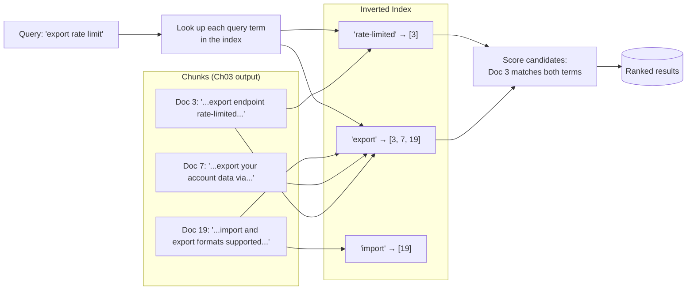
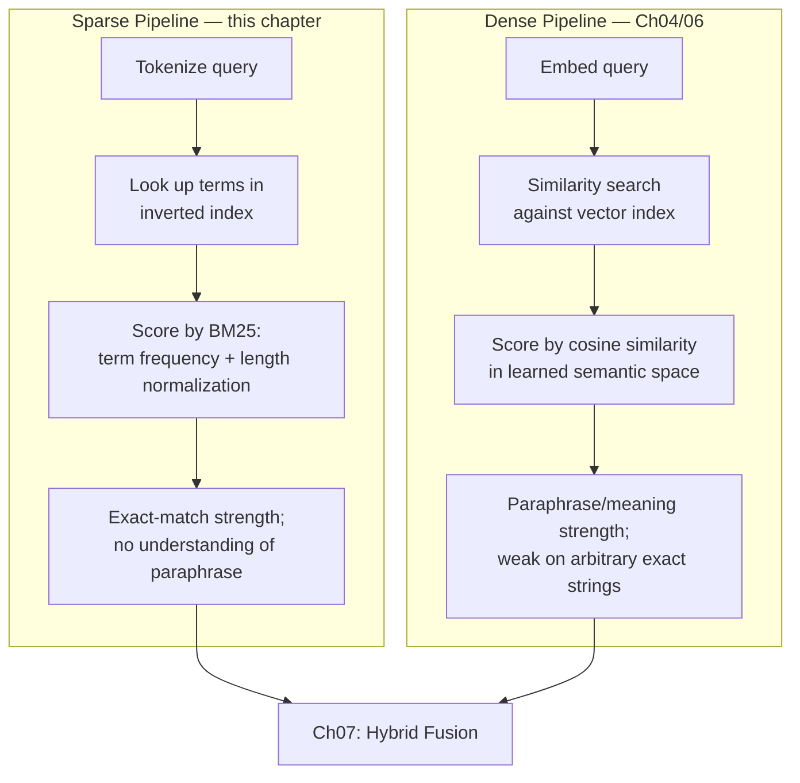
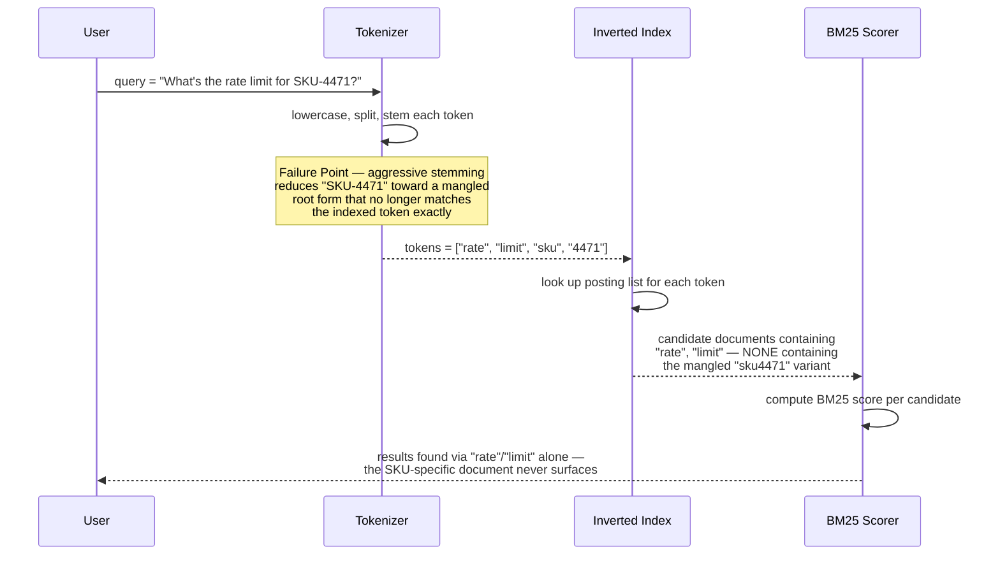
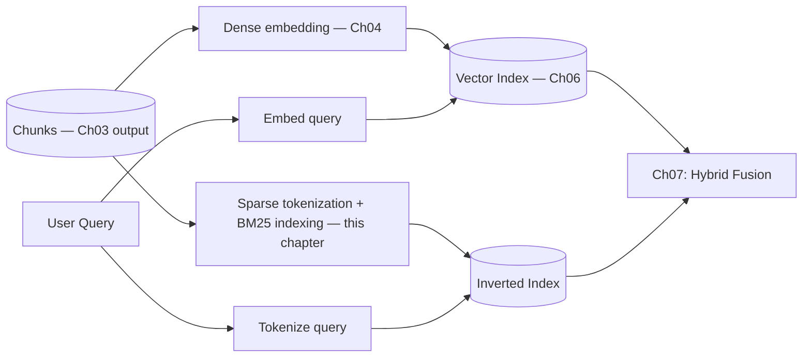
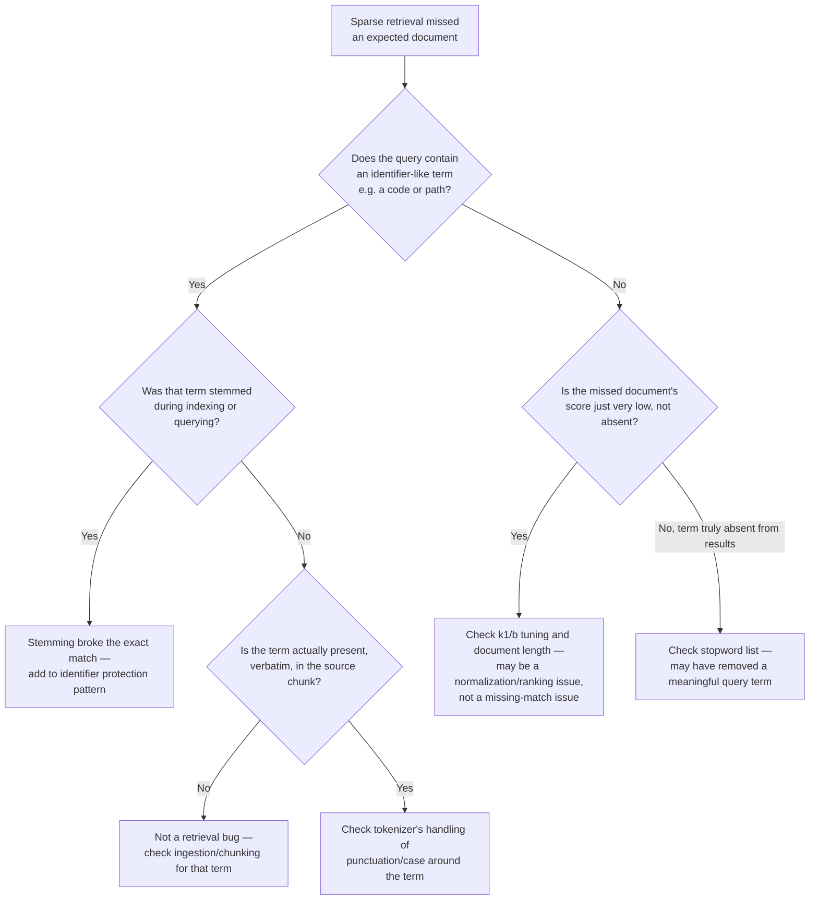

# Chapter 05 — Sparse Retrieval: BM25, TF-IDF, and Keyword Search

> "An embedding model has an opinion about what a word means. A keyword index has none — and sometimes that's exactly what you need."

**Learning Objectives**

By the end of this chapter, you will be able to:

- Explain precisely why dense embeddings can systematically miss exact-term queries — product codes, API endpoint names, error codes — and demonstrate it on a real example.
- Implement TF-IDF from scratch and explain what each term in the formula is actually doing.
- Implement Okapi BM25 from scratch, and explain what it adds beyond TF-IDF (term saturation, document-length normalization).
- Use `bm25s`, the current production-grade sparse retrieval library, for fast, scalable keyword search.
- Tokenize and preprocess text correctly for sparse retrieval — and know exactly when stemming helps recall and when it silently destroys exact-match accuracy.
- Describe learned sparse retrieval (SPLADE) as the middle ground between classic BM25 and dense embeddings.
- Choose between sparse-only, dense-only, and a combined approach for a given query type — setting up Chapter 07's hybrid search.
- Diagnose a sparse-retrieval miss and localize it to tokenization, stemming, or scoring — not just "the search is broken."

**Prerequisites**

- Chapters 01–04 completed — this chapter is the direct answer to the question Chapter 04 closed with: why dense embeddings alone often aren't enough.
- Comfortable Python, basic familiarity with logarithms (BM25's formula uses them, and understanding why matters more than memorizing the formula).
- `pip install scikit-learn bm25s PyStemmer` in your virtual environment.

**Estimated Reading Time:** 75–85 minutes
**Estimated Hands-on Time:** 3–4 hours

---

## ⚡ Fast Read

> **Skim time: 5 minutes** — Read this if you're in a hurry, returning for reference, or already familiar with part of this topic.

- **What it is:** Keyword-based retrieval — TF-IDF and BM25 — the search technique that predates embeddings entirely and still outperforms them on a specific, common class of query.
- **Why it matters:** Chapter 04 closed with a specific challenge: take a query containing an exact code, endpoint name, or identifier, and see if dense retrieval finds it reliably. It often doesn't — dense embedding models are trained to understand *meaning*, and an arbitrary string like `SKU-4471` or `/export` doesn't carry meaning the way a sentence does.
- **Key insight:** The single most common way teams accidentally break sparse retrieval isn't a bug in BM25 — it's over-aggressive stemming. Reducing "exporting," "exports," and "export" all down to the same root is exactly what you want for natural language, and exactly what silently breaks an exact match on a product code that happens to get stemmed into something else entirely.
- **What you build:** A from-scratch TF-IDF and BM25 implementation to understand the math, then a production-grade sparse retriever using `bm25s` — built to plug directly into Chapter 01's `Retriever` interface, ready for Chapter 07 to combine with dense search.
- **Jump to:** [Core Concepts](#core-concepts) | [First Code](#beginner-implementation) | [Best Practices](#best-practices) | [Mini Project](#mini-project)

---

## Why This Topic Exists

Chapter 04 ended with a challenge: take a query containing a specific, exact term — a product SKU, an API endpoint path, an error code — and run it through your dense embedding pipeline. For a lot of real corpora, the result is worse than you'd expect. Not broken, not erroring — just quietly less reliable than a plain keyword search would have been.

This isn't a flaw in any particular embedding model. It's structural. A dense embedding model is trained to map text to vector space based on *meaning* — "the export feature," "exporting your data," and "how do I get my data out" should all land near each other, because they mean roughly the same thing. That's a genuine strength. But an identifier like `SKU-4471` or `/export` doesn't have "meaning" in the way a sentence does — it's an arbitrary string that only matters because it matches, exactly, something the user is looking for. An embedding model, having never been specifically trained to treat identifiers as special, has no strong reason to place `SKU-4471` distinctly apart from `SKU-4472` or `SKU-3471` — they're superficially similar strings, semantically almost identical territory, and yet completely different products.

This is exactly the class of failure keyword search has always been good at, because keyword search doesn't try to understand meaning at all — it matches terms, exactly, and ranks by how distinctively and frequently they appear. This chapter builds that tool properly, from the ground up, so Chapter 07 can combine it with everything Chapters 04–06 built, instead of treating dense embeddings as the only retrieval mechanism a modern RAG system needs.

---

## Real-World Analogy

**The Indexer and the Interpreter**

Imagine a reference desk staffed by two very different assistants.

The **Indexer** has memorized the exact location of every single word in every document in the building. Ask for `SKU-4471` and the Indexer walks straight to it, instantly, with zero hesitation — because the Indexer doesn't try to understand what you mean, only to match what you *said*, exactly. Ask the Indexer a vague question like "what's the thing that lets me get my data out," though, and they're stuck — if the word "export" never actually appears in the relevant document, the Indexer has no way to bridge that gap.

The **Interpreter** understands meaning and context. Ask about "getting my data out" and the Interpreter correctly connects it to a document about "the export feature," even though the words don't match — because the Interpreter understands what you're *getting at*, not just what you literally said. But ask the Interpreter for `SKU-4471` specifically, and they might confidently hand you `SKU-4472` instead — a plausible, similar-looking answer — because to someone reasoning about meaning rather than exact strings, the two codes look nearly identical, and the Interpreter was never trained to treat "off by one digit" as "completely wrong."

Neither assistant alone can staff the desk properly. This chapter builds the Indexer. Chapter 04 already built the Interpreter. Chapter 07 puts them behind the same desk.

---

## Core Concepts

### Sparse Retrieval

- **Technical definition:** Retrieval based on high-dimensional, mostly-zero ("sparse") vectors, typically one dimension per unique term in a vocabulary, where a document's score for a query is computed from exact term overlap weighted by term importance — as opposed to dense retrieval, where every dimension of a much shorter vector carries some (usually uninterpretable) signal.
- **Simple definition:** Search based on which exact words appear, and how important each word is — not on "meaning" in a learned, geometric sense.
- **Analogy:** The Indexer from this chapter's analogy — exact, literal, and fast, with zero understanding of paraphrase.

### TF-IDF (Term Frequency–Inverse Document Frequency)

- **Technical definition:** A term-weighting scheme that scores a term's importance to a document as the product of its frequency within that document (Term Frequency) and the inverse of how many documents in the corpus contain it at all (Inverse Document Frequency) — so a term that appears often in one document but rarely across the whole corpus scores highly, while a common term that appears everywhere scores low regardless of local frequency.
- **Simple definition:** A word that shows up a lot in this one document, but rarely anywhere else in the corpus, is probably what this document is really about.
- **Analogy:** In a newsroom, the word "the" appearing constantly tells you nothing about any article's topic — but a word like "acquisition" appearing repeatedly in one specific article, and almost nowhere else that week, is a strong signal about what that article is actually about.

### BM25 (Okapi BM25)

- **Technical definition:** A refinement of TF-IDF that adds two corrections: term-frequency saturation (a term's contribution to the score grows with frequency but with diminishing returns, controlled by a parameter `k1`), and document-length normalization (a term appearing in a short document counts for more than the same raw frequency in a long one, controlled by a parameter `b`).
- **Simple definition:** TF-IDF's smarter successor — it stops assuming "20 mentions of a word is automatically twice as relevant as 10 mentions," and it corrects for the fact that long documents naturally contain more word repetitions than short ones, without that meaning they're more relevant.
- **Analogy:** A restaurant critic who notices a dish mentioned once in a short menu blurb is a much stronger signal of that dish's importance than the same dish being mentioned once in a 40-page restaurant history book — same raw count, very different weight.

### Inverted Index

- **Technical definition:** A data structure mapping each term in a vocabulary to the list of documents (and often positions) in which it appears — the "posting list" — enabling a search engine to look up documents matching a term in roughly constant time, rather than scanning every document for every query.
- **Simple definition:** Instead of a book's index that maps chapters to topics, this is the reverse — a giant lookup table mapping every word to every document that contains it.
- **Analogy:** The back-of-the-book index, but for an entire library at once — "export" → [Document 3, Document 7, Document 19], ready to look up instantly instead of re-reading every book each time someone asks.

### Tokenization (for Sparse Retrieval)

- **Technical definition:** The process of splitting text into discrete units (tokens — typically words or subwords) that become the atomic terms indexed and matched against in sparse retrieval, including decisions about case-folding, punctuation handling, and splitting on hyphens or special characters.
- **Simple definition:** Deciding exactly what counts as "one word" for search purposes — is `SKU-4471` one token, or three (`SKU`, `4471`, and a hyphen)? That decision determines whether an exact-code search works at all.
- **Analogy:** Deciding how to file a hyphenated last name in a card catalog — file it wrong, and the person searching for it will never find the card, even though it's sitting right there.

### Stemming / Lemmatization

- **Technical definition:** Reducing a word to its root form (stemming: a crude, rule-based truncation; lemmatization: a more linguistically correct reduction to a dictionary base form) before indexing and querying, so that morphological variants of a word (e.g., "exports," "exporting," "exported") match each other.
- **Simple definition:** Chopping words down to their root so "run," "running," and "ran" are all treated as the same search term.
- **Analogy:** A librarian filing "running," "runner," and "ran" all under the same card labeled "run" — helpful for a book about jogging, actively harmful if one of those words was actually part of a specific product name.

### Stopwords

- **Technical definition:** Extremely common words (typically function words like "the," "is," "at," "which") that are often excluded from a sparse index because their high frequency across nearly every document makes them poor discriminators of relevance.
- **Simple definition:** The small, everyday words that appear in almost every sentence and don't tell you much about what a document is actually about.
- **Analogy:** Not indexing the word "the" in a library catalog — nobody's search is meaningfully helped by knowing which books contain the word "the," since nearly all of them do.

### Learned Sparse Retrieval (SPLADE)

- **Technical definition:** A retrieval approach that uses a neural model (typically a fine-tuned transformer) to produce sparse, term-weighted representations — combining sparse retrieval's exact-term matching and efficient inverted-index infrastructure with a learned, context-aware understanding of term importance and implicit term expansion, rather than TF-IDF/BM25's purely statistical weighting.
- **Simple definition:** A middle ground — still fundamentally a keyword-matching system with an inverted index under the hood, but the term weights (and even which additional related terms to include) are learned by a neural model instead of computed from raw statistics.
- **Analogy:** The Indexer from this chapter's analogy, after being trained to also recognize that a document about "getting your data out" is relevant to a search for "export" — without losing the underlying exact-match speed and infrastructure.

---

## Architecture Diagrams

### Diagram 1 — The Inverted Index



### Diagram 2 — Sparse vs. Dense Retrieval, Side by Side



---

## Flow Diagrams

### A BM25 Query, Scored Step by Step — With the Stemming Failure Point



---

## Beginner Implementation

We start with TF-IDF, implemented entirely from scratch — no libraries beyond the Python standard library — so the underlying intuition is fully visible before any library abstracts it away.

```python
# Learning example — beginner_tfidf.py
# TF-IDF implemented from scratch: term frequency, inverse document
# frequency, and cosine-similarity-based ranking.

import math

def tokenize(text: str) -> list[str]:
    """Deliberately simple: lowercase, split on whitespace, strip basic
    punctuation. Real tokenization decisions (see Core Concepts) matter
    enormously — this is a teaching baseline, not a production tokenizer."""
    return [t.strip(".,!?()[]{}\"'") for t in text.lower().split()]

def term_frequency(term: str, doc_tokens: list[str]) -> float:
    """Raw count of the term in this document, normalized by document
    length — otherwise longer documents would trivially score higher on
    every term just by containing more words overall."""
    return doc_tokens.count(term) / len(doc_tokens)

def inverse_document_frequency(term: str, all_docs_tokens: list[list[str]]) -> float:
    """The core TF-IDF insight: a term's value is inversely proportional
    to how many documents contain it. A term in every document (like
    'the') contributes almost nothing; a term in one document out of a
    thousand is a strong, distinctive signal."""
    docs_containing_term = sum(1 for doc in all_docs_tokens if term in doc)
    # +1 in the denominator avoids division by zero for a term that,
    # somehow, appears in zero documents (shouldn't happen if the term
    # came from the corpus, but defensive against edge cases).
    return math.log(len(all_docs_tokens) / (1 + docs_containing_term))

def tfidf_vector(doc_tokens: list[str], all_docs_tokens: list[list[str]]) -> dict[str, float]:
    vocabulary = set(doc_tokens)
    return {
        term: term_frequency(term, doc_tokens) * inverse_document_frequency(term, all_docs_tokens)
        for term in vocabulary
    }

def cosine_similarity_sparse(vec_a: dict[str, float], vec_b: dict[str, float]) -> float:
    shared_terms = set(vec_a) & set(vec_b)
    dot_product = sum(vec_a[t] * vec_b[t] for t in shared_terms)
    norm_a = math.sqrt(sum(v ** 2 for v in vec_a.values()))
    norm_b = math.sqrt(sum(v ** 2 for v in vec_b.values()))
    if norm_a == 0 or norm_b == 0:
        return 0.0
    return dot_product / (norm_a * norm_b)

if __name__ == "__main__":
    corpus = [
        "The export endpoint is rate-limited to 100 requests per minute.",
        "API keys can be rotated from the account security page.",
        "Exporting your account data is available on all pricing tiers.",
    ]
    docs_tokens = [tokenize(doc) for doc in corpus]

    query_tokens = tokenize("What is the rate limit for exporting data?")
    query_vec = tfidf_vector(query_tokens, docs_tokens + [query_tokens])

    for i, doc_tokens in enumerate(docs_tokens):
        doc_vec = tfidf_vector(doc_tokens, docs_tokens + [query_tokens])
        similarity = cosine_similarity_sparse(query_vec, doc_vec)
        print(f"Doc {i}: {similarity:.4f}  — {corpus[i][:50]}...")
```

**Walking through what's actually happening:**

- `term_frequency` divides by document length — without this, a document that just repeats "export export export" many times would dominate purely by being verbose, not by being genuinely more relevant.
- `inverse_document_frequency` is where TF-IDF earns its name and its power: notice it uses `math.log`, which means the penalty for a term being common grows *slowly* at first and then more steeply — a term in every single document scores at or near zero, exactly as it should.
- Run this against the sample corpus and you'll see Document 0 (about the export endpoint's rate limit) score highest for the query about "rate limit for exporting data" — even though the query says "exporting" and the document says "export," because both share enough weighted terms overall. Notice, though, this only worked because both words share the substring "export" and got tokenized in a way that still overlapped partially — a more different phrasing might not have matched at all. That's the exact limitation BM25 doesn't fully solve either (stemming does, at a cost — see Common Mistakes).

---

## Intermediate Implementation

Now Okapi BM25, from scratch, on top of the same corpus — so you can directly compare it against TF-IDF's output and see exactly what the saturation and length-normalization terms change.

```python
# Learning example — intermediate_bm25.py
# Okapi BM25 implemented from scratch, built on an explicit inverted index.

import math
from collections import defaultdict, Counter

class BM25FromScratch:
    def __init__(self, corpus_tokens: list[list[str]], k1: float = 1.5, b: float = 0.75):
        """
        k1 controls term-frequency saturation: higher k1 means additional
        occurrences of a term keep contributing more before diminishing
        returns kick in. b controls document-length normalization: b=1
        fully normalizes by length, b=0 ignores length entirely. 1.5 and
        0.75 are the standard, widely-used defaults — reasonable starting
        points, not universal constants (tune against your own eval set,
        as with every parameter in this course).
        """
        self.k1 = k1
        self.b = b
        self.corpus_tokens = corpus_tokens
        self.doc_lengths = [len(doc) for doc in corpus_tokens]
        self.avg_doc_length = sum(self.doc_lengths) / len(corpus_tokens)
        self.inverted_index: dict[str, list[int]] = defaultdict(list)
        for doc_id, tokens in enumerate(corpus_tokens):
            for term in set(tokens):
                self.inverted_index[term].append(doc_id)
        self.doc_freqs = [Counter(tokens) for tokens in corpus_tokens]
        self.n_docs = len(corpus_tokens)

    def idf(self, term: str) -> float:
        """BM25's IDF differs slightly from TF-IDF's — this is the
        standard Robertson-Sparck Jones formulation, which can go slightly
        negative for extremely common terms (a known, accepted property,
        usually handled by clamping at zero in production libraries)."""
        n_containing = len(self.inverted_index.get(term, []))
        return math.log((self.n_docs - n_containing + 0.5) / (n_containing + 0.5) + 1)

    def score(self, query_tokens: list[str], doc_id: int) -> float:
        doc_tokens = self.corpus_tokens[doc_id]
        doc_term_counts = self.doc_freqs[doc_id]
        doc_length = self.doc_lengths[doc_id]

        total_score = 0.0
        for term in query_tokens:
            if term not in doc_term_counts:
                continue
            freq = doc_term_counts[term]
            idf = self.idf(term)

            # This is BM25's core formula. The numerator grows with
            # frequency; the denominator's (1 - b + b * length/avg_length)
            # term is the length normalization — a term appearing 3 times
            # in a short document scores higher than the same 3 occurrences
            # in a document twice the average length.
            numerator = freq * (self.k1 + 1)
            denominator = freq + self.k1 * (1 - self.b + self.b * doc_length / self.avg_doc_length)
            total_score += idf * (numerator / denominator)
        return total_score

    def search(self, query_tokens: list[str], k: int = 5) -> list[tuple[int, float]]:
        # Only score documents that share AT LEAST ONE term with the query
        # — this is what the inverted index buys you: no need to score
        # every document in the corpus, only plausible candidates.
        candidate_doc_ids = set()
        for term in query_tokens:
            candidate_doc_ids.update(self.inverted_index.get(term, []))

        scored = [(doc_id, self.score(query_tokens, doc_id)) for doc_id in candidate_doc_ids]
        scored.sort(key=lambda x: x[1], reverse=True)
        return scored[:k]
```

**What changed, and why each change matters:**

1. **The inverted index (`self.inverted_index`) is built once, at initialization** — exactly like Chapter 02's ingestion-time work, this is a cost paid once, not per query. `search` only ever scores documents that share at least one term with the query, which is what makes sparse retrieval fast at scale: no linear scan of the entire corpus per query.
2. **`k1` and `b` are explicit, tunable parameters**, not hidden constants — this is the direct, code-level expression of BM25 being TF-IDF's more carefully engineered successor. Try setting `b=0` and notice document length stops mattering at all; try a very high `k1` and notice repeated terms keep contributing almost linearly instead of saturating.
3. **BM25's IDF formula differs subtly from TF-IDF's** — notice the `+0.5` smoothing terms and the `+1` at the end, both standard corrections that prevent the score from behaving erratically for very rare or very common terms. This is a case where "close to TF-IDF" is not "the same as TF-IDF" — the details matter for production-grade behavior at the edges.
4. **`search` still uses raw whitespace tokenization** — no stemming, no stopword removal yet. Run a query for `"export"` against a document containing `"exporting"` and watch it score zero contribution from that term, because they're different tokens. That's the exact gap stemming is designed to close — and the exact reason it needs to be applied carefully, which the Advanced Implementation addresses directly.

---

## Advanced Implementation

Production sparse retrieval needs speed at real corpus scale — `bm25s` is the current fastest widely-used Python BM25 library — plus a tokenization pipeline that applies stemming where it helps and explicitly protects exact-match-critical tokens where it doesn't. We also implement this behind Chapter 01's `Retriever` Protocol, so it plugs directly into the modular pipeline without any changes elsewhere.

```python
# Production example — advanced_sparse_retrieval.py
# A production-grade sparse retriever using bm25s, with tokenization that
# protects identifier-like tokens (codes, SKUs, endpoint paths) from
# stemming, and conforms to Ch01's Retriever Protocol.

from __future__ import annotations
from dataclasses import dataclass
import re
import bm25s
import Stemmer

# Tokens matching this pattern look like identifiers, not natural-language
# words: leading-slash paths, alphanumeric mixes with embedded digits, or
# hyphen/underscore/slash-joined compounds. These get preserved exactly,
# never stemmed — stemming "SKU-4471" or "/export" toward some mangled
# root is the single most common way production sparse retrieval quietly
# breaks on exact-match queries.
#
# This pattern is deliberately biased toward FALSE POSITIVES over false
# negatives: protecting an ordinary word like "rate-limited" from stemming
# just means it loses a little recall benefit — cheap. Failing to protect
# a real identifier means an exact-match query silently returns nothing —
# expensive. When in doubt, this heuristic chooses not to stem.
IDENTIFIER_PATTERN = re.compile(r"^(/[a-z0-9\-_/]+|[a-z]+[-_/][a-z0-9]+|[a-z]*\d[a-z0-9\-_/]*)$", re.IGNORECASE)

stemmer = Stemmer.Stemmer("english")

def protective_tokenize(texts: list[str]) -> list[list[str]]:
    """
    bm25s's built-in tokenizer applies stemming uniformly to every token,
    which is exactly the failure mode this chapter warns against — so we
    tokenize manually here instead, applying stemming conditionally, then
    hand the already-split token lists to bm25s (which accepts pre-tokenized
    input directly, bypassing its own built-in tokenizer entirely).
    """
    results = []
    for text in texts:
        # The starting character class includes "/" so a leading-slash
        # path like "/export" survives tokenization intact, instead of
        # silently losing its slash before IDENTIFIER_PATTERN ever sees it.
        raw_tokens = re.findall(r"[a-zA-Z0-9/][a-zA-Z0-9\-_/]*", text.lower())
        final_tokens = []
        for tok in raw_tokens:
            if IDENTIFIER_PATTERN.match(tok):
                final_tokens.append(tok)  # preserved exactly — no stemming
            else:
                final_tokens.append(stemmer.stemWord(tok))
        results.append(final_tokens)
    return results

@dataclass
class Chunk:
    text: str
    source: str
    score: float = 0.0

class SparseRetriever:
    """Implements Ch01's Retriever Protocol — a drop-in replacement (or,
    in Ch07, a component to be COMBINED with) the dense Retriever from
    earlier chapters, with no changes needed to RagPipeline itself."""

    def __init__(self, chunks: list[Chunk]):
        self.chunks = chunks
        corpus_texts = [c.text for c in chunks]
        self.corpus_tokens = protective_tokenize(corpus_texts)
        self.index = bm25s.BM25()
        self.index.index(self.corpus_tokens)

    def retrieve(self, query: str, k: int) -> list[Chunk]:
        query_tokens = protective_tokenize([query])
        doc_ids, scores = self.index.retrieve(query_tokens, k=min(k, len(self.chunks)))
        results = []
        for doc_id, score in zip(doc_ids[0], scores[0]):
            chunk = self.chunks[doc_id]
            results.append(Chunk(text=chunk.text, source=chunk.source, score=float(score)))
        return results

    def save(self, path: str) -> None:
        # Persist source alongside text — bm25s's corpus can be any list
        # of JSON-serializable objects, not just raw strings, so we save
        # dicts here instead of bare text and lose the metadata retrieve()
        # actually needs to rebuild a full Chunk.
        corpus = [{"text": c.text, "source": c.source} for c in self.chunks]
        self.index.save(path, corpus=corpus)

    @classmethod
    def load(cls, path: str) -> "SparseRetriever":
        instance = cls.__new__(cls)
        instance.index = bm25s.BM25.load(path, load_corpus=True)
        # bm25s restores the saved corpus on the loaded index — rebuild
        # self.chunks from it so retrieve() has the same chunk/source data
        # it would have had if this instance had never been persisted.
        instance.chunks = [
            Chunk(text=doc["text"], source=doc["source"]) for doc in instance.index.corpus
        ]
        return instance
```

**Why this shape earns its complexity:**

- **`IDENTIFIER_PATTERN` is the direct code fix for this chapter's central failure mode.** A token like `sku-4471` or `export` (when part of a path like `/export`) never gets run through the stemmer — it's indexed and matched exactly as written. A natural-language token like `exporting` still gets stemmed to `export`, so paraphrase-tolerant matching keeps working for ordinary prose. This is the specific, deliberate compromise the research behind this chapter flagged: stemming isn't wrong, it's just wrong to apply *uniformly* across every token type.
- **`SparseRetriever.retrieve()` matches Chapter 01's `Retriever` Protocol exactly** — same method signature (`retrieve(query, k) -> list[Chunk]`) as the dense retriever from earlier chapters. This isn't a coincidence; it's the entire reason Chapter 01 introduced Protocol-based interfaces in the first place. Chapter 07 will construct a `HybridRetriever` that holds one of each and combines their results — neither retriever needs to know the other exists.
- **`bm25s`'s speed advantage matters at real scale.** Independent benchmarks show it substantially outpacing the older, simpler `rank_bm25` library — often by two orders of magnitude — while requiring only NumPy and an optional stemmer/Numba acceleration, with no external search server required for small-to-medium corpora.
- **`save`/`load` mirror the persistence discipline from Chapter 02's ingestion pipeline** — an inverted index, like a vector index, is expensive to rebuild and should be treated as durable state, not recomputed on every process start.

---

## Production Architecture

The sparse index is built at ingestion time, from the exact same chunks Chapter 03 produced — running alongside, not instead of, Chapter 04's dense embedding step.



For infrastructure choice at scale: `bm25s` running embedded in your application process is a reasonable default up to a meaningful corpus size (comfortably into the millions of documents, per its published benchmarks) with no separate search server to operate. Beyond that, or when you need sparse retrieval to share infrastructure with other search workloads, PostgreSQL's built-in full-text search (`tsvector`/`ts_rank`) is a lightweight production option if you're already running Postgres for other parts of the system (Volume 2's PostgreSQL server work is directly relevant here), and Elasticsearch or OpenSearch remain the standard choice at genuine enterprise scale or when you need mature operational tooling (alerting, sharding, replication) around the search layer itself.

> **Currency Note:** `bm25s`'s position as the current recommended default over the older `rank_bm25` library reflects benchmarks and library maturity as of this writing — this is exactly the kind of fast-moving library-ecosystem fact CLAUDE.md flags for re-verification. What's stable is the underlying BM25 mathematics itself (`k1`, `b`, term saturation, length normalization) — those haven't meaningfully changed since the algorithm's original formulation, unlike the tooling built on top of it.

---

## Best Practices

1. **Never apply stemming uniformly across every token.** Detect and protect identifier-like tokens (codes, SKUs, paths, error codes) from stemming — this single decision prevents the majority of "why didn't it find the exact thing I searched for" incidents in sparse retrieval.
2. **Build the inverted index once, at ingestion time, and persist it** — exactly like the vector index from Chapter 06, an inverted index is expensive to rebuild and should never be recomputed per query.
3. **Tune `k1` and `b` against your own evaluation set** (Chapter 12), not blindly on the standard 1.5/0.75 defaults — different corpora (short, uniform chunks vs. long, variable-length documents) benefit from different length-normalization strength.
4. **Implement sparse retrieval behind the same `Retriever` interface as dense retrieval** from the start — this is what makes Chapter 07's hybrid fusion a composition problem, not a rewrite.
5. **Remove stopwords for natural-language queries, but be careful with queries that are mostly identifiers** — a query like `"SKU-4471"` has no meaningful stopwords to remove in the first place, but a query like `"what is the"` immediately followed by a code shouldn't have the code itself accidentally caught by an overly broad stopword list.
6. **Prefer `bm25s` (or an equivalent current fast library) over hand-rolled or older, slower libraries in production** — the from-scratch implementation in this chapter exists to build understanding, not to ship.
7. **Log which query terms actually matched, per result**, not just the final score — this is the single most useful debugging signal when a sparse retrieval result looks wrong (see this chapter's Debugging Guide).
8. **Re-index sparse alongside dense on the same ingestion trigger** — a stale sparse index is exactly Chapter 01's failure #7 (Stale Retrieval), just on the keyword side instead of the vector side.

---

## Security Considerations

- **Keyword stuffing / relevance manipulation.** Because BM25 scores are a direct, computable function of term frequency and rarity, a malicious or manipulated document can be engineered to score artificially highly for a target query by repeating specific terms — the sparse-retrieval equivalent of old-school SEO spam. This is a real instance of Chapter 01's "poisoned corpora" security concern (§Security Considerations, Chapter 01), specifically applicable to the sparse retrieval path — a well-run ingestion pipeline should include basic anomaly detection for documents with statistically unusual term-repetition patterns.
- **Query term logging.** Logging which exact terms matched for debugging (Best Practice #7 above) is valuable, but if query logs are retained, they represent a record of exactly what users searched for, in plain, exact terms — treat sparse-retrieval query logs with the same access-control discipline as any other user-activity log, particularly once this course reaches sensitive document domains in Module 3.

---

## Cost Considerations

| Approach | Cost model | Notes |
|---|---|---|
| From-scratch / `rank_bm25` | CPU only, no external dependencies | Fine for learning and small corpora; not recommended at production scale |
| `bm25s` (embedded) | CPU only | No API calls, no per-query cost — dramatically cheaper than any dense embedding API call, since there's no model inference involved at all |
| PostgreSQL full-text search | Infrastructure cost of your existing Postgres instance | Reasonable if you're already running Postgres for other parts of the system |
| Elasticsearch / OpenSearch | Hosting/cluster infrastructure cost, or a managed service fee | Justified at large scale or when you need mature operational tooling around search |

The contrast with Chapter 04 is worth stating plainly: **sparse retrieval, at query time, costs essentially nothing beyond CPU** — there's no embedding model inference involved at all, hosted or self-hosted. This is part of why hybrid search (Chapter 07) is rarely a hard cost trade-off — adding a sparse retrieval pass alongside dense retrieval is nearly free compared to the dense embedding call it runs alongside.

---

## Common Mistakes

**Mistake 1 — Applying stemming uniformly, breaking exact-code matching.**
```python
# Wrong: every token gets stemmed, including identifiers
tokens = [stemmer.stemWord(tok) for tok in raw_tokens]
# "SKU-4471" might get mangled toward an unrecognizable stemmed form,
# and will never again match a query for the exact original string

# Right: detect identifier-like tokens and protect them from stemming
tokens = [
    tok if IDENTIFIER_PATTERN.match(tok) else stemmer.stemWord(tok)
    for tok in raw_tokens
]
```

**Mistake 2 — Relying on dense embeddings alone for exact-identifier queries.**
```python
# Wrong: one retrieval path, no fallback for exact-match queries
results = dense_retriever.retrieve(query, k=10)

# Right: run both, at minimum compare results for queries containing
# identifier-shaped tokens (full fusion logic comes in Ch07)
if contains_identifier_pattern(query):
    sparse_results = sparse_retriever.retrieve(query, k=10)
    dense_results = dense_retriever.retrieve(query, k=10)
    results = merge_and_dedupe(sparse_results, dense_results)
else:
    results = dense_retriever.retrieve(query, k=10)
```

**Mistake 3 — Ignoring document-length normalization (plain TF instead of BM25).**
```python
# Wrong: raw term frequency only, no length normalization — a long
# document naturally accumulates more term repetitions and wins by
# default, regardless of true relevance
score = doc_tokens.count(term)

# Right: BM25's length-normalized, saturating score
numerator = freq * (k1 + 1)
denominator = freq + k1 * (1 - b + b * doc_length / avg_doc_length)
score = idf * (numerator / denominator)
```

**Mistake 4 — Removing stopwords with a fixed list that doesn't account for domain context.**
```python
# Wrong: a generic English stopword list applied blindly, potentially
# removing a term that's actually meaningful in this specific domain
tokens = [t for t in tokens if t not in GENERIC_STOPWORDS]

# Right: validate the stopword list against your own domain vocabulary
# before deploying — a generic list is a starting point, not a given
DOMAIN_SAFE_STOPWORDS = GENERIC_STOPWORDS - DOMAIN_SIGNIFICANT_TERMS
tokens = [t for t in tokens if t not in DOMAIN_SAFE_STOPWORDS]
```

**Mistake 5 — Case-sensitivity inconsistency for identifiers.**
```python
# Wrong: lowercasing everything uniformly can cause a code like "SKU-4471"
# and a different code "sku-4471" (if such variance exists in the corpus)
# to be silently treated as identical, or a code-matching regex tuned for
# uppercase to fail to match after lowercasing happens elsewhere in the pipeline
if text.isupper():  # naive, order-dependent, easy to get wrong
    ...

# Right: decide and apply ONE consistent case-handling policy across
# indexing AND querying, and make identifier detection run BEFORE
# lowercasing changes what "looks like" an identifier
tokens = tokenize_preserving_case_for_detection(text)
```

---

## Debugging Guide



| Symptom | Likely cause | First thing to check |
|---|---|---|
| Exact code/SKU query returns nothing | Identifier token was stemmed during indexing or querying | Compare the indexed token form to the query's tokenized form for that term |
| Result ranks lower than expected despite containing the query term | `k1`/`b` tuning, or document-length effects | Score breakdown per term; document length relative to corpus average |
| A clearly relevant document never appears at all | Term removed by stopword list, or never indexed | Confirm the term survives tokenization and isn't in the stopword list |
| Sparse and dense retrieval disagree sharply on the same query | Expected for some query types — this is the exact motivation for Ch07 | Classify the query: identifier-heavy (favor sparse) vs. paraphrase-heavy (favor dense) |
| Index rebuild takes far longer than expected | Using `rank_bm25` or a from-scratch implementation at real corpus scale | Migrate to `bm25s` for production-scale indexing |

---

## Performance Optimisation

| Technique | What it improves | Illustrative gain* | Trade-off |
|---|---|---|---|
| `bm25s` over `rank_bm25` | Indexing and query speed | Independent benchmarks report `bm25s` substantially outperforming `rank_bm25`, in some cases by two orders of magnitude | Slightly less transparent internals than a hand-rolled implementation — worth understanding the from-scratch version first |
| Persisted, pre-built inverted index | Startup/query latency | Avoids full re-indexing on every process restart | Requires disk storage and a cache-invalidation story tied to ingestion (Ch02) |
| Identifier-protected tokenization | Exact-match recall specifically | Directly prevents the single most common sparse-retrieval miss category described in this chapter | Requires maintaining and tuning the identifier-detection pattern for your domain |
| Candidate pruning via inverted index (only scoring documents sharing ≥1 term) | Query latency at scale | Avoids a full linear scan of the corpus per query | None significant — this is a strict improvement over naive full-corpus scoring |

*As with prior chapters, validate against your own corpus and evaluation harness (Chapter 12) rather than assuming these figures transfer directly.

---

## Decision Framework — When Sparse Retrieval Alone Is (and Isn't) Enough

| Query characteristic | Recommendation |
|---|---|
| Contains an exact code, SKU, error code, or API path | Sparse retrieval should be included — dense alone is unreliable here |
| Paraphrased, conversational, or synonym-heavy | Dense retrieval typically dominates — sparse may miss entirely if no literal terms overlap |
| Mixed — a natural-language question referencing a specific term | Neither alone is sufficient; this is precisely what Chapter 07's hybrid fusion solves |
| Very short, keyword-style queries (e.g., search-bar style, not full questions) | Sparse retrieval often performs surprisingly well on its own |
| Corpus is small and domain vocabulary is highly regular/technical | Sparse retrieval alone may be sufficient — validate against your evaluation harness (Ch12) before assuming you need the added complexity of hybrid search |

---

## Technology Comparison — Sparse Retrieval Tooling

| Tool | Type | Best for | Notes |
|---|---|---|---|
| `rank_bm25` | Pure Python library | Learning, small corpora, quick prototyping | Simple API; degrades in performance well before large-corpus scale |
| `bm25s` | Optimized Python library | Production use at small-to-large scale, embedded in the application process | Current recommended default; NumPy-based with optional Numba/stemmer acceleration |
| PostgreSQL full-text search | Database-integrated | Teams already running Postgres for other retrieval components | `tsvector`/`ts_rank`; convenient co-location with other data |
| Elasticsearch / OpenSearch | Dedicated search engine | Enterprise scale, need for mature operational tooling (sharding, alerting) | Higher operational overhead; justified once scale or ops maturity requirements exceed embedded options |
| SPLADE (learned sparse) | Neural sparse retrieval | Teams wanting sparse retrieval's infrastructure with learned term weighting | An advanced option — genuinely useful, but adds model-serving complexity BM25 doesn't have |

---

## Interview Questions

1. **"Why would a dense embedding model struggle to reliably retrieve an exact product code or error code?"** — Expect: embeddings are trained for semantic similarity, not exact-string discrimination; an arbitrary identifier doesn't carry "meaning" the way a sentence does.
2. **"Explain what BM25 adds beyond TF-IDF."** — Expect: term-frequency saturation (diminishing returns via `k1`) and document-length normalization (via `b`).
3. **"What's the single most common way sparse retrieval breaks in production, and why?"** — Expect: over-aggressive, uniformly-applied stemming mangling identifier-like tokens so they no longer match exact queries.
4. **"How would you decide whether a given query needs sparse retrieval, dense retrieval, or both?"** — Expect: presence of identifier-shaped tokens favors sparse; paraphrase/synonym-heavy natural language favors dense; ambiguous cases motivate hybrid search.
5. **"What is an inverted index, and why does it matter for query performance at scale?"** — Expect: term-to-document mapping enabling candidate pruning, avoiding a full linear scan of the corpus per query.
6. **"How would a malicious document manipulate BM25 ranking, and how would you defend against it?"** — Expect: keyword stuffing exploiting term-frequency scoring; defended via anomaly detection on term-repetition patterns during ingestion.

---

## Exercises

1. **(20 min)** Run this chapter's from-scratch TF-IDF on a small corpus with a query containing a word that appears in exactly one document. Confirm that document scores highest, and explain why using the IDF formula.
2. **(30 min)** Run the from-scratch BM25 implementation on the same corpus at two very different `b` values (e.g., `b=0` and `b=1`). Deliberately include one very long and one very short document containing the same query term, and observe how ranking changes.
3. **(30 min)** Reproduce this chapter's central failure mode directly: index a small corpus containing a product code (e.g., `SKU-4471`), apply uniform stemming to every token including the code, and confirm a query for the exact code fails to match. Then fix it using identifier protection and confirm the match succeeds.
4. **(45 min)** Implement `SparseRetriever` end-to-end with `bm25s` on a real chunk set from your own corpus, and confirm it satisfies Chapter 01's `Retriever` Protocol by calling `.retrieve(query, k)` directly.
5. **(60 min, harder)** Take 10 real or realistic queries against your corpus — a mix of paraphrased natural-language questions and exact-identifier lookups — and run each through both your Chapter 04 dense retriever and this chapter's sparse retriever. Categorize where each one wins, and where they disagree entirely.

---

## Quiz

1. **Why does IDF use a logarithm rather than a simple inverse (1/document count)?**
   *The logarithm makes the penalty for term commonness grow gradually rather than punishing moderately common terms as severely as extremely common ones — a smoother, more calibrated weighting.*
2. **What does BM25's `k1` parameter control?**
   *Term-frequency saturation — how quickly additional occurrences of a term stop contributing significantly more to the score.*
3. **What does BM25's `b` parameter control?**
   *Document-length normalization strength — `b=1` fully normalizes for length, `b=0` ignores length entirely.*
4. **Why is stemming applied uniformly across all tokens a common production mistake?**
   *It can mangle identifier-like tokens (codes, SKUs, paths) so they no longer match exact-string queries, even though stemming genuinely helps natural-language term matching.*
5. **What is an inverted index, and why is it faster than scanning every document per query?**
   *A term-to-document mapping that lets a query only score documents sharing at least one term with it, avoiding a full linear scan of the corpus.*
6. **Why might dense embeddings struggle specifically with a query like "SKU-4471"?**
   *Embedding models are trained on semantic meaning; an arbitrary identifier string doesn't carry meaning in the way natural language does, so nearby-looking codes can be embedded closely together despite being completely different products.*
7. **What is learned sparse retrieval (SPLADE), and how does it differ from classic BM25?**
   *A neural model produces the sparse, term-weighted representation instead of TF-IDF/BM25's purely statistical weighting — still built on exact-term matching and an inverted index, but with learned term importance and implicit expansion.*
8. **Why should sparse and dense retrievers implement the same interface (Protocol)?**
   *It lets a hybrid retriever (Ch07) compose both without either needing to know the other exists — the same modularity principle established in Chapter 01.*
9. **What's a realistic security risk specific to sparse retrieval's scoring mechanism?**
   *Keyword stuffing — a manipulated document engineered with repeated target terms to score artificially highly, a sparse-retrieval-specific instance of Chapter 01's corpus-poisoning concern.*
10. **Why is sparse retrieval's query-time cost usually far lower than dense retrieval's?**
    *No embedding model inference is required at query time — sparse retrieval is CPU-only term lookup and arithmetic, versus dense retrieval's model inference call.*

---

## Mini Project

**Build:** A sparse retriever over your Chapter 03 chunk output, using `bm25s`, with identifier-protective tokenization.

**Acceptance criteria:**
- [ ] `SparseRetriever` implements Chapter 01's `Retriever` Protocol (`.retrieve(query, k) -> list[Chunk]`).
- [ ] At least one query containing an exact identifier (a code, endpoint path, or similar) is correctly retrieved, and you can show it would have failed without identifier protection.
- [ ] The index is built once and persisted (`save`/`load`), not rebuilt on every run.
- [ ] You've run at least 3 queries through both this chapter's sparse retriever and your Chapter 04 dense retriever, and documented where they agree and disagree.

**Time estimate:** 2–3 hours.

---

## Production Project

**Build:** Extend the Mini Project into a full sparse-retrieval service with tuned parameters and anomaly-aware ingestion.

**Acceptance criteria:**
- [ ] `k1` and `b` are tuned against a small labeled evaluation set (even an informal one — Chapter 12 formalizes this) rather than left at defaults, with your reasoning documented.
- [ ] The identifier-detection pattern is validated against at least 5 real identifier formats from your domain (codes, paths, SKUs, whatever your corpus actually contains).
- [ ] A basic keyword-stuffing anomaly check is implemented at ingestion time — flagging any document with a statistically unusual term-repetition pattern for review.
- [ ] Sparse and dense indices are both rebuilt on the same ingestion trigger, confirmed via a test that updates a document and checks both indices reflect the change.
- [ ] A short `RUNBOOK.md` documenting: how to tune `k1`/`b` for a new corpus, how to diagnose a missed exact-match query (referencing this chapter's Debugging Guide), and when to migrate from embedded `bm25s` to a dedicated search engine.

**Time estimate:** 1–2 days.

---

## Key Takeaways

- Dense embeddings and sparse retrieval fail on different, complementary classes of query — dense struggles with arbitrary exact strings; sparse struggles with paraphrase and synonyms.
- BM25 improves on TF-IDF with two corrections: term-frequency saturation (`k1`) and document-length normalization (`b`).
- The inverted index is what makes sparse retrieval fast — only documents sharing at least one query term ever get scored.
- The single most common way sparse retrieval breaks in production is uniform, unprotected stemming mangling identifier-like tokens.
- Sparse and dense retrievers should share the same interface (Protocol) from the start, so Chapter 07's hybrid fusion is a composition problem, not a rewrite.
- Sparse retrieval's query-time cost is negligible compared to dense retrieval's model-inference cost — adding it alongside dense search is nearly free.
- `bm25s` is the current recommended production default over older libraries like `rank_bm25`, offering substantial speed improvements at real corpus scale.
- Learned sparse retrieval (SPLADE) exists as a middle ground — worth knowing about, not required for most production RAG systems starting out.
- Keyword stuffing is a real, sparse-retrieval-specific corpus-poisoning risk, addressable with basic term-repetition anomaly detection at ingestion time.

---

## Chapter Summary

| Concept | Key Takeaway |
|---|---|
| TF-IDF | Weights terms by local frequency and corpus-wide rarity; the foundation BM25 builds on |
| BM25 | Adds term-frequency saturation and document-length normalization to TF-IDF |
| Inverted Index | Term-to-document lookup structure enabling fast candidate pruning |
| Stemming | Improves natural-language recall; must be selectively disabled for identifier-like tokens |
| Learned Sparse Retrieval (SPLADE) | Neural term weighting on top of classic sparse infrastructure — an advanced middle ground |
| Sparse vs. Dense | Complementary failure modes — exact strings favor sparse, paraphrase favors dense |

---

## Resources

- Robertson & Zaragoza, ["The Probabilistic Relevance Framework: BM25 and Beyond"](https://www.nowpublishers.com/article/Details/INR-019) — the foundational reference for the BM25 formula implemented in this chapter.
- [`bm25s` GitHub repository](https://github.com/xhluca/bm25s) and its accompanying paper — the production-grade library used in this chapter's Advanced Implementation.
- [scikit-learn `TfidfVectorizer` documentation](https://scikit-learn.org/stable/modules/generated/sklearn.feature_extraction.text.TfidfVectorizer.html) — a production-grade TF-IDF implementation worth knowing, beyond this chapter's from-scratch teaching version.
- Formal, Piwowarski & Clinchant, and related SPLADE papers — search "SPLADE learned sparse retrieval" for the current body of work on neural sparse retrieval referenced in this chapter's Core Concepts.
- Volume 1, Chapter 08 — Vector Databases, the dense-retrieval counterpart this chapter's sparse retrieval is designed to complement.

---

## Glossary Terms Introduced

| Term | One-line definition |
|---|---|
| Sparse Retrieval | Exact-term-based retrieval using mostly-zero, high-dimensional term vectors |
| TF-IDF | Term weighting by local frequency times inverse corpus-wide document frequency |
| BM25 (Okapi BM25) | TF-IDF's successor, adding term-frequency saturation and length normalization |
| Inverted Index | A term-to-document mapping enabling fast candidate lookup |
| Tokenization | Splitting text into discrete indexed/matched units |
| Stemming / Lemmatization | Reducing words to a root form to match morphological variants |
| Stopwords | Common, low-information words often excluded from a sparse index |
| Learned Sparse Retrieval (SPLADE) | Neural-model-produced sparse, term-weighted representations |

---

## See Also

| Chapter | Why it's relevant |
|---|---|
| Vol 3, Ch 01 — RAG Architecture Deep Dive | The `Retriever` Protocol this chapter's `SparseRetriever` implements directly |
| Vol 3, Ch 04 — Embedding Models | The dense-retrieval counterpart whose exact-match blind spot motivates this entire chapter |
| Vol 3, Ch 06 — Dense Retrieval | Where the dense side of the sparse/dense pairing gets its full production treatment |
| Vol 3, Ch 07 — Hybrid Search | Combines this chapter's sparse retriever with the dense retriever using fusion techniques |
| Vol 3, Ch 12 — RAG Evaluation | The evaluation harness this chapter repeatedly points to for tuning `k1`/`b` and validating tokenization choices |
| Volume 1, Ch 08 — Vector Databases | The dense-retrieval fundamentals this chapter's sparse approach is designed to complement, not replace |

---

## Preparation for Next Chapter

Chapter 06 (Dense Retrieval and Vector Search at Scale) goes deep on the dense side this chapter has been contrasting against — ANN indexing, metadata filtering, and production vector database patterns — completing the pair Chapter 07 then combines.

**Technical checklist:**
- [ ] Have this chapter's Mini Project `SparseRetriever` on hand, along with your Chapter 04 dense embeddings.
- [ ] Note the queries from this chapter's Exercise 5 where sparse and dense retrieval disagreed — Chapter 06 and Chapter 07 will return to exactly these examples.

**Conceptual check:**
- Why does an inverted index's speed advantage (skip documents sharing zero query terms) not have a direct equivalent in dense vector search — what does approximate nearest-neighbor search do instead, and why might that distinction matter for Chapter 06?
- If sparse and dense retrieval disagree on which document is most relevant for a given query, what does that disagreement itself tell you about the query?

**Optional challenge:** For one query where sparse and dense retrieval fully disagreed in Exercise 5, write down a prediction: which one do you think is actually "more correct" for that specific query, and why? You'll get to test that judgment rigorously once Chapter 12's evaluation harness exists.
