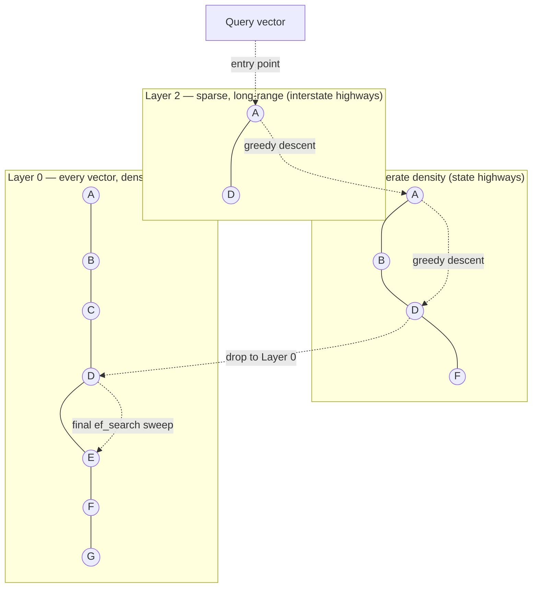
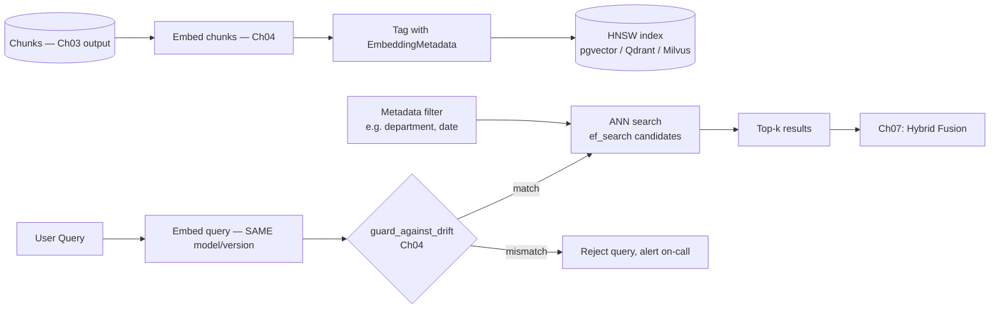
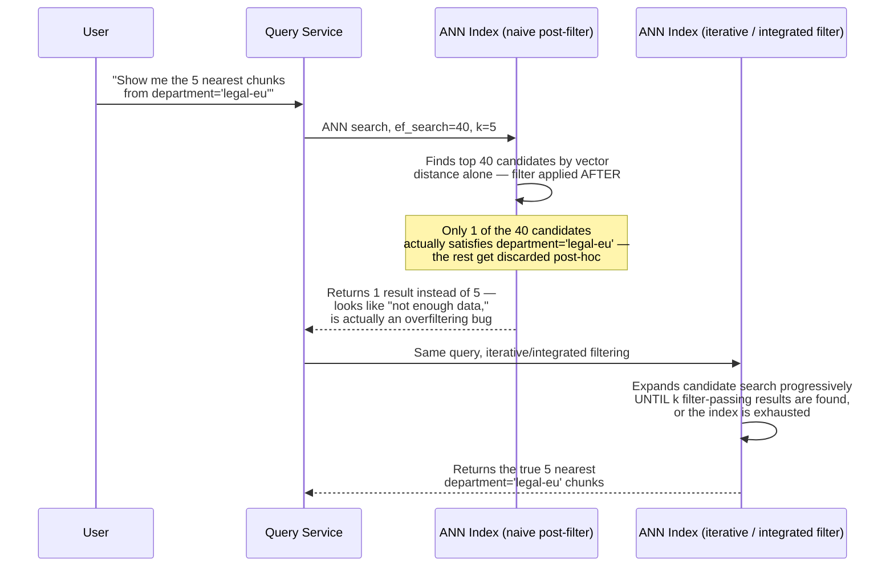
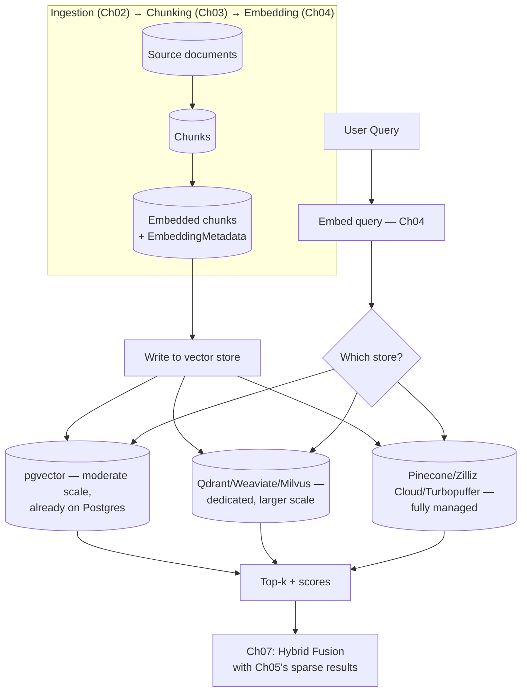

# Chapter 06 — Dense Retrieval and Vector Search at Scale

> "A vector index doesn't find the closest match. It finds a match that's close enough, fast enough, on purpose."

**Learning Objectives**

By the end of this chapter, you will be able to:

- Explain precisely why exact nearest-neighbor search doesn't scale, and calculate the point at which a real corpus crosses that line.
- Implement brute-force exact k-NN from scratch and measure exactly where it breaks down.
- Implement a simplified HNSW (Hierarchical Navigable Small World) graph from scratch, and explain what its layers are actually doing.
- Tune `M`, `ef_construction`, and `ef_search` deliberately, and explain the recall/latency/memory trade-off each one controls.
- Diagnose the "overfiltering" failure mode — where combining metadata filters with ANN search silently returns too few, or zero, results — and fix it correctly.
- Stand up a production dense retriever behind Chapter 01's `Retriever` Protocol, using pgvector with a tuned HNSW index.
- Choose between pgvector, Qdrant, Milvus, and a managed service for a given scale and operational constraint.
- Apply quantization (scalar, binary) to control a vector index's memory footprint without silently destroying recall.

**Prerequisites**

- Chapters 01–05 completed — this chapter is the direct continuation of Chapter 04's embeddings and the dense counterpart to Chapter 05's sparse retrieval.
- Comfortable Python and basic SQL; Docker installed for the pgvector examples.
- `pip install numpy psycopg[binary] pgvector qdrant-client hnswlib`
- A local PostgreSQL instance with the `pgvector` extension available (the Advanced Implementation includes the Docker setup) — or Docker itself, if you'd rather run it in a container.

**Estimated Reading Time:** 80–90 minutes
**Estimated Hands-on Time:** 4–5 hours

---

## ⚡ Fast Read

> **Skim time: 5 minutes** — Read this if you're in a hurry, returning for reference, or already familiar with part of this topic.

- **What it is:** How dense (embedding-based) retrieval actually finds nearest neighbors at real corpus scale — not by checking every vector, but by using an *approximate* index built for a deliberate, tunable trade-off between recall, latency, and memory.
- **Why it matters:** Chapter 04 showed you how to produce embeddings. It never addressed what happens when you have ten million of them and a query needs an answer in under 50 milliseconds — brute-force comparison against every vector simply doesn't scale, and the industry-standard fix (HNSW) is a specific, learnable data structure, not a black box.
- **Key insight:** "Approximate" doesn't mean "occasionally wrong by accident" — it means a knob you control. Every production vector index trades a small, quantifiable amount of recall for a large, predictable amount of speed, and the parameters that control that trade (`M`, `ef_construction`, `ef_search`) are things you tune against your own evaluation set, not defaults you accept blindly.
- **What you build:** A brute-force exact k-NN search, a simplified HNSW graph built from scratch to see exactly how it skips most of the corpus, and a production-grade `DenseRetriever` backed by pgvector's tuned HNSW index — implementing Chapter 01's `Retriever` Protocol so Chapter 07 can combine it with Chapter 05's sparse retriever with zero rewrites.
- **Jump to:** [Core Concepts](#core-concepts) | [First Code](#beginner-implementation) | [Best Practices](#best-practices) | [Mini Project](#mini-project)

---

## Why This Topic Exists

Chapter 04 answered "how do I turn text into a vector that captures meaning?" It did not answer "how do I find the right vector out of ten million of them, fast, in production?" That second question is what this chapter is about, and it turns out to be a genuinely different engineering problem from the first one.

Here's the wall you hit if you don't solve it deliberately. Finding the true nearest neighbors of a query vector, exactly, means comparing that query against every single vector in your corpus — an operation whose cost grows linearly with corpus size. At a thousand chunks, that's instant. At a hundred thousand, it's still fine on modern hardware. Somewhere in the low millions, depending on your embedding dimension and your latency budget, brute-force comparison stops being "a bit slower" and starts being "your p99 latency blows through every SLA you have." This isn't a hypothetical scaling concern for some future version of your system — Chapter 02 was explicit that this course targets corpora that can reach thousands of dense source documents, which chunk out into hundreds of thousands to millions of embedded chunks. That's exactly the range where exact search becomes the bottleneck.

The fix the entire industry converged on is **Approximate Nearest Neighbor (ANN) search**: build an index, ahead of time, that lets a query skip over the overwhelming majority of the corpus and still find a result that's correct, or close enough to correct, almost all of the time. "Approximate" is not a euphemism for "unreliable" — it's a precise, measurable trade-off, and the entire discipline of production dense retrieval is learning to control that trade-off on purpose instead of discovering it by accident in an incident review.

---

## Real-World Analogy

**The Skip List, and the Interstate Highway System**

If you've ever implemented or studied a skip list, you already understand the core idea behind this chapter's central algorithm, just in one dimension instead of many. A skip list adds extra "express lane" pointers on top of a plain sorted linked list — a bottom layer with every element, and progressively sparser layers above it that let a search skip over huge stretches of the list instead of walking it one node at a time. You start at the sparse top layer, move as far as you can before you'd overshoot, then drop down a layer and repeat, narrowing in on the answer far faster than a linear scan ever could.

**HNSW (Hierarchical Navigable Small World)**, this chapter's central data structure, is that exact idea generalized from a sorted line to an arbitrary-dimension vector space. Picture the interstate highway system: the top layer has only a handful of major cities connected by long-range interstate highways — get on one, and you cover enormous distance in a single hop, at the cost of only stopping at a few places. Drop down a layer and you're on state highways, connecting more cities, more densely, with each hop covering less ground. Drop down again and you're on local streets — every address in the country is reachable, but only by relatively short hops between neighbors.

Searching HNSW works exactly like planning a cross-country drive this way: start at the sparse top layer, greedily move toward your destination for as long as each hop gets you closer, then drop a layer once you've gone as far as that layer's roads can take you, and repeat until you're at street level, making small, precise final hops to the actual nearest addresses. You never once had to consider every street in the country — only the small number of roads that were actually on a plausible path.

---

## Core Concepts

### Exact k-Nearest-Neighbor (k-NN) Search

- **Technical definition:** Finding the `k` vectors in a corpus with the smallest distance (or highest similarity) to a query vector, guaranteed correct, by computing that distance against every vector in the corpus.
- **Simple definition:** Checking literally everything, one at a time, and keeping track of the best matches you've seen so far.
- **Analogy:** Reading every single file in a filing cabinet, cover to cover, because it's the only way to be *certain* you found the single most relevant one.

### Approximate Nearest Neighbor (ANN) Search

- **Technical definition:** A family of algorithms that trade a bounded, controllable amount of retrieval accuracy for large improvements in query speed and memory efficiency, typically by building an index structure ahead of time that lets a query examine only a small fraction of the corpus.
- **Simple definition:** Finding a match that's correct (or close enough to correct) the overwhelming majority of the time, without needing to check every single item.
- **Analogy:** The highway system from this chapter's analogy — you reach the right neighborhood fast by not considering every street in the country, accepting a vanishingly small chance you take a slightly suboptimal route.

### Recall (in ANN context)

- **Technical definition:** The fraction of the *true* top-`k` nearest neighbors (as determined by exact search) that an approximate search actually returns, typically reported as `recall@k` (e.g., "recall@10 of 0.95" means, on average, 9.5 of the true 10 nearest neighbors were found).
- **Simple definition:** How often the "approximate" answer actually matches what exact search would have given you.
- **Analogy:** A weather forecast's accuracy score — "95% of the time, our 'rain tomorrow' call matched what actually happened" is a measured, ongoing property, not a one-time guarantee.

### HNSW (Hierarchical Navigable Small World)

- **Technical definition:** A graph-based ANN index built as multiple layers, each layer a "navigable small world" graph connecting a subset of the corpus's vectors, with layer density decreasing geometrically toward the top — search proceeds greedily from a sparse top layer down to the fully-populated bottom layer, at each step moving to whichever neighbor is closest to the query.
- **Simple definition:** The interstate-highway-system data structure from this chapter's analogy, built directly out of your embedding vectors.
- **Analogy:** The highway system itself — sparse long-range connections at the top, dense local connections at the bottom, letting a search "drive" toward the answer instead of scanning every address.

### `M`, `ef_construction`, and `ef_search`

- **Technical definition:** HNSW's three primary tuning parameters. `M` sets the maximum number of graph connections (edges) each node keeps per layer, directly trading memory and build time for recall. `ef_construction` sets the size of the candidate list examined while *building* the graph — a larger value produces a higher-quality graph at the cost of slower indexing. `ef_search` sets the size of the candidate list examined at *query* time — a larger value improves recall at the cost of query latency, and unlike `M` and `ef_construction`, it can be tuned per query, live, without rebuilding anything.
- **Simple definition:** `M` is how many "roads" each intersection gets. `ef_construction` is how carefully you plan the road network when you build it. `ef_search` is how many alternate routes you're willing to check before committing to an answer, every time someone asks for directions.
- **Analogy:** `M` is how many highway on-ramps a city has; `ef_construction` is how much time the highway planners spent optimizing the road network before it opened; `ef_search` is how many route options your GPS considers before picking one — check more, and you're more likely to find the truly fastest route, at the cost of the GPS taking a little longer to answer.

### Product Quantization / Scalar Quantization / Binary Quantization

- **Technical definition:** Techniques that compress a vector's stored representation — scalar quantization maps each dimension's floating-point range to a smaller integer type (e.g., `float32` → `int8`); binary quantization compresses each dimension to a single bit; product quantization splits a vector into sub-vectors and replaces each with a learned, discrete "codeword" — all trading some retrieval accuracy for large reductions in memory and, often, search speed.
- **Simple definition:** Storing a rougher, smaller version of each vector so millions of them fit in memory (or fit more cheaply), while still being close enough to the original to rank documents correctly most of the time.
- **Analogy:** Storing a compressed JPEG instead of a raw camera file — you lose some fine detail, but for the overwhelming majority of practical purposes (including "is this roughly the same photo?"), the compressed version works just as well, at a fraction of the storage cost.

### IVF (Inverted File Index) and DiskANN

- **Technical definition:** IVF partitions a corpus into clusters (via a coarse quantizer, typically k-means) and, at query time, searches only the clusters nearest the query — often combined with product quantization (IVF-PQ) for further compression. DiskANN is a disk-resident graph index (based on the Vamana graph algorithm) designed so a billion-scale vector index can live primarily on disk, with only a compressed summary held in memory, while still meeting low-latency, high-recall targets.
- **Simple definition:** IVF is "only search the neighborhoods that look promising, not the whole city." DiskANN is "build an index so large it can't fit in memory, and still search it fast by keeping only a compact summary in RAM."
- **Analogy:** IVF is a librarian who first figures out which *section* of the library your topic belongs to, then only searches shelves in that section. DiskANN is a library so large its full catalog can't fit on the librarian's desk — so the desk holds a compressed index, and the librarian fetches full books from the stacks (disk) only when a compressed match looks promising.

### Metadata Filtering and Overfiltering

- **Technical definition:** Constraining ANN search results to vectors whose associated metadata satisfies a predicate (e.g., `department = 'billing'`, `updated_after = '2026-01-01'`) — implemented as **pre-filtering** (filter the candidate set first, then search only within it), **post-filtering** (run ANN search first, then discard results that fail the filter), or **integrated filtering** (the index itself is filter-aware during graph traversal). Overfiltering is the specific failure mode where a restrictive filter combined with naive post-filtering causes the index to return far fewer than `k` results, or none, because the ANN search's candidate list was exhausted before enough filter-passing vectors were found.
- **Simple definition:** Searching only among vectors that also match some other condition (like "only documents from this department") — done wrong, the search can come back nearly empty even when plenty of matching documents actually exist in the corpus.
- **Analogy:** Asking a GPS for "the three nearest coffee shops that are wheelchair-accessible." If the GPS finds the ten nearest coffee shops first and *then* checks accessibility, and none of those ten happen to qualify, it might report "no results" — even though an accessible coffee shop exists twelve minutes away and was never considered because the initial search radius stopped too early.

---

## Architecture Diagrams

### Diagram 1 — HNSW's Layered Graph Structure



### Diagram 2 — Production Dense Retrieval Path



---

## Flow Diagrams

### The Overfiltering Failure, and Its Fix



---

## Beginner Implementation

We start with exact k-NN — no index, no approximation, just brute-force comparison — both to establish the ground truth every ANN method will be measured against, and to see directly where the O(n) wall actually is.

```python
# Learning example — beginner_exact_knn.py
# Brute-force exact k-nearest-neighbor search, plus a timing demonstration
# of exactly where linear scaling starts to hurt.

import time
import numpy as np

def exact_knn(query: np.ndarray, corpus: np.ndarray, k: int) -> list[tuple[int, float]]:
    """
    Compares the query against EVERY vector in the corpus — no shortcuts.
    This is the ground truth every approximate method in this chapter
    will be measured against for recall.
    """
    # Cosine similarity via normalized dot product — same convention as
    # Chapter 04's embedding comparisons, kept consistent across the course.
    query_norm = query / np.linalg.norm(query)
    corpus_norms = corpus / np.linalg.norm(corpus, axis=1, keepdims=True)
    similarities = corpus_norms @ query_norm  # one dot product per corpus vector — O(n * d)

    # argpartition avoids a full sort when we only need the top k — still
    # O(n) overall, but meaningfully faster than sorting all n scores.
    top_k_idx = np.argpartition(-similarities, k)[:k]
    top_k_sorted = top_k_idx[np.argsort(-similarities[top_k_idx])]
    return [(int(i), float(similarities[i])) for i in top_k_sorted]

def benchmark_scaling(dimensions: int = 1536, k: int = 10) -> None:
    """
    The point of this function: watch query time grow linearly as corpus
    size grows. At 1,536 dimensions (Chapter 04's text-embedding-3-small),
    this becomes noticeable well before you'd expect from CS-101 intuition
    about "just a dot product."
    """
    rng = np.random.default_rng(seed=42)
    query = rng.standard_normal(dimensions).astype(np.float32)

    for corpus_size in [1_000, 10_000, 100_000, 1_000_000]:
        corpus = rng.standard_normal((corpus_size, dimensions)).astype(np.float32)
        start = time.perf_counter()
        exact_knn(query, corpus, k)
        elapsed_ms = (time.perf_counter() - start) * 1000
        print(f"Corpus size {corpus_size:>9,}: {elapsed_ms:8.2f} ms")

if __name__ == "__main__":
    benchmark_scaling()
```

**Walking through what's actually happening:**

- The core operation, `corpus_norms @ query_norm`, is a single matrix-vector multiply — highly optimized by NumPy's underlying BLAS library, but still fundamentally `O(n × d)` work: one dot product per corpus vector, and every dot product touches all `d` dimensions.
- Run `benchmark_scaling()` yourself and watch the numbers: the jump from 1,000 to 1,000,000 vectors is a thousand-fold increase in corpus size, and query time grows roughly in proportion — there's no shortcut being taken anywhere in this code, by design.
- This is the exact wall this chapter exists to get you around. Note what does *not* change with corpus size in this code: there is no index, no pre-computation beyond normalization — every single query re-examines the entire corpus from scratch. That's the property HNSW exists to eliminate.

---

## Intermediate Implementation

Now a simplified HNSW, built from scratch, so the layered graph from this chapter's diagrams stops being a picture and becomes code you can step through. This implementation deliberately omits several production concerns (deletion, concurrent inserts, the neighbor-diversity heuristic from the original paper) to keep the core idea visible — Chapter 08's Advanced Implementation section on production infrastructure covers the fully-engineered version.

```python
# Learning example — intermediate_hnsw.py
# A simplified, from-scratch HNSW implementation — enough to see exactly
# how layered graph search skips over most of the corpus. Not
# production-grade: see Advanced Implementation for that.

import math
import heapq
import numpy as np

class SimpleHNSW:
    def __init__(self, dimensions: int, M: int = 16, ef_construction: int = 64):
        """
        M: max neighbors kept per node, per layer — the "how many roads
        per intersection" parameter. ef_construction: candidate list size
        used while building the graph — larger means a better-connected,
        slower-to-build graph. These are the exact same parameters
        pgvector exposes in the Advanced Implementation; this class exists
        so you understand what those production parameters actually do.
        """
        self.dimensions = dimensions
        self.M = M
        self.ef_construction = ef_construction
        self.ml = 1.0 / math.log(M)  # controls how quickly layer density thins out
        self.vectors: dict[int, np.ndarray] = {}
        self.layers: list[dict[int, set[int]]] = []  # layers[i][node_id] = neighbor ids
        self.entry_point: int | None = None
        self.rng = np.random.default_rng(seed=7)

    def _distance(self, a: np.ndarray, b: np.ndarray) -> float:
        # 1 - cosine similarity, so smaller = closer, matching standard
        # nearest-neighbor convention used by every library in this chapter.
        return 1.0 - float(np.dot(a, b) / (np.linalg.norm(a) * np.linalg.norm(b)))

    def _random_layer(self) -> int:
        # Exponentially-decaying layer assignment: most nodes only ever
        # exist at layer 0; a small, geometrically-shrinking fraction
        # reach higher layers — this IS the "sparse highways on top,
        # dense streets at the bottom" structure from the analogy.
        return int(-math.log(self.rng.random()) * self.ml)

    def _search_layer(self, query: np.ndarray, entry_ids: list[int], ef: int, layer: int) -> list[tuple[float, int]]:
        """Greedy best-first search within a single layer, expanding the
        candidate list up to `ef` items. This is the exact operation that
        happens at every layer during both insertion and search — descend
        greedily at upper layers, gather `ef` candidates at the target layer."""
        visited = set(entry_ids)
        candidates = [(self._distance(query, self.vectors[i]), i) for i in entry_ids]
        heapq.heapify(candidates)
        results = list(candidates)

        while candidates:
            dist, node_id = heapq.heappop(candidates)
            if results and dist > max(results, key=lambda x: x[0])[0] and len(results) >= ef:
                break  # no closer candidates remain worth exploring
            for neighbor_id in self.layers[layer].get(node_id, set()):
                if neighbor_id in visited:
                    continue
                visited.add(neighbor_id)
                neighbor_dist = self._distance(query, self.vectors[neighbor_id])
                heapq.heappush(candidates, (neighbor_dist, neighbor_id))
                results.append((neighbor_dist, neighbor_id))

        results.sort(key=lambda x: x[0])
        return results[:ef]

    def insert(self, node_id: int, vector: np.ndarray) -> None:
        self.vectors[node_id] = vector
        node_layer = self._random_layer()
        while len(self.layers) <= node_layer:
            self.layers.append({})

        if self.entry_point is None:
            self.entry_point = node_id
            for layer in range(node_layer + 1):
                self.layers[layer].setdefault(node_id, set())
            return

        # Descend from the top layer to just above this node's own layer,
        # greedily narrowing to the single closest entry point at each
        # level — exactly the "drive toward the destination" descent from
        # the analogy, done once per insertion to find good neighbors.
        entry_ids = [self.entry_point]
        for layer in range(len(self.layers) - 1, node_layer, -1):
            entry_ids = [self._search_layer(vector, entry_ids, ef=1, layer=layer)[0][1]]

        # At and below this node's own layer, connect it to its M closest
        # candidates found via a wider (ef_construction-sized) search —
        # this is the step that actually builds the graph's edges.
        for layer in range(min(node_layer, len(self.layers) - 1), -1, -1):
            candidates = self._search_layer(vector, entry_ids, ef=self.ef_construction, layer=layer)
            neighbors = [node_id_ for _, node_id_ in candidates[: self.M]]
            self.layers[layer].setdefault(node_id, set()).update(neighbors)
            for neighbor_id in neighbors:
                self.layers[layer].setdefault(neighbor_id, set()).add(node_id)
            entry_ids = [c[1] for c in candidates]

    def search(self, query: np.ndarray, k: int, ef_search: int = 40) -> list[tuple[int, float]]:
        entry_ids = [self.entry_point]
        for layer in range(len(self.layers) - 1, 0, -1):
            entry_ids = [self._search_layer(query, entry_ids, ef=1, layer=layer)[0][1]]
        results = self._search_layer(query, entry_ids, ef=ef_search, layer=0)
        return [(node_id, 1.0 - dist) for dist, node_id in results[:k]]  # back to similarity
```

**What changed, and why each change matters:**

1. **`_random_layer` is the single line that makes this "hierarchical."** Because layer assignment decays exponentially, roughly `M` times fewer nodes exist at each layer up — this is exactly the highway analogy's "a handful of interstate-connected cities, many more state-highway-connected towns, and every single address at street level," produced by one line of probability, not by any explicit design decision at insert time.
2. **`insert` descends greedily through upper layers using `ef=1`** (find the single closest node, move there, repeat) — this mirrors exactly how `search` will later use the upper layers: as a fast way to get *roughly* close before doing real work, not as a place to find the actually-correct answer.
3. **The real work happens at and below the node's own layer**, where `ef_construction` — not `ef=1` — controls how many candidates get considered before picking the `M` closest as permanent graph edges. A higher `ef_construction` produces a better-connected, more accurate graph, at the direct cost of slower insertion — precisely the trade-off named in Core Concepts.
4. **`search` uses `ef_search`, a completely separate parameter from `ef_construction`**, and this is the detail most beginners miss: `ef_search` can change on every single query, with zero cost to the already-built graph, while `M` and `ef_construction` are baked in at build time and require a rebuild to change. This is exactly why production systems tune `ef_search` per query type (Best Practices), but only rarely rebuild an index to change `M`.
5. **Compare this against Beginner's `exact_knn`** on the same corpus: build a `SimpleHNSW` over, say, 5,000 random vectors, run both `exact_knn` and `SimpleHNSW.search` for the same query, and measure two things — how much faster HNSW answers, and what fraction of `exact_knn`'s true top-10 actually appear in HNSW's top-10. That fraction is `recall@10`, computed directly rather than taken on faith.

---

## Advanced Implementation

Production dense retrieval means a persisted, properly-tuned HNSW index behind Chapter 01's `Retriever` Protocol — built here on **pgvector**, reusing Chapter 04's `EmbeddingMetadata` and `guard_against_drift` so a version mismatch is rejected outright rather than silently returning meaningless similarity scores.

```sql
-- Learning + Production example — schema.sql
-- pgvector schema with a tuned HNSW index and metadata columns for filtering.

CREATE EXTENSION IF NOT EXISTS vector;

CREATE TABLE chunks (
    id              bigserial PRIMARY KEY,
    text            text NOT NULL,
    source          text NOT NULL,
    department      text,               -- example metadata filter target
    updated_at      timestamptz NOT NULL DEFAULT now(),
    embedding       vector(1536) NOT NULL,      -- matches Ch04's text-embedding-3-small
    embedding_model text NOT NULL,              -- part of EmbeddingMetadata — checked
    embedding_dims  int  NOT NULL               -- before any query is allowed to search
);

-- CONCURRENTLY avoids locking the table for writes during index build —
-- essential once `chunks` is a live, continuously-ingesting production
-- table (Ch02), not a one-time batch load.
CREATE INDEX CONCURRENTLY chunks_embedding_hnsw_idx
    ON chunks
    USING hnsw (embedding vector_cosine_ops)
    WITH (m = 16, ef_construction = 128);
    -- m=16 is pgvector's own default; ef_construction raised from the
    -- default of 64 to 128, a common production adjustment for better
    -- recall at a one-time build-time cost. Tune both against your own
    -- evaluation set (Ch12) rather than trusting these numbers blindly.

-- A supporting index for the metadata filter used in the query below —
-- without it, filtering by department has no efficient path of its own.
CREATE INDEX chunks_department_idx ON chunks (department);
```

```python
# Production example — advanced_dense_retrieval.py
# DenseRetriever backed by pgvector, implementing Ch01's Retriever
# Protocol, reusing Ch04's EmbeddingMetadata and guard_against_drift.

from __future__ import annotations
from dataclasses import dataclass
import psycopg
from psycopg.rows import dict_row
from pgvector.psycopg import register_vector

# Reused directly from Chapter 04 — same class, same guard function,
# no reimplementation. In a real repository these live in a shared module.
from chapter04_embeddings import EmbeddingMetadata, Embedder, guard_against_drift

@dataclass
class Chunk:
    text: str
    source: str
    score: float = 0.0

class DenseRetriever:
    """Implements Ch01's Retriever Protocol exactly like Ch05's
    SparseRetriever — same method signature, so Ch07's HybridRetriever
    can hold one of each without either knowing the other exists."""

    def __init__(self, conn: psycopg.Connection, embedder: Embedder, index_metadata: EmbeddingMetadata):
        self.conn = conn
        self.embedder = embedder
        self.index_metadata = index_metadata
        register_vector(conn)

    def retrieve(self, query: str, k: int, department: str | None = None, ef_search: int = 100) -> list[Chunk]:
        query_meta = self.embedder.metadata()
        # The exact same drift check from Chapter 04 — refuse to search
        # rather than silently return scores from mismatched vector spaces.
        guard_against_drift(query_meta, self.index_metadata)

        query_vector = self.embedder.embed([query])[0]

        with self.conn.cursor(row_factory=dict_row) as cur:
            # ef_search is set PER QUERY, PER TRANSACTION via SET LOCAL —
            # this is exactly the parameter from the Intermediate
            # Implementation's SimpleHNSW.search, exposed live in
            # production without any index rebuild required.
            cur.execute("SET LOCAL hnsw.ef_search = %s", (ef_search,))

            if department is not None:
                # Filtering is pushed into the SQL WHERE clause, letting
                # pgvector's iterative index scan (0.8.0+) expand the
                # candidate search progressively until k filter-passing
                # rows are found — this is the direct fix for the
                # overfiltering failure mode from this chapter's Flow
                # Diagram, not a naive post-filter in application code.
                cur.execute(
                    """
                    SELECT text, source, 1 - (embedding <=> %(qv)s) AS score
                    FROM chunks
                    WHERE department = %(dept)s
                    ORDER BY embedding <=> %(qv)s
                    LIMIT %(k)s
                    """,
                    {"qv": query_vector, "dept": department, "k": k},
                )
            else:
                cur.execute(
                    """
                    SELECT text, source, 1 - (embedding <=> %(qv)s) AS score
                    FROM chunks
                    ORDER BY embedding <=> %(qv)s
                    LIMIT %(k)s
                    """,
                    {"qv": query_vector, "k": k},
                )
            rows = cur.fetchall()

        return [Chunk(text=row["text"], source=row["source"], score=float(row["score"])) for row in rows]
```

```yaml
# Deployment example — docker-compose.yml
# Local pgvector instance for development, matching the schema above.
services:
  postgres:
    image: pgvector/pgvector:pg17     # official image, ships pgvector prebuilt
    environment:
      POSTGRES_PASSWORD: dev_password_change_me
      POSTGRES_DB: rag_chunks
    ports:
      - "5432:5432"
    volumes:
      - pgdata:/var/lib/postgresql/data
volumes:
  pgdata:
```

```typescript
// Production example — query-service.ts
// A Node.js/TypeScript query path using Qdrant instead of pgvector — the
// genuinely production-relevant alternative when you need a dedicated
// vector service rather than an existing Postgres instance. Included
// because @qdrant/js-client-rest is an official, actively maintained
// client, not a forced example.
import { QdrantClient } from "@qdrant/js-client-rest";

const client = new QdrantClient({ url: "http://localhost:6333" });

async function retrieveChunks(queryVector: number[], k: number, department?: string) {
  // Qdrant applies the filter DURING graph traversal (integrated
  // filtering, per this chapter's Core Concepts) rather than as a
  // separate post-search step — the same overfiltering fix pgvector's
  // iterative scans provide, implemented at the index level instead.
  const results = await client.search("chunks", {
    vector: queryVector,
    limit: k,
    filter: department
      ? { must: [{ key: "department", match: { value: department } }] }
      : undefined,
    params: { hnsw_ef: 100 }, // same parameter as pgvector's hnsw.ef_search
  });
  return results.map((r) => ({ text: r.payload?.text, score: r.score }));
}
```

**Why this shape earns its complexity:**

- **`guard_against_drift` is called on every single query**, reusing Chapter 04's exact function — this chapter doesn't reinvent that check, it depends on it. A `DenseRetriever` that skipped this call would be vulnerable to the exact silent-failure mode Chapter 04's Production Issue box described, just realized here at query time instead of at embedding time.
- **`SET LOCAL hnsw.ef_search` scopes the parameter to the current transaction only** — this is deliberate: a high-recall, higher-latency `ef_search` for a compliance-sensitive query type shouldn't leak into and slow down every other query on the connection.
- **Filtering happens inside the SQL query, not in Python after fetching results** — this is the direct code-level fix for the overfiltering failure mode. pgvector's iterative index scans (available since pgvector 0.8.0) let the planner keep expanding the HNSW candidate search until enough filter-passing rows are found, instead of stopping at a fixed candidate count and returning whatever survived the filter.
- **The TypeScript example exists to show the same discipline (server-side filtering, tunable `ef_search`/`hnsw_ef`) holds regardless of which vector database you choose** — the Protocol shape is portable even when the underlying engine isn't pgvector.

> **Currency Note:** Version and feature specifics in this chapter were verified as of mid-2026 and move quickly. At the time of writing: pgvector is at **0.8.3**, with iterative index scans (fixing overfiltering) added in **0.8.0** and `halfvec`/`bit` quantized types available since **0.7.0**; Qdrant is in the **1.17–1.18** range; Weaviate is at **1.38** with a GA disk-based index (HFresh) and rotational quantization; Milvus 2.6 replaced its Kafka/Pulsar dependency with an internal write-ahead log ("Woodpecker"). What's stable: HNSW's core algorithm, its three parameters (`M`, `ef_construction`, `ef_search`), and the pre-filter/post-filter/integrated-filter taxonomy — none of that has changed since this chapter's underlying research was written, unlike the specific library versions built on top of it. Always confirm current version numbers, defaults, and pricing against each vendor's own documentation before a production decision.

---

## Production Architecture



At moderate scale — up to a few million chunks, on infrastructure you're already operating — **pgvector** is a strong default specifically because it avoids standing up an entirely separate system: your chunks, their metadata, and their vectors all live in the same transactional database, with the same backup, access-control, and operational tooling you already run for everything else (Volume 2's PostgreSQL server work applies directly here). Beyond that scale, or when vector search needs to be a first-class, independently-scaled service, **Qdrant, Weaviate, or Milvus** become the more common choice — each ships production-grade quantization, filtering, and clustering support out of the box. At genuinely large scale, cost sensitivity, or when you'd rather not operate the infrastructure at all, a **managed service** (Pinecone, Zilliz Cloud, or a serverless option like Turbopuffer) trades operational ownership for a recurring bill.

---

## Best Practices

1. **Tune `ef_search` per query type, not once globally.** A compliance-critical query can afford a higher `ef_search` (better recall, more latency); a search-bar autocomplete query usually can't. `SET LOCAL` (pgvector) or a per-request parameter (Qdrant's `hnsw_ef`) makes this a live decision, not a rebuild.
2. **Always build HNSW indexes with `CREATE INDEX CONCURRENTLY`** (or the equivalent non-blocking build in your chosen store) — a production `chunks` table is being written to continuously (Ch02), and a blocking index build stalls every concurrent write.
3. **Measure recall against a real ground truth, continuously, not once at launch.** Periodically run a sample of real queries through both exact k-NN (Beginner Implementation) and your production ANN index, and track `recall@k` as a monitored metric — a silent recall regression after a parameter change or index rebuild is otherwise invisible until users complain.
4. **Push metadata filters into the index, not into application code after fetching results.** Post-filtering in Python is the direct cause of the overfiltering failure mode — use iterative scans (pgvector), integrated filtering (Qdrant/Weaviate), or equivalent, so the index itself keeps searching until enough filter-passing results exist.
5. **Quantize deliberately, and re-measure recall after you do.** Scalar (`halfvec`) or binary quantization can cut memory use dramatically, but the recall cost is corpus-dependent — validate against your own evaluation set (Ch12) rather than assuming a vendor's headline compression ratio transfers unchanged to your data.
6. **Version-tag every vector with `EmbeddingMetadata` and check it on every query** (Ch04) — this chapter's `DenseRetriever` calls `guard_against_drift` on every single `retrieve()`, and production code should too.
7. **Prefer `M=16` as a starting point, and raise `ef_construction`/`ef_search` before raising `M`.** `M` primarily trades memory and build time; for most corpora, recall gains from a higher `ef_construction`/`ef_search` come far more cheaply than the same gain from raising `M`.
8. **Choose your vector store by operational scale, not by benchmark headlines.** A store that wins an isolated latency benchmark but requires infrastructure you don't yet operate is usually the wrong choice for a team below a few million vectors — pgvector's "it's already in your stack" advantage is often decisive at that scale.

---

## Security Considerations

- **Embedding inversion.** Research has repeatedly shown that dense embedding vectors can, under some conditions, be partially inverted back toward the original text they were generated from — meaning a leaked vector store is not automatically a "safe," anonymized artifact. Treat a vector database containing embeddings of sensitive source material with the same access-control discipline as the source documents themselves, not as a lower-sensitivity derived asset.
- **Metadata filter bypass.** If a `department`- or `access-level`-style metadata filter (this chapter's filtering examples) is the *only* enforcement of who can see what, a bug in the filtering logic — or a client that forgets to pass the filter at all — becomes a direct data-leak path. Enforce access control at the database or application-authorization layer, independent of and in addition to any retrieval-time metadata filter, exactly as you would with row-level security in any other data-access path.
- **Stale-vector data exposure.** A deleted or revoked document whose vector isn't also deleted from the index remains searchable indefinitely — Chapter 01's "Stale Retrieval" failure mode, and this chapter's dedicated Production Issue below, are also a genuine security concern whenever "deleted" is supposed to mean "no longer accessible," not just "no longer shown in the primary UI."

---

## Cost Considerations

| Approach | Cost model | Notes |
|---|---|---|
| pgvector (self-hosted) | Infrastructure cost of your existing Postgres instance | No incremental licensing cost; scales with your existing database sizing, not a separate bill |
| Qdrant / Weaviate / Milvus (self-hosted OSS) | Compute + storage for the cluster you operate | No per-query fee, but you own uptime, scaling, and upgrades |
| Qdrant Cloud / Weaviate Cloud / Zilliz Cloud (managed) | Usage-based, typically storage + compute tier | Removes operational burden; check current tier pricing before committing at scale |
| Pinecone (managed, serverless) | Storage + query-volume based | Fully managed; verify current published pricing directly — reported figures vary meaningfully across sources and change over time |
| Turbopuffer (managed, serverless) | Storage + per-query pricing, positioned as cost-optimized for very large, infrequently-queried corpora | Notably lower headline cost at large scale in vendor benchmarks; validate against your own query patterns rather than vendor comparison marketing |

Quantization directly reduces the storage line of every row above — binary quantization's typical 32x compression ratio (recall recovered via a re-ranking pass over the compressed candidates) is usually the single largest cost lever available before considering a cheaper infrastructure tier at all.

> **Currency Note:** Vector database pricing is one of the fastest-moving figures in this entire course — a specific vendor's per-GB or per-query rate quoted today is not a number to build a budget around six months from now. Confirm current pricing directly against each vendor's published pricing page before any procurement decision.

---

## Production Issue: Stale Vectors After Document Update or Deletion

**Symptoms**
Users report the assistant citing information from a document that was deleted or corrected weeks ago. A support agent asks about a pricing policy that changed last sprint, and the system confidently answers with the old number, citing a source document that, when checked in the CMS, no longer exists or no longer contains that text.

**Root Cause**
The vector index was updated at the *document's* creation or last full re-ingestion, but the deletion or edit event never triggered a corresponding delete/update against the vector store. Chunking (Ch03) and embedding (Ch04) both ran correctly at ingestion time — the failure is entirely in incremental synchronization: nothing in the pipeline listens for "this document changed" and propagates that to the index.

**How to Diagnose It**
1. Pick a document known to have been deleted or materially edited. Query the vector store directly for chunks whose `source` matches that document's identifier.
   ```sql
   SELECT id, text, updated_at FROM chunks WHERE source = 'policy-doc-142';
   ```
2. If rows still exist for a document that's supposed to be gone or changed, compare `updated_at` against the document's actual last-modified timestamp in its source system — a large gap confirms the index never received the update.
3. Check the ingestion pipeline's trigger logic (Ch02) for whether document deletion/update events are wired to anything beyond the primary document store.

**How to Fix It**
```python
# Wrong: ingestion only ever inserts, nothing ever removes or updates
def ingest_document(doc):
    chunks = chunk_document(doc)
    embeddings = embed_chunks(chunks)
    write_to_vector_store(chunks, embeddings)  # no corresponding delete path exists anywhere

# Right: every document change event maps to an explicit vector-store operation
def sync_document(doc, event: str):
    if event == "deleted":
        vector_store.delete(where={"source": doc.id})
    elif event in ("created", "updated"):
        vector_store.delete(where={"source": doc.id})  # remove old chunks first
        chunks = chunk_document(doc)
        embeddings = embed_chunks(chunks)
        vector_store.upsert(chunks, embeddings)
```

**How to Prevent It in Future**
Treat the vector index as a *derived, synchronized* copy of the source corpus, not an independent data store — every document lifecycle event (create, update, delete) in Chapter 02's ingestion pipeline should have an explicit, tested mapping to a vector-store operation, and a periodic reconciliation job should compare document IDs in the source system against document IDs represented in the vector store, alerting on any drift. Chapter 14 covers this synchronization discipline at full production depth.

---

## Common Mistakes

**Mistake 1 — Leaving `ef_search` at its library default in production.**
```python
# Wrong: default ef_search (often 40) may not meet recall requirements
# for a corpus with high-dimensional, closely-clustered embeddings
results = index.search(query_vector, k=10)

# Right: tune ef_search deliberately, validated against your own
# recall@k measurement (Ch12), not left at a library's generic default
results = index.search(query_vector, k=10, ef_search=100)
```

**Mistake 2 — Post-filtering in application code, causing overfiltering.**
```python
# Wrong: ANN search runs first with no awareness of the filter,
# then results are filtered afterward — can return far fewer than k
candidates = index.search(query_vector, k=10)
filtered = [c for c in candidates if c.metadata["department"] == "legal"]
# If none of the top 10 happen to be "legal," you get zero results —
# even if plenty of matching documents exist elsewhere in the index

# Right: push the filter into the search call itself, so the index
# keeps expanding its candidate search until k filter-passing results exist
filtered = index.search(query_vector, k=10, filter={"department": "legal"})
```

**Mistake 3 — Rebuilding the entire index synchronously on every insert.**
```python
# Wrong: full index rebuild on every single document update — becomes
# unusable well before real production ingestion volume
def add_document(doc):
    all_vectors = fetch_all_vectors_including(doc)
    index = build_hnsw_index(all_vectors)  # O(n log n), every single time

# Right: use the index's native incremental insert — HNSW is designed
# to support adding nodes without a full rebuild
def add_document(doc):
    vector = embed(doc)
    index.insert(doc.id, vector)  # incremental, not a full rebuild
```

**Mistake 4 — Trusting "it returned results" as proof retrieval is correct.**
```python
# Wrong: no ground truth comparison anywhere — a non-empty result list
# is treated as evidence the search worked correctly
results = dense_retriever.retrieve(query, k=5)
assert len(results) > 0  # proves almost nothing about correctness

# Right: periodically compare against exact k-NN ground truth
# (Beginner Implementation) and track recall@k as a real metric
exact_results = exact_knn(query_vector, full_corpus, k=5)
recall = len(set(r.id for r in results) & set(exact_results)) / 5
```

**Mistake 5 — Ignoring quantization's recall cost because the compression ratio looked good.**
```python
# Wrong: enabling binary quantization purely for the storage savings,
# with no recall re-validation against the un-quantized baseline
index = build_index(vectors, quantization="binary")  # 32x smaller, deployed untested

# Right: measure recall@k before and after quantization on your own
# corpus, and only ship the quantized version if the recall drop is
# acceptable for your use case — often recovered via a re-ranking pass
# over quantized candidates using full-precision vectors (Ch08)
recall_before = measure_recall(unquantized_index, eval_queries)
recall_after = measure_recall(quantized_index, eval_queries)
assert recall_after >= recall_before - ACCEPTABLE_DROP
```

---

## Debugging Guide

```mermaid
flowchart TD
    Start[Dense retrieval returned<br/>wrong or too-few results] --> Q1{Was a metadata<br/>filter applied?}
    Q1 -- Yes --> Q2{Does removing the filter<br/>fix the result count?}
    Q2 -- Yes --> R1[Overfiltering — switch to<br/>iterative/integrated filtering]
    Q2 -- No --> Q3{Is embedding_model/dims<br/>on query = index?}
    Q1 -- No --> Q3
    Q3 -- No, mismatch --> R2[EmbeddingMetadata drift —<br/>guard_against_drift should<br/>have caught this, check why it didn't]
    Q3 -- Yes, matches --> Q4{Does recall@k against<br/>exact k-NN look low?}
    Q4 -- Yes --> R3[Raise ef_search first;<br/>if insufficient, reconsider M/ef_construction]
    Q4 -- No, recall looks fine --> Q5{Is the missing document<br/>actually still in the index?}
    Q5 -- No --> R4[Stale vector / sync gap —<br/>see this chapter's Production Issue]
    Q5 -- Yes --> R5[Check chunking (Ch03) —<br/>the answer may be split across chunks]
```

| Symptom | Likely cause | First thing to check |
|---|---|---|
| Fewer than `k` results returned with a metadata filter applied | Overfiltering — naive post-filter exhausted candidates before filter passed | Rerun without the filter; if the count jumps back to `k`, this confirms it |
| Query returns results with suspiciously uniform, meaningless-looking scores | Embedding model/dimension mismatch between query and index | Compare `EmbeddingMetadata` on both sides directly, don't assume `guard_against_drift` ran |
| Recall@k measurably dropped after a deploy | `ef_search`/`M`/`ef_construction` changed, or quantization was enabled | Diff the index configuration against the last known-good deploy |
| A document known to be deleted still appears in results | Vector-store delete never fired on the document lifecycle event | Query the store directly by `source` for that document's ID |
| Query latency spiked under load | `ef_search` set too high for the traffic volume, or index outgrew available memory | Check p99 latency vs. `ef_search` value; check whether quantization or DiskANN-style disk-backed indexing is needed at current scale |

---

## Performance Optimisation

| Technique | What it improves | Illustrative gain* | Trade-off |
|---|---|---|---|
| HNSW over exact k-NN | Query latency at scale | Sub-linear query time vs. exact search's linear scan — the entire premise of this chapter | Small, bounded recall loss vs. exact search |
| Raising `ef_search` | Recall | Directly improves recall@k, tunable live, per query | Higher per-query latency; no rebuild needed to change it |
| Raising `ef_construction` | Recall (via graph quality) | Better-connected graph, improving recall at any given `ef_search` | Slower index build time only — no query-time cost |
| Binary quantization | Memory footprint | Vendor-reported compression around 32x vs. full `float32` storage | Requires re-ranking with full-precision vectors to recover lost recall |
| Iterative / integrated metadata filtering | Correctness under filtered queries | Eliminates overfiltering entirely, rather than reducing its frequency | Slightly higher per-query cost than a naive (broken) post-filter |
| DiskANN-style disk-resident indexing | Cost at billion-scale | Enables billion-vector indexes without proportionally billion-vector RAM | Higher query latency than a fully in-memory HNSW index at smaller scale |

*As with prior chapters, validate against your own corpus and evaluation harness (Chapter 12) rather than assuming these figures transfer directly.

---

## Decision Framework — Choosing a Vector Store by Scale and Constraint

| Situation | Recommendation |
|---|---|
| Already running PostgreSQL; corpus in the low millions of vectors or fewer | pgvector — no new infrastructure, HNSW built in, filtering via ordinary SQL |
| Need a dedicated, independently-scaled vector service; comfortable operating it | Qdrant, Weaviate, or Milvus (self-hosted) — mature quantization and filtering support |
| Need vector search but no appetite to operate the infrastructure | A managed service (Pinecone, Qdrant Cloud, Zilliz Cloud) |
| Extremely large, cost-sensitive corpus, especially with sparse query traffic | A serverless, storage-optimized option (e.g., Turbopuffer) — validate against your own query pattern, not just headline pricing |
| Billion-scale corpus where full in-memory indexing is cost-prohibitive | DiskANN-style disk-resident indexing (native in some managed services; pgvectorscale adds this to pgvector) |
| Corpus already lives primarily as documents in a search engine (Elasticsearch/OpenSearch) for full-text search | Consider that engine's native vector support before adding an entirely separate vector database |

---

## Technology Comparison — Vector Database Landscape

| Store | Model | Notable strengths (as of this writing) | Best for |
|---|---|---|---|
| pgvector | Postgres extension | HNSW + IVFFlat, `halfvec`/`bit` quantized types, iterative index scans (fixes overfiltering) | Teams already on Postgres, moderate scale |
| Qdrant | OSS + managed | Strong payload filtering, low latency, binary quantization | Filtering-heavy workloads, cost-efficient self-hosting |
| Weaviate | OSS + managed | Built-in hybrid search, multi-tenancy, disk-based index option at scale | Multi-tenant SaaS, hybrid search out of the box |
| Milvus / Zilliz | OSS + managed | Broadest index-type selection (HNSW/IVF/DiskANN), built for extreme scale | Very large, billion-vector corpora |
| Pinecone | Managed only | Fully managed, sparse-dense hybrid search, minimal operational burden | Teams that want zero infrastructure ownership |
| Elasticsearch / OpenSearch | OSS + managed | Unified full-text + vector search in one engine, native binary quantization | Teams already standardized on one of these for search |
| Turbopuffer / LanceDB | Serverless / lakehouse-style | Storage-optimized, usage-based pricing | Very large or multimodal corpora, cost-sensitive scale |

> **Currency Note:** This table is a snapshot verified mid-2026. Every entry in it — supported index types, quantization methods, pricing — is exactly the kind of fast-moving detail CLAUDE.md flags for reverification: confirm current features and version numbers against each vendor's official docs before a production decision.

---

## Interview Questions

1. **"Why doesn't exact nearest-neighbor search scale, and at what point does that actually start to matter?"** — Expect: linear cost in corpus size, becoming a real production bottleneck somewhere in the low-to-mid millions of vectors depending on latency budget and dimensionality.
2. **"Explain what `ef_search` controls, and why it's different from `ef_construction`."** — Expect: `ef_search` is a query-time candidate list size, tunable per query without rebuilding anything; `ef_construction` is baked into the graph at build time and requires a rebuild to change.
3. **"What is overfiltering, and how do you fix it?"** — Expect: naive post-filtering after ANN search can return far fewer than `k` results when the filter is restrictive; fixed via iterative or integrated (filter-aware) search rather than filtering after the fact.
4. **"How would you decide between pgvector and a dedicated vector database like Qdrant?"** — Expect: existing Postgres investment and moderate scale favor pgvector; independently-scaled, filtering-heavy, or very large workloads favor a dedicated store.
5. **"What's the actual trade-off quantization makes, and how do you validate it's acceptable?"** — Expect: memory/speed for accuracy; validated by measuring recall@k before and after against your own evaluation set, not by trusting a vendor's headline compression ratio.
6. **"How can a vector index end up returning information from a deleted document?"** — Expect: stale vectors — the vector store wasn't synchronized with the document's deletion event; fixed by treating the index as a derived, actively-synchronized copy of the source corpus.

---

## Exercises

1. **(20 min)** Run `benchmark_scaling()` from the Beginner Implementation on your own machine. At what corpus size does query time first exceed 50ms? Compare that number against your own corpus's actual (or projected) chunk count.
2. **(30 min)** Build a `SimpleHNSW` index over 5,000 random vectors (Intermediate Implementation) and compute `recall@10` against `exact_knn` ground truth at three different `ef_search` values (e.g., 10, 40, 100). Plot or tabulate recall vs. latency.
3. **(30 min)** Reproduce the overfiltering failure mode directly: build a small corpus where only 1 in 50 chunks matches a given metadata value, run a naive post-filter search for `k=5`, and confirm it returns fewer than 5 results. Then fix it using integrated/iterative filtering and confirm it returns the true top 5.
4. **(45 min)** Stand up the Docker Compose pgvector instance from the Advanced Implementation, load a real chunk set from your own corpus, build the HNSW index, and confirm `DenseRetriever` satisfies Chapter 01's `Retriever` Protocol by calling `.retrieve(query, k)` directly.
5. **(60 min, harder)** Take the same 10 queries you used in Chapter 05's Exercise 5 (where you compared sparse vs. dense retrieval). Run them again through this chapter's `DenseRetriever`, but this time also measure and record each query's latency and effective `ef_search`. Identify at least one query where recall would meaningfully improve with a higher `ef_search`, and confirm it by testing that value directly.

---

## Quiz

1. **Why does exact k-NN search's cost grow linearly with corpus size?**
   *Every query must compute a distance against every single vector in the corpus — there's no shortcut that avoids examining each one.*
2. **What does HNSW's `M` parameter control, and what does it cost to increase?**
   *The maximum number of graph connections (edges) each node keeps per layer; increasing it improves recall at the cost of more memory and slower index builds.*
3. **What's the difference between `ef_construction` and `ef_search`?**
   *`ef_construction` controls candidate list size while building the graph (a one-time, build-time cost); `ef_search` controls candidate list size at query time, and can be changed live, per query, without rebuilding anything.*
4. **What is `recall@k`, and why does it matter for evaluating an ANN index?**
   *The fraction of the true top-k nearest neighbors (per exact search) that an approximate search actually returns — it's the concrete, measurable way to know how much accuracy an approximate method is actually trading away.*
5. **What is overfiltering, and what causes it?**
   *An ANN search combined with a restrictive metadata filter returning far fewer results than requested, or none, because a naive post-filter step discards most or all of the ANN candidate list before enough filter-passing results are found.*
6. **How does pgvector's iterative index scan address overfiltering?**
   *It lets the query planner keep expanding the HNSW candidate search progressively until enough filter-passing rows are found, rather than stopping at a fixed candidate count and discarding the rest afterward.*
7. **What does quantization trade away, and how should that trade-off be validated?**
   *Storage size and often search speed, at the cost of some retrieval accuracy — validated by measuring recall@k before and after quantization on your own corpus, not by assuming a vendor's headline compression ratio transfers unchanged.*
8. **Why is DiskANN-style indexing relevant at billion-vector scale specifically?**
   *It allows an index far larger than available RAM to still be searched with low latency and high recall by keeping only a compressed summary in memory and reading full vectors from disk only for promising candidates.*
9. **Why should a dense retriever call `guard_against_drift` (Ch04) on every query?**
   *Because a query embedded with a different model or dimensionality than the index produces meaningless similarity scores that look plausible but aren't — silently, unless explicitly checked.*
10. **Why does a vector index need to be treated as a "derived, synchronized" copy of the source corpus rather than an independent data store?**
    *Because document updates and deletions in the source system don't automatically propagate to the vector store — without an explicit synchronization path, the index accumulates stale vectors representing outdated or deleted content indefinitely.*

---

## Mini Project

**Build:** A `DenseRetriever` backed by pgvector, with a tuned HNSW index, over your Chapter 03/04 chunk and embedding output.

**Acceptance criteria:**
- [ ] `DenseRetriever` implements Chapter 01's `Retriever` Protocol (`.retrieve(query, k) -> list[Chunk]`).
- [ ] `guard_against_drift` (Ch04) is called on every `retrieve()`, and you've confirmed it actually rejects a deliberately mismatched embedder.
- [ ] The HNSW index is built with `CREATE INDEX CONCURRENTLY` and at least one non-default parameter (`ef_construction` or `m`) chosen deliberately, with your reasoning documented.
- [ ] You've measured `recall@10` against exact k-NN ground truth (Beginner Implementation) on a real sample of your corpus, at your chosen `ef_search`.
- [ ] At least one query uses a metadata filter, and you've confirmed it returns the correct count of results (not silently fewer, due to overfiltering).

**Time estimate:** 2–3 hours.

---

## Production Project

**Build:** Extend the Mini Project into a synchronized, monitored production dense-retrieval service.

**Acceptance criteria:**
- [ ] A document update/deletion event correctly propagates to the vector store (this chapter's Production Issue fix), confirmed via a test that edits a document and verifies its old chunks are no longer retrievable.
- [ ] `ef_search` is configurable per request (not hardcoded), and you've documented at least one query type that intentionally uses a higher value.
- [ ] Quantization (scalar or binary) is evaluated: measure `recall@k` with and without it enabled, and document whether the trade-off is acceptable for your use case.
- [ ] A periodic reconciliation check exists (even a simple script) comparing document IDs in your source system against document IDs represented in the vector store, flagging drift.
- [ ] A short `RUNBOOK.md` documenting: how to tune `M`/`ef_construction`/`ef_search` for a new corpus, how to diagnose overfiltering (referencing this chapter's Debugging Guide), and the criteria for migrating from pgvector to a dedicated vector database.

**Time estimate:** 1–2 days.

---

## Key Takeaways

- Exact nearest-neighbor search doesn't scale — its cost grows linearly with corpus size, and real production corpora cross that line well before you'd expect.
- HNSW's layered graph structure is the generalization of a skip list's "express lane" idea into arbitrary-dimension vector space — sparse long-range connections at the top, every vector connected at the bottom.
- `M` and `ef_construction` are baked in at index-build time; `ef_search` is tunable live, per query, with zero rebuild cost — know which lever you're actually pulling.
- Recall is a measured, monitored property, not an assumption — validate ANN results against exact k-NN ground truth, continuously, not just at launch.
- Overfiltering — naive post-filtering after ANN search — is the single most common way metadata-filtered vector search silently returns too few or zero results; fix it with iterative or integrated filtering.
- Quantization trades accuracy for memory and speed in a way that must be validated per-corpus, not assumed from a vendor's headline compression number.
- A vector index is a derived, synchronized copy of the source corpus — document updates and deletions must explicitly propagate to it, or stale vectors accumulate indefinitely.
- pgvector is a strong default at moderate scale specifically because it avoids new infrastructure; dedicated vector databases and managed services earn their operational cost at larger scale or when filtering/multi-tenancy needs exceed what SQL comfortably expresses.
- Sparse (Ch05) and dense (this chapter) retrievers implementing the same `Retriever` Protocol is what makes Chapter 07's hybrid fusion a composition problem, not a rewrite.

---

## Chapter Summary

| Concept | Key Takeaway |
|---|---|
| Exact k-NN | Correct by definition, but linear cost makes it impractical at real scale |
| HNSW | Layered graph index — sparse long-range connections at top, dense connections at bottom, enabling sub-linear search |
| `M` / `ef_construction` / `ef_search` | Build-time vs. query-time knobs controlling the recall/latency/memory trade-off |
| Recall@k | The measured fraction of true nearest neighbors an approximate method actually returns |
| Overfiltering | Metadata filtering combined with naive post-filtering silently returns too few results — fixed via iterative/integrated filtering |
| Quantization | Trades storage/speed for accuracy — must be validated per corpus, not assumed |
| Vector store synchronization | The index must be treated as a derived copy of the source corpus, kept in sync on every document lifecycle event |

---

## Resources

- Malkov & Yashunin, ["Efficient and robust approximate nearest neighbor search using Hierarchical Navigable Small World graphs"](https://arxiv.org/abs/1603.09320) — the original HNSW paper this chapter's Intermediate Implementation is a simplified version of.
- [pgvector GitHub repository](https://github.com/pgvector/pgvector) — official documentation, changelog, and current index/type support.
- [Qdrant documentation](https://qdrant.tech/documentation/) — filtering, quantization, and HNSW parameter reference for the alternative production example in this chapter.
- [ANN-Benchmarks](https://github.com/erikbern/ann-benchmarks) — a long-running, open benchmark comparing ANN libraries; confirm current data freshness before citing specific numbers.
- Subramanya et al., ["DiskANN: Fast Accurate Billion-point Nearest Neighbor Search on a Single Node"](https://proceedings.neurips.cc/paper/2019/hash/09853c7fb1d3f8ee67a61b6bf4a7f8e6-Abstract.html) — the disk-resident graph index referenced in this chapter's Core Concepts.
- Volume 1, Chapter 08 — Vector Databases, the foundational chapter this one goes far beyond into production ANN tuning.

---

## Glossary Terms Introduced

| Term | One-line definition |
|---|---|
| Exact k-NN | Brute-force nearest-neighbor search, correct by definition, linear in corpus size |
| Approximate Nearest Neighbor (ANN) | Index-based search trading a bounded accuracy loss for large speed/memory gains |
| Recall@k | The fraction of true top-k nearest neighbors an approximate search actually returns |
| HNSW | Hierarchical Navigable Small World — the dominant graph-based ANN index architecture |
| `M` / `ef_construction` / `ef_search` | HNSW's three core tuning parameters, controlling graph density, build quality, and query-time recall |
| Quantization (scalar/binary/product) | Compressing stored vector precision to trade accuracy for memory and speed |
| IVF (Inverted File Index) | Cluster-then-search ANN approach, often paired with product quantization |
| DiskANN | Disk-resident graph ANN index enabling billion-scale search without proportional RAM |
| Metadata Filtering / Overfiltering | Constraining ANN results by non-vector criteria; the failure mode when naive post-filtering returns too few results |

---

## See Also

| Chapter | Why it's relevant |
|---|---|
| Vol 3, Ch 01 — RAG Architecture Deep Dive | The `Retriever` Protocol this chapter's `DenseRetriever` implements directly |
| Vol 3, Ch 04 — Embedding Models | The `EmbeddingMetadata`/`guard_against_drift` machinery this chapter's retriever depends on for every query |
| Vol 3, Ch 05 — Sparse Retrieval | The complementary retrieval path this chapter's dense retriever will be combined with in Chapter 07 |
| Vol 3, Ch 07 — Hybrid Search | Combines this chapter's dense retriever with Chapter 05's sparse retriever using fusion techniques |
| Vol 3, Ch 12 — RAG Evaluation | The evaluation harness this chapter repeatedly points to for measuring recall@k and validating quantization/parameter choices |
| Vol 3, Ch 14 — Production RAG Architecture and Operations | Full production depth on vector-store synchronization, the topic of this chapter's Production Issue |
| Volume 1, Ch 08 — Vector Databases | The foundational vector database chapter this one goes far beyond into ANN algorithm internals and production tuning |

---

## Preparation for Next Chapter

Chapter 07 (Hybrid Search) combines this chapter's `DenseRetriever` with Chapter 05's `SparseRetriever` using score fusion techniques — most notably Reciprocal Rank Fusion — solving the score-normalization problem that comes from combining two retrievers whose raw scores live on completely different scales.

**Technical checklist:**
- [ ] Have this chapter's Mini Project `DenseRetriever` on hand, along with your Chapter 05 `SparseRetriever` — both implementing the same `Retriever` Protocol.
- [ ] Note the raw score ranges each retriever actually returns for a few real queries (BM25 scores and cosine similarity scores look nothing alike) — Chapter 07 will explain exactly why that mismatch matters and how fusion handles it.

**Conceptual check:**
- If BM25 scores and cosine similarity scores are on completely different numeric scales, why is it wrong to simply average them together directly?
- For a query where sparse and dense retrieval disagreed entirely (Chapter 05's Exercise 5), what would "combining" their results even mean — is it a ranking problem, a scoring problem, or both?

**Optional challenge:** Take one query from your corpus and run it through both this chapter's `DenseRetriever` and Chapter 05's `SparseRetriever` at `k=10`. Look at the two ranked lists side by side — how much overlap is there, and where they disagree, which one looks right to you? You'll get to combine them formally, instead of eyeballing it, once Chapter 07 introduces fusion.
