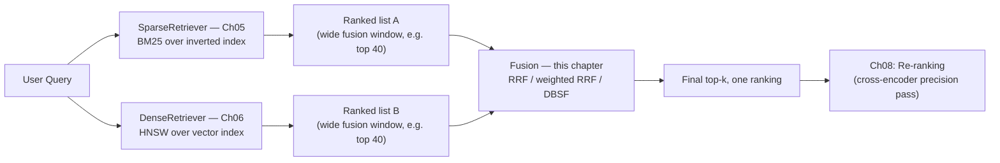
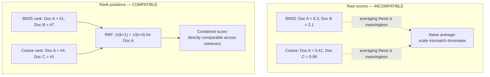
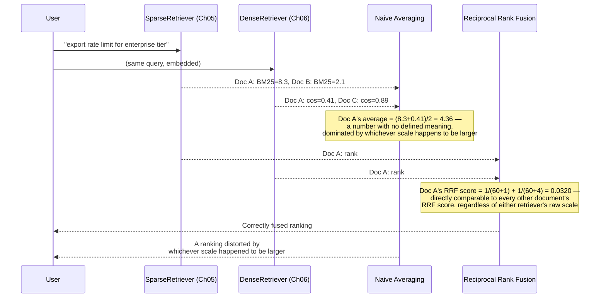
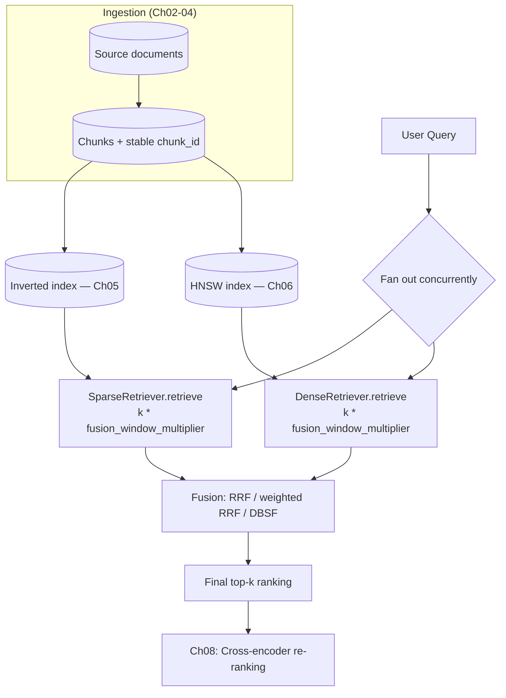

# Chapter 07 — Hybrid Search: Combining Sparse and Dense

> "A BM25 score and a cosine similarity aren't two numbers on the same ruler. Averaging them isn't a compromise — it's a category error."

**Learning Objectives**

By the end of this chapter, you will be able to:

- Explain precisely why averaging raw BM25 scores and cosine similarity scores together is mathematically meaningless, not just imprecise.
- Implement Reciprocal Rank Fusion (RRF) from scratch, and explain why it deliberately throws away score magnitude and uses rank position instead.
- Implement score normalization (min-max) as an alternative to RRF, and reproduce the specific outlier-sensitivity failure that makes rank-based fusion the safer default.
- Build a production `HybridRetriever` that composes Chapter 05's `SparseRetriever` and Chapter 06's `DenseRetriever` behind Chapter 01's `Retriever` Protocol, with zero changes to either.
- Tune RRF's rank constant and apply per-retriever weights when labeled evaluation data justifies it.
- Choose between RRF, weighted RRF, and distribution-based score fusion (DBSF) for a given corpus and tuning budget.
- Use native hybrid search support in production systems — Elasticsearch's `rank_rrf` retriever, Weaviate's `alpha`/`relativeScoreFusion`, and Qdrant's fusion query API.
- Diagnose a hybrid search result that looks wrong, and localize the problem to fusion weighting versus an individual retriever's own failure.

**Prerequisites**

- Chapters 01–06 completed — this chapter combines Chapter 05's `SparseRetriever` and Chapter 06's `DenseRetriever` directly; both must be on hand.
- Comfortable Python; basic familiarity with how ranking and sorting work.
- `pip install numpy` (this chapter's from-scratch fusion code has no other new dependencies — it operates on the outputs of retrievers you already built).

**Estimated Reading Time:** 70–80 minutes
**Estimated Hands-on Time:** 3–4 hours

---

## ⚡ Fast Read

> **Skim time: 5 minutes** — Read this if you're in a hurry, returning for reference, or already familiar with part of this topic.

- **What it is:** The technique for combining Chapter 05's sparse (BM25) retrieval results with Chapter 06's dense (vector) retrieval results into a single, correctly-ordered ranking — most commonly via Reciprocal Rank Fusion (RRF).
- **Why it matters:** Chapter 05 and Chapter 06 both closed with the same open question: sparse and dense retrieval sometimes disagree entirely on the same query, and you need one final answer, not two competing ones. Naively averaging their raw scores together doesn't answer that question — it produces a number that doesn't mean anything, because the two scores aren't measuring the same thing on the same scale.
- **Key insight:** The industry-standard fix doesn't try to make the two scores comparable at all — it throws away score magnitude entirely and fuses based on *rank position* instead. A document ranked #1 by BM25 and a document ranked #1 by cosine similarity are directly comparable in a way their raw scores never can be, which is exactly why Reciprocal Rank Fusion needs no normalization step to work correctly.
- **What you build:** A from-scratch Reciprocal Rank Fusion implementation, a from-scratch demonstration of why naive score averaging and even naive normalization can fail, and a production-grade `HybridRetriever` that composes your existing sparse and dense retrievers with no changes to either — ready for Chapter 08's re-ranking stage to refine further.
- **Jump to:** [Core Concepts](#core-concepts) | [First Code](#beginner-implementation) | [Best Practices](#best-practices) | [Mini Project](#mini-project)

---

## Why This Topic Exists

Chapter 05 built a sparse retriever and closed with a specific, concrete exercise: run real queries through both it and Chapter 04's dense retriever, and note where they agree and where they disagree entirely. Chapter 06 built a proper production dense retriever and asked the same question again, more precisely: if BM25 scores and cosine similarity scores live on completely different numeric scales, why would it be wrong to just average them together directly?

Here's the honest answer, worked all the way through. A BM25 score is an unbounded, corpus-dependent sum of term-frequency and inverse-document-frequency contributions — its scale depends on your corpus size, your document lengths, and even which specific query terms happen to be rare or common in your specific data. A cosine similarity score is bounded, typically between -1 and 1 (or 0 and 1, depending on convention) by definition, regardless of corpus. A BM25 score of `8.3` and a cosine similarity of `0.71` are not two measurements of the same underlying quantity at different scales — they're two fundamentally different kinds of number, produced by two fundamentally different scoring processes, and there is no principled conversion factor between them that holds across queries. Averaging them isn't a rough approximation of "combine these two useful signals" — it's closer to averaging a temperature in Celsius with a stock price and calling the result "the weather-adjusted market outlook." The arithmetic runs; the answer means nothing.

This chapter is where Module 2's two retrieval halves finally get combined correctly — not by inventing a clever normalization scheme that happens to work on today's corpus and quietly breaks on tomorrow's, but by adopting the technique the information retrieval field converged on for exactly this problem: fuse by rank, not by raw score.

---

## Real-World Analogy

**Two Judges, Two Scoring Scales**

Picture a diving competition and a gymnastics competition happening on the same afternoon, and imagine — for whatever contrived reason — you need to pick one overall winner across both events. The diving judges score out of 10. The gymnastics judges score out of 100. A diver who scores a 9.2 and a gymnast who scores an 88.5 did not get "meaningfully similar" scores just because 9.2 and 88.5 are both numbers you could theoretically average — a 9.2 out of 10 is a much stronger relative performance than an 88.5 out of 100, and averaging the raw numbers (`(9.2 + 88.5) / 2 = 48.85`) produces a figure that describes nothing real about either competition.

The fix experienced tournament organizers actually use is exactly this chapter's central idea: don't touch the raw scores at all. Instead, rank each competition's participants from first to last, *within their own event*, and combine based on those rank positions — first place is worth more than second place, in both events, regardless of what the raw scoring scale happened to be. A diver who placed 1st and a gymnast who placed 1st are now directly, meaningfully comparable, in a way their original 9.2-out-of-10 and 88.5-out-of-100 never were. Reciprocal Rank Fusion is that exact idea, applied to search results instead of athletes.

---

## Core Concepts

### Score Incommensurability

- **Technical definition:** The property that two scoring functions produce values on scales, distributions, or units that cannot be meaningfully combined via simple arithmetic (addition, averaging) without an explicit, justified transformation — the mathematical name for "these two numbers aren't measuring the same thing."
- **Simple definition:** Two scores that look like they're on the same 0-to-something scale, but actually aren't, so adding or averaging them produces a number that doesn't mean anything.
- **Analogy:** The diving score and gymnastics score from this chapter's analogy — both "numbers between 0 and something," neither directly combinable with the other without first converting to a common basis (like rank).

### Reciprocal Rank Fusion (RRF)

- **Technical definition:** A rank aggregation method that scores each document by summing `1 / (k + rank)` across every ranked list in which it appears, where `rank` is the document's 1-indexed position in that list and `k` is a constant (conventionally `60`) that dampens the influence of very low ranks; documents are then re-sorted by this combined score.
- **Simple definition:** Instead of combining raw scores, combine *rank positions* — being ranked #1 by any retriever contributes a lot; being ranked #200 contributes almost nothing; a document that ranks well across multiple retrievers rises to the top of the combined list.
- **Analogy:** The tournament organizer's fix from this chapter's analogy — score by finishing position within each event, not by the raw numbers each event's judges happened to use.

### Rank Constant (`k`)

- **Technical definition:** RRF's single tunable parameter, added to each rank before inverting — a larger `k` flattens the difference in contribution between a rank-1 and a rank-10 result, while a smaller `k` makes top ranks dominate the fused score more sharply. The original RRF paper (Cormack et al., SIGIR 2009) found `k = 60` performed well across their test collections, and it has become the near-universal default across production systems.
- **Simple definition:** A dial that controls how much extra credit a #1 finish gets over a #10 finish — bigger `k` means less extreme credit, smaller `k` means #1 finishes dominate more.
- **Analogy:** A curve applied to how strictly "1st place" is rewarded over "10th place" — a very forgiving curve (`large k`) treats a near-top finish as still quite valuable; a strict curve (`small k`) rewards only the very top finishes meaningfully.

### Score Normalization (Min-Max)

- **Technical definition:** A fusion alternative that rescales each ranked list's raw scores into a common range (typically `[0, 1]`) using that list's own minimum and maximum observed score, before combining the rescaled scores — usually via a weighted sum.
- **Simple definition:** Instead of throwing away the raw scores like RRF does, stretch or squeeze each retriever's scores onto the same 0-to-1 ruler first, then combine the rescaled numbers.
- **Analogy:** Grading every judge's scorecard on a curve so the highest score in *that specific event* always becomes a 100 and the lowest always becomes a 0 — useful, but entirely dependent on that specific event's minimum and maximum, which is exactly where this technique gets fragile.

### Distribution-Based Score Fusion (DBSF)

- **Technical definition:** A normalization approach that rescales each ranked list's scores using that list's mean and standard deviation (commonly `mean ± 3 standard deviations` as the effective range) rather than its raw min/max, making the normalization less sensitive to a single extreme outlier score distorting the entire scale.
- **Simple definition:** A sturdier version of min-max normalization that uses "how scores are typically distributed" instead of "the single highest and lowest score observed," so one freak result doesn't warp everything else.
- **Analogy:** Grading on a curve based on the *typical* spread of scores in past competitions, rather than whatever the single best and worst scores happened to be at this particular event — much harder for one unusually high or low outlier score to throw off everyone else's grade.

### Weighted / Convex Combination Fusion

- **Technical definition:** A fusion method (used by RRF, min-max fusion, and DBSF alike) that assigns an explicit weight to each retriever's contribution before summing — a plain, unweighted fusion effectively assumes equal weight (`1.0`) for every retriever.
- **Simple definition:** Letting one retriever's opinion count for more than the other's, on purpose, instead of assuming they should always be trusted equally.
- **Analogy:** A tournament where the head judge's scorecard is explicitly worth 1.5x an assistant judge's — still combining rank-based scores, just no longer assuming every judge's opinion should count identically.

### Fusion Window (Candidate Pool Size)

- **Technical definition:** The number of results requested from *each individual retriever* before fusion runs — deliberately larger than the final number of results the user will see, so a document that one retriever ranks moderately (but not in its literal top few) still has a chance to be considered during fusion.
- **Simple definition:** Asking each retriever for more candidates than you actually need, so fusion has real material to work with instead of being starved down to almost nothing before it even starts.
- **Analogy:** Inviting the top 50 finishers from each event into the combined scoring round, not just the top 5 — a competitor who finished 12th in diving but 2nd in gymnastics should still have a shot at the combined podium, which requires that 12th-place finisher to have been invited into the room at all.

---

## Architecture Diagrams

### Diagram 1 — The Hybrid Search Pipeline



### Diagram 2 — RRF's Rank-Based Scoring, Side by Side with Raw Scores



---

## Flow Diagrams

### A Single Query, Fused Two Ways — Naive Averaging vs. RRF



---

## Beginner Implementation

We start by building the failure case directly — naive score averaging — so its problem is visible in output, not just asserted in prose. Then we implement Reciprocal Rank Fusion from scratch and compare.

```python
# Learning example — beginner_fusion.py
# Demonstrates naive score averaging's failure mode directly, then
# implements Reciprocal Rank Fusion from scratch as the fix.

from collections import defaultdict

def naive_average_fusion(sparse_scores: dict[str, float], dense_scores: dict[str, float]) -> list[tuple[str, float]]:
    """
    The wrong approach, implemented faithfully so its failure is visible,
    not just described. Averages raw BM25 and cosine scores directly —
    watch what this does to documents that only appear in one list.
    """
    all_doc_ids = set(sparse_scores) | set(dense_scores)
    fused = {}
    for doc_id in all_doc_ids:
        # .get(doc_id, 0.0) silently treats "not retrieved by this
        # retriever" as "scored zero by this retriever" — itself a second,
        # compounding error on top of the scale-mismatch problem.
        fused[doc_id] = (sparse_scores.get(doc_id, 0.0) + dense_scores.get(doc_id, 0.0)) / 2
    return sorted(fused.items(), key=lambda x: -x[1])

def reciprocal_rank_fusion(ranked_lists: list[list[str]], k: int = 60) -> list[tuple[str, float]]:
    """
    The standard fix. Each ranked_list is a list of doc_ids already
    ordered best-to-worst by ITS OWN retriever — we never look at that
    retriever's raw score again, only the position each doc_id holds
    within its own list.
    """
    scores: dict[str, float] = defaultdict(float)
    for ranked_list in ranked_lists:
        for rank, doc_id in enumerate(ranked_list, start=1):  # rank is 1-indexed, per the original paper
            scores[doc_id] += 1.0 / (k + rank)
    return sorted(scores.items(), key=lambda x: -x[1])

if __name__ == "__main__":
    # BM25 scores are unbounded and corpus-dependent; cosine scores are
    # bounded roughly [0, 1]. Doc A leads BM25 comfortably but only
    # ranks 4th on cosine; Doc C isn't found by sparse search at all.
    sparse_scores = {"doc_a": 8.3, "doc_b": 2.1, "doc_d": 1.4}
    dense_scores = {"doc_c": 0.89, "doc_e": 0.71, "doc_f": 0.55, "doc_a": 0.41}

    print("Naive average fusion (WRONG):")
    for doc_id, score in naive_average_fusion(sparse_scores, dense_scores):
        print(f"  {doc_id}: {score:.4f}")

    sparse_ranked = sorted(sparse_scores, key=lambda d: -sparse_scores[d])
    dense_ranked = sorted(dense_scores, key=lambda d: -dense_scores[d])
    print("\nReciprocal Rank Fusion (RIGHT):")
    for doc_id, score in reciprocal_rank_fusion([sparse_ranked, dense_ranked]):
        print(f"  {doc_id}: {score:.4f}")
```

**Walking through what's actually happening:**

- Run this and look closely at `naive_average_fusion`'s output: `doc_a` — the single strongest BM25 match by a wide margin — gets its score dragged down by being averaged against a *cosine* value that lives on a completely different scale, while a document like `doc_c` (the strongest cosine match, never seen by sparse search at all) gets an artificial `0.0` bolted onto it from a retriever that never had a chance to score it in the first place. Neither of those outcomes reflects anything real about relevance.
- `reciprocal_rank_fusion` never touches `8.3` or `0.89` at all — it only ever asks "what position did this document hold in this list?" `doc_a`'s rank-1 finish in BM25 and rank-4 finish in cosine combine into `1/(60+1) + 1/(60+4) ≈ 0.0320`, a number directly comparable to any other document's RRF score, regardless of what scale either retriever's original scores happened to live on.
- Notice `doc_c`, absent from sparse results entirely, still gets a real, principled score from RRF — `1/(60+1)` for its rank-1 cosine finish alone — rather than the naive approach's arbitrary "treat missing as zero" patch.

---

## Intermediate Implementation

Now the sturdier alternative to plain min-max normalization — Distribution-Based Score Fusion (DBSF) — built to show exactly the outlier-sensitivity failure that makes naive normalization risky, and why RRF remains the safer default when you don't have strong reason to trust a retriever's raw score calibration.

```python
# Learning example — intermediate_normalization_fusion.py
# Min-max normalization fusion, its outlier failure mode reproduced
# directly, and DBSF (distribution-based normalization) as the fix.

import statistics

def minmax_normalize(scores: dict[str, float]) -> dict[str, float]:
    """Rescales a single retriever's scores to [0, 1] using ITS OWN
    min and max — fragile precisely because a single extreme value
    reshapes the scale for every other score in the same list."""
    values = list(scores.values())
    lo, hi = min(values), max(values)
    if hi == lo:
        return {doc_id: 0.5 for doc_id in scores}  # degenerate case: no spread to normalize against
    return {doc_id: (score - lo) / (hi - lo) for doc_id, score in scores.items()}

def dbsf_normalize(scores: dict[str, float]) -> dict[str, float]:
    """
    Distribution-Based Score Fusion's normalization step: rescale using
    mean +/- 3 standard deviations as the effective range, instead of
    the raw min/max. A single freak outlier shifts the mean and standard
    deviation only slightly, instead of redefining the entire scale the
    way it would under plain min-max normalization.
    """
    values = list(scores.values())
    mean = statistics.mean(values)
    stdev = statistics.pstdev(values) or 1e-9  # avoid divide-by-zero if all scores are identical
    lo, hi = mean - 3 * stdev, mean + 3 * stdev
    return {doc_id: max(0.0, min(1.0, (score - lo) / (hi - lo))) for doc_id, score in scores.items()}

def weighted_sum_fusion(normalized_lists: list[dict[str, float]], weights: list[float]) -> list[tuple[str, float]]:
    all_doc_ids = set().union(*normalized_lists)
    fused = {
        doc_id: sum(w * lst.get(doc_id, 0.0) for w, lst in zip(weights, normalized_lists))
        for doc_id in all_doc_ids
    }
    return sorted(fused.items(), key=lambda x: -x[1])

if __name__ == "__main__":
    # A single keyword-stuffed or unusually long document produces an
    # outlier BM25 score far above the rest of the list — exactly the
    # kind of document Ch05's Security Considerations warned about.
    sparse_scores = {
        "doc_a": 6.2, "doc_b": 5.9, "doc_c": 5.5, "doc_outlier": 41.0,
    }

    print("Min-max normalized (fragile to the outlier):")
    print(" ", minmax_normalize(sparse_scores))
    # Notice doc_a, doc_b, doc_c — all genuinely strong, close matches —
    # get compressed into a tiny sliver near 0.0 once doc_outlier defines
    # the top of the scale almost entirely on its own.

    print("DBSF normalized (dampened by mean/stdev instead):")
    print(" ", dbsf_normalize(sparse_scores))
    # doc_a/b/c retain meaningfully different, usable scores — the
    # outlier still scores highest, but it no longer flattens everyone
    # else's relative standing in the process.
```

**What changed, and why each change matters:**

1. **`minmax_normalize` is genuinely useful — right up until one score is an outlier.** Run the example and watch `doc_a`, `doc_b`, and `doc_c` — three documents with real, meaningfully different BM25 scores — collapse toward the bottom of the `[0, 1]` range almost indistinguishably, purely because `doc_outlier`'s `41.0` redefined what "1.0" means for the entire list.
2. **`dbsf_normalize` uses `mean ± 3σ` instead of literal min/max**, which is far less sensitive to any single extreme value — the same outlier still normalizes to a high score, but the three genuinely-close documents retain a meaningfully different, usable spread relative to each other.
3. **Neither of these techniques is "wrong" the way naive raw-score averaging was** — both are real, used-in-production fusion strategies (Qdrant ships DBSF natively; Weaviate's `relativeScoreFusion` is a min-max variant). The point of this comparison is that *score-based* fusion, done well, requires real care about distributional assumptions — which is exactly why RRF, which sidesteps score magnitude entirely, remains the safer default when you don't have strong evidence your retrievers' raw scores are well-behaved.
4. **`weighted_sum_fusion` is the same idea as RRF's optional per-retriever weighting**, just operating on normalized scores instead of rank positions — the Advanced Implementation's `HybridRetriever` supports both approaches behind one interface, so switching fusion strategy is a configuration change, not a rewrite.

---

## Advanced Implementation

Production hybrid search means composing Chapter 05's `SparseRetriever` and Chapter 06's `DenseRetriever` — unmodified — behind a `HybridRetriever` that itself implements Chapter 01's `Retriever` Protocol. One detail this promotes to a first-class concern: fusion needs a **stable document identifier** shared by both retrievers, so the same underlying chunk retrieved by sparse and dense search is recognized as *the same document*, not two coincidentally-similar pieces of text.

```python
# Production example — advanced_hybrid_retrieval.py
# HybridRetriever composing Ch05's SparseRetriever and Ch06's
# DenseRetriever, implementing Ch01's Retriever Protocol. Extends the
# Chunk shape from prior chapters with a stable chunk_id, required so
# fusion can recognize the same chunk across both retrievers' results.

from __future__ import annotations
from dataclasses import dataclass
from collections import defaultdict
from concurrent.futures import ThreadPoolExecutor
from enum import Enum

@dataclass
class Chunk:
    chunk_id: str   # NEW in this chapter — stable identity fusion depends on;
                     # Ch05/Ch06's retrievers must populate this from the
                     # same ingestion-time ID (Ch02/03), not derive it from text
    text: str
    source: str
    score: float = 0.0

class FusionStrategy(Enum):
    RRF = "rrf"
    WEIGHTED_RRF = "weighted_rrf"

class HybridRetriever:
    """Implements Ch01's Retriever Protocol exactly like Ch05's
    SparseRetriever and Ch06's DenseRetriever — same method signature,
    so this can be swapped in anywhere either of them could be, with
    Ch08's re-ranker layering on top with no further changes."""

    def __init__(
        self,
        sparse_retriever,   # Ch05's SparseRetriever
        dense_retriever,    # Ch06's DenseRetriever
        fusion_window_multiplier: int = 4,
        rrf_k: int = 60,
        weights: tuple[float, float] | None = None,  # (sparse_weight, dense_weight)
        strategy: FusionStrategy = FusionStrategy.RRF,
    ):
        self.sparse_retriever = sparse_retriever
        self.dense_retriever = dense_retriever
        self.fusion_window_multiplier = fusion_window_multiplier
        self.rrf_k = rrf_k
        self.weights = weights or (1.0, 1.0)
        self.strategy = strategy

    def retrieve(self, query: str, k: int) -> list[Chunk]:
        # The fusion window: deliberately wider than k, so a document
        # ranked #15 by one retriever but #1 by the other still gets a
        # real chance during fusion, instead of being excluded before
        # fusion even runs. See this chapter's Common Mistakes for what
        # happens when this window is set too narrow.
        fusion_k = k * self.fusion_window_multiplier

        # Run both retrievers CONCURRENTLY, not sequentially — they're
        # independent I/O-bound calls (an inverted-index lookup and an
        # HNSW search), and fusion latency should approach
        # max(sparse_latency, dense_latency), not their sum.
        with ThreadPoolExecutor(max_workers=2) as executor:
            sparse_future = executor.submit(self.sparse_retriever.retrieve, query, fusion_k)
            dense_future = executor.submit(self.dense_retriever.retrieve, query, fusion_k)
            sparse_results = sparse_future.result()
            dense_results = dense_future.result()

        fused_ids = self._fuse(sparse_results, dense_results)

        # Rebuild full Chunk objects from whichever retriever's result
        # actually carried each chunk_id — either side is a valid source
        # of the same underlying chunk content.
        chunk_lookup = {c.chunk_id: c for c in (sparse_results + dense_results)}
        return [chunk_lookup[chunk_id] for chunk_id, _ in fused_ids[:k] if chunk_id in chunk_lookup]

    def _fuse(self, sparse_results: list[Chunk], dense_results: list[Chunk]) -> list[tuple[str, float]]:
        sparse_ids = [c.chunk_id for c in sparse_results]
        dense_ids = [c.chunk_id for c in dense_results]
        sparse_weight, dense_weight = self.weights

        scores: dict[str, float] = defaultdict(float)
        for rank, chunk_id in enumerate(sparse_ids, start=1):
            weight = sparse_weight if self.strategy == FusionStrategy.WEIGHTED_RRF else 1.0
            scores[chunk_id] += weight * (1.0 / (self.rrf_k + rank))
        for rank, chunk_id in enumerate(dense_ids, start=1):
            weight = dense_weight if self.strategy == FusionStrategy.WEIGHTED_RRF else 1.0
            scores[chunk_id] += weight * (1.0 / (self.rrf_k + rank))

        return sorted(scores.items(), key=lambda x: -x[1])
```

```sql
-- Production example — hybrid_fusion.sql
-- Native SQL hybrid search: PostgreSQL full-text search (ts_rank) fused
-- with pgvector's cosine distance, using RRF computed directly in SQL.
-- Reuses Ch06's chunks table AND assumes a tsvector column populated
-- at ingestion time — a genuine alternative to app-side fusion when
-- you're already committed to Postgres for both retrieval paths.

WITH sparse_ranked AS (
    SELECT
        id,
        RANK() OVER (ORDER BY ts_rank(text_search, query) DESC) AS rank
    FROM chunks, plainto_tsquery('english', 'export rate limit enterprise') AS query
    WHERE text_search @@ query
    LIMIT 40   -- fusion window, per this chapter's Core Concepts
),
dense_ranked AS (
    SELECT
        id,
        RANK() OVER (ORDER BY embedding <=> '[...]'::vector) AS rank
    FROM chunks
    ORDER BY embedding <=> '[...]'::vector
    LIMIT 40   -- same fusion window on the dense side
)
SELECT
    c.id,
    c.text,
    c.source,
    -- Reciprocal Rank Fusion, computed directly in SQL: k=60, summed
    -- across whichever of the two CTEs actually contain this row.
    COALESCE(1.0 / (60 + s.rank), 0.0) + COALESCE(1.0 / (60 + d.rank), 0.0) AS fused_score
FROM chunks c
LEFT JOIN sparse_ranked s ON c.id = s.id
LEFT JOIN dense_ranked d ON c.id = d.id
WHERE s.id IS NOT NULL OR d.id IS NOT NULL
ORDER BY fused_score DESC
LIMIT 10;
```

```typescript
// Production example — rrf.ts
// A small, vendor-neutral RRF utility — useful when fusing results
// from two separate services (e.g., a managed sparse search endpoint
// and a managed vector search endpoint) in a Node.js query service,
// rather than relying on either vendor's built-in fusion.
type RankedResult = { id: string };

function reciprocalRankFusion(
  rankedLists: RankedResult[][],
  k: number = 60
): { id: string; score: number }[] {
  const scores = new Map<string, number>();
  for (const list of rankedLists) {
    list.forEach((result, index) => {
      const rank = index + 1; // 1-indexed, matching the original RRF paper
      scores.set(result.id, (scores.get(result.id) ?? 0) + 1 / (k + rank));
    });
  }
  return Array.from(scores.entries())
    .map(([id, score]) => ({ id, score }))
    .sort((a, b) => b.score - a.score);
}
```

**Why this shape earns its complexity:**

- **`chunk_id` is not cosmetic — it's the entire reason fusion works at all.** Without a stable identifier shared by both retrievers, `HybridRetriever` would have no principled way to know that a chunk returned by BM25 and a chunk returned by HNSW are the same underlying document, rather than two different chunks that merely contain similar text. This identifier must come from ingestion (Ch02/03), not be derived after the fact from chunk text — two chunks can legitimately have near-identical text and still be different documents.
- **`fusion_window_multiplier` directly implements this chapter's Fusion Window concept in code** — requesting `k * 4` candidates from each retriever, not just `k`, before fusion runs. Set this to `1` and rerun the Mini Project's evaluation; watch recall on disagreement-heavy queries measurably drop, for exactly the reason described in Common Mistakes.
- **`ThreadPoolExecutor` runs both retrievers concurrently** — this is a real, meaningful latency optimization, not a stylistic choice: two independent I/O-bound retrieval calls run in parallel cost roughly as much time as the *slower* of the two, not their sum.
- **`FusionStrategy.WEIGHTED_RRF` exists as a configuration option, not a separate class** — switching from unweighted RRF to a tuned per-retriever weighting (once Chapter 12's evaluation harness gives you the labeled data to justify specific weights) is a constructor argument, not a rewrite.
- **The SQL example exists because Chapters 05 and 06 both flagged PostgreSQL full-text search and pgvector as a valid combined option** — for a team already committed to Postgres for both retrieval paths, computing RRF directly in SQL avoids a second round-trip and an application-layer fusion step entirely.

> **Currency Note:** Native hybrid search support across vector databases moves quickly, and this chapter's version-specific claims were verified mid-2026: Elasticsearch's `rank_rrf` retriever reached general availability in 8.16.0, with weighted RRF added in 9.2; OpenSearch added RRF-based fusion via its score-ranker-processor in 2.19 (its earlier normalization-processor path, added in 2.10, remains available as a separate approach); Weaviate's `relativeScoreFusion` has been the default fusion algorithm since v1.24; Qdrant added RRF in v1.10 and DBSF in v1.11, with weighted RRF in v1.17. One detail could not be confirmed with confidence during this chapter's research: Qdrant's exact default value for its RRF rank constant — sources disagreed, so **do not assume it matches this chapter's `k=60` convention without checking Qdrant's current API reference directly**, and pass `k` explicitly rather than relying on an unconfirmed default. What's stable: RRF's formula, the `k=60` convention originating from the 2009 paper, and the rank-vs-score distinction underlying every fusion strategy in this chapter.

---

## Production Architecture



At small to moderate scale, hand-rolled fusion in application code (this chapter's `HybridRetriever`) is a reasonable default — it works with any pair of retrievers regardless of vendor, and keeps fusion logic visible and testable. At larger scale, or when you're already standardized on a single search platform, native hybrid search support (Elasticsearch, OpenSearch, Weaviate, Qdrant) removes an application-layer hop and lets the platform apply fusion during its own query execution rather than after two separate network round-trips.

---

## Best Practices

1. **Default to unweighted RRF with `k=60`** unless you have a specific, evaluated reason to deviate — it requires no normalization, no distributional assumptions, and is the most battle-tested fusion approach across the industry.
2. **Always request a fusion window wider than your final `k`** from each individual retriever — this chapter's `fusion_window_multiplier` (commonly 3–5x) is what lets a document ranked moderately by one retriever but strongly by the other actually get a chance to surface after fusion.
3. **Move to weighted RRF or DBSF only once you have labeled evaluation data** (Chapter 12) to justify specific weights or trust a retriever's score calibration — tuning fusion weights on vibes alone is a common way to quietly overfit to a handful of example queries.
4. **Run sparse and dense retrieval concurrently, not sequentially** — they're independent operations, and sequential execution needlessly doubles hybrid search's contribution to end-to-end latency.
5. **Establish a stable `chunk_id` at ingestion time** (Ch02/03) and ensure both retrievers populate it identically — fusion is only as correct as its ability to recognize the same underlying chunk across two different retrieval paths.
6. **Log each result's per-retriever rank contribution, not just its final fused score** — when a hybrid result looks wrong, knowing "sparse ranked this #2, dense never returned it at all" localizes the problem immediately (see this chapter's Debugging Guide).
7. **Treat the fusion strategy itself as an evaluated, tunable component** (Chapter 12), not a one-time architectural decision — a fusion approach chosen at launch may need revisiting as corpus size, query patterns, or retriever quality change.
8. **Fusion is not a substitute for re-ranking.** A well-fused top-k candidate list is still produced by two comparatively coarse retrievers — Chapter 08's cross-encoder re-ranking pass exists specifically to refine that candidate list's final ordering with a more expensive, more accurate model.

---

## Security Considerations

- **Compounding corpus poisoning.** Chapter 05 flagged keyword stuffing as a way to artificially inflate a document's BM25 score; a document engineered to also embed close to common queries compounds this risk — appearing artificially high in *both* ranked lists means it also compounds its RRF contribution. Ingestion-time anomaly detection (Ch05) remains the correct defense; fusion has no way to distinguish a genuinely relevant, dual-strong match from a manipulated one.
- **Access control must be enforced on both retrieval paths independently, before fusion.** If a document a user isn't authorized to see is filtered out of sparse results but not dense results (or vice versa, due to an inconsistency between the two retrievers' filtering logic), fusion will happily promote it into the final ranking anyway — fusion has no visibility into *why* a document was or wasn't in either input list, only that it was. Authorization must be a property both retrievers guarantee independently, not something fusion is trusted to preserve.

---

## Cost Considerations

| Approach | Cost model | Notes |
|---|---|---|
| Fusion computation itself (RRF, min-max, DBSF) | CPU only, negligible | Operates on already-retrieved rank lists — this is arithmetic over a few dozen items, not a model call |
| Running both retrievers per query | Sum of Ch05's sparse cost (near-zero) and Ch06's dense cost (embedding + ANN search) | Adding sparse retrieval alongside dense is nearly free, exactly as Chapter 05 established — the real cost of hybrid search is almost entirely the dense retrieval path you'd be paying for anyway |
| Hand-rolled application-layer fusion | One extra network round-trip avoided per retriever if run concurrently; otherwise additive | Concurrent execution (this chapter's Advanced Implementation) keeps this close to the cost of dense retrieval alone |
| Native platform hybrid search (Elasticsearch/OpenSearch/Weaviate/Qdrant) | Included in the platform's existing query cost | Removes the application-layer fan-out and fusion step entirely, at the cost of being tied to that platform's specific fusion implementation |

The headline cost takeaway: **hybrid search rarely costs meaningfully more than dense-only search**, because sparse retrieval's query-time cost is negligible (Ch05) and fusion's computational cost is negligible relative to either retriever's actual work. The real decision driver is almost never cost — it's correctness, and how much the query-answer quality improves for queries where sparse and dense disagree.

---

## Production Issue: Sparse and Dense Scores Combined Without Normalization

**Symptoms**
Hybrid search results look strange in a specific, consistent way: results seem to almost always favor one retrieval path over the other, regardless of query type. A support-agent query for an exact error code returns semantically-related-but-wrong documents ranked above the document that literally contains the code; or, in the opposite direction, an obviously paraphrased natural-language query keeps surfacing an oddly-specific, keyword-heavy document that shouldn't be anywhere near the top.

**Root Cause**
Someone implemented fusion as `final_score = bm25_score + cosine_score` (or a similarly naive weighted sum) directly on raw scores, without normalizing or converting to rank first. Because BM25 scores are unbounded and routinely land in the range of several units to several dozen, while cosine similarity is bounded to roughly `[0, 1]`, one signal numerically dwarfs the other on every single query — not because it's actually more relevant, but purely because of the numeric scale it happens to live on.

**How to Diagnose It**
1. Log the raw sparse and dense scores for a sample of real queries, side by side with the final fused score.
   ```python
   print(f"sparse={sparse_score:.4f}  dense={dense_score:.4f}  fused={fused_score:.4f}")
   ```
2. Check whether the fused score's ranking ever actually changes based on the dense score, or whether it's effectively determined by the sparse score alone (or vice versa) — if one signal's contribution to the sum is consistently orders of magnitude larger than the other's, that's the smoking gun.
3. Compare the fused ranking against each retriever's own independent ranking (Ch05, Ch06) for the same query — if the fused ranking is nearly identical to one retriever's ranking alone, fusion isn't actually combining anything.

**How to Fix It**
```python
# Wrong: raw scores combined directly — one scale silently dominates
fused_score = bm25_score + cosine_score

# Right: fuse by rank position, not raw score magnitude
def reciprocal_rank_fusion(ranked_lists: list[list[str]], k: int = 60) -> list[tuple[str, float]]:
    scores: dict[str, float] = defaultdict(float)
    for ranked_list in ranked_lists:
        for rank, doc_id in enumerate(ranked_list, start=1):
            scores[doc_id] += 1.0 / (k + rank)
    return sorted(scores.items(), key=lambda x: -x[1])
```

**How to Prevent It in Future**
Never combine raw scores from two structurally different scoring functions without an explicit, deliberate fusion strategy — default to RRF, and require an evaluation-harness comparison (Ch12) before shipping any alternative (weighted RRF, DBSF, or otherwise). Code review for any retrieval-fusion change should specifically ask "does this operate on rank, or on raw score magnitude?" as a standing checklist item.

---

## Common Mistakes

**Mistake 1 — Averaging raw scores directly.**
```python
# Wrong: BM25 and cosine live on incompatible scales
fused_score = (bm25_score + cosine_score) / 2

# Right: fuse by rank, sidestepping the scale mismatch entirely
fused = reciprocal_rank_fusion([sparse_ranked_ids, dense_ranked_ids], k=60)
```

**Mistake 2 — Requesting only the final `k` from each retriever before fusing.**
```python
# Wrong: no fusion window — a document ranked #12 by one retriever
# never gets a chance, even if it ranks #1 on the other
sparse_results = sparse_retriever.retrieve(query, k=10)
dense_results = dense_retriever.retrieve(query, k=10)

# Right: request a wider candidate pool from each retriever, THEN fuse
# down to the final k
fusion_k = 10 * 4
sparse_results = sparse_retriever.retrieve(query, k=fusion_k)
dense_results = dense_retriever.retrieve(query, k=fusion_k)
fused = reciprocal_rank_fusion([...])[:10]
```

**Mistake 3 — Fusing by chunk text equality instead of a stable identifier.**
```python
# Wrong: assumes two chunks with identical text are "the same document" —
# breaks the moment the corpus contains genuinely similar-but-distinct
# chunks (a common pattern in structured/templated documents)
if sparse_chunk.text == dense_chunk.text:
    merge(sparse_chunk, dense_chunk)

# Right: use a stable chunk_id assigned at ingestion time (Ch02/03),
# which both retrievers must carry through unchanged
if sparse_chunk.chunk_id == dense_chunk.chunk_id:
    merge(sparse_chunk, dense_chunk)
```

**Mistake 4 — Running sparse and dense retrieval sequentially.**
```python
# Wrong: latency is the SUM of both retrievers' individual latency
sparse_results = sparse_retriever.retrieve(query, k)
dense_results = dense_retriever.retrieve(query, k)   # waits for sparse to finish first, unnecessarily

# Right: run both concurrently — latency approaches the SLOWER of the two
with ThreadPoolExecutor(max_workers=2) as executor:
    sparse_future = executor.submit(sparse_retriever.retrieve, query, k)
    dense_future = executor.submit(dense_retriever.retrieve, query, k)
    sparse_results, dense_results = sparse_future.result(), dense_future.result()
```

**Mistake 5 — Treating a fusion parameter's default as permanent, unvalidated truth.**
```python
# Wrong: k=60 accepted forever, on faith, because it's "the standard"
fused = reciprocal_rank_fusion(ranked_lists, k=60)  # never revisited

# Right: k=60 as a documented STARTING point, validated against your
# own evaluation set (Ch12) before being trusted in production
fused = reciprocal_rank_fusion(ranked_lists, k=TUNED_RRF_K)  # TUNED_RRF_K set from eval results
```

---

## Debugging Guide

```mermaid
flowchart TD
    Start[Hybrid result looks wrong] --> Q1{Does the fused ranking<br/>match one retriever's<br/>own ranking almost exactly?}
    Q1 -- Yes --> Q2{Is fusion using raw<br/>scores instead of rank?}
    Q2 -- Yes --> R1[Raw-score-dominance bug —<br/>see this chapter's Production Issue]
    Q2 -- No --> Q3{Are per-retriever weights<br/>set to something extreme?}
    Q3 -- Yes --> R2[Revisit weights against<br/>an evaluation set, Ch12]
    Q1 -- No --> Q4{Was the missing document<br/>present in EITHER retriever's<br/>raw result list, pre-fusion?}
    Q4 -- No, absent from both --> R3[Not a fusion bug —<br/>check the individual retriever<br/>per Ch05/Ch06's own debugging guides]
    Q4 -- Yes, present but excluded --> Q5{Was the fusion window<br/>(candidate pool size) too narrow?}
    Q5 -- Yes --> R4[Widen fusion_window_multiplier]
    Q5 -- No --> R5[Check chunk_id consistency —<br/>possible identity mismatch across retrievers]
```

| Symptom | Likely cause | First thing to check |
|---|---|---|
| Fused ranking looks identical to one retriever's own ranking | Raw scores combined without normalization; one scale dominates | Log raw sparse/dense scores alongside the fused score for several queries |
| A document present in one retriever's raw results never appears after fusion | Fusion window too narrow, or `chunk_id` mismatch between retrievers | Confirm the document's `chunk_id` is identical across both retrievers' outputs |
| Fusion favors sparse or dense inconsistently across similar queries | Retriever-specific bug (Ch05/Ch06), not a fusion issue | Rule out the individual retriever first, using its own chapter's debugging guide |
| Hybrid query latency roughly equals sparse latency + dense latency | Retrievers running sequentially instead of concurrently | Confirm both `retrieve()` calls are dispatched via a thread pool or async gather, not one after another |
| RRF-fused results look reasonable but subtly off vs. exact expectations | `k` constant not tuned for this corpus | Compare fused rankings at a few different `k` values against your evaluation set (Ch12) |

---

## Performance Optimisation

| Technique | What it improves | Illustrative gain* | Trade-off |
|---|---|---|---|
| Concurrent sparse + dense retrieval | End-to-end hybrid query latency | Latency approaches `max(sparse, dense)` instead of their sum | Slightly more complex error handling (both futures must be checked) |
| RRF over naive score averaging | Correctness, not raw speed | Eliminates the scale-mismatch failure mode entirely | None significant — RRF's computation is negligible either way |
| Native platform hybrid search (Elasticsearch/Weaviate/Qdrant) | Removes an application-layer network hop | One query round-trip instead of two independent retrieval calls plus a fusion step | Ties fusion logic to that platform's specific implementation |
| Fusion window tuning | Recall on disagreement-heavy queries | Directly controlled by `fusion_window_multiplier` — wider windows catch more true fusion-worthy candidates | Wider windows mean each retriever does slightly more work per query |
| DBSF over plain min-max normalization | Robustness to outlier scores | Meaningfully more stable rankings when raw score distributions are skewed | Marginally more computation (mean/stdev vs. min/max) — negligible in practice |

*As with prior chapters, validate against your own corpus and evaluation harness (Chapter 12) rather than assuming these figures transfer directly.

---

## Decision Framework — Choosing a Fusion Strategy

| Situation | Recommendation |
|---|---|
| No labeled evaluation data yet; starting from scratch | Unweighted RRF, `k=60` — the safest, most battle-tested default |
| Labeled evaluation data exists, and sparse/dense should be weighted differently for your corpus | Weighted RRF, with weights validated against that evaluation set (Ch12) |
| Strong evidence both retrievers' raw scores are well-calibrated and reasonably well-behaved | DBSF, or a normalized weighted sum — but re-validate this assumption periodically, not just once |
| Already standardized on Elasticsearch, OpenSearch, Weaviate, or Qdrant for one retrieval path | Use that platform's native hybrid search support before building a hand-rolled fusion layer |
| Very small corpus, or a corpus where sparse and dense retrieval rarely disagree in practice | Validate against your evaluation harness whether fusion is even earning its complexity over a single retriever |

---

## Technology Comparison — Native Hybrid Search Support

| Platform | Fusion method(s) | Key parameter(s) | Notes |
|---|---|---|---|
| Elasticsearch | RRF via the `rank_rrf` retriever | `rank_constant` (default 60), `rank_window_size`, per-retriever weights (9.2+) | Reached GA in 8.16.0; retriever-tree query syntax replaces the older `rrf` top-level parameter |
| OpenSearch | Normalization processor (min-max, L2) or RRF via score-ranker-processor | Normalization technique, combination method, optional weights; RRF rank constant (default 60) | Two distinct, separately-configured paths — pick one per use case, not both at once |
| Weaviate | `relativeScoreFusion` (default since v1.24) or `rankedFusion` (legacy) | `alpha` (0 = pure keyword, 1 = pure vector, 0.5 = balanced) | `relativeScoreFusion` is a min-max-style normalization, not RRF |
| Qdrant | RRF (v1.10+) or DBSF (v1.11+) | `k` (confirm current default directly — see this chapter's Currency Note), per-prefetch weights (v1.17+) | Native Query API `fusion` parameter selects the strategy |
| Pinecone | Sparse-dense hybrid vectors (single index) or separate dense/sparse indexes fused at query time | `alpha` (single-index approach) | As of 2026, Pinecone's serverless guidance favors separate indexes fused at query time over the older single combined-vector approach — confirm current guidance before committing to either |
| pgvector + PostgreSQL full-text search | Hand-rolled RRF in SQL (this chapter's Advanced Implementation) | `k`, fusion window (`LIMIT` in each CTE) | No native fusion built in — you compute it yourself, as shown |

> **Currency Note:** Every parameter default and version number in this table is a mid-2026 snapshot. Hybrid search support is actively evolving across every platform listed — confirm current defaults, GA status, and available fusion methods against each vendor's own documentation before a production decision.

---

## Interview Questions

1. **"Why is it wrong to average a BM25 score and a cosine similarity score together?"** — Expect: they're incommensurable — unbounded/corpus-dependent vs. bounded — so their raw magnitudes aren't measuring the same thing on the same scale.
2. **"Explain how Reciprocal Rank Fusion works, and why it doesn't need score normalization."** — Expect: it sums `1/(k+rank)` across ranked lists, operating purely on rank position, which is directly comparable across retrievers regardless of their underlying score scales.
3. **"What does RRF's `k` constant actually control?"** — Expect: how sharply top ranks are rewarded relative to lower ranks — smaller `k` makes top finishes dominate more; larger `k` flattens the difference.
4. **"When would you choose DBSF or normalized score fusion over plain RRF?"** — Expect: when you have strong, validated reason to trust a retriever's raw score calibration, or when tuning data justifies moving beyond an unweighted rank-based default.
5. **"Why does hybrid search need a stable document identifier across retrievers, and what happens if you don't have one?"** — Expect: fusion must recognize the same underlying chunk across two different retrieval paths; without a shared ID, fusion either fails to merge genuinely identical results or incorrectly merges genuinely distinct ones with similar text.
6. **"How would you diagnose a hybrid search result where one retrieval signal seems to always dominate?"** — Expect: log raw per-retriever scores and ranks alongside the fused result; check whether fusion operates on rank or on raw score magnitude, which is the most common root cause.

---

## Exercises

1. **(20 min)** Run this chapter's `naive_average_fusion` and `reciprocal_rank_fusion` on the sample data in the Beginner Implementation. Add a third document that only sparse retrieval finds, and a fourth that only dense retrieval finds — confirm both appear in RRF's output with real, non-zero scores.
2. **(30 min)** Reproduce the min-max normalization outlier failure directly: construct a BM25 score set with one artificially high outlier (simulating Ch05's keyword-stuffing concern), apply `minmax_normalize`, and confirm the other scores collapse toward zero. Then apply `dbsf_normalize` and compare.
3. **(30 min)** Using your Chapter 05 `SparseRetriever` and Chapter 06 `DenseRetriever`, run the same query at three different `fusion_window_multiplier` values (1, 2, 4). Identify a query where a wider window changes the final top-k — and explain, using each retriever's raw rank for that document, why the change happened.
4. **(45 min)** Implement `HybridRetriever` end-to-end over your own corpus, extending your `SparseRetriever` and `DenseRetriever` to populate a stable `chunk_id`. Confirm it satisfies Chapter 01's `Retriever` Protocol by calling `.retrieve(query, k)` directly.
5. **(60 min, harder)** Take the 10 queries from Chapter 06's Exercise 5 (where you compared sparse and dense retrieval directly). Run each through `HybridRetriever` and record where the fused ranking matches your own judgment of the correct answer, versus either individual retriever alone. Identify at least one query where fusion outperforms both individual retrievers, and one where it doesn't — and explain why, in each case.

---

## Quiz

1. **Why can't BM25 scores and cosine similarity scores be combined by simple averaging?**
   *They're incommensurable — BM25 is unbounded and corpus-dependent, cosine similarity is bounded — so their raw magnitudes don't represent the same quantity on the same scale.*
2. **What does Reciprocal Rank Fusion actually operate on — score magnitude or something else?**
   *Rank position within each retriever's own ranked list — it never looks at the underlying raw score at all.*
3. **What is the conventional value of RRF's `k` constant, and where does it come from?**
   *60 — from Cormack, Clarke, and Büttcher's original 2009 SIGIR paper, which found it performed well across their test collections; it has become the near-universal default since.*
4. **What does a larger `k` value do to RRF's scoring behavior?**
   *It dampens the difference in contribution between top-ranked and lower-ranked documents, making the fused score less dominated by whichever retriever ranked a document #1.*
5. **What is the specific failure mode of min-max normalization that DBSF is designed to address?**
   *A single extreme outlier score redefines the entire scale, compressing all other genuinely-different scores toward one end of the range.*
6. **Why does hybrid fusion require a stable document identifier shared across both retrievers?**
   *Without one, fusion has no principled way to know whether a chunk returned by sparse retrieval and a chunk returned by dense retrieval represent the same underlying document or merely similar text.*
7. **Why should sparse and dense retrieval be run concurrently rather than sequentially during fusion?**
   *They're independent operations; running them sequentially needlessly adds their individual latencies together instead of approaching the latency of the slower one alone.*
8. **What is the "fusion window," and what goes wrong if it's set too narrow?**
   *The number of candidates requested from each retriever before fusion runs; set too narrow (e.g., equal to the final k), a document ranked well by only one retriever may never be considered during fusion at all.*
9. **Why is fusion not a substitute for re-ranking (Chapter 08)?**
   *Fusion still combines the output of two comparatively coarse retrievers; a cross-encoder re-ranking pass refines the final ordering with a more expensive, more accurate model applied only to the fused candidate pool.*
10. **What's a realistic security risk specific to combining sparse and dense retrieval?**
    *A document engineered to score artificially well on both retrieval paths (compounding Chapter 05's keyword-stuffing risk with a dense-retrieval-friendly phrasing) compounds its influence on the fused ranking, since fusion cannot distinguish genuine dual-strength relevance from manipulation.*

---

## Mini Project

**Build:** A `HybridRetriever` composing your Chapter 05 `SparseRetriever` and Chapter 06 `DenseRetriever`, using Reciprocal Rank Fusion.

**Acceptance criteria:**
- [ ] `HybridRetriever` implements Chapter 01's `Retriever` Protocol (`.retrieve(query, k) -> list[Chunk]`).
- [ ] Both underlying retrievers are extended to populate a stable `chunk_id`, and you've confirmed fusion correctly recognizes the same chunk when it's returned by both retrievers.
- [ ] Sparse and dense retrieval run concurrently, confirmed by comparing hybrid query latency against the sum of each retriever's individual latency.
- [ ] At least one query demonstrates fusion correctly surfacing a document that ranked outside the top-k on ONE retriever but well within the fusion window — and you've shown it would have been missed with `fusion_window_multiplier=1`.
- [ ] You've reproduced the naive-averaging failure mode directly (Beginner Implementation) and can explain, using your own corpus's real scores, why it would have produced a wrong ranking.

**Time estimate:** 2–3 hours.

---

## Production Project

**Build:** Extend the Mini Project into a tuned, monitored hybrid retrieval service.

**Acceptance criteria:**
- [ ] RRF's `k` constant and `fusion_window_multiplier` are validated against a small labeled evaluation set (even an informal one — Chapter 12 formalizes this), with your reasoning documented.
- [ ] At least one alternative fusion strategy (weighted RRF or DBSF) is implemented and compared against unweighted RRF on the same evaluation set, with results documented even if unweighted RRF wins.
- [ ] Per-retriever rank/score contribution is logged for every fused result, confirmed useful by using it to diagnose at least one deliberately-introduced fusion issue (e.g., temporarily reverting to naive averaging and confirming the logs make the problem obvious).
- [ ] Access control is verified independently on both retrieval paths — confirmed via a test that a document excluded from one retriever's results (due to a permission filter) never re-appears in the fused output via the other retriever.
- [ ] A short `RUNBOOK.md` documenting: how to tune fusion parameters for a new corpus, how to diagnose a fusion result that looks wrong (referencing this chapter's Debugging Guide), and the criteria for migrating from hand-rolled fusion to a native platform's hybrid search support.

**Time estimate:** 1–2 days.

---

## Key Takeaways

- BM25 scores and cosine similarity scores are incommensurable — averaging them directly produces a number with no defined meaning, not just an imprecise one.
- Reciprocal Rank Fusion sidesteps the scale-mismatch problem entirely by operating on rank position instead of raw score magnitude — this is why it needs no normalization step to work correctly.
- RRF's `k=60` convention traces back to the original 2009 paper and remains the near-universal production default across Elasticsearch, OpenSearch, and Qdrant.
- Score-based fusion alternatives (min-max normalization, DBSF) are real and used in production, but require more care about distributional assumptions — a single outlier score can distort min-max normalization severely, which DBSF's mean/stdev-based approach is specifically designed to resist.
- Fusion requires a stable, shared document identifier across retrievers — without one, there's no principled way to recognize the same chunk returned by two different retrieval paths.
- Sparse and dense retrieval should run concurrently during fusion — they're independent operations, and sequential execution needlessly adds their latencies together.
- The fusion window (requesting more candidates than the final k from each retriever) is what lets a document ranked well by only one retriever still surface after fusion — too narrow a window silently excludes exactly the documents fusion exists to catch.
- Fusion is not a substitute for re-ranking — it combines two comparatively coarse retrievers, and Chapter 08's cross-encoder re-ranking exists to refine that combined candidate list further.
- Native hybrid search support (Elasticsearch, OpenSearch, Weaviate, Qdrant) is a legitimate alternative to hand-rolled fusion once you're standardized on a single search platform, trading some flexibility for one fewer application-layer hop.

---

## Chapter Summary

| Concept | Key Takeaway |
|---|---|
| Score Incommensurability | BM25 and cosine scores aren't on the same scale — combining them directly is a category error |
| Reciprocal Rank Fusion (RRF) | Fuses by rank position, not raw score — the industry-standard default, `k=60` |
| Rank Constant (`k`) | Controls how sharply top ranks are rewarded relative to lower ranks |
| Min-Max Normalization / DBSF | Score-based fusion alternatives; DBSF is more robust to outlier scores than plain min-max |
| Fusion Window | Requesting more candidates than the final k from each retriever, so fusion has real material to combine |
| Stable Chunk Identity | Fusion requires a shared document identifier across retrievers to recognize the same chunk |

---

## Resources

- Cormack, Clarke & Büttcher, ["Reciprocal Rank Fusion outperforms Condorcet and Individual Rank Learning Methods"](https://cormack.uwaterloo.ca/cormacksigir09-rrf.pdf), SIGIR 2009 — the original RRF paper and source of the `k=60` convention used throughout this chapter.
- [Elasticsearch `rank_rrf` retriever documentation](https://www.elastic.co/docs/reference/elasticsearch/rest-apis/retrievers/rrf-retriever) — the native RRF implementation referenced in this chapter's Technology Comparison.
- [OpenSearch hybrid search documentation](https://docs.opensearch.org/latest/vector-search/ai-search/hybrid-search/index/) — normalization-processor and score-ranker-processor approaches.
- [Weaviate hybrid search fusion algorithms](https://weaviate.io/blog/hybrid-search-fusion-algorithms) — `relativeScoreFusion` vs. `rankedFusion`, and the `alpha` parameter.
- [Qdrant hybrid queries documentation](https://qdrant.tech/documentation/search/hybrid-queries/) — native RRF and DBSF support.
- Volume 1, Chapter 09 — RAG fundamentals, the introductory treatment this chapter's fusion techniques go far beyond.

---

## Glossary Terms Introduced

| Term | One-line definition |
|---|---|
| Score Incommensurability | Two scores that can't be meaningfully combined via simple arithmetic without an explicit transformation |
| Reciprocal Rank Fusion (RRF) | Rank aggregation summing `1/(k+rank)` across ranked lists — the industry-standard hybrid fusion default |
| Rank Constant (`k`) | RRF's tunable parameter controlling how sharply top ranks are rewarded over lower ranks |
| Score Normalization (Min-Max) | Rescaling a retriever's scores to a common range using its own observed min/max |
| Distribution-Based Score Fusion (DBSF) | Normalization using mean/standard deviation instead of raw min/max, more robust to outliers |
| Weighted / Convex Combination Fusion | Assigning explicit per-retriever weights before combining fusion scores |
| Fusion Window | The (deliberately wider than final k) number of candidates requested from each retriever before fusion |

---

## See Also

| Chapter | Why it's relevant |
|---|---|
| Vol 3, Ch 01 — RAG Architecture Deep Dive | The `Retriever` Protocol this chapter's `HybridRetriever` implements directly |
| Vol 3, Ch 05 — Sparse Retrieval | One of the two retrievers this chapter composes — its keyword-stuffing security concern compounds when combined with dense retrieval |
| Vol 3, Ch 06 — Dense Retrieval | The other retriever this chapter composes; its Exercise 5 queries are directly reused in this chapter's exercises |
| Vol 3, Ch 08 — Re-ranking and Advanced Retrieval | The precision pass applied to this chapter's fused candidate list |
| Vol 3, Ch 12 — RAG Evaluation | The evaluation harness this chapter repeatedly points to for validating fusion parameters and comparing strategies |
| Volume 1, Ch 09 — RAG | The introductory RAG chapter this volume's retrieval stack (sparse + dense + fusion) goes far beyond |

---

## Preparation for Next Chapter

Chapter 08 (Re-ranking and Advanced Retrieval) takes this chapter's fused candidate list and applies a more expensive, more accurate model — a cross-encoder — to refine the final ordering, plus query transformation techniques (HyDE, multi-query, step-back prompting) that improve what gets retrieved in the first place.

**Technical checklist:**
- [ ] Have this chapter's Mini Project `HybridRetriever` on hand, along with the underlying `SparseRetriever` (Ch05) and `DenseRetriever` (Ch06) it composes.
- [ ] Note at least one query from Exercise 5 where fusion's top result still didn't feel like the *best possible* answer, even though it was a reasonable one — Chapter 08 will show you exactly what re-ranking adds on top of fusion.

**Conceptual check:**
- If fusion already combines two retrieval signals into one ranking, what could a re-ranking pass possibly add that fusion doesn't already provide?
- Why might a cross-encoder re-ranker be too expensive to run over an entire corpus, but perfectly reasonable to run over a fusion-narrowed candidate pool of 20–50 documents?

**Optional challenge:** Take one query where `HybridRetriever`'s top result felt "close but not quite right." Write down, in your own words, what specifically feels off about the ranking — you'll get to test whether a cross-encoder re-ranker actually fixes that specific issue once Chapter 08 introduces it.
