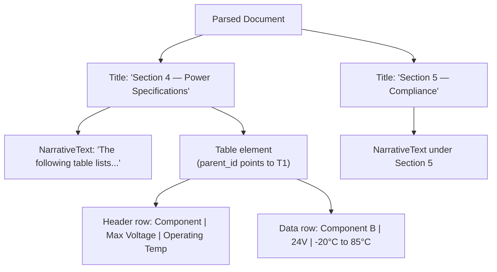
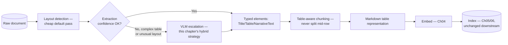
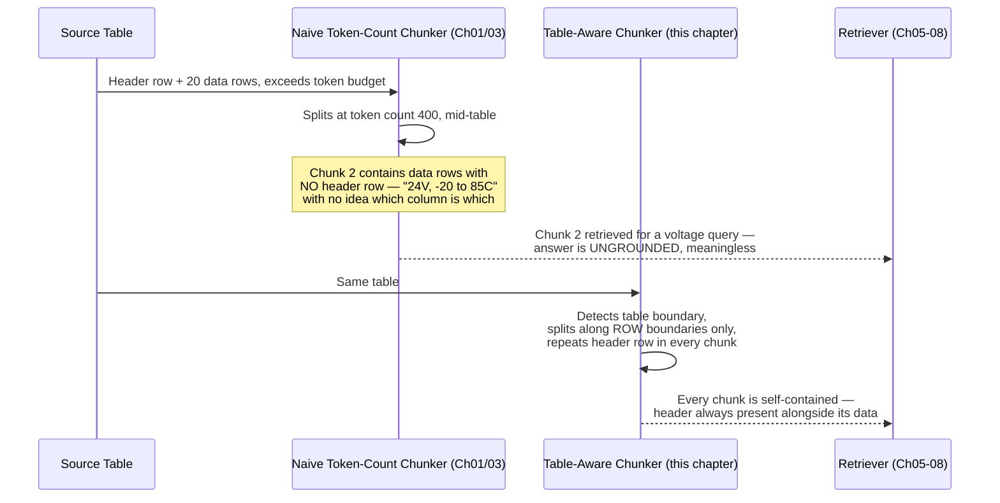
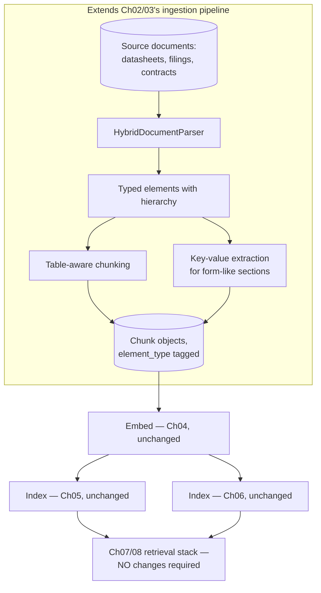
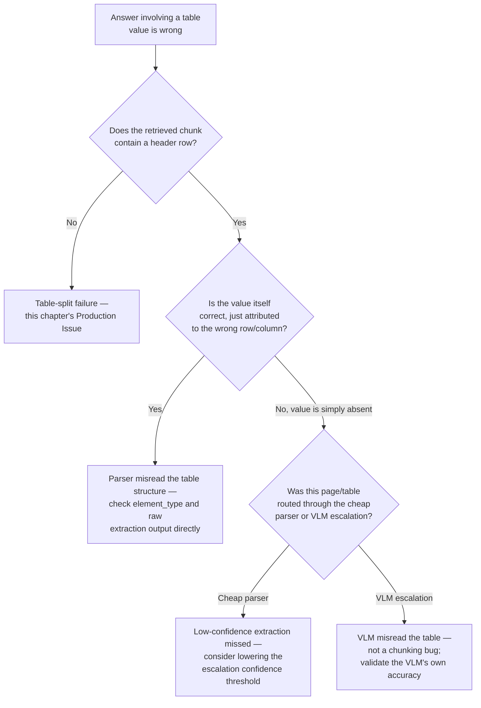

# Chapter 09 — RAG Over Structured and Semi-Structured Documents

> "A table's numbers are only numbers. Its header row is what makes them mean anything at all — and that's exactly the part naive chunking throws away first."

**Learning Objectives**

By the end of this chapter, you will be able to:

- Reproduce, directly, the specific failure where flat-text chunking separates a table's data row from the header that gives it meaning.
- Extract tables from native-text PDFs using `camelot`/`pdfplumber`, and know precisely when these tools cannot help at all (scanned pages).
- Use a production document-parsing tool that preserves element type and hierarchy (titles, sections, tables, narrative text) through ingestion, instead of collapsing everything to flat strings.
- Represent an extracted table for embedding using the markdown-table convention, and explain why markdown outperforms JSON for most RAG indexing use cases.
- Implement table-aware chunking that never splits a table mid-row, and repeats header context when a table must span multiple chunks.
- Extract key-value pairs from semi-structured, form-like documents, and know when a dedicated extraction tool is justified over general-purpose parsing.
- Choose between traditional OCR/layout parsing, VLM-based parsing, and a hybrid of the two for a given document type and cost budget.
- Diagnose a "found the right document, gave the wrong answer" failure and correctly localize it to table-structure loss during ingestion, not a retrieval bug.

**Prerequisites**

- Chapters 01–08 completed — this chapter changes what happens at ingestion (Ch02) and chunking (Ch03) time; retrieval, fusion, and re-ranking (Ch05–08) are unchanged downstream.
- `pip install camelot-py[base] pdfplumber "unstructured[pdf]"` (`camelot` additionally requires Ghostscript installed at the system level).
- Comfortable Python; no new math beyond what Chapters 01–08 already covered.

**Estimated Reading Time:** 75–85 minutes
**Estimated Hands-on Time:** 4–5 hours

---

## ⚡ Fast Read

> **Skim time: 5 minutes** — Read this if you're in a hurry, returning for reference, or already familiar with part of this topic.

- **What it is:** Extending Chapters 02–03's ingestion and chunking pipeline to correctly handle tables, sections, and key-value fields in structured and semi-structured documents, instead of treating every document as flat prose.
- **Why it matters:** Every retrieval technique built in Chapters 05–08 assumes a chunk is a reasonably self-contained, meaningful piece of text. A table breaks that assumption immediately — a number in a table cell means nothing without the row and column headers that label it, and naive chunking routinely separates the two.
- **Key insight:** The fix isn't a smarter retriever — every technique in Chapters 05–08 already works correctly once it's given a chunk that actually preserves table structure. The entire problem, and the entire fix, lives at ingestion time, before retrieval ever runs.
- **What you build:** A table-aware chunker that never splits a table mid-row, a document parser that preserves section hierarchy through ingestion, and a production ingestion pipeline that routes documents through the cheapest parsing strategy that will actually work for them.
- **Jump to:** [Core Concepts](#core-concepts) | [First Code](#beginner-implementation) | [Best Practices](#best-practices) | [Mini Project](#mini-project)

---

## Why This Topic Exists

Every chapter from 01 through 08 built a genuinely complete, general-purpose retrieval stack — sparse, dense, fused, and re-ranked — on top of one quiet assumption: that a chunk is a reasonably self-contained unit of meaning. For ordinary prose, Chapter 03's recursive and structure-aware chunking hold that assumption up fine. For a table, that assumption breaks immediately, and it breaks in the specific place that matters most: the numbers.

Consider a table with a header row (`Component`, `Max Voltage`, `Operating Temp`) and several data rows below it. A fixed-size or naively recursive chunker, working purely off character or token counts, has no concept of "this row belongs to that header" — it will happily cut the table wherever the token budget runs out, which is very often mid-table, sometimes mid-row. The result: a chunk containing `"...Component B, 24V, -20°C to 85°C"` with absolutely no indication of which column each number belongs to, because the header row that labeled them ended up in a *different* chunk, or worse, was never chunked as connected to this data at all. Every retriever built in this course will happily retrieve that orphaned row — it just won't mean anything to the reader, or to the LLM generating an answer from it. This is not a retrieval bug. Every technique in Chapters 05–08 is working exactly as designed; the input they were given was already broken before they ever saw it.

This chapter also marks a deliberate shift in this course's example material. Chapters 01–08 (Modules 1–2) stayed in a neutral domain on purpose, so every reader — regardless of industry — could learn general RAG engineering without wading through domain-specific noise. Starting here, in Module 3, examples increasingly draw from structured, regulated document domains: technical specification sheets, financial filings, legal contract schedules, regulatory tables. The techniques taught are exactly as general as everything before them — a table is a table whether it's listing hardware specifications or drug dosages — but the documents get harder, because that's genuinely where this problem gets sharp enough to matter.

---

## Real-World Analogy

**The CSV File With the Header Row Deleted**

If you've ever split a large CSV file into smaller pieces — say, by piping it through a command that breaks it into chunks of a fixed number of lines — you've probably run into this exact failure already, just in a different form. The first chunk looks fine: it has the header row (`id,component,max_voltage,operating_temp`) followed by some data rows. Every chunk after the first is a disaster: a grid of raw values with absolutely no column labels attached, because the header row that gave those columns meaning only existed once, at the very top of the original file, and got left behind the moment you split blindly by line count.

A table embedded inside a PDF, split by a token-counting chunker with no awareness that it's looking at a table at all, fails in exactly this way. The fix a competent engineer would reach for immediately with a CSV — "make sure every split chunk keeps a copy of the header row" — is precisely this chapter's central technique, just applied to a PDF's tables instead of a spreadsheet's rows.

---

## Core Concepts

### Structured vs. Semi-Structured vs. Unstructured Documents

- **Technical definition:** Structured documents have a fully regular, machine-parseable schema (a database export, a well-formed CSV); semi-structured documents have a recognizable but inconsistent structure — headings, tables, key-value fields — embedded within otherwise free-form content (a PDF datasheet, a scanned form); unstructured documents are pure free-form text or media with no reliable schema at all (an email body, a chat transcript).
- **Simple definition:** How much of the document's shape can a program count on, versus how much is just prose a human would have to read to understand?
- **Analogy:** A spreadsheet (structured), a filled-out paper form scanned into a PDF (semi-structured — recognizably form-shaped, but not machine-native), and a handwritten letter (unstructured).

### Table Structure Recognition

- **Technical definition:** The process of detecting a table's presence within a document and reconstructing its row/column layout — which cells belong to which row, which row is the header — from either native PDF text-positioning data or, for scanned documents, a combination of OCR and layout-detection models.
- **Simple definition:** Figuring out, automatically, "this is a table, this is its header row, and this specific number belongs to this specific row and this specific column."
- **Analogy:** Reconstructing a spreadsheet's grid lines from a photograph of a printed table — obvious to a human eye, genuinely hard for software to get right consistently.

### Document Element Ontology

- **Technical definition:** A typed classification of every distinct piece of a parsed document (Title, NarrativeText, Table, ListItem, Header, FigureCaption, and similar categories), typically carrying a `parent_id`/hierarchy pointer so section structure survives parsing, rather than the document being collapsed into one undifferentiated block of text.
- **Simple definition:** Tagging each piece of the document with what *kind* of thing it is — a heading, a paragraph, a table, a caption — instead of treating the whole document as one big string.
- **Analogy:** The difference between a document's raw text dump and its actual outline view in a word processor — the outline knows which paragraph belongs under which heading; the raw text dump doesn't.

### Table-Aware Chunking

- **Technical definition:** A chunking strategy (extending Chapter 03's structure-aware chunking) that treats a detected table as an atomic unit — never splitting it at an arbitrary token boundary — and, when a table is too large to fit in one chunk, splits along row boundaries only, repeating the header row in every resulting chunk.
- **Simple definition:** Never cutting a table in a place that separates a value from the header that labels it — and if the table has to be split at all, copying the header into every piece.
- **Analogy:** The CSV-splitting fix from this chapter's analogy — keep a copy of the header row in every piece, no matter how the file gets divided.

### Key-Value Extraction

- **Technical definition:** Extracting labeled field/value pairs from a semi-structured document (e.g., `Invoice Number: INV-4471`, `Effective Date: 2026-03-01`) as discrete, structured data rather than leaving them embedded in unstructured running text — typically via a dedicated forms-extraction model or a cloud IDP (Intelligent Document Processing) API.
- **Simple definition:** Pulling out a document's "label: value" pairs — the kind of thing you'd find on a form — as clean, structured data instead of just raw prose.
- **Analogy:** The difference between reading a filled-out form as a paragraph of run-on text versus getting a clean spreadsheet row of `Field Name → Value` pairs.

### Table Representation for Embedding

- **Technical definition:** The choice of textual encoding used to represent an extracted table before it's embedded (Ch04) and indexed (Ch05–06) — most commonly Markdown table syntax, sometimes JSON, and in some cases the table's page image itself for multi-modal retrieval (Chapter 10).
- **Simple definition:** What format do you actually turn a table into before handing it to an embedding model — since embedding models were trained overwhelmingly on natural text and Markdown, not raw JSON structures.
- **Analogy:** Writing a table out the way it would appear in a well-formatted README file (Markdown) versus a raw data export (JSON) — both are valid, but one reads far more naturally to a model trained mostly on human-written documents.

### Hybrid OCR + VLM Document Parsing

- **Technical definition:** A document-parsing strategy that applies a cheap, fast, traditional OCR/layout-detection pipeline to the bulk of a document's pages, and escalates only the subset of pages that pipeline handles poorly (complex tables, unusual layouts, low-confidence extractions) to a more expensive vision-language model (VLM) capable of reading the page as an image directly.
- **Simple definition:** Use the cheap tool for the easy 80% of pages, and only pay for the expensive tool on the hard 20% that actually need it.
- **Analogy:** A triage nurse handling routine cases quickly and referring only the genuinely complicated ones to a specialist — using the specialist for every single case would be needlessly slow and expensive.

---

## Architecture Diagrams

### Diagram 1 — Document Element Hierarchy



### Diagram 2 — Structured Document Ingestion Pipeline



---

## Flow Diagrams

### The Table-Split Failure, and Its Fix



---

## Beginner Implementation

We start with the simplest real table-extraction path — `camelot` and `pdfplumber` against a native-text PDF — and then reproduce this chapter's central failure directly by running the extracted table through Chapter 01/03's plain token-count chunker.

```python
# Learning example — beginner_table_extraction.py
# Extracts a table from a native-text PDF using camelot, converts it to
# Markdown, then deliberately reproduces the naive-chunking failure.

import camelot

def extract_tables_as_markdown(pdf_path: str) -> list[str]:
    """
    camelot only works on NATIVE-TEXT PDFs — it reads the PDF's actual
    text-positioning data to reconstruct rows and columns. It cannot
    help at all on a SCANNED page (a page that's really just an image);
    that case needs OCR first, or a VLM-based approach (Advanced
    Implementation).
    """
    tables = camelot.read_pdf(pdf_path, pages="all")
    markdown_tables = []
    for table in tables:
        df = table.df
        header = df.iloc[0].tolist()
        rows = df.iloc[1:].values.tolist()
        # Markdown table syntax — the representation this chapter's
        # Core Concepts recommends as the default for embedding, because
        # embedding models were trained overwhelmingly on Markdown-like
        # natural text, not raw JSON structures.
        md = "| " + " | ".join(header) + " |\n"
        md += "| " + " | ".join(["---"] * len(header)) + " |\n"
        for row in rows:
            md += "| " + " | ".join(str(cell) for cell in row) + " |\n"
        markdown_tables.append(md)
    return markdown_tables

def naive_chunk_by_tokens(text: str, chunk_size: int = 40) -> list[str]:
    """Chapter 01/03's plain token-count chunker — no awareness that
    it might be looking at a table at all. Reused here UNCHANGED,
    specifically to show it breaks a table exactly the way this
    chapter's Why This Topic Exists section describes."""
    words = text.split()
    return [" ".join(words[i:i + chunk_size]) for i in range(0, len(words), chunk_size)]

if __name__ == "__main__":
    # Simulating a real extracted table's markdown for a corpus without
    # a sample PDF on hand — run extract_tables_as_markdown() on a real
    # file to see the same structure produced from an actual document.
    sample_table_md = (
        "| Component | Max Voltage | Operating Temp |\n"
        "| --- | --- | --- |\n"
        "| Component A | 12V | -10C to 70C |\n"
        "| Component B | 24V | -20C to 85C |\n"
        "| Component C | 5V | 0C to 60C |\n"
        "| Component D | 48V | -40C to 105C |\n"
    )

    chunks = naive_chunk_by_tokens(sample_table_md, chunk_size=10)
    print("Naive token-count chunking of a table (WRONG):")
    for i, chunk in enumerate(chunks):
        print(f"  Chunk {i}: {chunk!r}")
```

**Walking through what's actually happening:**

- `extract_tables_as_markdown` does the real extraction work — `camelot` reads the PDF's actual character-positioning data to reconstruct which text belongs to which row and column, something no amount of clever text chunking downstream could ever recover if it were lost at this stage.
- Run the naive chunker on the sample table and look closely at the output: at least one resulting chunk contains data rows (`Component B | 24V | -20C to 85C`) with **no header row at all** — the header, `Component | Max Voltage | Operating Temp`, only survived into the *first* chunk, exactly like the CSV-splitting failure from this chapter's analogy.
- This is the entire problem this chapter exists to fix, made concrete: every retriever built in Chapters 05–08 will happily find and return that header-less chunk for a query about voltage — it isn't wrong about relevance, it's just been handed a chunk that was already broken before retrieval ever touched it.

---

## Intermediate Implementation

Now a real document-element parser — `unstructured` — that preserves section hierarchy and table boundaries through ingestion, plus a table-aware chunker that fixes the exact failure demonstrated above.

```python
# Learning example — intermediate_structured_parsing.py
# Uses unstructured's typed-element model to preserve document
# hierarchy, then implements table-aware chunking that never splits a
# table mid-row and repeats the header when a table must span chunks.

from unstructured.partition.pdf import partition_pdf
from dataclasses import dataclass

@dataclass
class DocumentElement:
    element_type: str      # "Title", "NarrativeText", "Table", etc. — unstructured's ontology
    text: str
    parent_id: str | None  # links a NarrativeText/Table back to its enclosing Title/section

def parse_document(pdf_path: str) -> list[DocumentElement]:
    """
    strategy="hi_res" runs real layout detection (not just raw text
    extraction) so tables are recognized AS tables, not just as
    paragraphs of numbers — this is the difference between this
    function and a plain PDF text-extraction call.
    """
    elements = partition_pdf(pdf_path, strategy="hi_res", infer_table_structure=True)
    return [
        DocumentElement(
            element_type=el.category,
            text=el.metadata.text_as_html if el.category == "Table" else str(el),
            parent_id=el.metadata.parent_id,
        )
        for el in elements
    ]

def chunk_table_aware(table_markdown: str, header_row: str, max_rows_per_chunk: int = 15) -> list[str]:
    """
    The direct fix for this chapter's central failure. Splits ONLY along
    row boundaries — never mid-row — and repeats header_row at the top
    of every resulting chunk, so every chunk is self-contained even if
    the original table had to be split across several of them.
    """
    lines = table_markdown.strip().split("\n")
    separator_row = lines[1]  # the "| --- | --- |" markdown separator line
    data_rows = lines[2:]     # everything after the header and separator

    chunks = []
    for i in range(0, len(data_rows), max_rows_per_chunk):
        row_slice = data_rows[i:i + max_rows_per_chunk]
        chunk = "\n".join([header_row, separator_row] + row_slice)
        chunks.append(chunk)
    return chunks

if __name__ == "__main__":
    sample_table_md = (
        "| Component | Max Voltage | Operating Temp |\n"
        "| --- | --- | --- |\n"
        "| Component A | 12V | -10C to 70C |\n"
        "| Component B | 24V | -20C to 85C |\n"
        "| Component C | 5V | 0C to 60C |\n"
        "| Component D | 48V | -40C to 105C |\n"
    )
    header = "| Component | Max Voltage | Operating Temp |"

    chunks = chunk_table_aware(sample_table_md, header, max_rows_per_chunk=2)
    print("Table-aware chunking (RIGHT):")
    for i, chunk in enumerate(chunks):
        print(f"--- Chunk {i} ---\n{chunk}\n")
```

**What changed, and why each change matters:**

1. **`parse_document` never collapses the document to one string** — every element keeps its `element_type` and `parent_id`, exactly matching this chapter's Document Element Ontology. This is what makes it possible to *find* the tables in a document at all, rather than treating every page as undifferentiated prose.
2. **`infer_table_structure=True` is doing the real work** — without it, a table would still get extracted as an "Uncategorized" or "NarrativeText" element, losing its row/column structure entirely, exactly the same failure this chapter's Beginner Implementation reproduced with a plain chunker.
3. **`chunk_table_aware` never once splits mid-row.** Run it against the same sample table used in the Beginner Implementation's failure demo, and compare: every resulting chunk here has its own copy of the header row, so a query about `Component B`'s voltage retrieves a chunk that still says, explicitly, which column is which.
4. **This is directly analogous to Chapter 03's structure-aware chunking**, just specialized further for the one structural type (tables) that a generic paragraph-based chunker handles worst. The same underlying discipline — respect the document's actual structure, don't just count tokens — is what both techniques share.

---

## Advanced Implementation

Production structured-document ingestion means the hybrid OCR+VLM strategy from this chapter's Core Concepts, plus key-value extraction for form-like documents, producing `Chunk` objects that plug directly into Chapters 05–08's existing retrieval pipeline with zero downstream changes.

```python
# Production example — advanced_structured_ingestion.py
# Hybrid OCR+VLM document parsing with confidence-based escalation, key-
# value extraction, and Chunk objects compatible with Ch05-08 unchanged.

from __future__ import annotations
from dataclasses import dataclass, field

@dataclass
class Chunk:
    chunk_id: str
    text: str
    source: str
    score: float = 0.0
    element_type: str = "text"       # NEW in this chapter: "text", "table", or "key_value" —
    metadata: dict = field(default_factory=dict)  # traces WHY this chunk looks the way it does

class HybridDocumentParser:
    """Routes each page through the cheapest strategy that will actually
    work for it — this is the direct code implementation of this
    chapter's Hybrid OCR+VLM Core Concept."""

    def __init__(self, cheap_parser, vlm_parser, confidence_threshold: float = 0.7):
        self.cheap_parser = cheap_parser  # e.g., unstructured's hi_res strategy
        self.vlm_parser = vlm_parser      # a vision-language model reading the page as an image
        self.confidence_threshold = confidence_threshold

    def parse_page(self, page) -> tuple[list[DocumentElement], str]:
        elements, confidence = self.cheap_parser.parse_with_confidence(page)
        if confidence >= self.confidence_threshold:
            return elements, "cheap_parser"
        # Escalate ONLY this page — the majority of a real document's
        # pages should never need this path, which is exactly what keeps
        # the hybrid strategy's average cost low (see Cost Considerations).
        return self.vlm_parser.parse(page), "vlm_escalation"

def table_to_chunks(table_markdown: str, header_row: str, source: str, doc_id: str, max_rows: int = 15) -> list[Chunk]:
    lines = table_markdown.strip().split("\n")
    separator_row, data_rows = lines[1], lines[2:]
    chunks = []
    for i in range(0, len(data_rows), max_rows):
        row_slice = data_rows[i:i + max_rows]
        chunk_text = "\n".join([header_row, separator_row] + row_slice)
        chunks.append(Chunk(
            chunk_id=f"{doc_id}_table_{i}",
            text=chunk_text,
            source=source,
            element_type="table",
            metadata={"row_range": (i, i + len(row_slice))},
        ))
    return chunks

def extract_key_value_pairs(document_text: str, llm_client, model: str = "claude-sonnet-5") -> dict[str, str]:
    """
    LLM-based key-value extraction — a reasonable default for moderate
    volume without committing to a cloud IDP's forms API. At meaningful
    scale, a dedicated forms-extraction service (this chapter's Cost
    Considerations) is typically cheaper and more consistent per page.
    """
    response = llm_client.messages.create(
        model=model, max_tokens=500,
        messages=[{
            "role": "user",
            "content": f"Extract every label:value field from this document as "
                       f"JSON (e.g. {{\"Invoice Number\": \"INV-4471\"}}). "
                       f"Only include fields that are explicitly labeled:\n\n{document_text}",
        }],
    )
    import json
    return json.loads(response.content[0].text)
```

```sql
-- Production example — structured_elements.sql
-- Extends Ch06's pgvector chunks table with element-type metadata, so
-- table/key-value chunks can be filtered independently of narrative text
-- at query time, and traced back to their extraction method.

ALTER TABLE chunks
    ADD COLUMN element_type text NOT NULL DEFAULT 'text',   -- 'text', 'table', or 'key_value'
    ADD COLUMN parsing_method text,                         -- 'cheap_parser' or 'vlm_escalation'
    ADD COLUMN row_range int4range;                         -- NULL for non-table chunks

-- Lets a query specifically favor or exclude table chunks — useful once
-- Ch12's evaluation harness reveals whether table-heavy queries benefit
-- from being routed differently than narrative-text queries.
CREATE INDEX chunks_element_type_idx ON chunks (element_type);
```

**Why this shape earns its complexity:**

- **`HybridDocumentParser.parse_page` is the direct code implementation of the cost/accuracy trade-off this chapter's Core Concepts describes** — most pages get the cheap path; only pages the cheap parser is genuinely unsure about get escalated. This is what keeps hybrid parsing's average per-document cost close to the cheap parser's cost, while still recovering VLM-level accuracy on the pages that actually need it.
- **`Chunk` gains an `element_type` field**, following the same pattern Chapter 07 established when it added `chunk_id` — a deliberate, explicit schema addition, not a silent retrofit. Downstream, Chapters 05–08's retrievers don't need to know or care about this field; it exists for filtering, debugging, and citation-tracing, exactly like the metadata columns Chapter 06 already supported.
- **`extract_key_value_pairs` is presented as a reasonable default, not the only option** — this chapter's Cost Considerations and Decision Framework are explicit that a dedicated cloud IDP forms API is often the better choice once page volume is high enough to justify its per-page cost against LLM API costs at the same volume.
- **The SQL migration extends, rather than replaces, Chapter 06's existing schema** — this is deliberate continuity: a structured-document-aware ingestion pipeline should be an additive change to an already-working retrieval stack, not a parallel system.

> **Currency Note:** Document parsing tooling is one of the fastest-moving areas this course covers, and several specifics here were verified only as of mid-2026: `camelot-py` reached v2.0.0 with an optional GPU-accelerated path; `unstructured`'s `hi_res` strategy and typed-element ontology remain the current reference approach; **LlamaParse** now offers four pricing tiers (Fast, Cost-Effective, Agentic, and Agentic Plus) at roughly $1.25 per 1,000 credits; **Docling** (IBM's open-source parsing project) moved under the Linux Foundation's AI & Data governance and shipped an Apache-2.0-licensed vision model (`Granite-Docling-258M`) specifically for document parsing. Vendor-reported accuracy figures (some cloud IDP and parsing-tool marketing cites numbers like "99% table accuracy") were **not independently verified** during this chapter's research — treat any single vendor's accuracy claim as a starting hypothesis to validate against your own corpus (Ch12), not a guarantee. What's stable: the hybrid cheap-parser-plus-VLM-escalation strategy as a cost-control pattern, and the underlying reason table-aware chunking matters — neither depends on which specific tool is fastest or cheapest this quarter.

---

## Production Architecture



The core architectural point this chapter makes: **structured-document handling is entirely an ingestion-time concern.** Once a table has been correctly parsed, chunked without splitting mid-row, and represented as a well-formed Markdown table, it flows through Chapters 04–08's entire retrieval stack completely unchanged — no retriever, fusion strategy, or reranker built earlier in this course needs to know or care that a given chunk happens to represent a table rather than a paragraph.

---

## Best Practices

1. **Never let a table reach the chunker as flat, undifferentiated text.** Table structure recognition must happen at parsing time, before chunking — once row/column association is lost, no downstream technique in this course can recover it.
2. **Default to Markdown as your table representation for embedding**, reserving JSON for cases where a downstream system needs strict, programmatic schema access rather than natural-language-style retrieval.
3. **Repeat the header row in every chunk a large table gets split into** — this single rule is the direct fix for this chapter's central failure mode.
4. **Use a hybrid parsing strategy by default**: a cheap layout/OCR pass for the majority of pages, escalating only low-confidence pages to a VLM — validate the escalation rate on your own corpus rather than assuming a fixed percentage.
5. **Preserve document element hierarchy (`parent_id`, section titles) through ingestion**, even for chunks that aren't tables — this is what makes accurate citation (Chapter 13) possible later.
6. **Choose key-value extraction tooling by volume, not by whichever is easiest to wire up first** — LLM-based extraction is a reasonable default at moderate volume; a dedicated cloud IDP forms API usually wins on cost and consistency at high volume.
7. **Never trust a vendor's accuracy claim without validating it against your own documents** — table extraction accuracy is highly dependent on document layout complexity, scan quality, and table density, all of which vary enormously across real corpora.
8. **Version-tag your parsing pipeline's output** (parser name, strategy, and version), exactly as Chapter 04 tagged embeddings — a silent parser upgrade can change table extraction behavior in ways worth being able to trace after the fact.

---

## Security Considerations

- **Adversarial documents designed to break table structure recognition.** A malformed or deliberately obfuscated table (inconsistent cell borders, hidden text layered behind visible cell content, unusual encoding) can cause a parser to silently misattribute or drop content — a structured-document-specific instance of Chapter 05's corpus-poisoning concern, now targeting the parser itself rather than the retriever's scoring function. Validate extraction output against expected structure (row/column counts, expected header presence) as part of ingestion, not just downstream retrieval quality.
- **Data residency and exposure when using third-party parsing services.** Sending a regulated, sensitive document (a financial filing, a contract, a technical specification containing proprietary detail) through a cloud IDP API or hosted VLM parsing service means that document's content leaves your infrastructure. This is a real, concrete consideration specifically relevant to Module 3's shift toward regulated document domains — confirm data handling, retention, and residency terms for any third-party parsing service before routing sensitive documents through it, and prefer a self-hosted parsing strategy (`unstructured`, `camelot`, self-hosted Docling) when that consideration is decisive.

---

## Real Client Scenario: The Misread Rate Table

A financial services client ingests quarterly filings containing interest-rate schedule tables — a header row of `Tier`, `Rate`, `Effective Date`, followed by a dozen data rows. Their first-generation ingestion pipeline used Chapter 01's plain fixed-size chunker on every document type uniformly, including these filings. During a routine audit, a support engineer discovers the assistant confidently answering a client's rate-tier question with a rate that belongs to a *different* tier entirely — because the chunk containing that row had been split away from its header, and both the retriever and the generator had no way to know which tier the surfaced row's rate actually applied to. The fix was exactly this chapter's table-aware chunking, applied at the ingestion layer, with no changes required to the sparse retriever, dense retriever, fusion, or re-ranking stages already built and validated in Chapters 05–08.

---

## Cost Considerations

| Approach | Cost model | Notes |
|---|---|---|
| `camelot` / `pdfplumber` (self-hosted) | Free, CPU only | Native-text PDFs only — cannot help with scanned documents at all |
| `unstructured` (self-hosted, open-source) | Free, CPU (GPU optional for layout models) | Current reference approach for typed-element parsing; `hi_res` strategy is slower than plain text extraction |
| Cloud IDP APIs (Azure Document Intelligence, AWS Textract, Google Document AI) | Per-1,000-pages pricing, tiered by feature (OCR vs. tables vs. forms) | No infrastructure to operate; per-page cost adds up quickly at high volume — confirm current tier pricing directly before committing |
| LlamaParse | Per-credit pricing across four tiers (Fast through Agentic Plus) | Higher tiers cost meaningfully more per page but handle denser, more complex documents better |
| Self-hosted Docling | Free, open-source (Apache 2.0) | A genuine no-cost alternative to cloud IDP APIs, with growing enterprise backing |
| Hybrid OCR+VLM (this chapter's recommended default) | Cheap parser cost for most pages, VLM cost only for the escalated minority | Lowest average cost per page while recovering VLM-level accuracy where it's actually needed |

The overall shape worth internalizing: **cost in structured-document ingestion is driven almost entirely by how many pages need the expensive path**, not by which specific tool you pick for the cheap path — measuring and minimizing your corpus's actual VLM-escalation rate is a far higher-leverage cost lever than shopping between similarly-priced cloud APIs.

---

## Production Issue: Table Extracted as Flat Text, Losing Row/Column Association

**Symptoms**
The assistant confidently answers a question that involves a specific numeric value from a table, but the value is wrong — often subtly wrong, belonging to an adjacent row or column rather than being obviously nonsensical. Support tickets describe answers that are "close but not quite right" in a way that's hard to pin down, specifically for questions referencing tabular data (specifications, rate schedules, dosage tables, pricing tiers).

**Root Cause**
At ingestion time, a table was extracted (or chunked) in a way that discarded its row/column structure — either the parser itself failed to recognize the table as a table (extracting it as flat, undifferentiated text), or a downstream chunker split the table without preserving which header applied to which surviving row. The retriever, fusion, and re-ranking stages all worked correctly; they were simply handed a chunk that no longer carried the information needed to answer correctly.

**How to Diagnose It**
1. Retrieve the specific chunk that was used to answer the question, and inspect it directly.
   ```python
   result = hybrid_retriever.retrieve(query, k=5)
   for chunk in result:
       print(f"element_type={chunk.element_type}\n{chunk.text}\n---")
   ```
2. Check whether the chunk contains a header row at all. If it contains bare numeric values with no adjacent column labels, this is confirmed.
3. Trace back to the original source document and confirm whether the table was ever correctly recognized as a table during parsing (`element_type` should be `"table"`, not `"text"` or `"uncategorized"`).

**How to Fix It**
```python
# Wrong: table content flattened to plain text during parsing, with no
# structural markers at all
chunk_text = " ".join(cell for row in table_rows for cell in row)

# Right: preserve row/column structure explicitly, using Markdown table
# syntax, and never split the result at anything other than a row boundary
chunk_text = "\n".join(
    "| " + " | ".join(row) + " |" for row in [header_row, separator_row] + data_rows
)
```

**How to Prevent It in Future**
Validate table extraction as an explicit ingestion-time check, not just an assumption — confirm every chunk tagged `element_type="table"` actually contains its header row, as an automated sanity check run on every ingestion job, not discovered later through a support ticket. Chapter 12's evaluation harness should include test queries specifically targeting tabular data, so this failure mode is caught before launch, not after.

---

## Common Mistakes

**Mistake 1 — Applying a generic prose chunker uniformly to every document type.**
```python
# Wrong: the SAME fixed-size/recursive chunker (Ch01/03) used for every
# document, including ones containing tables
chunks = chunk_recursive(document_text, chunk_size_tokens=400)

# Right: detect tables during parsing FIRST, and route them through a
# table-aware chunker; only ordinary prose goes through Ch03's chunker
for element in parsed_elements:
    if element.element_type == "table":
        chunks.extend(chunk_table_aware(element.text, header_row))
    else:
        chunks.extend(chunk_recursive(element.text, chunk_size_tokens=400))
```

**Mistake 2 — Flattening a table to a single undelimited string.**
```python
# Wrong: no structure at all survives — every cell run together
chunk_text = " ".join(str(cell) for row in table_rows for cell in row)

# Right: Markdown table syntax preserves row/column structure explicitly
chunk_text = "\n".join("| " + " | ".join(row) + " |" for row in table_rows)
```

**Mistake 3 — Choosing one monolithic parsing tool for every document, regardless of type.**
```python
# Wrong: assumes every document is a native-text PDF — silently fails
# (or produces garbage) on scanned pages
tables = camelot.read_pdf(any_pdf_path, pages="all")

# Right: check document type first, and route accordingly
if is_native_text_pdf(pdf_path):
    tables = camelot.read_pdf(pdf_path, pages="all")
else:
    tables = hybrid_parser.parse_page(pdf_path)  # OCR/VLM path for scanned pages
```

**Mistake 4 — Trusting a vendor's accuracy claim without your own validation.**
```python
# Wrong: choosing a parsing tool based purely on marketing claims
parser = VendorX_Parser()  # "99% table accuracy" per their website

# Right: validate against a small, representative sample of YOUR OWN
# documents before committing, and re-validate periodically (Ch12)
sample_accuracy = validate_extraction(parser, my_own_labeled_sample)
assert sample_accuracy >= MY_MINIMUM_ACCEPTABLE_THRESHOLD
```

**Mistake 5 — Splitting a large table without repeating the header row.**
```python
# Wrong: header appears once, in the first chunk only
chunks = [header_and_first_rows] + [rows_only for rows_only in remaining_row_groups]

# Right: every chunk gets its own copy of the header row
chunks = [
    "\n".join([header_row, separator_row] + row_group)
    for row_group in row_groups
]
```

---

## Debugging Guide



| Symptom | Likely cause | First thing to check |
|---|---|---|
| Retrieved chunk has bare numbers, no header | Table split without header repetition | Inspect the chunk directly; confirm `element_type="table"` |
| Correct-looking answer, wrong specific value | Table misread — row/column swapped during extraction | Compare the raw extracted table against the source document's actual table |
| Table content missing from retrieval entirely | Table never recognized as a table during parsing | Check `element_type` for that section — likely tagged `"text"` or `"uncategorized"` |
| Extraction quality inconsistent across similar documents | Cheap parser struggling on a subset of layouts | Measure per-document confidence scores; consider hybrid VLM escalation |
| Key-value fields missing or malformed | Wrong extraction approach for document type (prose parser used on a form) | Confirm the document was routed through key-value extraction, not generic chunking |

---

## Performance Optimisation

| Technique | What it improves | Illustrative trade-off | Notes |
|---|---|---|---|
| Hybrid OCR+VLM parsing | Average per-page cost | Cheap parser handles the majority; VLM cost is paid only for the escalated minority | Escalation rate should be measured per-corpus, not assumed |
| Table-aware chunking | Retrieval correctness for tabular queries | Slightly more complex chunking logic than plain recursive chunking | Directly eliminates this chapter's central failure mode |
| Native-text extraction (camelot/pdfplumber) over OCR, when applicable | Speed and cost | Free and fast, but only works on native-text PDFs | Always check document type before choosing a parsing path |
| Element-type metadata filtering at query time | Precision for table-specific queries | Requires the schema addition shown in this chapter's SQL example | Validate against Ch12's evaluation set whether this filtering measurably helps |

*As with prior chapters, validate against your own corpus and evaluation harness (Chapter 12) rather than assuming these figures transfer directly.

---

## Decision Framework — Choosing a Parsing Strategy

| Situation | Recommendation |
|---|---|
| Native-text PDFs (not scanned), simple table layouts | `camelot`/`pdfplumber` — free, fast, sufficient |
| Mixed corpus, moderate table complexity | `unstructured` with `hi_res` strategy as the default parser |
| High volume of complex tables, denser documents (financial/scientific) | LlamaParse's higher tiers, or a hybrid OCR+VLM pipeline |
| Scanned or image-only documents | OCR-based or VLM-based parsing required — native-text tools cannot help |
| Form-heavy documents (applications, structured intake forms) | Dedicated key-value/forms extraction (cloud IDP forms API, or LLM-based extraction at lower volume) |
| Regulated or highly sensitive documents | Weigh self-hosted parsing (`unstructured`, `camelot`, self-hosted Docling) against third-party data-residency implications |

---

## Technology Comparison — Structured Document Parsing Tools

| Tool | Type | Best for | Notes |
|---|---|---|---|
| `camelot-py` / `pdfplumber` | Self-hosted, free | Native-text PDFs with clear table borders | Cannot handle scanned documents |
| `unstructured` | Self-hosted, free (open-source) | General-purpose typed-element parsing across formats | `hi_res` strategy adds real layout detection, at a speed cost |
| Docling | Self-hosted, free (Apache 2.0) | Teams wanting a fully open-source alternative to cloud IDP APIs | Now under Linux Foundation governance; growing enterprise adoption |
| LlamaParse | Managed, tiered per-credit pricing | Dense, complex documents (financial, scientific) | Higher tiers trade cost for accuracy on harder documents |
| Azure Document Intelligence / AWS Textract / Google Document AI | Managed, per-1,000-pages pricing | Teams wanting a fully managed cloud pipeline, including forms/KV extraction | Confirm current tiered pricing and data-residency terms directly |
| VLM-based parsing (Reducto, Chunkr, or a general-purpose vision LLM) | Managed or self-hosted | Complex layouts, charts, and cases where OCR-based tools consistently struggle | Highest per-page cost; best used as an escalation path, not a default |

> **Currency Note:** Every tool, version, and pricing detail in this table is a mid-2026 snapshot in a genuinely fast-moving space — confirm current versions, accuracy claims, and pricing directly against each vendor's documentation before a production decision.

---

## Interview Questions

1. **"Why does a table break the assumptions the rest of a RAG pipeline relies on?"** — Expect: a table's values are only meaningful with their row/column headers attached; naive chunking, built for prose, has no concept of preserving that association.
2. **"Why is Markdown generally preferred over JSON for representing a table before embedding it?"** — Expect: embedding models are trained overwhelmingly on natural, Markdown-like text; Markdown is more token-efficient and reads more naturally to these models than repeated JSON keys.
3. **"What's the hybrid OCR+VLM parsing strategy, and why does it exist?"** — Expect: cheap layout/OCR parsing for the majority of pages, escalating only low-confidence pages to a more expensive VLM — controlling average cost while still recovering accuracy where genuinely needed.
4. **"How would you fix a table that's too large to fit in a single chunk?"** — Expect: split along row boundaries only, never mid-row, and repeat the header row in every resulting chunk.
5. **"Why is structured-document handling described as an ingestion-time concern rather than a retrieval-time one?"** — Expect: once a table is correctly parsed and chunked, it flows through the existing retrieval, fusion, and re-ranking stack unchanged — the fix lives entirely upstream of retrieval.
6. **"What's a realistic security consideration specific to using a third-party document-parsing API?"** — Expect: sending sensitive or regulated documents to a cloud parsing service means that content leaves your infrastructure — a data-residency and exposure concern distinct from the retrieval-time security risks covered in earlier chapters.

---

## Exercises

1. **(20 min)** Run this chapter's `naive_chunk_by_tokens` on the sample table provided, and confirm at least one resulting chunk contains data rows with no header row present.
2. **(30 min)** Apply `chunk_table_aware` to the same sample table at a smaller `max_rows_per_chunk` (e.g., 1 row per chunk), and confirm every resulting chunk still contains a full, correct header.
3. **(30 min)** Using a real PDF from your own corpus containing at least one table, run both `camelot` and `unstructured`'s `hi_res` strategy against it. Compare their extracted table structure directly — do they agree on the header row and row count?
4. **(45 min)** Extend your Chapter 06/07 ingestion pipeline to tag chunks with `element_type`, and confirm a query targeting tabular data can be filtered to `element_type="table"` chunks only, using the SQL schema addition from this chapter's Advanced Implementation.
5. **(60 min, harder)** Take a scanned (image-only) document, if you have one available, or simulate one by rasterizing a page to an image. Confirm `camelot`/`pdfplumber` fail to extract anything meaningful from it, then implement a simple confidence check that would correctly route this page to VLM escalation in a hybrid pipeline.

---

## Quiz

1. **Why does naive token-count chunking fail specifically on tables, when it works reasonably well on prose?**
   *It has no concept of a table's row/column structure — it cuts wherever the token budget runs out, which routinely separates data rows from the header row that gives them meaning.*
2. **What's the difference between `camelot`/`pdfplumber` and a hybrid OCR+VLM approach, in terms of what documents each can handle?**
   *`camelot`/`pdfplumber` only work on native-text PDFs, reading the PDF's own text-positioning data; a hybrid OCR+VLM approach can also handle scanned, image-only pages.*
3. **Why is Markdown generally preferred over JSON for representing a table before embedding?**
   *Embedding models are trained heavily on natural, Markdown-like text; Markdown is also more token-efficient than JSON, which repeats key names for every row.*
4. **What is a document element ontology, and why does it matter for structured documents?**
   *A typed classification (Title, Table, NarrativeText, etc.) with hierarchy information, preserving section structure through parsing — without it, a table gets treated as undifferentiated prose.*
5. **How should a table that's too large for one chunk be split correctly?**
   *Along row boundaries only, never mid-row, with the header row repeated in every resulting chunk.*
6. **What does the hybrid OCR+VLM parsing strategy optimize for?**
   *Average per-page cost — cheap parsing handles most pages; only low-confidence pages are escalated to the more expensive VLM path.*
7. **Why is structured-document handling considered an ingestion-time fix rather than a retrieval-time one?**
   *Once a table is correctly parsed and chunked, it works correctly with the existing retrieval, fusion, and re-ranking stack unchanged — the failure and the fix both live upstream of retrieval.*
8. **What's the risk of trusting a parsing vendor's advertised accuracy figure without validation?**
   *Accuracy is highly dependent on document layout complexity and scan quality specific to your own corpus — a vendor's benchmark numbers may not transfer to your documents at all.*
9. **What's a key-value pair extraction, and when is it justified over general document parsing?**
   *Extracting labeled field/value pairs (e.g., "Invoice Number: INV-4471") as discrete structured data; justified for form-like documents where a dedicated forms model or cloud IDP API is typically more accurate and cost-effective at volume than generic parsing.*
10. **What's a realistic data-residency concern introduced by using a cloud document-parsing API?**
    *Sending a document through a third-party parsing service means its content leaves your infrastructure — a real concern for regulated or sensitive documents that needs to be weighed against a self-hosted parsing alternative.*

---

## Mini Project

**Build:** A table-aware ingestion extension to your existing Chapter 02/03 pipeline.

**Acceptance criteria:**
- [ ] At least one real table from your own corpus is correctly extracted with `camelot`/`pdfplumber` or `unstructured`, preserving row/column structure.
- [ ] The extracted table is represented in Markdown and correctly chunked using `chunk_table_aware`, confirmed by inspecting at least one split-table case for header repetition.
- [ ] You've reproduced this chapter's central failure directly: run the same table through a plain token-count chunker (Ch01/03) and confirm at least one resulting chunk lacks its header row.
- [ ] `Chunk` objects carry an `element_type` field, and at least one query demonstrates filtering to `element_type="table"` results specifically.

**Time estimate:** 2–3 hours.

---

## Production Project

**Build:** Extend the Mini Project into a hybrid, monitored structured-document ingestion service.

**Acceptance criteria:**
- [ ] A hybrid parsing strategy is implemented, routing at least one deliberately low-confidence or complex document through a VLM escalation path (even a simple rule-based confidence check counts).
- [ ] Key-value extraction is implemented for at least one form-like document, with extracted fields validated against the document manually.
- [ ] An automated ingestion-time sanity check confirms every chunk tagged `element_type="table"` contains its header row — failing the check should flag the document for review, not silently ship a broken chunk.
- [ ] Extraction accuracy is validated against a small, labeled sample of your own documents (even an informal one — Chapter 12 formalizes this), rather than trusted from vendor claims alone.
- [ ] A short `RUNBOOK.md` documenting: how to choose a parsing strategy for a new document type, how to diagnose a table-structure-loss failure (referencing this chapter's Debugging Guide), and the criteria for escalating from self-hosted to cloud IDP parsing.

**Time estimate:** 1–2 days.

---

## Key Takeaways

- A table's values are meaningless without their row/column headers — naive, prose-oriented chunking routinely separates the two, and this is an ingestion-time failure, not a retrieval bug.
- Table structure recognition must happen at parsing time; once row/column association is lost, no downstream retrieval, fusion, or re-ranking technique in this course can recover it.
- Markdown is the default, safest table representation for embedding — reserve JSON for cases requiring strict programmatic schema access downstream.
- Table-aware chunking never splits mid-row, and repeats the header row in every chunk a large table is split into — this single rule fixes this chapter's central failure mode directly.
- A hybrid OCR+VLM parsing strategy — cheap parsing by default, VLM escalation only for low-confidence pages — controls average cost while recovering accuracy where it's genuinely needed.
- Key-value extraction is a distinct problem from table extraction, best served by dedicated forms tooling at meaningful volume.
- Never trust a parsing vendor's advertised accuracy figure without validating against your own documents — accuracy is highly dependent on your specific corpus's layout complexity and scan quality.
- Sending sensitive or regulated documents through a third-party parsing API introduces a genuine data-residency consideration, distinct from this course's earlier retrieval-time security concerns.
- This chapter's entire fix lives upstream of retrieval — Chapters 05–08's retrieval stack works correctly, unchanged, once it's given chunks that actually preserve document structure.

---

## Chapter Summary

| Concept | Key Takeaway |
|---|---|
| Table Structure Recognition | Must happen at parsing time — lost row/column association can't be recovered downstream |
| Document Element Ontology | Typed, hierarchical parsing preserves section structure instead of collapsing to flat text |
| Table-Aware Chunking | Splits only along row boundaries, repeating the header row in every resulting chunk |
| Key-Value Extraction | A distinct problem from table extraction, suited to dedicated forms tooling at volume |
| Table Representation | Markdown is the default for embedding; JSON only when strict schema access is required downstream |
| Hybrid OCR+VLM Parsing | Cheap parsing by default, VLM escalation only for low-confidence pages, to control average cost |

---

## Resources

- [`unstructured` documentation](https://docs.unstructured.io/) — the typed-element parsing library used in this chapter's Intermediate Implementation.
- [`camelot-py` documentation](https://camelot-py.readthedocs.io/) — native-text PDF table extraction used in this chapter's Beginner Implementation.
- [Docling project](https://github.com/docling-project/docling) — the open-source, Linux Foundation-governed structured document parsing project referenced in this chapter's Currency Note.
- [LlamaParse documentation](https://docs.llamaindex.ai/) — the tiered managed parsing service referenced in this chapter's Technology Comparison.
- Volume 1, Chapter 09 — RAG fundamentals; Vol 3, Chapter 03 — Chunking Strategies, the general-purpose chunking discipline this chapter specializes for tables.

---

## Glossary Terms Introduced

| Term | One-line definition |
|---|---|
| Structured / Semi-Structured / Unstructured Documents | A spectrum of how reliably a document's shape can be counted on programmatically |
| Table Structure Recognition | Reconstructing a table's row/column layout from a document during parsing |
| Document Element Ontology | Typed, hierarchical classification of parsed document pieces (Title, Table, NarrativeText, etc.) |
| Table-Aware Chunking | Chunking that never splits a table mid-row, repeating headers when a table must span chunks |
| Key-Value Extraction | Extracting labeled field/value pairs from semi-structured, form-like documents |
| Hybrid OCR + VLM Parsing | Cheap parsing by default, escalating only low-confidence pages to a vision-language model |

---

## See Also

| Chapter | Why it's relevant |
|---|---|
| Vol 3, Ch 02 — Document Ingestion at Scale | The ingestion pipeline this chapter extends with structured-document-specific handling |
| Vol 3, Ch 03 — Chunking Strategies | The general chunking discipline this chapter specializes for tables specifically |
| Vol 3, Ch 06 — Dense Retrieval | The `chunks` table schema this chapter's SQL example extends with `element_type` metadata |
| Vol 3, Ch 10 — Multi-Modal RAG | Extends this chapter's table handling to keeping tables as IMAGES for multimodal retrieval |
| Vol 3, Ch 12 — RAG Evaluation | The evaluation harness this chapter repeatedly points to for validating extraction accuracy on your own corpus |
| Vol 3, Ch 13 — Trustworthy RAG for High-Stakes Domains | Builds directly on this chapter's element hierarchy for accurate citation and traceability |

---

## Preparation for Next Chapter

Chapter 10 (Multi-Modal RAG) goes further into retrieving and reasoning over content this chapter treated only as text-representable — images, charts, and diagrams — including the option of keeping a table as an image entirely, for cases where even a well-formed Markdown representation loses something a visual layout preserves.

**Technical checklist:**
- [ ] Have this chapter's table-aware ingestion pipeline on hand, along with at least one document containing a chart, diagram, or image alongside its tables and text.
- [ ] Note whether any table in your corpus has a layout (merged cells, nested headers, unusual visual structure) that feels like it would lose meaning even in a well-formed Markdown representation — Chapter 10 will address exactly this case.

**Conceptual check:**
- If Markdown table representation works well for most tables, why might a table with a complex, highly visual layout still be better retrieved as an image?
- This chapter's hybrid OCR+VLM strategy already uses a vision-language model for hard pages — what's the conceptual difference between that and full multi-modal retrieval, which Chapter 10 covers?

**Optional challenge:** Find a chart or diagram in your own corpus (not a table — an actual visual chart or diagram). Try describing, in your own words, what question a user might reasonably ask about it — then consider whether your current text-only pipeline could answer that question at all. You'll get the tools to handle this properly once Chapter 10 introduces multi-modal retrieval.
