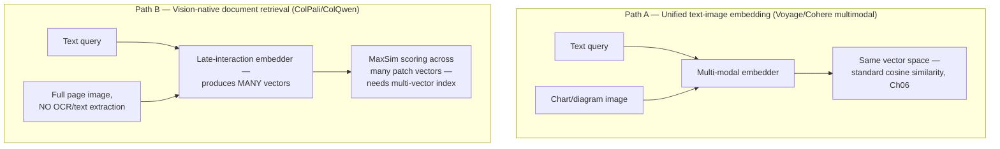
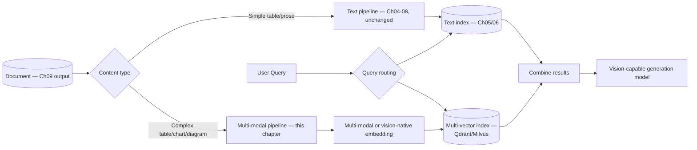
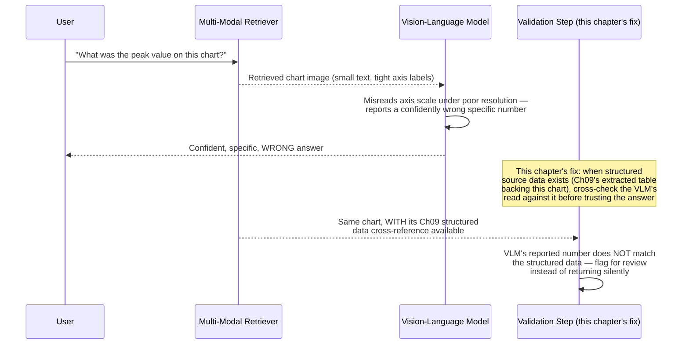
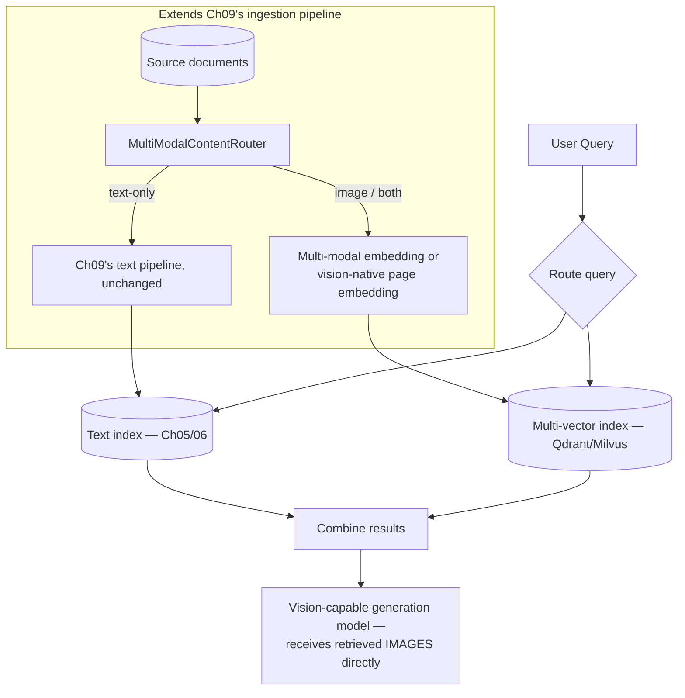
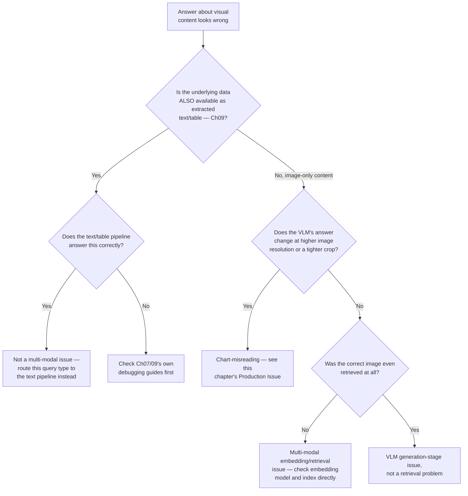

# Chapter 10 — Multi-Modal RAG

> "Flattening a chart to a text caption throws away exactly the information a chart exists to convey: the shape of the data, not just a sentence describing it."

**Learning Objectives**

By the end of this chapter, you will be able to:

- Explain precisely what a chart, diagram, or complex table layout loses when it's flattened to text — and why that loss is sometimes acceptable and sometimes isn't.
- Use a multi-modal embedding model to retrieve images and diagrams directly, without an intermediate text-captioning step.
- Implement vision-native document retrieval (ColPali/ColQwen-style late interaction) that embeds a page image directly, skipping OCR entirely.
- Decide, for a given table or figure, whether to represent it as text (Ch09), as an image, or both — and justify that decision against your own corpus, not a default assumption.
- Pass retrieved images to a vision-capable generation model correctly, and reason about the cost and context-window implications of doing so.
- Reproduce a documented VLM chart-misreading failure (axis/legend misinterpretation) directly, so its risk is demonstrated, not just asserted.
- Recognize when a retrieval failure that looks "visual" is actually an ordinary chunking or hybrid-search problem in disguise — and avoid reaching for multi-modal complexity that doesn't fix the actual issue.
- Choose a multi-modal vector store strategy appropriate to your scale, given which databases currently support multi-vector/late-interaction indexing natively.

**Prerequisites**

- Chapters 01–09 completed — this chapter extends Chapter 09's structured-document handling to genuinely visual content (charts, diagrams, and complex table layouts), and reuses Chapters 05–08's retrieval stack unchanged.
- `pip install pillow` plus an API key for at least one multi-modal embedding provider (Voyage AI or Cohere) and one vision-capable generation model.
- Comfortable Python; no new math beyond Chapter 06's vector search concepts, applied to a different kind of vector.

**Estimated Reading Time:** 70–80 minutes
**Estimated Hands-on Time:** 4–5 hours

---

## ⚡ Fast Read

> **Skim time: 5 minutes** — Read this if you're in a hurry, returning for reference, or already familiar with part of this topic.

- **What it is:** Retrieving and reasoning over images, charts, diagrams, and visually complex tables directly — using multi-modal embeddings and vision-native retrieval — rather than forcing every document into text first.
- **Why it matters:** Chapter 09 fixed table-as-text extraction; but some visual content genuinely loses meaning when flattened to text no matter how carefully it's done — a chart's *shape*, a diagram's *spatial layout*, a table's merged-cell structure. This chapter handles the content Chapter 09's best text representation still can't fully capture.
- **Key insight:** Multi-modal retrieval is a genuine capability upgrade, not a universal upgrade — several current studies find that many RAG systems that seem to be "failing on visual content" are actually failing on ordinary chunking or hybrid-search bugs that Chapters 03–09 already fix. Reach for multi-modal complexity only after ruling that out on your own corpus.
- **What you build:** A multi-modal retriever using a current unified text-image embedding model, a vision-native document retriever (ColPali/ColQwen-style) that embeds page images directly, and a demonstrated VLM chart-misreading failure case with a validation pattern to catch it.
- **Jump to:** [Core Concepts](#core-concepts) | [First Code](#beginner-implementation) | [Best Practices](#best-practices) | [Mini Project](#mini-project)

---

## Why This Topic Exists

Chapter 09 solved the table problem for the common case: extract the table's structure correctly, represent it as Markdown, chunk it without splitting rows, and it flows through the existing retrieval stack fine. But some visual content resists this fix no matter how carefully it's applied. A chart's entire point is to convey a *shape* — a trend, a distribution, a comparison — visually; converting it to a text caption ("sales increased from January to March, then declined") necessarily discards the actual data points, the precise shape of the curve, anything a viewer might have noticed that the caption's author didn't think to mention. A table with merged header cells, nested column groups, or an unusual visual layout can lose meaning in Markdown conversion in ways a simple row/column table doesn't. A technical diagram — a circuit schematic, an architecture diagram, a flowchart — often has no reasonable text representation at all.

This chapter is where this course adds a genuinely different retrieval modality: instead of converting everything to text and using Chapters 05–08's text-based retrieval stack, multi-modal RAG retrieves directly against images — either by embedding an image and text into the same vector space (so a text query can find a relevant image), or, more radically, by embedding a document's page as an image directly and skipping text extraction entirely. Both are real, current production techniques. Neither replaces Chapter 09's text-based pipeline — they extend it, for the specific subset of content where text genuinely loses too much.

---

## Real-World Analogy

**The Difference Between a Weather Report and a Weather Map**

A meteorologist can describe tomorrow's weather in words: "a cold front moves through the region from the northwest, bringing scattered showers by afternoon." That description is genuinely useful, and for many purposes, entirely sufficient — Chapter 09's text-based table extraction is exactly this kind of useful, sufficient description for most tables.

But hand a pilot planning a flight path the *actual weather map* instead — the satellite image showing the precise shape and speed of that front, the exact regions of cloud cover, the visual texture that reveals turbulence patterns a verbal summary would never think to mention — and the pilot gets something the paragraph fundamentally couldn't contain, no matter how well-written. Neither the paragraph nor the map is "better" in general; they're suited to different needs. Multi-modal RAG is building the pipeline that can hand over the actual map when the paragraph won't do — while keeping the paragraph (Chapter 09's text representation) as the default for everything that doesn't need it.

---

## Core Concepts

### Multi-Modal Embedding

- **Technical definition:** An embedding model trained to map both images and text into the same shared vector space, so a text query's embedding and a relevant image's embedding land close together — enabling cross-modal retrieval (text query → image result, or vice versa) using the same similarity search machinery Chapter 06 already built.
- **Simple definition:** An embedding model that understands pictures and words well enough to know when a picture and a sentence are "about the same thing," and places them near each other in the same vector space.
- **Analogy:** A bilingual translator who doesn't just convert word-for-word, but truly understands both languages well enough to recognize when a phrase in one and a phrase in the other mean the same thing — except here, the "two languages" are images and text.

### Vision-Native Document Retrieval (ColPali / Late Interaction)

- **Technical definition:** A retrieval approach that embeds an entire document page as an image directly — using a vision-language model to produce multiple patch-level embedding vectors per page — and scores query-page relevance via a late-interaction mechanism (comparing many query token embeddings against many page patch embeddings, taking the best match per query token), entirely skipping OCR or text extraction.
- **Simple definition:** Instead of first extracting text from a page and then searching that text, treat the whole page as a picture and search directly against the picture — no OCR step, no text-extraction failure mode, ever.
- **Analogy:** Recognizing a friend's face directly in a photograph, rather than first describing the photograph in words to someone else and having them guess who it is from your description — skipping the lossy "convert to words first" step entirely.

### Table-as-Image vs. Table-as-Text

- **Technical definition:** The choice, for a given extracted table, between Chapter 09's text/Markdown representation (efficient, works well with existing sparse and dense retrieval) and preserving the table as an image for multi-modal retrieval (preserves visual layout, merged cells, and spatial structure that flattening can lose) — commonly implemented as indexing *both* representations rather than choosing exclusively.
- **Simple definition:** Keep the clean, readable text version of a simple table (Chapter 09), but for a genuinely complex or visually unusual table, also keep the picture of it — and index both.
- **Analogy:** Keeping both a transcript and the original audio recording of an important meeting — the transcript is more searchable day-to-day, but the recording preserves tone and detail the transcript can't fully capture.

### VLM Chart/Diagram Understanding

- **Technical definition:** Using a vision-language model, at either ingestion time (to generate a text description for embedding) or query time (to read and reason about a retrieved chart image directly), to answer questions about visual data representations — distinct from, and complementary to, direct multi-modal embedding.
- **Simple definition:** Having a vision-capable model actually look at a chart and describe or answer questions about it, rather than relying only on whatever caption or nearby text happened to be extracted.
- **Analogy:** Asking a colleague who's actually looked at the chart to explain a specific data point to you, rather than relying only on a report's summary paragraph that was written without that specific question in mind.

### Multi-Vector / Late Interaction Indexing

- **Technical definition:** A vector index structure that stores multiple embedding vectors per document (rather than one), and scores a query against a document by comparing sets of vectors (e.g., via MaxSim, taking the best-matching document vector for each query vector and summing) — the indexing structure vision-native document retrieval requires, since it produces many patch-level vectors per page rather than one page-level vector.
- **Simple definition:** A vector database feature that lets one document be represented by *many* vectors instead of just one, needed because vision-native retrieval produces dozens of small vectors per page instead of a single summary vector.
- **Analogy:** Judging a book not by one single summary sentence, but by comparing a reader's specific question against every individual paragraph of the book and taking whichever paragraph matches best — a much richer, but much more expensive, comparison than judging by the book's one-line blurb.

---

## Architecture Diagrams

### Diagram 1 — Two Multi-Modal Retrieval Paths, Side by Side



### Diagram 2 — Multi-Modal Retrieval in the Full Pipeline



---

## Flow Diagrams

### A VLM Chart-Misreading Failure, Reproduced



---

## Beginner Implementation

We start with the simpler of the two paths: a unified multi-modal embedding model, used to retrieve an image directly from a text query — no vision-native late interaction yet, just Chapter 06's existing similarity search applied to a different kind of embedding.

```python
# Learning example — beginner_multimodal_embedding.py
# Uses a multi-modal embedding API to embed both a text query and an
# image into the SAME vector space, then retrieves via plain cosine
# similarity — the exact same operation as Ch06's DenseRetriever,
# just with a different embedding model producing the vectors.

import voyageai
import numpy as np
from PIL import Image

client = voyageai.Client()

def embed_text(texts: list[str]) -> np.ndarray:
    result = client.multimodal_embed(inputs=[[t] for t in texts], model="voyage-multimodal-3.5")
    return np.array(result.embeddings)

def embed_images(image_paths: list[str]) -> np.ndarray:
    images = [Image.open(p) for p in image_paths]
    result = client.multimodal_embed(inputs=[[img] for img in images], model="voyage-multimodal-3.5")
    return np.array(result.embeddings)

def cosine_similarity(a: np.ndarray, b: np.ndarray) -> float:
    return float(np.dot(a, b) / (np.linalg.norm(a) * np.linalg.norm(b)))

if __name__ == "__main__":
    query = "chart showing quarterly revenue growth"
    query_vec = embed_text([query])[0]

    # In a real pipeline these would be actual chart images extracted
    # from your corpus's documents; paths are illustrative here.
    image_paths = ["revenue_chart.png", "org_chart.png", "network_diagram.png"]
    image_vecs = embed_images(image_paths)

    scores = [(path, cosine_similarity(query_vec, vec)) for path, vec in zip(image_paths, image_vecs)]
    scores.sort(key=lambda x: -x[1])
    print("Text-to-image retrieval ranking:")
    for path, score in scores:
        print(f"  {score:.4f}  {path}")
```

**Walking through what's actually happening:**

- `embed_text` and `embed_images` call the exact same underlying model, `voyage-multimodal-3.5` — this is the entire point of a unified multi-modal embedding model: text and images aren't handled by two separate systems bolted together, they're two inputs to the same model, producing vectors that are directly comparable.
- `cosine_similarity` is identical to Chapter 06's dense retrieval comparison — nothing about the *comparison* changes when the vectors happen to represent an image instead of text; only the embedding model producing them is different.
- This is the simplest possible multi-modal retrieval path, and it's often sufficient: for a corpus where images are a small fraction of the content and mostly stand-alone (photographs, simple diagrams), this text-to-image path covers real query patterns without needing vision-native late interaction at all.

---

## Intermediate Implementation

Now vision-native document retrieval — the ColPali/ColQwen-style approach that embeds an entire page as an image directly, producing many patch-level vectors instead of one, and reproduces the VLM chart-misreading failure this chapter's Flow Diagram illustrates.

```python
# Learning example — intermediate_vision_native_retrieval.py
# Vision-native page retrieval using late interaction (ColQwen-style),
# plus a direct reproduction of VLM chart-misreading.

from colpali_engine.models import ColQwen2, ColQwen2Processor
import torch
from PIL import Image

model = ColQwen2.from_pretrained("vidore/colqwen2-v1.0", torch_dtype=torch.bfloat16)
processor = ColQwen2Processor.from_pretrained("vidore/colqwen2-v1.0")

def embed_page_images(page_images: list[Image.Image]) -> list[torch.Tensor]:
    """
    Unlike Ch06's dense embeddings (one vector per chunk) or even the
    Beginner Implementation's multimodal embed (one vector per image),
    this produces MANY vectors per page — one per image patch — which
    is exactly why this needs a multi-vector index (Qdrant/Milvus), not
    a plain single-vector index like pgvector.
    """
    batch = processor.process_images(page_images)
    with torch.no_grad():
        embeddings = model(**batch)  # shape: (num_pages, num_patches, embedding_dim)
    return list(embeddings)

def max_sim_score(query_embeddings: torch.Tensor, page_embeddings: torch.Tensor) -> float:
    """
    MaxSim: for each query token vector, find its single best-matching
    page patch vector, then sum those best-matches across all query
    tokens. This is what "late interaction" means — comparison happens
    AFTER both sides are embedded, at the individual-vector level, not
    by collapsing everything to one vector first.
    """
    similarity_matrix = torch.matmul(query_embeddings, page_embeddings.T)  # (num_query_tokens, num_patches)
    best_match_per_query_token = similarity_matrix.max(dim=1).values
    return float(best_match_per_query_token.sum())

def demonstrate_chart_misreading(vlm_client, chart_image_path: str, ground_truth_peak_value: float) -> None:
    """
    Reproduces this chapter's central failure mode directly: a VLM
    asked to read a specific number off a chart image can misread the
    axis scale or legend, especially at low resolution or with tightly-
    packed labels, and report a confident, specific, WRONG number.
    """
    from anthropic import Anthropic
    response = vlm_client.messages.create(
        model="claude-sonnet-5", max_tokens=100,
        messages=[{
            "role": "user",
            "content": [
                {"type": "image", "source": {"type": "base64", "media_type": "image/png",
                                              "data": _load_base64(chart_image_path)}},
                {"type": "text", "text": "What was the peak value shown on this chart? Answer with just the number."},
            ],
        }],
    )
    vlm_reported_value = response.content[0].text.strip()
    print(f"VLM reported: {vlm_reported_value}")
    print(f"Ground truth: {ground_truth_peak_value}")
    # THE VALIDATION THIS CHAPTER RECOMMENDS: cross-check the VLM's
    # reading against structured source data when it exists (e.g., Ch09's
    # extracted table backing this same chart), rather than trusting a
    # vision-only read of a chart at face value for a fact-bound number.

def _load_base64(path: str) -> str:
    import base64
    with open(path, "rb") as f:
        return base64.b64encode(f.read()).decode()
```

**What changed, and why each change matters:**

1. **`embed_page_images` produces a tensor of shape `(num_pages, num_patches, embedding_dim)`, not `(num_pages, embedding_dim)`** — this single shape difference is the entire reason vision-native retrieval needs a fundamentally different indexing strategy than everything built in Chapters 05–09. There is no single vector per page to drop into a plain HNSW index the way Chapter 06 did.
2. **`max_sim_score` is doing something structurally different from Chapter 06's cosine similarity** — instead of one comparison between two vectors, it's dozens of comparisons (one per query token) each independently finding its own best match somewhere on the page, then summing. This is far more expensive per comparison, but dramatically more precise — it can recognize that a specific query term matches a specific small region of the page, something a single page-level vector could never represent.
3. **`demonstrate_chart_misreading` exists to make this chapter's risk visible, not just asserted.** Run it against a chart with a known peak value and tightly-packed axis labels, and it's a documented, common failure for the VLM to misread the scale — reporting a plausible-looking but wrong number, with exactly the same unwarranted confidence Chapter 08's HyDE failure demonstrated for hallucinated hypothetical documents.
4. **The validation pattern in the comment is this chapter's actual fix, not an afterthought**: when a chart has backing structured data (e.g., the same table Chapter 09's pipeline already extracted as text), cross-checking the VLM's visual read against that structured source is a concrete, checkable way to catch this exact failure before it reaches a user.

---

## Advanced Implementation

Production multi-modal RAG means routing each piece of content to the representation (or representations) it actually needs, indexing vision-native embeddings in a multi-vector-capable store, and passing retrieved images to a vision-capable generator — while keeping Chapter 09's text pipeline as the default for everything that doesn't require this added complexity.

```python
# Production example — advanced_multimodal_pipeline.py
# Routes content to text-only, multi-modal, or BOTH representations,
# indexes vision-native embeddings via Qdrant's native multi-vector
# support, and produces Chunk objects compatible with the existing
# Ch05-08 retrieval stack for the text path.

from __future__ import annotations
from dataclasses import dataclass, field
from qdrant_client import QdrantClient
from qdrant_client.models import VectorParams, Distance, MultiVectorConfig, MultiVectorComparator

@dataclass
class Chunk:
    chunk_id: str
    text: str
    source: str
    score: float = 0.0
    element_type: str = "text"       # from Ch09: "text", "table", "key_value"
    modality: str = "text"           # NEW in this chapter: "text", "image", or "both"
    metadata: dict = field(default_factory=dict)

class MultiModalContentRouter:
    """Decides, per piece of content, whether it needs text-only,
    multi-modal, or both representations — the direct code
    implementation of this chapter's core decision, and the reason this
    chapter is additive to Ch09's pipeline rather than a replacement."""

    def route(self, element) -> list[str]:
        if element.element_type == "table" and not element.has_complex_layout:
            return ["text"]  # Ch09's Markdown representation is sufficient
        if element.element_type in ("chart", "diagram"):
            return ["image"]  # no reasonable text representation exists
        if element.element_type == "table" and element.has_complex_layout:
            return ["text", "image"]  # index BOTH — Ch09's text for search, image for visual fidelity
        return ["text"]

class QdrantMultiVectorStore:
    """Native multi-vector support (Qdrant/Milvus both offer this) is
    what makes storing ColQwen-style late-interaction embeddings
    practical — pgvector has no equivalent primitive as of this
    writing, which is exactly why this chapter's vision-native path
    requires a different store than Ch06's DenseRetriever used."""

    def __init__(self, client: QdrantClient, collection_name: str = "page_images"):
        self.client = client
        self.collection_name = collection_name
        self.client.create_collection(
            collection_name=collection_name,
            vectors_config=VectorParams(
                size=128,  # per-patch embedding dimension, model-dependent
                distance=Distance.COSINE,
                multivector_config=MultiVectorConfig(comparator=MultiVectorComparator.MAX_SIM),
            ),
        )

    def index_page(self, page_id: str, patch_embeddings: list[list[float]], source: str) -> None:
        self.client.upsert(collection_name=self.collection_name, points=[{
            "id": page_id,
            "vector": patch_embeddings,  # a LIST of vectors, not one — the multi-vector shape
            "payload": {"source": source},
        }])

    def search(self, query_embeddings: list[list[float]], k: int) -> list[dict]:
        # Qdrant applies MaxSim scoring natively, server-side — no need
        # to reimplement the scoring loop from the Intermediate
        # Implementation's max_sim_score by hand in application code.
        results = self.client.query_points(
            collection_name=self.collection_name, query=query_embeddings, limit=k,
        )
        return [{"page_id": r.id, "score": r.score, "source": r.payload["source"]} for r in results.points]
```

**Why this shape earns its complexity:**

- **`MultiModalContentRouter` is the code-level answer to this chapter's central judgment call** — most content stays on Chapter 09's text pipeline unchanged; only content that genuinely needs it gets routed to the more expensive multi-modal path. This is a deliberate rejection of "embed everything as an image, just in case" — that approach pays vision-native retrieval's storage and compute cost (materially higher per page than text embeddings) for content that never needed it.
- **`QdrantMultiVectorStore` uses Qdrant's native `MultiVectorConfig`**, not a hand-rolled workaround — this is a direct consequence of this chapter's Core Concepts: vision-native retrieval fundamentally needs a store that can hold and score multiple vectors per document, which pgvector (Chapter 06's default) does not currently support natively.
- **`Chunk` gains a `modality` field**, following the same explicit-schema-addition discipline Chapter 07 (`chunk_id`) and Chapter 09 (`element_type`) both established — new plumbing, called out directly, not silently retrofitted.
- **Nothing about Chapters 05–08's retrieval stack changes for the text path** — this pipeline runs alongside it, not instead of it, exactly as Chapter 09's structured-document handling did.

> **Currency Note:** Multi-modal RAG tooling moves quickly, and several specifics here were verified only as of mid-2026: Voyage AI's `voyage-multimodal-3.5` (32K context, added native video support) and Cohere's `Embed v4` are current leading unified text-image embedding options; ColPali's successor, ColQwen2/ColQwen2.5, is the current recommended starting point for vision-native document retrieval, with Qdrant and Milvus both offering native multi-vector/MaxSim support (pgvector does not, as of this writing). Vision-capable generation models and their exact context/pricing figures change on a similarly fast timescale — confirm current model IDs and image-token pricing directly before a production decision. What's stable: the underlying distinction between unified multi-modal embedding and vision-native late interaction, and the reasoning for when each is worth its added cost — neither depends on which specific model tops a benchmark this quarter. Also worth stating plainly, because multiple current sources make the same point: **several published 2026 case studies found that RAG systems believed to be failing on "visual blindness" were actually failing on ordinary chunking or hybrid-search problems already fixed by Chapters 03–09** — rule those out on your own corpus before investing in multi-modal infrastructure.

---

## Production Architecture



The core architectural point, echoing Chapter 09: **multi-modal handling is additive, not a replacement.** The large majority of most corpora's content never leaves Chapter 05–08's existing text retrieval stack; multi-modal infrastructure is reserved specifically for the subset of content this chapter's routing logic identifies as genuinely needing it.

---

## Best Practices

1. **Rule out an ordinary chunking or hybrid-search bug before adding multi-modal infrastructure.** Several current 2026 case studies found "visual blindness" complaints were actually Chapter 03–09 problems — validate against your own corpus first.
2. **Route content deliberately, not uniformly** — most tables and figures are well served by Chapter 09's text pipeline; reserve vision-native retrieval for content that genuinely loses meaning as text.
3. **Index both text and image representations for genuinely complex tables**, rather than choosing exclusively — Chapter 09's text representation remains valuable for exact-term search even when a visual representation is also kept.
4. **Never trust a VLM's read of a specific number off a chart without cross-checking against structured source data when it exists** — this chapter's chart-misreading failure is real and reproducible; a chart's backing table (if extracted per Chapter 09) is a checkable ground truth.
5. **Choose a vector store with native multi-vector support before committing to vision-native retrieval** — pgvector's lack of this primitive (as of this writing) makes it the wrong default for a ColQwen-style pipeline, unlike its strong fit for Chapter 06's plain dense retrieval.
6. **Budget for vision-native retrieval's real storage cost** — patch-level embeddings for an entire page consume meaningfully more storage per document than a single text chunk's embedding; validate this cost against your actual corpus size before committing.
7. **Pin multi-modal embedding and VLM model versions explicitly**, exactly as Chapter 04 pinned embedding models — this space moves quickly, and a silent model change can shift both retrieval and generation behavior.
8. **Build a small, chart/diagram-specific evaluation set** (Chapter 12 formalizes this) before scaling multi-modal retrieval — general text-retrieval evaluation metrics don't capture whether a VLM is reading a chart's axis correctly.

---

## Security Considerations

- **Visual prompt injection.** A chart or diagram image can, in principle, contain embedded text designed to manipulate a VLM reading it during generation — a visual analogue of Chapter 08's document-content prompt-injection risk, now via an image rather than plain text. The same content-sanitization discipline (validating retrieved content before it reaches a generation call) applies here, just extended to images.
- **Data exposure through multi-modal embedding APIs.** Sending a corpus's images (which may contain sensitive diagrams, proprietary technical drawings, or regulated visual content) to a third-party multi-modal embedding API carries the same data-residency consideration Chapter 09 raised for document-parsing APIs — confirm data handling terms before routing sensitive visual content through a hosted embedding service.

---

## Cost Considerations

| Approach | Cost model | Notes |
|---|---|---|
| Unified multi-modal embedding (Voyage/Cohere) | Per-image/per-pixel pricing, tiered by resolution | Meaningfully cheaper and simpler than vision-native retrieval; sufficient for many corpora |
| Vision-native retrieval (ColPali/ColQwen) | Self-hosted compute (model inference) + multi-vector index storage | Storage cost is real and material — patch-level embeddings per page consume far more space than a single chunk vector |
| VLM-based chart/diagram reading at query time | Per-call vision-capable LLM API cost | Only paid when a chart/diagram-specific query actually needs it — not a bulk ingestion-time cost |
| Indexing both text and image representations for complex tables | Sum of Ch09's text cost plus this chapter's image cost | Justified only for tables that genuinely need the visual representation — not a default for every table |

The overall shape worth internalizing: **most of a real corpus's content should never touch this chapter's cost model at all** — the `MultiModalContentRouter`'s entire job is keeping that true, by routing only genuinely visual content down the more expensive path.

---

## Production Issue: Chart Data Misread by a Vision-Language Model

**Symptoms**
A user asks a specific, numeric question about a chart or graph in the corpus ("what was the peak value in Q3?"), and the assistant answers confidently with a specific number — which turns out to be wrong when checked against the chart's actual underlying data. The error is often subtle: close to the real value, or attributable to a plausible misreading of the axis scale, rather than an obviously nonsensical answer.

**Root Cause**
The vision-language model reading the chart image misinterpreted the axis scale, legend, or label positioning — a well-documented VLM failure mode, especially under low image resolution, tightly-packed axis labels, or unusual chart formatting. The model produces a confident, specific-sounding answer because that's what it was asked for, with no built-in signal that its visual read might be wrong.

**How to Diagnose It**
1. Retrieve the exact chart image the answer was generated from, and manually verify the correct value against it directly.
2. Check whether the chart has backing structured data available (e.g., a Chapter 09-extracted table for the same underlying data) — if so, compare the VLM's reported value against that structured source directly.
3. Test the same chart image at a different resolution or crop — if the VLM's answer changes noticeably, this confirms resolution/legibility as a contributing factor.

**How to Fix It**
```python
# Wrong: trusting the VLM's chart read directly, with no cross-check
answer = vlm_client.ask_about_chart(chart_image, question)

# Right: when structured source data exists, cross-check the VLM's
# answer against it before returning a result with high confidence
structured_value = get_backing_table_value(chart_id, requested_field)
vlm_answer = vlm_client.ask_about_chart(chart_image, question)
if structured_value is not None and not values_approximately_match(vlm_answer, structured_value):
    flag_for_human_review(chart_id, vlm_answer, structured_value)
else:
    answer = vlm_answer
```

**How to Prevent It in Future**
Wherever a chart has backing structured data (common when the chart was generated from a table Chapter 09's pipeline already extracted), treat that structured data as the source of truth for fact-bound numeric questions, using the VLM's visual read only when no structured alternative exists — or as a secondary check, not the primary answer path. Chapter 13 formalizes this pattern as part of trustworthy RAG's broader grounding discipline.

---

## Common Mistakes

**Mistake 1 — Applying multi-modal retrieval uniformly to every table and figure.**
```python
# Wrong: every table gets the expensive vision-native treatment,
# regardless of whether it actually needs it
for table in all_tables:
    index_as_vision_native(table)

# Right: route deliberately — most tables stay on Ch09's text pipeline
for element in all_elements:
    representations = content_router.route(element)
    if "text" in representations:
        index_text(element)
    if "image" in representations:
        index_vision_native(element)
```

**Mistake 2 — Trusting a VLM's chart read as ground truth with no cross-check.**
```python
# Wrong: no validation against any available structured source
answer = vlm_client.ask_about_chart(chart_image, "what's the peak value?")

# Right: cross-check against backing structured data when it exists
# (this chapter's Production Issue fix)
if backing_table_exists(chart_id):
    answer = validate_against_structured_data(vlm_answer, chart_id)
```

**Mistake 3 — Assuming a "visual blindness" complaint requires multi-modal infrastructure without ruling out ordinary retrieval bugs first.**
```python
# Wrong: jumping straight to building a vision-native pipeline because
# a user complained the assistant "can't see" a chart's data
build_vision_native_pipeline()

# Right: first confirm the underlying text/table extraction (Ch09) and
# hybrid retrieval (Ch07) are actually working correctly for this content
diagnose_with_ch09_debugging_guide()
diagnose_with_ch07_debugging_guide()
# only THEN consider multi-modal infrastructure if those check out
```

**Mistake 4 — Using a single-vector index for vision-native (late interaction) embeddings.**
```python
# Wrong: averaging or pooling patch-level embeddings into one vector to
# fit a plain single-vector index — destroys the fine-grained matching
# that makes late interaction valuable in the first place
page_vector = patch_embeddings.mean(dim=0)
pgvector_index.insert(page_vector)

# Right: use a store with native multi-vector support, preserving all
# patch-level vectors and their MaxSim scoring
qdrant_multi_vector_store.index_page(page_id, patch_embeddings, source)
```

**Mistake 5 — Ignoring vision-native retrieval's real storage cost until it's a production surprise.**
```python
# Wrong: no capacity planning before committing to vision-native
# retrieval at full corpus scale
migrate_entire_corpus_to_vision_native()

# Right: measure per-page storage cost on a representative sample first,
# and project it against your actual corpus size
sample_storage_cost = measure_patch_embedding_storage(sample_pages)
projected_total = sample_storage_cost * total_corpus_page_count
```

---

## Debugging Guide



| Symptom | Likely cause | First thing to check |
|---|---|---|
| Wrong specific number from a chart | VLM misread axis/legend | Compare against backing structured data if it exists |
| "Can't find" a diagram that's clearly in the corpus | Multi-modal embedding/index issue, or content never routed to the image path | Confirm the content was actually indexed via `MultiModalContentRouter` |
| Answer changes noticeably at different image resolution | Confirms VLM legibility as a contributing factor | Re-test at multiple resolutions/crops before concluding it's a retrieval bug |
| Vision-native retrieval seems to return irrelevant pages | Late-interaction scoring or embedding quality issue | Compare against a known-good query/page pair; validate MaxSim scoring directly |
| Storage or query cost far higher than expected | Multi-modal routing applied too broadly | Audit what fraction of content is actually routed to the image path |

---

## Performance Optimisation

| Technique | What it improves | Illustrative trade-off | Notes |
|---|---|---|---|
| Deliberate content routing (not uniform multi-modal indexing) | Storage and compute cost | Requires classification logic per element, but avoids paying vision-native cost for content that doesn't need it | The single highest-leverage cost control in this chapter |
| Cross-checking VLM chart reads against structured data | Accuracy on fact-bound visual questions | Requires the chart to have a backing structured source (Ch09) | Not available for every chart — only where source data was extracted |
| Native multi-vector store (Qdrant/Milvus) over a workaround | Retrieval quality for vision-native embeddings | Requires standardizing on a store that supports this primitive | pgvector does not currently offer an equivalent |
| Unified multi-modal embedding over vision-native retrieval, when sufficient | Cost and simplicity | Loses some visual fidelity (whole-page structure) that late interaction preserves | Validate against your own corpus whether the simpler path is actually sufficient before adopting the more expensive one |

*As with prior chapters, validate against your own corpus and evaluation harness (Chapter 12) rather than assuming these figures transfer directly.

---

## Decision Framework — Choosing a Multi-Modal Strategy

| Situation | Recommendation |
|---|---|
| Corpus has few images, mostly stand-alone photos/simple diagrams | Unified multi-modal embedding (Voyage/Cohere) is likely sufficient |
| Corpus has complex tables with merged cells or unusual visual layout | Index both text (Ch09) and image representations |
| Corpus has charts/graphs where exact data values matter | Prefer cross-checking against backing structured data over trusting a VLM's visual read alone |
| Documents are dense, complex, hard to parse reliably as text at all | Vision-native retrieval (ColQwen-style) may outperform text extraction entirely |
| A "visual blindness" complaint hasn't been validated against Ch03-09's existing pipeline | Diagnose the existing pipeline first — don't assume multi-modal infrastructure is the fix |
| Already standardized on pgvector | Note it lacks native multi-vector support — factor this into any vision-native retrieval decision |

---

## Interview Questions

1. **"What does a chart lose when it's flattened to a text caption, and why does that sometimes matter?"** — Expect: the actual shape/precise values of the data, which matters for fact-bound or trend-sensitive questions but not for general-gist questions.
2. **"What's the structural difference between unified multi-modal embedding and vision-native late interaction retrieval?"** — Expect: unified embedding produces one vector per image/text input, comparable via plain cosine similarity; late interaction produces many patch-level vectors per page, scored via MaxSim, requiring a multi-vector-capable index.
3. **"Why might a RAG system that seems to be failing on visual content actually have an ordinary chunking bug instead?"** — Expect: several documented 2026 case studies found "visual blindness" complaints traced back to Chapter 03-09-level chunking or hybrid-search problems, not genuine visual retrieval failures.
4. **"How would you validate a VLM's read of a specific numeric value on a chart?"** — Expect: cross-check against backing structured source data when it exists (e.g., the table the chart was generated from), rather than trusting the visual read alone.
5. **"Why doesn't pgvector work well for vision-native (ColPali-style) retrieval?"** — Expect: it lacks native multi-vector/late-interaction indexing support, which vision-native retrieval structurally requires given its many-vectors-per-page output.
6. **"When would you index both a text and an image representation of the same table?"** — Expect: when the table has a complex or unusual visual layout (merged cells, nested headers) where flattening to text loses meaningful structure, while still wanting text-based searchability.

---

## Exercises

1. **(20 min)** Run this chapter's `embed_text`/`embed_images` functions on a small set of images from your own corpus, and confirm a text query retrieves the semantically-relevant image at the top of the ranking.
2. **(30 min)** Reproduce this chapter's chart-misreading failure directly: find or construct a chart with tightly-packed axis labels, ask a vision-capable model for a specific numeric value, and check it against the chart's actual underlying data.
3. **(30 min)** Implement `MultiModalContentRouter`'s logic against a sample of your own corpus's tables and figures, and manually review whether its routing decisions look correct for each one.
4. **(45 min)** If you have access to Qdrant or Milvus, set up a small multi-vector collection and index a handful of page images using a vision-native embedding model; confirm retrieval returns sensible results for a few test queries.
5. **(60 min, harder)** Take 10 queries from your corpus that reference charts, diagrams, or complex tables. For each, determine whether Chapter 09's existing text pipeline already answers it correctly. Report the fraction where multi-modal retrieval would genuinely add value versus the fraction where an existing pipeline fix would have been sufficient.

---

## Quiz

1. **Why can't every chart be adequately represented as a text caption?**
   *A caption necessarily summarizes; it discards the chart's precise shape, exact data points, and any detail the caption's author didn't think to mention.*
2. **What's the key structural difference in output shape between a unified multi-modal embedding and a vision-native (late interaction) embedding?**
   *Unified embedding produces one vector per input; vision-native embedding produces many patch-level vectors per page.*
3. **What does MaxSim scoring do, and why is it needed for vision-native retrieval?**
   *For each query token vector, it finds the single best-matching page patch vector and sums these best-matches — needed because late interaction compares many vectors on each side, not one.*
4. **Why should multi-modal infrastructure be considered additive rather than a wholesale replacement for the text pipeline?**
   *Most content is well served by the existing text retrieval stack; multi-modal retrieval is reserved for the specific subset of content that genuinely loses meaning as text.*
5. **What's a documented, reproducible VLM failure mode specific to chart reading?**
   *Misreading the axis scale or legend, especially under low resolution or tightly-packed labels, producing a confident but wrong specific number.*
6. **How can this chart-misreading failure be caught before it reaches a user?**
   *Cross-check the VLM's reported value against backing structured source data (e.g., the table the chart was generated from), when such data is available.*
7. **Why might a "visual blindness" complaint about a RAG system actually be a chunking or hybrid-search bug?**
   *Documented 2026 case studies found this pattern repeatedly — the actual root cause was in the existing text pipeline, not a genuine gap in visual retrieval capability.*
8. **Why does vision-native retrieval need a different vector store than Chapter 06's plain dense retriever used?**
   *It requires native multi-vector/late-interaction support (e.g., Qdrant, Milvus), which pgvector does not currently offer.*
9. **When would you choose to index both a text and an image representation of the same table?**
   *When the table has complex visual structure (merged cells, unusual layout) that text flattening loses, while still wanting the searchability text provides.*
10. **What's a realistic security risk specific to images in a multi-modal RAG pipeline?**
    *Visual prompt injection — an image could contain embedded text or visual content designed to manipulate a VLM reading it during generation, analogous to Chapter 08's document-content injection risk.*

---

## Mini Project

**Build:** A multi-modal retrieval extension using unified text-image embedding, applied to your own corpus's images.

**Acceptance criteria:**
- [ ] At least one text query correctly retrieves a relevant image from your corpus using a multi-modal embedding model.
- [ ] `MultiModalContentRouter`'s routing logic is applied to at least 5 real elements from your corpus (tables, charts, diagrams), with routing decisions manually reviewed for correctness.
- [ ] You've reproduced this chapter's chart-misreading failure directly on at least one real or constructed chart image.
- [ ] `Chunk` objects carry a `modality` field, and you can filter results by modality.

**Time estimate:** 2–3 hours.

---

## Production Project

**Build:** Extend the Mini Project into a hybrid text/multi-modal ingestion and retrieval service.

**Acceptance criteria:**
- [ ] Vision-native retrieval (ColPali/ColQwen-style) is implemented for at least a small sample of pages, using a native multi-vector store (Qdrant or Milvus).
- [ ] A cross-check pattern is implemented for at least one chart with backing structured data, confirmed to correctly flag a deliberately-introduced VLM misreading.
- [ ] Storage cost for vision-native embeddings is measured on a representative sample and projected against your full corpus size, with a documented decision on whether it's justified at that scale.
- [ ] At least 10 queries referencing visual content are evaluated against both the existing text pipeline and the new multi-modal path, with results documented on where each wins.
- [ ] A short `RUNBOOK.md` documenting: how to decide whether a document needs multi-modal handling, how to diagnose a chart-misreading failure (referencing this chapter's Debugging Guide), and cost-monitoring guidance for vision-native storage growth.

**Time estimate:** 1–2 days.

---

## Key Takeaways

- Some visual content genuinely loses meaning when flattened to text, no matter how carefully Chapter 09's extraction is done — charts, diagrams, and complex table layouts are the clearest cases.
- Multi-modal retrieval comes in two structurally different forms: unified text-image embedding (one vector per input, plain cosine comparison) and vision-native late interaction (many vectors per page, MaxSim scoring).
- Multi-modal infrastructure is additive, not a replacement — most corpus content should stay on Chapters 05–08's existing text retrieval stack.
- Multiple documented 2026 case studies found "visual blindness" complaints were actually ordinary chunking or hybrid-search bugs — rule those out before investing in multi-modal complexity.
- VLM chart-misreading (wrong axis/legend interpretation) is a real, reproducible failure — cross-checking against backing structured data, when available, is the concrete fix.
- Vision-native retrieval requires a vector store with native multi-vector support (Qdrant, Milvus) — pgvector does not currently offer this, unlike its strong fit for Chapter 06's plain dense retrieval.
- Vision-native retrieval's storage cost is real and materially higher per page than text embeddings — measure it against your actual corpus before committing at scale.
- Indexing both text and image representations of a complex table is a legitimate, common pattern — not an either/or choice.

---

## Chapter Summary

| Concept | Key Takeaway |
|---|---|
| Multi-Modal Embedding | Unified vector space for text and images — one vector per input, standard cosine comparison |
| Vision-Native Document Retrieval | Embeds whole pages as images, many vectors per page, scored via MaxSim late interaction |
| Table-as-Image vs. Table-as-Text | Often both, not either/or — text for search, image for visual fidelity |
| VLM Chart Understanding | Real capability, with a documented, reproducible misreading failure mode requiring validation |
| Multi-Vector Indexing | A distinct index primitive (Qdrant/Milvus) required for vision-native retrieval; pgvector lacks it |
| When NOT to Go Multi-Modal | Rule out ordinary chunking/hybrid-search bugs first — a well-documented false-positive pattern |

---

## Resources

- Faysse et al., ["ColPali: Efficient Document Retrieval with Vision Language Models"](https://arxiv.org/abs/2407.01449) — the original vision-native late-interaction retrieval paper.
- [Voyage AI multimodal embeddings documentation](https://docs.voyageai.com/docs/multimodal-embeddings) and [Cohere Embed v4 documentation](https://docs.cohere.com/docs/multimodal-embeddings) — the unified embedding APIs used in this chapter's Beginner Implementation.
- [Qdrant multi-vector documentation](https://qdrant.tech/documentation/) — native `MultiVectorConfig`/MaxSim support used in this chapter's Advanced Implementation.
- Volume 1, Chapter 09 — RAG fundamentals; Vol 3, Chapter 09 — Structured Documents, the text-based pipeline this chapter extends.

---

## Glossary Terms Introduced

| Term | One-line definition |
|---|---|
| Multi-Modal Embedding | An embedding model mapping both images and text into the same shared vector space |
| Vision-Native Document Retrieval | Embedding a page image directly, skipping OCR/text extraction, via patch-level late interaction |
| Table-as-Image vs. Table-as-Text | The choice (or combination) between text and visual table representations |
| Multi-Vector / Late Interaction Indexing | A vector store primitive holding many vectors per document, scored via MaxSim |
| VLM Chart Understanding | Using a vision-language model to read and reason about chart/diagram images directly |

---

## See Also

| Chapter | Why it's relevant |
|---|---|
| Vol 3, Ch 06 — Dense Retrieval | The single-vector similarity search this chapter's unified embedding path reuses directly |
| Vol 3, Ch 09 — RAG Over Structured and Semi-Structured Documents | The text-based table pipeline this chapter extends, not replaces |
| Vol 3, Ch 11 — Graph RAG and Knowledge Graphs | The other Module 3 extension to the retrieval stack, for cross-document reasoning rather than visual content |
| Vol 3, Ch 12 — RAG Evaluation | The evaluation harness this chapter points to for building a chart/diagram-specific test set |
| Vol 3, Ch 13 — Trustworthy RAG for High-Stakes Domains | Formalizes this chapter's structured-data cross-check pattern as part of broader grounding discipline |

---

## Preparation for Next Chapter

Chapter 11 (Graph RAG and Knowledge Graphs) covers the other major Module 3 extension to this course's retrieval stack — not for visual content, but for questions requiring reasoning across relationships spanning many documents, which pure vector or keyword retrieval structurally struggles with.

**Technical checklist:**
- [ ] Have this chapter's multi-modal routing logic on hand, along with Chapter 09's structured-document pipeline.
- [ ] Note any question from your own corpus that requires connecting information across multiple separate documents (not just finding the single best-matching chunk) — Chapter 11 will show you exactly why this is a different retrieval problem than anything solved so far.

**Conceptual check:**
- If a table's chart and its underlying data are both retrievable, why might a query asking "how does this relate to a table in a completely different document" need something beyond either retrieval path this chapter built?
- Why might a graph-based approach add real value for "how is X connected to Y across many documents" questions, while being unnecessary overhead for simple single-fact lookups?

**Optional challenge:** Find two documents in your own corpus that reference the same entity (a product, a company, a specific term) without directly citing each other. Consider what it would take for a RAG system to correctly connect them in an answer — you'll get the tools for this once Chapter 11 introduces graph-augmented retrieval.
