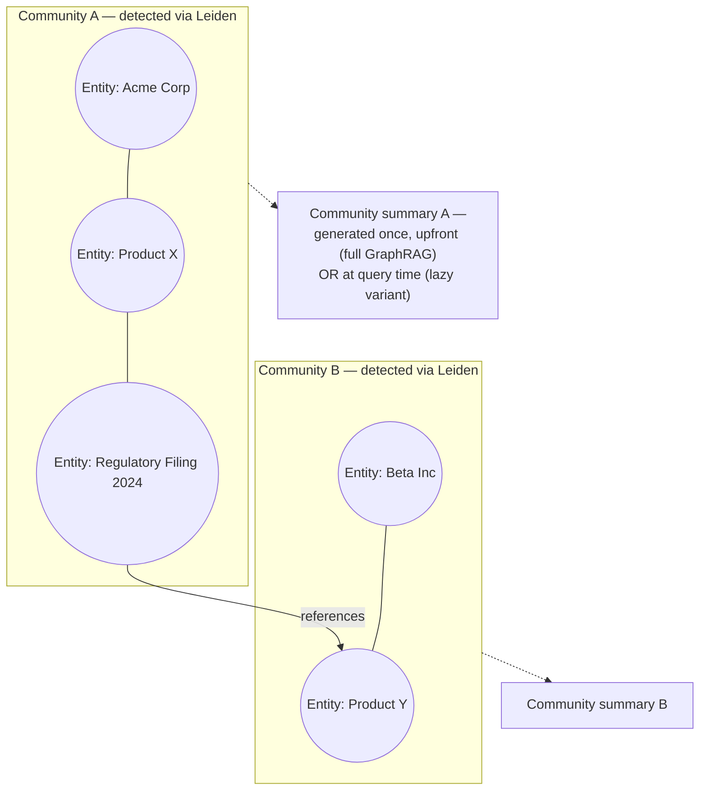
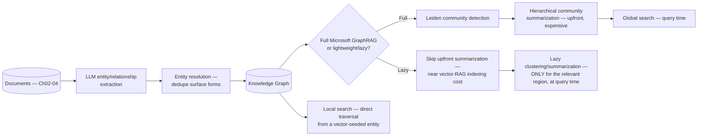
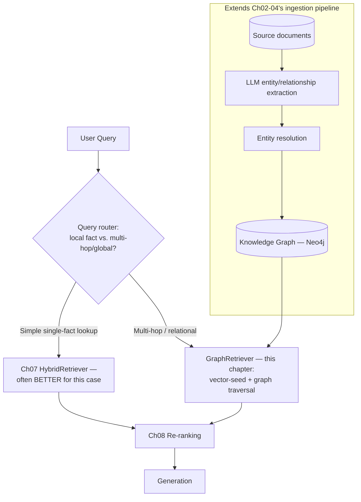

# Chapter 11 — Graph RAG and Knowledge Graphs

> "`grep` finds every file that mentions both names. It cannot tell you how they're connected — and neither can a vector index, for exactly the same underlying reason."

**Learning Objectives**

By the end of this chapter, you will be able to:

- Reproduce, directly, the specific class of question — relationships spanning multiple documents that never cite each other — where Chapters 05–08's retrieval stack structurally cannot find the answer, no matter how it's tuned.
- Extract entities and relationships from a document corpus using LLM-based structured extraction, and build a working knowledge graph from the result.
- Implement entity resolution to catch the same real-world entity appearing under different surface forms, and explain why skipping this step silently breaks graph traversal.
- Apply Leiden community detection to cluster related entities, and explain what hierarchical community summarization buys you — and what it costs.
- Implement a lightweight ("lazy") Graph RAG variant that defers expensive summarization to query time, and justify when this is the better default over Microsoft's original, more expensive approach.
- Build a hybrid retrieval pipeline that uses vector search to find seed entities and graph traversal to expand context from them.
- Choose correctly between graph-based and plain vector-based retrieval for a given query type, using evidence — including cases where graph retrieval measurably underperforms.
- Recognize "retrieval pivot" attacks as a security risk specific to hybrid graph+vector systems, distinct from anything covered in earlier chapters.

**Prerequisites**

- Chapters 01–10 completed — this chapter is the third and final piece of Module 3, extending Chapters 05–08's retrieval stack to cross-document relational reasoning.
- `pip install langchain-experimental neo4j leidenalg python-igraph`, and access to a Neo4j instance (the Advanced Implementation includes a Docker setup).
- Comfortable Python; no new math beyond basic graph concepts (nodes, edges, connected clusters).

**Estimated Reading Time:** 75–85 minutes
**Estimated Hands-on Time:** 4–5 hours

---

## ⚡ Fast Read

> **Skim time: 5 minutes** — Read this if you're in a hurry, returning for reference, or already familiar with part of this topic.

- **What it is:** Building and querying a knowledge graph — entities and their relationships, extracted from your corpus — to answer questions that require connecting facts scattered across many documents, which Chapters 05–08's retrieval stack cannot do by design.
- **Why it matters:** Every retriever built so far finds chunks *relevant to a query*. None of them can answer "how is X connected to Y" when that connection only becomes visible by combining facts from documents that never reference each other directly — that's a fundamentally different retrieval problem, not a tuning issue.
- **Key insight:** Graph RAG is not a strict upgrade over vector retrieval — a rigorous 2026 study found plain vector RAG actually *outperforms* graph-based retrieval by a meaningful margin on simple, single-fact lookup questions. Graph RAG earns its real, substantial cost only on genuinely multi-hop, cross-document, relationship-spanning questions — and the biggest 2025–2026 shift in this space is toward lightweight variants that skip the most expensive part of the original approach entirely.
- **What you build:** A reproduced multi-hop retrieval failure, an LLM-based entity/relationship extraction pipeline with entity resolution, Leiden community detection, and a production hybrid graph+vector retriever implementing Chapter 01's `Retriever` Protocol.
- **Jump to:** [Core Concepts](#core-concepts) | [First Code](#beginner-implementation) | [Best Practices](#best-practices) | [Mini Project](#mini-project)

---

## Why This Topic Exists

Every retrieval technique in this course, from Chapter 05 through Chapter 10, answers a version of the same question: given a query, which existing chunk (or image, or table) is most relevant? That's a genuinely hard problem, and Chapters 05–10 solved it well. But it's structurally the wrong question for a specific, common class of query: "what's the relationship between Entity A and Entity B?" when that relationship is never stated in any single chunk — it only becomes visible by connecting a fact in Document 12 to a fact in Document 47, documents that have no idea the other exists.

No amount of better chunking, better embeddings, better fusion, or better re-ranking fixes this, because the problem isn't retrieval quality — it's that the *answer doesn't live in any one retrievable unit at all*. It lives in the connections between units. This is exactly the kind of question a knowledge graph — entities as nodes, relationships as edges — is built to answer: traverse from Entity A, follow its edges, and see what you reach, regardless of which document originally stated each individual fact.

This chapter also comes with an important, evidence-based caution this course takes seriously: graph-based retrieval is genuinely more expensive to build and maintain than everything in Chapters 05–08, and it is not a universal upgrade. A rigorous comparison on simple factual-lookup questions (Natural Questions) found plain vector retrieval winning by a meaningful margin over graph-based retrieval — the graph's added structure was pure overhead for a question type it wasn't built to help with. This chapter teaches you to build a real, working graph RAG system, and equally, to recognize when *not* to reach for one.

---

## Real-World Analogy

**`grep` vs. the Dependency Graph**

If you've ever asked "what would break if I changed this function?" in a large codebase, you've already lived through this exact distinction. Running `grep -r "functionName"` across the codebase tells you every file that *mentions* the function's name — genuinely useful, and exactly analogous to what Chapters 05–08's retrieval stack does: find every chunk that's textually or semantically relevant to a query.

But `grep` cannot answer "what *transitively* depends on this function" — a function three layers removed, called by something that calls something that calls your function, mentions your function's name nowhere at all. Answering that question requires an actual **dependency graph**: nodes for each function, edges for "calls," built once by actually analyzing the code's structure, then traversed to answer exactly the kind of multi-hop question text search structurally cannot. A knowledge graph for a document corpus is the same idea, applied to entities and relationships extracted from prose instead of function calls extracted from code — and it exists for the exact same reason: some questions require traversing connections, not matching text.

---

## Core Concepts

### Knowledge Graph

- **Technical definition:** A graph data structure representing entities (people, organizations, products, concepts — extracted from a document corpus) as nodes and the relationships between them as labeled, directed edges, enabling traversal-based queries that text or vector search cannot answer directly.
- **Simple definition:** A map of "who/what is connected to who/what, and how" — built from your documents, instead of read directly from a single one.
- **Analogy:** The dependency graph from this chapter's analogy — nodes for functions, edges for "calls," letting you trace transitive relationships no single file's text reveals on its own.

### Entity and Relationship Extraction

- **Technical definition:** The process of identifying named entities and the relationships between them within document text, and outputting them as structured data (entity pairs plus a relationship label) — most commonly done in 2026 via LLM-based structured extraction (prompting an LLM to output entities/relationships via tool-calling against a defined schema) rather than traditional NER-plus-relation-extraction models.
- **Simple definition:** Reading a document and pulling out "X is related to Y in this specific way" as clean, structured facts, instead of leaving that relationship buried in a sentence.
- **Analogy:** A research assistant who reads a stack of reports and, instead of summarizing them separately, produces a clean list of "Company A acquired Company B in 2024" style facts you can actually build a database from.

### Entity Resolution

- **Technical definition:** The process of recognizing that multiple extracted entity mentions — potentially with different surface forms ("Dr. John Smith," "J. Smith," "Smith, John") — refer to the same real-world entity, and merging them into a single graph node before the graph is used for traversal.
- **Simple definition:** Making sure "Dr. John Smith" mentioned in one document and "J. Smith" mentioned in another don't become two separate, disconnected people in your graph when they're actually the same person.
- **Analogy:** A librarian's cataloging system correctly filing a book under one author entry even though the cover credits "J.R.R. Tolkien" and an interview transcript refers to him as "Professor Tolkien" — without this step, the library's own catalog would fracture one author into several unconnected identities.

### Community Detection (Leiden Algorithm)

- **Technical definition:** An algorithm that partitions a graph's nodes into densely-interconnected clusters ("communities") — the Leiden algorithm, a refinement of the earlier Louvain method, guarantees well-connected communities and remains the current standard approach for this step in Graph RAG pipelines.
- **Simple definition:** Automatically grouping your graph's entities into clusters of things that are heavily interconnected with each other — the graph equivalent of noticing which people in a social network form a tight-knit group.
- **Analogy:** Automatically detecting which employees at a large company form a genuinely collaborative team, purely from who works closely with whom, without anyone manually drawing an org chart.

### Community Summarization

- **Technical definition:** Generating a natural-language summary of each detected community (and, in Microsoft's original hierarchical approach, of each level of a multi-level community hierarchy) at indexing time, so a query requiring broad, corpus-wide understanding can be answered by reading summaries instead of traversing the raw graph.
- **Simple definition:** Writing a short "here's what this cluster of entities is generally about" summary for every group the community-detection step found — done once, upfront, so broad questions don't need to re-read the entire graph every time.
- **Analogy:** A company writing one summary memo per department, once, so a "what does the company do overall" question can be answered by reading a handful of memos instead of every individual employee's file.

### Global Search vs. Local Search

- **Technical definition:** Microsoft GraphRAG's two query-time modes: **global search** answers broad, corpus-spanning questions by map-reducing over community summaries; **local search** answers questions about a specific entity by traversing that entity's immediate graph neighborhood directly, without consulting community summaries at all.
- **Simple definition:** Global search is "give me the big picture across everything" (read the department memos); local search is "tell me about this one specific thing and what's directly connected to it" (look up one employee's file and their direct collaborators).
- **Analogy:** Asking "what does this company do overall" (global — read the summaries) versus "who does this specific person report to" (local — look up that one person's direct connections).

### Lightweight / Lazy Graph RAG

- **Technical definition:** A Graph RAG variant (e.g., LazyGraphRAG) that skips or defers the expensive upfront hierarchical community summarization step entirely, performing clustering and summarization only for the specific graph region relevant to a given query, at query time — reducing indexing cost to roughly that of plain vector RAG while aiming to preserve global-search-quality answers.
- **Simple definition:** Instead of writing summary memos for every department up front (expensive, done whether anyone ever asks about that department or not), only write a summary for the specific part of the company someone actually asks about, when they ask.
- **Analogy:** A just-in-time briefing prepared only for the specific department someone actually has a question about, instead of a standing library of department summaries maintained regardless of whether anyone ever reads them.

---

## Architecture Diagrams

### Diagram 1 — Knowledge Graph Structure With Detected Communities



### Diagram 2 — Full Graph RAG Pipeline, With the Lightweight Alternative



---

## Flow Diagrams

### The Multi-Hop Failure, and Graph Retrieval's Fix

```mermaid
sequenceDiagram
    participant U as User
    participant Hybrid as HybridRetriever (Ch07)
    participant Graph as Graph Retriever (this chapter)

    U->>Hybrid: "How does the regulatory filing<br/>affect Beta Inc's Product Y?"
    Hybrid->>Hybrid: Doc 12 mentions Acme's filing;<br/>Doc 47 mentions Beta's Product Y;<br/>NEITHER document mentions the other
    Hybrid-->>U: Retrieves both individually, but<br/>NEITHER chunk states the connection —<br/>answer requires combining them, which<br/>Ch07's fusion cannot do
    U->>Graph: Same question
    Graph->>Graph: Vector search finds seed entity<br/>"Regulatory Filing 2024" (Doc 12)
    Graph->>Graph: Traverse graph edges from that entity —<br/>finds "references" edge to Product Y (Doc 47)
    Graph-->>U: Returns the CONNECTION itself,<br/>not just two separately-relevant chunks
```

---

## Beginner Implementation

We start by reproducing the multi-hop failure directly, then building the simplest possible knowledge graph — LLM-based entity/relationship extraction, held in plain Python data structures, no graph database yet.

```python
# Learning example — beginner_graph_extraction.py
# Reproduces the multi-hop retrieval failure directly, then extracts
# entities and relationships from a small set of documents using
# LLM-based structured extraction (tool-calling), building a graph
# with nothing more than Python dicts.

from anthropic import Anthropic
import json

client = Anthropic()

# Two documents that never reference each other directly — exactly the
# failure case this chapter's Flow Diagram illustrates.
doc_12 = "Acme Corp filed Regulatory Filing 2024-0091, which introduces new labeling requirements for Product X and any products that reference its core formulation."
doc_47 = "Beta Inc's Product Y was developed using licensed technology that references Acme Corp's core Product X formulation under a 2023 licensing agreement."

def extract_entities_and_relationships(text: str, doc_id: str) -> list[dict]:
    """
    Tool-calling/structured-output extraction — the current-standard
    approach (LangChain's LLMGraphTransformer uses the same pattern) —
    over classic NER+relation-extraction models. Each output item is a
    (subject, relationship, object) triple, tagged with its source
    document for provenance (this chapter's Best Practices requires this).
    """
    response = client.messages.create(
        model="claude-sonnet-5", max_tokens=500,
        messages=[{
            "role": "user",
            "content": f"Extract entities and relationships from this text as a JSON "
                       f"list of objects with keys 'subject', 'relationship', 'object'. "
                       f"Only include relationships explicitly stated in the text:\n\n{text}",
        }],
    )
    triples = json.loads(response.content[0].text)
    for triple in triples:
        triple["source_doc"] = doc_id  # provenance — traces every edge back to its source
    return triples

def naive_hybrid_retrieval_fails(query: str, docs: dict[str, str]) -> None:
    """Simulates Ch07's HybridRetriever on this query — both documents
    are individually relevant, but neither states the actual connection
    the query is asking about."""
    print("Naive hybrid retrieval (simulated):")
    for doc_id, text in docs.items():
        print(f"  Retrieved {doc_id}: {text[:80]}...")
    print("  --> Neither chunk states the CONNECTION between them.\n")

if __name__ == "__main__":
    naive_hybrid_retrieval_fails(
        "How does the regulatory filing affect Beta Inc's Product Y?",
        {"doc_12": doc_12, "doc_47": doc_47},
    )

    graph_triples = []
    graph_triples.extend(extract_entities_and_relationships(doc_12, "doc_12"))
    graph_triples.extend(extract_entities_and_relationships(doc_47, "doc_47"))

    print("Extracted graph triples:")
    for triple in graph_triples:
        print(f"  ({triple['subject']}) --[{triple['relationship']}]--> ({triple['object']}) [from {triple['source_doc']}]")
```

**Walking through what's actually happening:**

- `naive_hybrid_retrieval_fails` isn't a bug demonstration in the sense earlier chapters used — Chapter 07's `HybridRetriever` would genuinely retrieve both documents correctly, because both really are relevant to the query. The failure is structural: fusion combines *rankings*, not *facts* — it has no mechanism to notice that Document 12's filing and Document 47's product are connected, because that connection is never stated as text in either one.
- `extract_entities_and_relationships` produces exactly the raw material a graph needs: subject-relationship-object triples, each tagged with its source document. Run it on both documents and look at the output — even at this simple stage, with no graph database involved at all, you can already see the missing link (`Product X` in `doc_12`'s triples, `Product X` referenced again in `doc_47`'s) that a graph traversal would connect directly.
- This is deliberately the simplest possible version — no entity resolution yet (the Intermediate Implementation adds that), no persisted graph store (the Advanced Implementation adds that) — specifically so the core extraction idea is visible without any supporting infrastructure obscuring it.

---

## Intermediate Implementation

Now entity resolution — catching the same real-world entity under different surface forms — and Leiden community detection, applied to a slightly larger extracted graph.

```python
# Learning example — intermediate_entity_resolution.py
# Entity resolution via embedding similarity (catching surface-form
# variants of the same entity), then Leiden community detection on the
# resolved graph.

import numpy as np
import networkx as nx
import leidenalg
import igraph as ig

def resolve_entities(entity_names: list[str], embed_fn, similarity_threshold: float = 0.9) -> dict[str, str]:
    """
    LLM-extracted entity names are NOT pre-deduplicated — "Acme Corp",
    "Acme Corporation", and "Acme" might all be extracted as distinct
    strings from different documents, even though they're the same
    entity. This function maps each surface form to a single canonical
    name, using embedding similarity as the resolution signal — the same
    approach Ch04's embeddings and Ch06's cosine similarity already
    established, applied here to entity NAMES instead of document chunks.
    """
    embeddings = embed_fn(entity_names)
    canonical_map: dict[str, str] = {}
    resolved_canonical_names: list[tuple[str, np.ndarray]] = []

    for name, vec in zip(entity_names, embeddings):
        best_match, best_score = None, 0.0
        for canonical_name, canonical_vec in resolved_canonical_names:
            score = float(np.dot(vec, canonical_vec) / (np.linalg.norm(vec) * np.linalg.norm(canonical_vec)))
            if score > best_score:
                best_match, best_score = canonical_name, score
        if best_match and best_score >= similarity_threshold:
            canonical_map[name] = best_match  # merge into the existing canonical entity
        else:
            canonical_map[name] = name  # this is a genuinely new entity
            resolved_canonical_names.append((name, vec))
    return canonical_map

def detect_communities(graph: nx.Graph) -> dict[str, int]:
    """
    Leiden remains the current standard for this step — a refinement of
    the earlier Louvain algorithm that guarantees well-connected
    communities. This function returns a mapping from entity name to
    community ID, the input Community Summarization needs next.
    """
    node_list = list(graph.nodes())
    node_index = {name: i for i, name in enumerate(node_list)}
    edges = [(node_index[u], node_index[v]) for u, v in graph.edges()]

    ig_graph = ig.Graph(n=len(node_list), edges=edges)
    partition = leidenalg.find_partition(ig_graph, leidenalg.ModularityVertexPartition)

    return {node_list[i]: community_id for community_id, community in enumerate(partition) for i in community}

if __name__ == "__main__":
    # Simulating entity names extracted from several documents, including
    # deliberate surface-form variants of the SAME real entities.
    raw_entity_names = ["Acme Corp", "Acme Corporation", "Product X", "Beta Inc", "Product Y", "Regulatory Filing 2024-0091"]

    def fake_embed(names):
        # Illustrative stand-in for Ch04's real embedding call — in
        # production this is the same Embedder Protocol from Chapter 04.
        rng = np.random.default_rng(seed=1)
        base = {"Acme Corp": rng.standard_normal(8), "Product X": rng.standard_normal(8),
                "Beta Inc": rng.standard_normal(8), "Product Y": rng.standard_normal(8),
                "Regulatory Filing 2024-0091": rng.standard_normal(8)}
        base["Acme Corporation"] = base["Acme Corp"] + rng.standard_normal(8) * 0.01  # near-identical, simulating a true match
        return [base[name] for name in names]

    canonical_map = resolve_entities(raw_entity_names, fake_embed)
    print("Entity resolution result:")
    for name, canonical in canonical_map.items():
        print(f"  {name!r} --> {canonical!r}")

    graph = nx.Graph()
    graph.add_edges_from([("Acme Corp", "Product X"), ("Product X", "Regulatory Filing 2024-0091"),
                          ("Beta Inc", "Product Y"), ("Product Y", "Product X")])
    communities = detect_communities(graph)
    print("\nDetected communities:")
    for entity, community_id in communities.items():
        print(f"  {entity}: community {community_id}")
```

**What changed, and why each change matters:**

1. **`resolve_entities` is not optional plumbing — it's the direct fix for this chapter's single most-cited production failure mode.** Run it on the sample data and confirm `"Acme Corporation"` resolves to the same canonical entity as `"Acme Corp"` — without this step, a graph traversal starting from one surface form would never reach edges connected to the other, silently fracturing what should be one connected entity into two disconnected ones.
2. **The similarity-threshold approach mirrors Chapter 06's cosine similarity comparison exactly** — this is deliberate: entity resolution is fundamentally the same "are these two things close enough in embedding space to be the same" question Chapter 06 already answered for document chunks, applied here to entity names instead.
3. **`detect_communities` uses Leiden, not a hand-rolled clustering heuristic** — Leiden's guarantee of well-connected communities (an improvement over the earlier Louvain algorithm) is exactly why it remains the current standard for this step, rather than being displaced by newer alternatives; what's actually changed in 2025–2026 is what happens *after* this step (the Advanced Implementation's lightweight variant), not this step itself.
4. **This is still all in-memory, using plain Python graph libraries** — the Advanced Implementation moves this into a persisted graph database, but the underlying logic (resolve, then detect communities) doesn't change; only where it's stored does.

---

## Advanced Implementation

Production Graph RAG means a persisted graph store (Neo4j), a hybrid retrieval pattern combining vector-seeded entity search with graph traversal, and — critically, per this chapter's cost research — a default toward the lightweight variant rather than Microsoft's original, more expensive hierarchical summarization approach.

```python
# Production example — advanced_graph_retrieval.py
# GraphRetriever implementing Ch01's Retriever Protocol: vector search
# finds seed entities, Cypher traversal expands from them. Defaults to
# the lightweight (lazy) strategy — deferring community summarization
# to query time — over Microsoft's original upfront hierarchical
# approach, per this chapter's cost/benefit research.

from __future__ import annotations
from dataclasses import dataclass, field
from neo4j import GraphDatabase

@dataclass
class Chunk:
    chunk_id: str
    text: str
    source: str
    score: float = 0.0
    element_type: str = "text"
    modality: str = "text"
    metadata: dict = field(default_factory=dict)

class GraphRetriever:
    """Implements Ch01's Retriever Protocol exactly like every retriever
    in this course — same method signature, so it composes with
    Ch07/08's fusion and re-ranking with no changes required there."""

    def __init__(self, driver: GraphDatabase.driver, embedder, seed_similarity_threshold: float = 0.75, max_hops: int = 2):
        self.driver = driver
        self.embedder = embedder
        self.seed_similarity_threshold = seed_similarity_threshold
        self.max_hops = max_hops

    def retrieve(self, query: str, k: int) -> list[Chunk]:
        query_vector = self.embedder.embed([query])[0]

        with self.driver.session() as session:
            # Step 1: VECTOR search finds seed entities — this is the
            # "pivot boundary" from this chapter's Security Considerations:
            # the point where a vector hit becomes a graph-traversal
            # starting point, and exactly where authorization must be
            # re-checked, not assumed to carry over from the vector index.
            seed_entities = session.run(
                """
                CALL db.index.vector.queryNodes('entity_embeddings', 5, $query_vector)
                YIELD node, score
                WHERE score >= $threshold
                RETURN node.name AS entity_name, score
                """,
                query_vector=query_vector, threshold=self.seed_similarity_threshold,
            ).data()

            # Step 2: GRAPH traversal expands from those seeds — this is
            # the step that answers "how is X connected to Y" in a way
            # Ch07's fusion structurally cannot, by following actual
            # graph edges rather than comparing independent rankings.
            results = []
            for seed in seed_entities:
                traversal = session.run(
                    """
                    MATCH (start:Entity {name: $entity_name})-[r*1..$max_hops]-(connected:Entity)
                    RETURN connected.name AS entity, connected.source_chunk AS chunk_id,
                           connected.text AS text, connected.source AS source
                    LIMIT $k
                    """,
                    entity_name=seed["entity_name"], max_hops=self.max_hops, k=k,
                ).data()
                results.extend(traversal)

        return [
            Chunk(chunk_id=r["chunk_id"], text=r["text"], source=r["source"],
                  element_type="graph_entity", metadata={"entity": r["entity"]})
            for r in results[:k]
        ]

class LightweightGraphRAG:
    """The lazy/lightweight strategy this chapter's research identifies
    as the current recommended default: skip upfront hierarchical
    community summarization entirely, and only cluster/summarize the
    SPECIFIC region relevant to a query, at query time. Indexing cost
    approaches plain vector RAG; the trade is doing this work on every
    global-search query instead of once at ingestion."""

    def __init__(self, graph_retriever: GraphRetriever, llm_client):
        self.graph_retriever = graph_retriever
        self.llm_client = llm_client

    def answer_global_query(self, query: str, k: int) -> str:
        relevant_chunks = self.graph_retriever.retrieve(query, k=k)
        # Summarization happens HERE, at query time, only for these
        # specific results — never as a standing, corpus-wide indexing
        # step the way Microsoft's original hierarchical approach does.
        context = "\n".join(c.text for c in relevant_chunks)
        response = self.llm_client.messages.create(
            model="claude-sonnet-5", max_tokens=500,
            messages=[{"role": "user", "content": f"Based on this context, answer: {query}\n\nContext:\n{context}"}],
        )
        return response.content[0].text
```

```yaml
# Deployment example — docker-compose.yml
# Local Neo4j instance for development, matching the graph schema above.
services:
  neo4j:
    image: neo4j:5-community
    environment:
      NEO4J_AUTH: neo4j/dev_password_change_me
      NEO4J_PLUGINS: '["graph-data-science"]'   # needed for Leiden community detection inside Neo4j itself
    ports:
      - "7474:7474"   # browser UI
      - "7687:7687"   # Bolt protocol
    volumes:
      - neo4j_data:/data
volumes:
  neo4j_data:
```

**Why this shape earns its complexity:**

- **`GraphRetriever` implements the exact same `Retriever` Protocol every prior chapter's retriever has** — this isn't incidental; it's why this chapter's graph retrieval can be composed alongside Chapter 07's `HybridRetriever` (query router picks the right one per query type, per this chapter's Decision Framework) with no changes to either.
- **The vector-search-then-graph-traversal pattern is deliberate, not arbitrary** — pure graph query alone requires already knowing which entity to start from; vector search solves exactly that "where do I start" problem by finding the entity whose embedding is closest to the query, then traversal takes over from there.
- **`LightweightGraphRAG` defaults to the lazy strategy specifically because of this chapter's cost research**: Microsoft's original hierarchical community summarization is a real, substantial upfront indexing cost, while lazy variants report indexing costs approaching plain vector RAG with dramatically lower query-time cost for comparable global-search quality — the right default for most teams starting out, with the full hierarchical approach reserved for cases where its specific quality profile has been validated as worth the added cost.
- **`docker-compose.yml` includes the `graph-data-science` plugin** — Neo4j's own Graph Data Science library includes Leiden community detection natively, an alternative to running the Intermediate Implementation's `leidenalg`/`igraph` combination in application code.

> **Currency Note:** This chapter's tooling and version specifics were verified as of mid-2026 and move quickly: Microsoft's GraphRAG project is at v3.1.0, restructured into a modular package set since v3.0; LazyGraphRAG (the lightweight variant this chapter recommends as a default) is integrated into Microsoft Discovery and Azure Local, with native integration into the core `graphrag` library described as upcoming but not yet confirmed merged as of this writing. Neo4j 2026.01+ added a Cypher `SEARCH` clause enabling in-index metadata filtering combined with vector search in one query. **Important callout: Kuzu, an embedded graph database sometimes recommended in older Graph RAG material, was acquired by Apple and archived in October 2025 — it is no longer a viable option, and any tutorial or reference recommending it should be treated as outdated.** ArcadeDB relicensed from a fully open license to BSL 1.1 in 2024 — a licensing consideration worth checking before adopting it. FalkorDB is positioned specifically as an "AI-first" graph database for Graph RAG workloads, with built-in HNSW vector search alongside its graph engine. What's stable: Leiden's position as the standard community-detection algorithm, and the underlying local-search-vs-global-search distinction — neither depends on which specific library or lightweight variant is fastest this quarter.

---

## Production Architecture



The architectural point this chapter insists on: **graph retrieval is a specialized tool selected by a query router, not a universal replacement for Chapters 05–08's stack.** A production system should route simple factual questions to the existing hybrid retriever (which the research behind this chapter found can *outperform* graph retrieval on exactly this query type) and reserve graph traversal for questions that are genuinely, verifiably about cross-document relationships.

---

## Best Practices

1. **Validate the multi-hop failure on your own corpus before building graph infrastructure at all.** Confirm Chapter 07's hybrid retriever genuinely cannot answer your target query type — graph RAG's cost is real, and a rigorous 2026 study found it can actually underperform plain vector RAG on simple factual lookups.
2. **Never skip entity resolution.** Raw LLM-extracted entity names are not pre-deduplicated — treat resolution as mandatory before any graph traversal is trusted, not an optional refinement.
3. **Default to a lightweight/lazy Graph RAG variant**, deferring or skipping upfront hierarchical community summarization, unless a specific, validated need for global-search quality justifies the full Microsoft-style approach's substantially higher indexing cost.
4. **Route queries deliberately between graph and hybrid retrieval** — build a query classifier (even a simple heuristic) distinguishing "about one specific entity or a simple fact" from "requires connecting information across documents," and send each to the retriever actually suited to it.
5. **Combine vector search with graph traversal, rather than requiring users to already know which entity to start from** — vector search solving the "where do I start" problem is what makes graph retrieval usable for natural-language queries at all.
6. **Track extraction provenance on every entity and edge** (which document, which chunk, produced this fact) — exactly the same discipline Chapter 09 established for document elements, essential for citation and for debugging a wrong graph traversal result.
7. **Plan for incremental graph updates from the start.** A document update or deletion (Chapter 06's stale-vector concern, now for graph edges) should not require a full graph rebuild — validate your chosen tooling's incremental-update support before committing to it at scale.
8. **Enforce authorization at both the vector-seed stage and the graph-traversal stage independently** — this chapter's Security Considerations covers exactly why this matters, and it directly echoes Chapter 07's lesson about independently enforcing access control across two combined retrieval paths.

---

## Security Considerations

- **Retrieval pivot attacks.** A 2026 line of research specifically documents a risk unique to hybrid graph+vector systems: a vector-seeded query can expand, via graph traversal, into context the querying user was never authorized to access in the first place — because authorization was checked (if at all) only at the vector-seed stage, and traversal from that seed silently inherited access to everything connected to it. This is a direct structural extension of Chapter 07's "authorization must be enforced on both retrieval paths independently" lesson, now applied to a system where one retrieval path (graph traversal) can expand far beyond what the other path (vector search) originally matched.
- **Poisoned extraction — corpus poisoning at the graph level.** An adversarial document can be crafted to cause LLM-based entity/relationship extraction to insert a fabricated relationship directly into the graph — arguably a more durable risk than Chapter 05's keyword-stuffing concern, because a single poisoned edge can silently propagate a false "fact" into every future query that happens to traverse it, not just a single retrieval result. Validate extraction output against expected patterns (unusually high-confidence claims about relationships between otherwise-unconnected entities are a reasonable anomaly signal) as part of ingestion.

---

## Real Client Scenario: Cross-Contract Relationship Tracing

A legal services client manages a corpus of fifty vendor contracts. A routine amendment is filed against one specific contract, and the compliance team needs to know: which *other* contracts reference this same counterparty under a clause structure affected by the amendment? No single contract states this — the connection only exists by tracing the counterparty entity and clause-type relationships across documents that were never drafted with each other in mind. Chapter 07's hybrid retrieval, run against this question, returns individually plausible-looking contract excerpts, but no single result states which contracts are actually affected as a set — exactly the failure this chapter's Flow Diagram illustrates. A graph built from extracted counterparty and clause-type relationships, traversed from the amended contract's entity node, answers the question directly by returning the connected set — the same underlying technique as this chapter's regulatory-filing example, applied to a different regulated document domain.

---

## Cost Considerations

| Approach | Cost model | Notes |
|---|---|---|
| LLM-based entity/relationship extraction | Per-document LLM API cost at ingestion time | Scales with corpus size and document length; a real, ongoing ingestion cost |
| Entity resolution | Embedding cost (reuses Ch04's embedding pipeline) plus comparison compute | Modest relative to extraction cost |
| Full Microsoft-style hierarchical community summarization | Substantial additional LLM cost at indexing time, for every community at every hierarchy level | The single largest cost driver in the "full" approach — paid whether or not global-search queries are frequent |
| Lightweight/lazy Graph RAG (this chapter's recommended default) | Indexing cost approaching plain vector RAG; summarization cost shifted to query time, only for relevant regions | Reported as dramatically cheaper overall for comparable global-search quality |
| Graph database hosting (Neo4j self-hosted vs. managed AuraDB) | Infrastructure or managed-service cost | Additional to the sparse/dense/vector infrastructure Chapters 05-06 already introduced |

The overall shape worth internalizing: **the biggest cost lever in this chapter is choosing lightweight over full hierarchical summarization** — far larger than any difference between graph database vendors, and exactly the shift this course's research found dominating 2025–2026 Graph RAG discourse.

---

## Production Issue: Entity Resolution Failure Causing Silently Missed Connections

**Symptoms**
A graph-based query that should find a clear relationship returns nothing, or returns an incomplete picture — a compliance query about a specific counterparty misses several contracts that clearly reference them, or a relationship query about a company misses documents that plainly discuss it. There's no error; the traversal simply doesn't reach nodes it should.

**Root Cause**
The same real-world entity was extracted under multiple surface forms across different documents ("Acme Corp" in one, "Acme Corporation" in another, "Acme" in a third) and never resolved into a single canonical node. The graph, as built, genuinely contains three disconnected entities where there should be one — traversal starting from any single surface form's node correctly finds only that node's own edges, and has no way to know the other two nodes represent the same thing.

**How to Diagnose It**
1. Query the graph directly for all nodes whose name is similar to (but not identical to) the entity in question.
   ```cypher
   MATCH (e:Entity) WHERE e.name CONTAINS 'Acme' RETURN e.name, e.source_chunk
   ```
2. If multiple distinct nodes appear for what should be one entity, this confirms an entity resolution failure.
3. Check whether entity resolution ran at all during ingestion for the affected documents — a resolution step that was skipped or misconfigured for a subset of the corpus is a common cause.

**How to Fix It**
```python
# Wrong: entity names inserted into the graph exactly as extracted,
# with no resolution step at all
for triple in extracted_triples:
    graph.add_node(triple["subject"])
    graph.add_node(triple["object"])
    graph.add_edge(triple["subject"], triple["object"], relationship=triple["relationship"])

# Right: resolve entity names to a canonical form BEFORE inserting
canonical_map = resolve_entities(all_extracted_entity_names, embed_fn)
for triple in extracted_triples:
    subject = canonical_map[triple["subject"]]
    object_ = canonical_map[triple["object"]]
    graph.add_node(subject)
    graph.add_node(object_)
    graph.add_edge(subject, object_, relationship=triple["relationship"])
```

**How to Prevent It in Future**
Make entity resolution a mandatory, tested step in the ingestion pipeline — never an optional post-processing pass that can be silently skipped for some documents. Periodically audit the graph for near-duplicate entity names (a simple embedding-similarity sweep across all node names, run on a schedule) to catch resolution gaps that slipped through at ingestion time, similar in spirit to Chapter 06's reconciliation check for stale vectors.

---

## Common Mistakes

**Mistake 1 — Using graph retrieval for simple, single-fact lookup queries.**
```python
# Wrong: routing every query through graph traversal, including ones
# with no multi-hop structure at all
results = graph_retriever.retrieve(simple_factual_query, k=10)

# Right: route by query type — a validated 2026 study found plain
# vector/hybrid retrieval OUTPERFORMS graph retrieval on simple lookups
if query_requires_multi_hop_reasoning(query):
    results = graph_retriever.retrieve(query, k=10)
else:
    results = hybrid_retriever.retrieve(query, k=10)
```

**Mistake 2 — Skipping entity resolution entirely.**
```python
# Wrong: raw extracted entity names inserted directly, unresolved
graph.add_edge(triple["subject"], triple["object"])

# Right: resolve to a canonical name first (this chapter's Production
# Issue fix)
canonical_subject = canonical_map[triple["subject"]]
canonical_object = canonical_map[triple["object"]]
graph.add_edge(canonical_subject, canonical_object)
```

**Mistake 3 — Defaulting to full hierarchical community summarization without validating the need for it.**
```python
# Wrong: paying the full Microsoft-style upfront summarization cost by
# default, regardless of whether global-search queries are common
build_full_hierarchical_summaries(graph)  # expensive, every community, every level

# Right: default to lightweight/lazy, upgrading only if validated need exists
lightweight_rag = LightweightGraphRAG(graph_retriever, llm_client)
```

**Mistake 4 — No incremental update path, requiring a full rebuild on every document change.**
```python
# Wrong: any single document update triggers a full graph rebuild
def update_document(doc):
    full_graph = rebuild_entire_graph_from_scratch(all_documents)

# Right: incremental insertion/removal targeting only the affected
# entities and edges
def update_document(doc):
    remove_edges_from_source(doc.id)
    new_triples = extract_entities_and_relationships(doc.text, doc.id)
    resolved_triples = resolve_against_existing_graph(new_triples, graph)
    graph.add_triples(resolved_triples)
```

**Mistake 5 — No provenance tracking on extracted entities and edges.**
```python
# Wrong: entities and relationships stored with no link back to source
graph.add_edge(subject, object_, relationship=rel)

# Right: every edge traces back to the document/chunk that produced it
graph.add_edge(subject, object_, relationship=rel, source_doc=doc_id, source_chunk=chunk_id)
```

---

## Debugging Guide

```mermaid
flowchart TD
    Start[Graph query returned<br/>nothing or an incomplete answer] --> Q1{Is this actually a<br/>multi-hop/relational question?}
    Q1 -- No, it's a simple fact --> R1[Wrong tool — route to<br/>Ch07 hybrid retrieval instead]
    Q1 -- Yes --> Q2{Does the entity exist in<br/>the graph under ANY surface form?}
    Q2 -- Multiple similar but<br/>distinct nodes found --> R2[Entity resolution failure —<br/>this chapter's Production Issue]
    Q2 -- No matching node at all --> R3[Extraction gap — check whether<br/>this document was ever processed<br/>through entity extraction]
    Q2 -- One correct node found --> Q3{Does traversal depth<br/>(max_hops) reach the<br/>connected entity?}
    Q3 -- No --> R4[Increase max_hops, or confirm<br/>the expected edge actually exists]
    Q3 -- Yes, but result missing --> R5[Check authorization filtering —<br/>possible over-aggressive access<br/>control at the traversal stage]
```

| Symptom | Likely cause | First thing to check |
|---|---|---|
| Query returns nothing despite an obvious relationship existing | Entity resolution failure — surface-form fragmentation | Search the graph for near-duplicate node names |
| Simple factual query performs worse via graph than via hybrid retrieval | Wrong tool for this query type | Confirm via your own evaluation set whether this query type actually needs graph traversal at all |
| A recently updated document's relationships don't appear | No incremental update path — stale graph | Confirm the document's update event actually triggered a graph re-extraction |
| Traversal reaches an entity but the expected edge is missing | Extraction gap for that specific relationship | Check raw extraction output for the source document directly |
| Query results include content the user shouldn't have access to | Retrieval pivot — authorization not enforced at the traversal stage | Confirm authorization is checked independently at both the vector-seed and graph-traversal stages |

---

## Performance Optimisation

| Technique | What it improves | Illustrative trade-off | Notes |
|---|---|---|---|
| Query routing (graph vs. hybrid) | Overall answer quality and cost | Requires building and validating a query classifier | The single highest-leverage decision in this chapter |
| Lightweight/lazy Graph RAG over full hierarchical summarization | Indexing cost | Shifts summarization cost to query time for global-search queries specifically | The dominant 2025-2026 cost optimization in this space |
| Vector-seeded graph traversal over pure graph query | Usability for natural-language queries | Requires maintaining an entity embedding index alongside the graph | Solves "where do I start" for queries that don't name an entity explicitly |
| Incremental graph updates over full rebuilds | Update latency and cost | Requires resolving new entities against the existing graph, not just appending | Avoids Chapter 06-style staleness at the graph level |

*As with prior chapters, validate against your own corpus and evaluation harness (Chapter 12) rather than assuming these figures transfer directly.

---

## Decision Framework — Graph RAG vs. Plain Vector/Hybrid RAG

| Situation | Recommendation |
|---|---|
| Simple, single-fact lookup questions | Prefer Chapter 07's hybrid retrieval — a rigorous 2026 study found it can outperform graph retrieval here |
| "How is X connected to Y" across documents that don't reference each other | Graph retrieval is the right tool — this is exactly the gap it fills |
| Broad, corpus-spanning "what does this corpus say overall about X" questions | Graph RAG's global search, preferably via a lightweight/lazy variant |
| Corpus is small, or multi-hop questions are rare in practice | Validate the actual need against your evaluation set before building graph infrastructure at all |
| Global-search quality has been validated as requiring full hierarchical summarization | Reserve Microsoft's original approach for this specific, confirmed need — not as a default |

---

## Technology Comparison — Graph Database and Framework Options

| Tool | Type | Notable strengths (as of this writing) | Best for |
|---|---|---|---|
| Neo4j | Graph database | First-party `neo4j-graphrag-python` package; native vector index + Cypher `SEARCH` clause for combined queries | The current reference option for production Graph RAG |
| Microsoft GraphRAG | Framework (not a database) | Full hierarchical community detection/summarization pipeline; LazyGraphRAG lightweight variant | Teams wanting Microsoft's specific reference architecture |
| FalkorDB | Graph database | "AI-first" positioning, built-in HNSW vector search alongside graph engine | Teams wanting graph and vector search in one system |
| Amazon Neptune | Managed graph database | Polyglot (RDF/SPARQL and property graph), standard AWS enterprise option | Teams already standardized on AWS |
| ArangoDB | Multi-model database | Graph, document, and search in one system | Note: relicensed to BSL 1.1 — confirm licensing terms fit your use case |
| Kuzu | Embedded graph database | — | **Archived October 2025 following its acquisition by Apple — no longer a viable option; do not use tutorials recommending it without checking this first** |

> **Currency Note:** Every tool, version, and status detail in this table is a mid-2026 snapshot in a fast-moving space — confirm current status directly, especially given Kuzu's archival, before making a technology commitment.

---

## Interview Questions

1. **"Why can't better chunking or better retrieval fix the multi-hop question this chapter opens with?"** — Expect: the answer doesn't live in any single retrievable chunk — it lives in the connection between facts stated in documents that never reference each other.
2. **"What's the entity resolution problem, and why does skipping it break graph traversal silently?"** — Expect: the same real-world entity extracted under different surface forms becomes multiple disconnected graph nodes; traversal from one surface form's node simply never reaches the others' edges, with no error raised.
3. **"What's the difference between global search and local search in Graph RAG, and when would you use each?"** — Expect: global search answers broad, corpus-spanning questions via community summaries; local search traverses a specific entity's immediate neighborhood directly — chosen based on whether the question needs the big picture or one entity's direct connections.
4. **"Why might graph retrieval actually perform WORSE than plain vector retrieval on some queries?"** — Expect: on simple, single-fact lookup questions, a rigorous 2026 study found graph retrieval's added structure is pure overhead — it wasn't built to help with that question type, and can introduce noise plain vector retrieval wouldn't have.
5. **"What does the lightweight/lazy Graph RAG approach change about the original Microsoft GraphRAG architecture?"** — Expect: it defers or skips the expensive upfront hierarchical community summarization step, doing clustering/summarization only for the relevant region at query time, dramatically reducing indexing cost.
6. **"What's a retrieval pivot attack, and why is it specific to hybrid graph+vector systems?"** — Expect: a vector-seeded query expands via graph traversal into context the user wasn't authorized to access, because authorization was checked only at the vector-seed stage and traversal silently inherited broader access — a risk that doesn't exist in a single-modality retrieval system.

---

## Exercises

1. **(20 min)** Run this chapter's `naive_hybrid_retrieval_fails` demonstration on the two sample documents, then run `extract_entities_and_relationships` on both and manually identify the connecting entity that links them.
2. **(30 min)** Reproduce the entity resolution failure directly: extract entities from two documents referring to the same real-world entity under different surface forms (without resolution), build a graph, and confirm traversal from one surface form's node never reaches edges connected to the other. Then apply `resolve_entities` and confirm the fix.
3. **(30 min)** Run `detect_communities` on a graph built from at least 10 real or realistic entities from your own corpus, and manually review whether the detected communities make intuitive sense.
4. **(45 min)** Implement `GraphRetriever` against a real Neo4j instance (using the Docker Compose setup), and confirm it satisfies Chapter 01's `Retriever` Protocol by calling `.retrieve(query, k)` directly.
5. **(60 min, harder)** Take 10 queries from your own corpus — a mix of simple single-fact lookups and genuinely multi-hop relational questions. Run each through both Chapter 07's `HybridRetriever` and this chapter's `GraphRetriever`. Report which retriever wins for which query type, and confirm whether your results match this chapter's Decision Framework.

---

## Quiz

1. **Why can't Chapters 05-08's retrieval stack answer a genuinely multi-hop, cross-document relationship question?**
   *The answer doesn't live in any single retrievable chunk — it only becomes visible by connecting facts stated in documents that never reference each other, which fusion and re-ranking have no mechanism to do.*
2. **What is entity resolution, and why is skipping it dangerous?**
   *Recognizing that different surface forms (e.g., "Acme Corp" vs. "Acme Corporation") refer to the same real-world entity and merging them into one graph node; skipping it silently fractures one entity into multiple disconnected nodes, breaking traversal with no visible error.*
3. **What does the Leiden algorithm do, and why does it remain the current standard?**
   *Partitions a graph into densely-interconnected communities; it's still standard because it guarantees well-connected communities, an improvement over the earlier Louvain method — what's changed recently is what happens after this step, not this step itself.*
4. **What's the difference between global search and local search?**
   *Global search answers broad questions via community summaries (map-reduce style); local search traverses a specific entity's immediate neighborhood directly, without consulting community summaries.*
5. **What does a lightweight/lazy Graph RAG variant change about the original approach?**
   *It skips or defers expensive upfront hierarchical community summarization, doing clustering/summarization only for the relevant region at query time — reducing indexing cost close to plain vector RAG.*
6. **Why does vector-seeded graph traversal matter for usability?**
   *It solves the "where do I start traversal from" problem for natural-language queries that don't explicitly name an entity, by finding the entity whose embedding is closest to the query first.*
7. **What did a rigorous 2026 study find about graph retrieval's performance on simple factual lookup questions?**
   *Plain vector retrieval outperformed graph-based retrieval by a meaningful margin — graph structure was pure overhead for a question type it wasn't designed to help with.*
8. **What is a retrieval pivot attack?**
   *A security risk specific to hybrid graph+vector systems where a vector-seeded query expands via graph traversal into context the user wasn't authorized to access, because authorization was only checked at the vector-seed stage.*
9. **Why is provenance tracking (source document/chunk per entity and edge) important in a knowledge graph?**
   *It enables citation and makes debugging a wrong traversal result possible — without it, there's no way to trace a graph fact back to the document that produced it.*
10. **Why should incremental graph updates be planned from the start rather than added later?**
    *Without them, any document update or deletion requires a full graph rebuild, which doesn't scale — an architectural decision that's expensive to retrofit once a large graph already exists.*

---

## Mini Project

**Build:** A knowledge graph extracted from your own corpus, with entity resolution and community detection.

**Acceptance criteria:**
- [ ] At least 10 real documents from your corpus are processed through LLM-based entity/relationship extraction, producing a set of triples with source provenance.
- [ ] Entity resolution is applied, and you've confirmed at least one real surface-form duplicate (or a deliberately constructed one) correctly resolves to a single canonical entity.
- [ ] Leiden community detection is run on the resulting graph, and you've manually reviewed at least one detected community for intuitive coherence.
- [ ] You've reproduced this chapter's multi-hop failure directly: identify (or construct) a question your Chapter 07 `HybridRetriever` cannot answer correctly, but a graph traversal can.

**Time estimate:** 2–3 hours.

---

## Production Project

**Build:** Extend the Mini Project into a hybrid, query-routed graph+vector retrieval service.

**Acceptance criteria:**
- [ ] `GraphRetriever` is implemented against a real Neo4j instance (or equivalent), satisfying Chapter 01's `Retriever` Protocol.
- [ ] A query router (even a simple heuristic or LLM-based classifier) is implemented and validated against your evaluation set, confirming it correctly routes simple factual queries to Chapter 07's hybrid retriever and multi-hop queries to `GraphRetriever`.
- [ ] The lightweight/lazy Graph RAG strategy is implemented for at least one global-search-style query, with its cost compared against what full hierarchical summarization would have cost for the same corpus.
- [ ] Authorization is verified independently at both the vector-seed stage and the graph-traversal stage, confirmed via a test simulating a retrieval pivot attempt.
- [ ] A short `RUNBOOK.md` documenting: how to diagnose an entity resolution failure (referencing this chapter's Debugging Guide), how to decide between graph and hybrid retrieval for a new query type, and the incremental update procedure for a document change.

**Time estimate:** 1–2 days.

---

## Key Takeaways

- Some questions require connecting facts across documents that never reference each other — a fundamentally different problem than Chapters 05-08's "find the most relevant chunk" retrieval, which no amount of tuning fixes.
- Entity resolution is mandatory, not optional — raw LLM-extracted entity names are not pre-deduplicated, and skipping resolution silently fractures entities into disconnected graph nodes.
- Leiden remains the standard community-detection algorithm; what's changed in 2025-2026 is deferring or skipping the expensive summarization step that follows it, not the detection step itself.
- Graph RAG is not a universal upgrade — a rigorous 2026 study found plain vector retrieval outperforming graph retrieval on simple, single-fact lookup questions.
- Vector-seeded graph traversal (find a starting entity via vector search, then traverse) is what makes graph retrieval usable for natural-language queries that don't explicitly name an entity.
- Lightweight/lazy Graph RAG variants, deferring community summarization to query time, are the current recommended default over Microsoft's original, more expensive hierarchical approach.
- Retrieval pivot attacks are a genuinely new security risk introduced by combining graph traversal with vector search — authorization must be enforced independently at both stages.
- Graph retrieval should be selected by a query router for the specific question types it's actually suited to, composed alongside — not replacing — Chapters 05-08's existing retrieval stack.
- This chapter closes Module 3 — Chapters 09-11 extended the retrieval stack to structured documents, multi-modal content, and cross-document relationships; Module 4 begins with formally evaluating all of it.

---

## Chapter Summary

| Concept | Key Takeaway |
|---|---|
| Knowledge Graph | Entities and relationships as nodes and edges, enabling traversal-based answers to connection questions |
| Entity Resolution | Mandatory deduplication of surface-form variants before graph traversal is trusted |
| Leiden Community Detection | The standard algorithm for clustering related entities into densely-connected groups |
| Global vs. Local Search | Broad, corpus-spanning questions vs. a specific entity's direct neighborhood |
| Lightweight/Lazy Graph RAG | Deferring expensive summarization to query time — the current recommended cost-conscious default |
| Graph vs. Vector RAG | Graph wins on multi-hop/relational questions; vector/hybrid can win on simple factual lookup — route accordingly |

---

## Resources

- [Microsoft GraphRAG GitHub repository](https://github.com/microsoft/graphrag) — the reference framework this chapter's full hierarchical approach is based on.
- [LazyGraphRAG — Microsoft Research blog](https://www.microsoft.com/en-us/research/blog/lazygraphrag-setting-a-new-standard-for-quality-and-cost/) — the lightweight variant this chapter recommends as a default.
- [`neo4j-graphrag-python` documentation](https://neo4j.com/docs/neo4j-graphrag-python/current/) — the first-party package used in this chapter's Advanced Implementation.
- Traag, Waltman & van Eck, ["From Louvain to Leiden: guaranteeing well-connected communities"](https://www.nature.com/articles/s41598-019-41695-z) — the algorithm used in this chapter's community detection.
- Volume 1, Chapter 10-11 — Agents and Multi-Agent Systems, relevant background for the query-routing pattern this chapter's Decision Framework relies on.

---

## Glossary Terms Introduced

| Term | One-line definition |
|---|---|
| Knowledge Graph | Entities as nodes and relationships as edges, enabling traversal-based, cross-document queries |
| Entity Resolution | Merging different surface forms of the same real-world entity into one canonical graph node |
| Leiden Algorithm | The standard graph community-detection algorithm, guaranteeing well-connected clusters |
| Global Search / Local Search | Broad community-summary-based queries vs. direct single-entity neighborhood traversal |
| Lightweight / Lazy Graph RAG | Deferring or skipping upfront community summarization to reduce indexing cost |
| Retrieval Pivot Attack | Authorization bypass where a vector-seeded query expands via graph traversal beyond its intended access scope |

---

## See Also

| Chapter | Why it's relevant |
|---|---|
| Vol 3, Ch 01 — RAG Architecture Deep Dive | The `Retriever` Protocol this chapter's `GraphRetriever` implements directly |
| Vol 3, Ch 06 — Dense Retrieval | The cosine-similarity comparison this chapter's entity resolution reuses for name matching |
| Vol 3, Ch 07 — Hybrid Search | The retrieval path this chapter's query router sends simple factual queries to — and which can outperform graph retrieval on that query type |
| Vol 3, Ch 09 — RAG Over Structured and Semi-Structured Documents | The provenance-tracking discipline this chapter applies to graph entities and edges |
| Vol 3, Ch 12 — RAG Evaluation | The evaluation harness needed to validate query routing decisions and lightweight-vs-full Graph RAG trade-offs |
| Volume 1, Ch 10-11 — Agents and Multi-Agent Systems | Background relevant to this chapter's query-routing pattern between retrieval strategies |

---

## Preparation for Next Chapter

This chapter closes Module 3. Chapters 09–11 extended this course's retrieval stack to structured documents, multi-modal content, and cross-document relational reasoning. Chapter 12 (RAG Evaluation) begins Module 4, formalizing exactly the kind of evidence-based validation this chapter repeatedly pointed to — measuring, rather than assuming, whether a given technique (graph retrieval, multi-modal retrieval, a specific fusion strategy) actually helps on your own corpus.

**Technical checklist:**
- [ ] Have your full retrieval stack on hand: sparse (Ch05), dense (Ch06), hybrid fusion (Ch07), re-ranking (Ch08), structured-document handling (Ch09), multi-modal retrieval (Ch10), and graph retrieval (this chapter).
- [ ] Note every place across Chapters 05–11 where this course said "validate against your own evaluation set (Ch12)" without yet giving you the tools to do so — Chapter 12 delivers on all of those promises at once.

**Conceptual check:**
- This chapter cited a specific study finding graph retrieval underperforms plain vector retrieval on simple factual questions — what would it take to verify (or refute) that same finding on your own corpus, rather than taking the citation on faith?
- Across Chapters 05–11, you've built at least five different retrieval strategies (sparse, dense, hybrid, graph, multi-modal). What would a single, shared evaluation harness need to measure to compare all of them fairly?

**Optional challenge:** Pick one query from your own corpus where you're genuinely unsure whether graph retrieval or hybrid retrieval would perform better. Write down your prediction now — you'll get the tools to test it rigorously, instead of guessing, once Chapter 12 introduces a formal evaluation harness.
