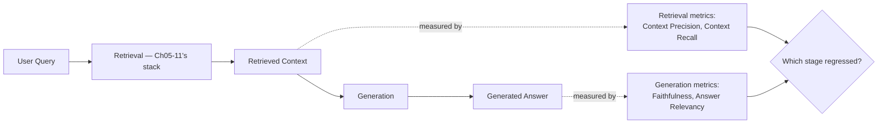
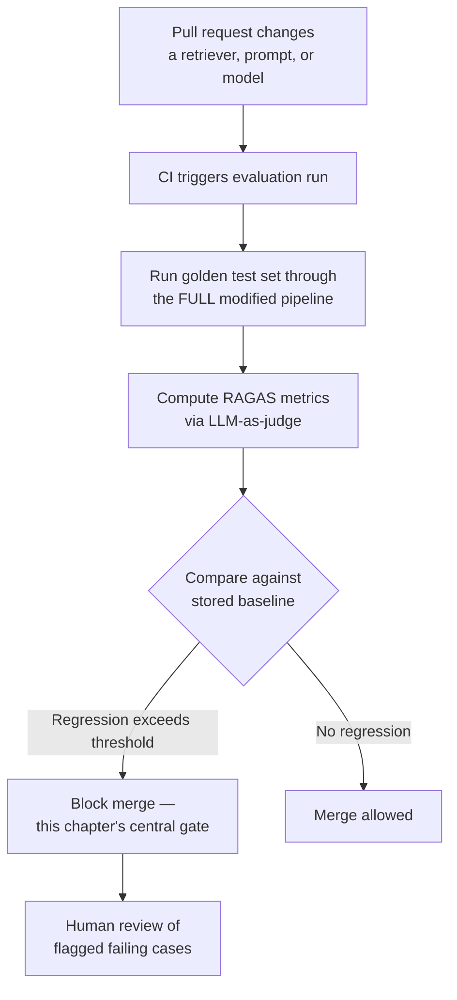
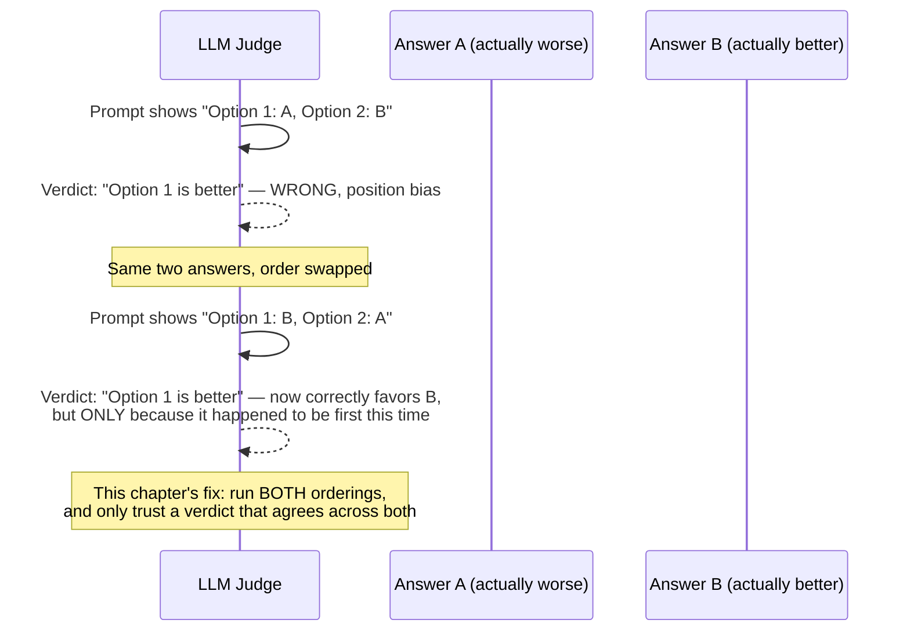
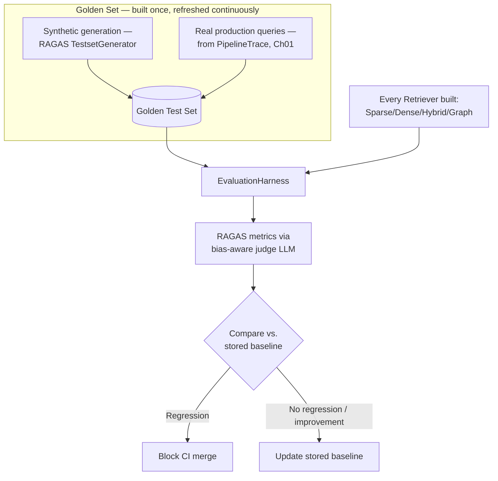
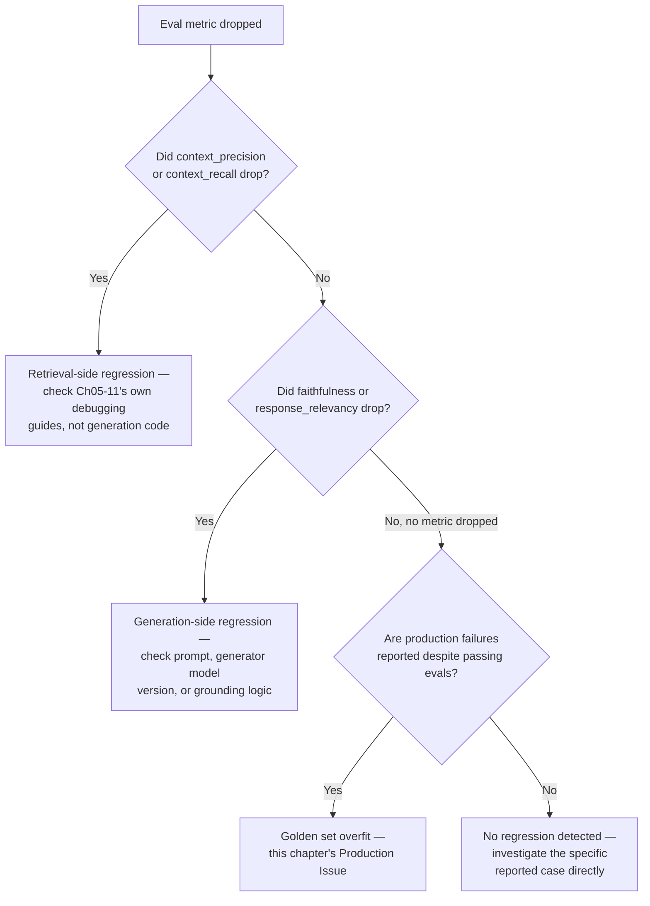

# Chapter 12 — RAG Evaluation

> "Every chapter since Chapter 05 has told you to 'validate this against your own evaluation set.' This is the chapter that finally makes that instruction possible to follow."

**Learning Objectives**

By the end of this chapter, you will be able to:

- Explain why "it looks right to me" cannot answer whether a retrieval change is actually an improvement, and why every technique built since Chapter 05 needs a measurable comparison.
- Implement RAG's standard metric split — retrieval metrics (context precision, context recall) and generation metrics (faithfulness, answer relevancy) — using RAGAS.
- Build a regression test set combining synthetic generation with real production queries, and explain why either source alone is insufficient.
- Apply LLM-as-judge methodology correctly, and reproduce its most consequential bias (position bias) directly, along with its standard mitigation.
- Wire an evaluation harness into CI as a blocking gate, so a retrieval regression is caught before merge, not discovered in production.
- Compare multiple retrieval strategies (sparse, dense, hybrid, graph) built across this course on the same test set, with evidence rather than intuition deciding between them.
- Choose between RAGAS, DeepEval, TruLens, Arize Phoenix, and LangSmith for a given team's workflow and ecosystem.
- Recognize when human evaluation remains necessary despite automated LLM-judge metrics, particularly as this course moves toward high-stakes domains.

**Prerequisites**

- Chapters 01–11 completed — this chapter evaluates the complete retrieval stack built across Module 2 (sparse, dense, hybrid, re-ranking) and Module 3 (structured, multi-modal, graph).
- `pip install ragas deepeval`
- Comfortable Python; an API key for at least one LLM to serve as judge — ideally from a different model family than whatever generates your RAG system's answers.

**Estimated Reading Time:** 80–90 minutes
**Estimated Hands-on Time:** 4–5 hours

---

## ⚡ Fast Read

> **Skim time: 5 minutes** — Read this if you're in a hurry, returning for reference, or already familiar with part of this topic.

- **What it is:** A formal, repeatable evaluation harness for RAG systems — retrieval metrics, generation metrics, and the regression test set that makes comparing techniques (or catching regressions) a measured fact instead of a guess.
- **Why it matters:** Nearly every chapter since Chapter 05 deferred a tuning decision to "validate against your own evaluation set (Ch12)" — BM25's `k1`/`b`, HNSW's `ef_search`, RRF's rank constant, whether re-ranking or HyDE actually helps, whether graph retrieval beats hybrid retrieval for a given query type. This chapter is where all of those deferred promises get paid off at once.
- **Key insight:** Using an LLM to judge your RAG system's own outputs is standard practice, but it has a specific, measurable failure mode most teams miss entirely: a judge model shows real, quantified bias toward outputs it recognizes as its *own style* — self-preference bias measured as high as 25% in some models — which means judging with the same model family that generates your answers can silently inflate every score you trust.
- **What you build:** A RAGAS-based evaluation of Chapter 07's `HybridRetriever`, a reproduced LLM-judge position-bias failure with its standard fix, and a production evaluation harness that compares every major retrieval strategy built in this course side by side, wired into CI as a regression gate.
- **Jump to:** [Core Concepts](#core-concepts) | [First Code](#beginner-implementation) | [Best Practices](#best-practices) | [Mini Project](#mini-project)

---

## Why This Topic Exists

Go back through Chapters 05 through 11 and count how many times a specific number was left as an open question: "tune `k1` and `b` against your own evaluation set," "validate `ef_search` against a real recall measurement," "compare fusion strategies against a labeled test set," "confirm whether re-ranking actually helped for your queries," "measure whether graph retrieval or hybrid retrieval wins for a given question type." Chapter 01 itself named the exact same gap directly — its `RELEVANCE_THRESHOLD` constant was flagged explicitly as "tuned, not derived," with a promise that this chapter would give you a rigorous way to set it instead of guessing.

Every one of those deferrals was deliberate, not an oversight — none of those tuning decisions can be made correctly without a fixed set of representative examples and a repeatable way to score performance against them. Building that evaluation harness *before* those tuning decisions would have meant asking you to trust a tool you hadn't yet learned to build. This chapter builds it now, with the full retrieval stack already in hand to evaluate.

The other reason this chapter exists here, at the start of Module 4, is more structural: Module 3 (Chapters 09–11) introduced genuinely more expensive techniques — vision-native retrieval, knowledge graphs — each explicitly framed as "not a universal upgrade, validate the need on your own corpus first." That instruction was only honest because this chapter was coming. Now it's here.

---

## Real-World Analogy

**The CI Test Suite Your Retrieval Pipeline Never Had**

Before a codebase has a test suite, every change is a small act of faith: you make the edit, run the application manually, click around, and decide subjectively whether it still "feels right." This works, technically, until the codebase and the team grow past the point where one person's manual click-through can catch everything — and it always breaks exactly when it matters most, silently, in production.

A CI test suite fixes this not by making anyone smarter, but by making the comparison automatic and repeatable: a fixed set of test cases, a pass/fail verdict, run on every single change, whether or not a human remembers to check manually. Every retrieval technique built in this course — sparse, dense, fusion, re-ranking, structured, multi-modal, graph — has been evaluated so far exactly the way pre-test-suite code gets evaluated: by trying a few example queries and eyeballing whether the results look reasonable. This chapter is the CI test suite this retrieval pipeline has been missing the entire time.

---

## Core Concepts

### Retrieval Metrics vs. Generation Metrics

- **Technical definition:** RAG evaluation's standard split — retrieval metrics (context precision, context recall, context relevance) measure whether the *right chunks* were found, independent of what the LLM does with them; generation metrics (faithfulness, answer relevancy, answer correctness) measure whether the *generated answer* is well-grounded in and relevant to whatever was retrieved, independent of whether the retrieval itself was any good.
- **Simple definition:** Two separate questions that need two separate scores — "did we find the right information?" and "did the model actually use it correctly?" — because a system can succeed at one and fail at the other.
- **Analogy:** Grading a research paper on two separate axes: did the author find good sources (retrieval), and did they represent those sources accurately in their writing (generation) — a paper can cite excellent sources and still misrepresent them, or cite mediocre sources and summarize them perfectly.

### Context Precision / Context Recall

- **Technical definition:** Context precision measures what fraction of the *retrieved* chunks were actually relevant to the query (are we retrieving noise alongside signal?); context recall measures what fraction of the chunks that *should* have been retrieved (per a reference answer or labeled ground truth) actually were (are we missing anything important?).
- **Simple definition:** Precision asks "of what we found, how much was actually useful?" Recall asks "of what was actually useful, how much did we find?"
- **Analogy:** A metal detector on a beach — precision is what fraction of its beeps were real treasure versus bottle caps; recall is what fraction of the actual buried treasure it managed to detect at all.

### Faithfulness (Groundedness)

- **Technical definition:** A generation metric measuring whether every claim in a generated answer is actually supported by the retrieved context, typically computed by decomposing the answer into atomic claims and checking each one against the context via natural language inference (entailment checking).
- **Simple definition:** Did the model only say things the retrieved documents actually support, or did it add things that sound plausible but aren't backed by anything it was given?
- **Analogy:** Fact-checking a news article not against the world in general, but specifically against the source documents the journalist was handed — did they stick to what those sources actually said?

### Answer Relevancy (Response Relevancy)

- **Technical definition:** A generation metric measuring how directly a generated answer addresses the actual question asked, independent of whether it's factually grounded — a faithful answer can still be irrelevant if it fails to address what was actually asked.
- **Simple definition:** Did the answer actually respond to the question, rather than being technically true but beside the point?
- **Analogy:** A student who answers a different (but related) exam question thoroughly and correctly — technically accurate, still the wrong answer to the question that was actually asked.

### LLM-as-Judge

- **Technical definition:** Using a large language model, prompted with a scoring rubric, to evaluate another system's output (retrieval relevance, faithfulness, answer quality) at a scale and cost that makes exhaustive human evaluation impractical — the current standard evaluation methodology for most RAG metrics, including RAGAS's faithfulness and relevancy scores.
- **Simple definition:** Using an LLM as an automated grader instead of a human, because grading every single test case by hand doesn't scale.
- **Analogy:** A standardized test grading service using a rubric to score essays at scale — faster and cheaper than every essay being read by the original teacher, with its own specific, documented biases the teacher wouldn't have had.

### LLM-Judge Bias

- **Technical definition:** A set of documented, systematic biases in LLM-as-judge scoring — most notably **position bias** (favoring whichever option appears first or second in a pairwise comparison, regardless of quality), **verbosity bias** (favoring longer answers independent of actual quality), and **self-preference bias** (a judge scoring outputs from its own model family more favorably than equivalent outputs from a different model).
- **Simple definition:** Specific, measurable ways an LLM grader's scores can be systematically skewed, not by the actual quality of what it's grading, but by superficial properties like word count or which answer it saw first.
- **Analogy:** A judge in a talent competition who — unconsciously, and measurably across many competitions — tends to rate whichever act performs first slightly higher, or is easier on contestants from their own training background, regardless of who actually performed better.

### Golden / Regression Test Set

- **Technical definition:** A fixed, curated (or systematically generated) set of representative query-answer(-context) examples used to measure a RAG system's performance consistently over time, enabling any change to be compared against a known baseline rather than evaluated in isolation.
- **Simple definition:** A stable, known set of test questions with known-good answers, run every time something changes, so you can tell immediately whether a change made things better or worse.
- **Analogy:** A fixed set of regression tests in a codebase — not exhaustive, but representative and stable enough that a failing test reliably signals something real broke.

---

## Architecture Diagrams

### Diagram 1 — Where Each Metric Type Measures the Pipeline



### Diagram 2 — CI-Integrated Evaluation Harness



---

## Flow Diagrams

### Position Bias, Reproduced



---

## Beginner Implementation

We start with RAGAS's core metrics, applied directly to Chapter 07's `HybridRetriever` output — retrieval and generation metrics computed side by side, so the split from this chapter's Core Concepts is visible in actual numbers, not just described.

```python
# Learning example — beginner_ragas_evaluation.py
# Computes RAGAS's core retrieval and generation metrics on a small,
# hand-built evaluation set built from Ch07's HybridRetriever output.

from ragas import evaluate, EvaluationDataset
from ragas.metrics import ContextPrecision, ContextRecall, Faithfulness, ResponseRelevancy
from ragas.llms import LangchainLLMWrapper

def build_eval_dataset(questions: list[dict]) -> EvaluationDataset:
    """
    Each entry needs: the question, the RETRIEVED context (Ch07's
    HybridRetriever output — this is what context_precision/recall
    measure), the GENERATED answer, and, where available, a reference
    answer (needed for context_recall, since recall requires knowing
    what SHOULD have been retrieved).
    """
    samples = [{
        "user_input": q["question"],
        "retrieved_contexts": q["retrieved_chunks"],   # from hybrid_retriever.retrieve()
        "response": q["generated_answer"],
        "reference": q.get("reference_answer"),        # ground truth, where available
    } for q in questions]
    return EvaluationDataset.from_list(samples)

if __name__ == "__main__":
    # In a real pipeline these come directly from calling Ch07's
    # HybridRetriever and your generator — hardcoded here for a
    # self-contained, runnable example.
    questions = [{
        "question": "What's the rate limit for the export endpoint on the enterprise tier?",
        "retrieved_chunks": ["The export endpoint is rate-limited to 100 requests per minute on the enterprise tier."],
        "generated_answer": "The export endpoint allows 100 requests per minute for enterprise tier customers.",
        "reference_answer": "100 requests per minute, enterprise tier.",
    }]

    dataset = build_eval_dataset(questions)
    judge_llm = LangchainLLMWrapper(...)  # ideally a DIFFERENT model family than your generator — see Core Concepts

    results = evaluate(
        dataset=dataset,
        metrics=[ContextPrecision(), ContextRecall(), Faithfulness(), ResponseRelevancy()],
        llm=judge_llm,
    )
    print(results.to_pandas()[["context_precision", "context_recall", "faithfulness", "response_relevancy"]])
```

**Walking through what's actually happening:**

- `build_eval_dataset` deliberately keeps `retrieved_contexts` and `response` as two separate fields — this is the direct data-structure expression of this chapter's Core Concepts split. `ContextPrecision`/`ContextRecall` only ever look at `retrieved_contexts` against `reference`; `Faithfulness`/`ResponseRelevancy` only ever look at `response` against `retrieved_contexts` and `user_input`. Neither metric family can see the other's inputs, which is exactly why a regression in one doesn't get masked by the other.
- `judge_llm` is called out explicitly as ideally a different model family than your generator — this isn't a stylistic footnote; it's the direct mitigation for self-preference bias, one of this chapter's Core Concepts, measured in published comparisons at up to roughly 25% for some models judging their own family's outputs.
- Run this against a handful of real queries from your own corpus (reusing Chapter 07's Exercise 5 queries is a natural starting point), and you have, for the first time in this course, an actual number for "how good is this retrieval pipeline" instead of a judgment call.

---

## Intermediate Implementation

Now the specific, documented bias this chapter's Flow Diagram illustrates — position bias in pairwise LLM-judge comparisons — reproduced directly, along with its standard fix: swap-order augmentation.

```python
# Learning example — intermediate_judge_bias.py
# Reproduces position bias in a pairwise LLM judge directly, then
# implements swap-order augmentation as the fix.

from anthropic import Anthropic

client = Anthropic()

def pairwise_judge(question: str, answer_a: str, answer_b: str, judge_model: str = "claude-sonnet-5") -> str:
    """A naive pairwise judge — shown ONE ordering only. This is exactly
    the setup that exposes position bias: the judge's verdict can depend
    on which answer happened to be labeled 'Option 1', not on which
    answer is actually better."""
    response = client.messages.create(
        model=judge_model, max_tokens=50,
        messages=[{
            "role": "user",
            "content": f"Question: {question}\n\nOption 1: {answer_a}\nOption 2: {answer_b}\n\n"
                       f"Which option better answers the question? Respond with ONLY '1' or '2'.",
        }],
    )
    return response.content[0].text.strip()

def swap_order_judge(question: str, answer_a: str, answer_b: str, judge_model: str = "claude-sonnet-5") -> str:
    """
    THE FIX. Runs the judge TWICE — once in each ordering — and only
    trusts a verdict that agrees across both. If the two runs disagree
    (the judge picks whichever came first BOTH times), that's position
    bias caught in the act, and the comparison is reported as a tie
    rather than a false, order-dependent verdict.
    """
    verdict_1 = pairwise_judge(question, answer_a, answer_b, judge_model)   # A=Option1, B=Option2
    verdict_2 = pairwise_judge(question, answer_b, answer_a, judge_model)   # B=Option1, A=Option2

    a_won_first_ordering = verdict_1 == "1"
    a_won_second_ordering = verdict_2 == "2"   # A is Option 2 in the swapped ordering

    if a_won_first_ordering and a_won_second_ordering:
        return "A"
    elif not a_won_first_ordering and not a_won_second_ordering:
        return "B"
    else:
        return "TIE — position bias detected, orderings disagreed"

if __name__ == "__main__":
    question = "What's the rate limit for the export endpoint?"
    answer_a = "100 requests per minute for enterprise tier customers."   # correct, concise
    answer_b = "The export endpoint, like many API endpoints in modern systems, has rate limiting applied to prevent abuse; specifically, it is limited to 100 requests per minute for enterprise tier customers, which balances usability with system protection."  # correct, verbose

    naive_verdict = pairwise_judge(question, answer_a, answer_b)
    print(f"Naive judge (single ordering): Option {naive_verdict}")

    robust_verdict = swap_order_judge(question, answer_a, answer_b)
    print(f"Swap-order judge (robust): {robust_verdict}")
    # Run this multiple times, or with the ordering reversed manually,
    # and compare: a naive judge can favor the verbose answer_b simply
    # for being longer (verbosity bias) or whichever answer appeared as
    # "Option 1" (position bias) — swap_order_judge exists specifically
    # to catch exactly this kind of order-dependent, non-substantive verdict.
```

**What changed, and why each change matters:**

1. **`pairwise_judge` is deliberately naive** — it's included exactly as most teams' first LLM-judge implementation looks, specifically so its failure mode is visible rather than assumed away.
2. **`swap_order_judge` doesn't try to fix the judge's underlying bias** — it can't; position bias is a property of the model being used as judge. Instead, it structurally routes around the bias by requiring agreement across both orderings, converting an unreliable single verdict into either a trustworthy one or an honest "we don't actually know" — a strictly better outcome than a confident, silently biased answer.
3. **This is the exact same discipline as Chapter 07's Reciprocal Rank Fusion**, applied to a completely different problem: rather than trusting one signal that might be systematically skewed, combine multiple independent measurements and require them to agree before trusting the result.
4. **Verbosity bias, mentioned in the example's comment, is not separately demonstrated with its own code** — deliberately, because the fix for it is the same class of technique (ensemble/multiple-judge agreement, or an explicit rubric constraining length as irrelevant to the score) rather than a fundamentally different mechanism. The point of this section is the *pattern* — route around a known bias with structural agreement checks — not an exhaustive catalog of every bias's own bespoke fix.

---

## Advanced Implementation

Production RAG evaluation means a harness that generates a representative test set, runs the full retrieval-plus-generation pipeline through it, computes metrics with bias-aware judging, and gates CI on regression — capable of comparing every retrieval strategy built across this course on the same footing.

```python
# Production example — advanced_evaluation_harness.py
# A production evaluation harness: synthetic test set generation,
# multi-strategy comparison (sparse/dense/hybrid/graph), and a
# CI-integrated regression gate.

from __future__ import annotations
from dataclasses import dataclass
from ragas.testset import TestsetGenerator
from ragas import evaluate
from ragas.metrics import ContextPrecision, ContextRecall, Faithfulness, ResponseRelevancy

@dataclass
class EvalResult:
    strategy_name: str
    context_precision: float
    context_recall: float
    faithfulness: float
    response_relevancy: float

class EvaluationHarness:
    """
    Runs the SAME golden test set through any Retriever Protocol
    implementation this course has built — SparseRetriever (Ch05),
    DenseRetriever (Ch06), HybridRetriever (Ch07), GraphRetriever
    (Ch11) — and reports directly comparable metrics for each, so a
    choice between them is evidence, not intuition.
    """

    def __init__(self, generator, judge_llm, generation_docs: list[str]):
        self.generator = generator
        self.judge_llm = judge_llm
        # TestsetGenerator builds a knowledge graph from source documents
        # and produces a configurable mix of single-hop and multi-hop
        # questions — deliberately including multi-hop cases, since a
        # test set of only simple lookups would never reveal whether
        # Ch11's graph retrieval is earning its added complexity.
        self.testset_generator = TestsetGenerator(llm=judge_llm)
        self._golden_docs = generation_docs

    def generate_golden_set(self, testset_size: int, real_production_queries: list[str] | None = None):
        """
        Synthetic generation ALONE is not sufficient — this chapter's
        Best Practices are explicit that a golden set should combine
        synthetic questions (covering corners a human might not think
        to write) with REAL production queries (covering what users
        actually ask, which synthetic generation can miss entirely).
        """
        synthetic_testset = self.testset_generator.generate_with_langchain_docs(
            self._golden_docs, testset_size=testset_size,
        )
        combined = list(synthetic_testset.to_pandas()["user_input"])
        if real_production_queries:
            combined.extend(real_production_queries)
        return combined

    def evaluate_strategy(self, strategy_name: str, retriever, questions: list[str]) -> EvalResult:
        samples = []
        for question in questions:
            retrieved_chunks = retriever.retrieve(question, k=10)
            answer = self.generator.generate(question, retrieved_chunks)
            samples.append({
                "user_input": question,
                "retrieved_contexts": [c.text for c in retrieved_chunks],
                "response": answer,
            })

        from ragas import EvaluationDataset
        dataset = EvaluationDataset.from_list(samples)
        results = evaluate(
            dataset=dataset,
            metrics=[ContextPrecision(), ContextRecall(), Faithfulness(), ResponseRelevancy()],
            llm=self.judge_llm,   # a different model family than self.generator, per this chapter's bias mitigation
        )
        df = results.to_pandas()
        return EvalResult(
            strategy_name=strategy_name,
            context_precision=df["context_precision"].mean(),
            context_recall=df["context_recall"].mean(),
            faithfulness=df["faithfulness"].mean(),
            response_relevancy=df["response_relevancy"].mean(),
        )

    def compare_strategies(self, strategies: dict[str, object], questions: list[str]) -> list[EvalResult]:
        """The direct payoff of every 'validate against your own
        evaluation set' deferral since Chapter 05: run sparse, dense,
        hybrid, and graph retrievers against the SAME questions, and
        get back directly comparable numbers instead of a guess."""
        return [self.evaluate_strategy(name, retriever, questions) for name, retriever in strategies.items()]

def ci_regression_gate(current: EvalResult, baseline: EvalResult, max_allowed_drop: float = 0.05) -> None:
    """
    The blocking gate from this chapter's Production Architecture
    diagram — designed to be called from a pytest test function
    (DeepEval's pytest-native pattern), so a retrieval-affecting PR
    that regresses past this threshold FAILS CI, rather than merging
    on the strength of a manual "looks fine to me" review.
    """
    for metric_name in ("context_precision", "context_recall", "faithfulness", "response_relevancy"):
        current_score = getattr(current, metric_name)
        baseline_score = getattr(baseline, metric_name)
        if baseline_score - current_score > max_allowed_drop:
            raise AssertionError(
                f"Regression detected in {metric_name}: {baseline_score:.3f} -> {current_score:.3f} "
                f"(drop of {baseline_score - current_score:.3f} exceeds max_allowed_drop={max_allowed_drop})"
            )
```

```python
# Production example — test_rag_regression.py
# A pytest test function, run in CI on every PR touching retrieval or
# generation code — the concrete implementation of this chapter's
# Production Architecture diagram's blocking gate.

def test_hybrid_retriever_no_regression(evaluation_harness, hybrid_retriever, golden_questions, stored_baseline):
    result = evaluation_harness.evaluate_strategy("hybrid_v2", hybrid_retriever, golden_questions)
    ci_regression_gate(current=result, baseline=stored_baseline, max_allowed_drop=0.05)
```

**Why this shape earns its complexity:**

- **`EvaluationHarness.compare_strategies` is the direct, concrete payoff of nearly every open tuning question this course has deferred since Chapter 05.** It doesn't just evaluate one pipeline — it runs the *same* golden set through every `Retriever` Protocol implementation built in this course, because that Protocol's consistency (established in Chapter 01, honored by every retriever since) is exactly what makes this kind of apples-to-apples comparison possible without writing bespoke evaluation code per retriever.
- **`generate_golden_set` explicitly combines synthetic and real queries** — this is a direct implementation of this chapter's Best Practices, not an incidental design choice: synthetic generation alone risks missing what real users actually ask; real production queries alone risk missing edge cases a synthetic generator would surface deliberately.
- **`ci_regression_gate` is designed to be called from an ordinary `pytest` test**, matching current tooling conventions (DeepEval's pytest-native positioning) — a retrieval regression becomes a failing test, not a Slack message someone might miss.
- **The judge LLM is passed in explicitly, separate from the generator**, at every call site — this is the concrete code-level enforcement of this chapter's self-preference-bias mitigation, not left to chance or convention.

> **Currency Note:** Evaluation tooling moves quickly, and several specifics here were verified only as of mid-2026: RAGAS is at v0.4.3, with its metric set expanded well beyond the original four (context precision/recall, faithfulness, answer relevancy) to include noise sensitivity, context entities recall, and Nvidia-contributed metrics (answer accuracy, context relevance, response groundedness) — **note that RAGAS's GitHub organization appears to have moved from `explodinggradients/ragas` to `vibrantlabsai/ragas`; confirm this directly before relying on a specific repository URL.** DeepEval is at v4.0, repositioned around a pytest-native, CI-integrated workflow with direct IDE/coding-agent integrations. **TruLens remains actively maintained** (now under Snowflake, following its TruEra acquisition) — do not assume it has been deprecated, a common but incorrect assumption in older material. Arize Phoenix, LangSmith, and Galileo round out the current landscape, each suited to a different ecosystem fit (OpenTelemetry-based and vendor-neutral, LangChain-native, and hallucination-guardrail-focused, respectively) rather than one being a universal winner. What's stable: the retrieval-versus-generation metric split itself, and the documented existence of position/verbosity/self-preference bias in LLM-as-judge methodology — none of that depends on which specific framework version is current this quarter.

---

## Production Architecture



The core architectural point: **this chapter's golden set is not a one-time artifact.** It's built once, from a combination of synthetic generation and real queries pulled directly from Chapter 01's `PipelineTrace` logging (which was explicitly built, back in Chapter 01, with the stated purpose of becoming "your regression test set tomorrow"), and refreshed continuously as production query distribution and source documents drift — exactly the same discipline Chapter 09 applied to validating parsing accuracy and Chapter 10 applied to chart/diagram-specific evaluation.

---

## Best Practices

1. **Never trust "it looks right to me" for a retrieval or generation change** — every technique built since Chapter 05 has an explicit, measurable comparison available now; use it.
2. **Always separate retrieval metrics from generation metrics when diagnosing a regression** — a faithfulness drop and a context recall drop point to entirely different root causes and entirely different fixes.
3. **Judge with a different model family than your generator**, as a default, structural mitigation for self-preference bias — not an occasional audit step, but the standard configuration.
4. **Use swap-order augmentation (or ensemble/multi-judge agreement) for any pairwise or comparative LLM-judge evaluation** — position bias is real, measurable, and not something prompting alone reliably fixes.
5. **Build your golden set from both synthetic generation and real production queries**, never either alone — synthetic generation surfaces edge cases; real queries surface what users actually ask.
6. **Refresh the golden set continuously, not once at launch** — production query distribution and source documents both drift, and a golden set that never changes stops being representative.
7. **Wire evaluation into CI as a blocking gate for any retrieval- or generation-affecting change** — a regression caught in review is far cheaper than one caught by a user.
8. **Reserve human evaluation for calibrating and auditing your automated judge itself**, and for high-stakes domains where an LLM judge's specialized-domain accuracy hasn't been separately validated — this course's Module 3-onward shift toward regulated documents makes this increasingly important, not less.

---

## Security Considerations

- **Golden set poisoning via mislabeled production incidents.** If a golden set is built partly from real production queries and logged responses (as this chapter's Best Practices recommend), an incident where a bad or manipulated response was mistakenly treated as "correct" — including, notably, a successful prompt injection (Chapter 08's document-content injection risk) that wasn't caught at the time — can be silently baked into the golden set as a passing example. Review any production-derived golden-set entry for correctness before trusting it as ground truth, not just for representativeness.
- **Sensitive query content in a stored evaluation set.** A golden set built from real user queries carries the same access-control obligation Chapter 05 raised for query logs — treat a stored evaluation set with the same care as any other record of what users actually asked, particularly once this course's Module 3-onward domain thread involves regulated document content.

---

## Real Client Scenario: The Overfit Evaluation Set

A team building a document-intelligence assistant over a structured, regulated corpus builds their evaluation set entirely from queries their own engineers wrote while testing the system during development — every question phrased clearly, every question about content the engineers already knew was well-covered. The evaluation suite passes consistently, every release, for months. In production, real users ask messier questions: ambiguous phrasing, questions that span two documents, questions about edge-case content the engineering team never tested. A regression that would have been caught immediately by even a handful of real production queries in the golden set ships silently, because the evaluation set was representative of how the system was *tested*, not how it was actually *used*. This is directly the CLAUDE.md-documented standard failure for this topic — a test set overfit to obvious queries, catching nothing about the failure modes that actually reach production — and it's fixed exactly the way this chapter's Best Practices describe: real production queries, not just synthetic or developer-authored ones, in every golden set.

---

## Cost Considerations

| Approach | Cost model | Notes |
|---|---|---|
| LLM-as-judge (frontier model) | Per-evaluation-call API cost, scaling with golden set size and metric count | Highest accuracy for calibration/audit purposes; not necessarily needed for every routine CI run |
| LLM-as-judge (distilled/cheaper model) | Substantially lower per-call cost | Reasonable for frequent CI runs once calibrated against a frontier-model or human baseline |
| Synthetic test set generation | One-time (or periodic refresh) LLM cost via `TestsetGenerator` | Amortized across every subsequent evaluation run using that golden set |
| Human evaluation | Human reviewer time, per example | Reserved for calibrating the automated judge and for high-stakes-domain spot checks — not a full-corpus, every-run cost |
| Full golden set on every PR vs. a sampled subset | Full set: highest confidence, highest per-PR cost; sampled subset: lower cost, some risk of missing a regression | A reasonable middle ground: full set on merge to main, sampled subset on every individual PR push |

The overall shape worth internalizing: **evaluation cost is a lever you control deliberately, not a fixed tax** — a well-designed harness runs a cheap, sampled check on every commit and a full, expensive check at the points that actually matter (pre-merge, pre-release), rather than paying frontier-judge cost on every keystroke or skipping evaluation entirely to save money.

---

## Production Issue: Test Set Overfit to Obvious Queries

**Symptoms**
The evaluation suite passes consistently across releases, showing stable or improving metrics — yet users report retrieval failures, hallucinated answers, or missed content that never showed up as a regression in CI. The gap between "what the eval suite says" and "what users actually experience" widens over time, not suddenly.

**Root Cause**
The golden test set was built from queries that are systematically easier, clearer, or more narrowly scoped than real production traffic — commonly because it was authored entirely by the engineering team during development, testing exactly the cases they already knew the system handled well, rather than sampled from (or validated against) the messier, more varied distribution of real user queries.

**How to Diagnose It**
1. Compare the golden set's query characteristics (length, phrasing complexity, whether they reference one document or several) against a sample of real production queries pulled from Chapter 01's `PipelineTrace` logs.
   ```python
   golden_avg_length = sum(len(q.split()) for q in golden_questions) / len(golden_questions)
   production_avg_length = sum(len(q.split()) for q in production_queries) / len(production_queries)
   ```
2. Run the evaluation harness against a freshly-sampled set of real production queries (not previously in the golden set) and compare the resulting metrics against the golden set's historical scores — a meaningful gap confirms the golden set was not representative.
3. Review recent user-reported failures directly against the golden set — confirm whether a query similar in structure to the failure ever appeared in the evaluation suite at all.

**How to Fix It**
```python
# Wrong: golden set built entirely from developer-authored test queries
golden_questions = [q for q in engineering_test_queries]

# Right: combine synthetic generation, developer-authored edge cases,
# AND a real sample of production queries (Ch01's PipelineTrace)
golden_questions = (
    synthetic_testset_generator.generate(source_docs, testset_size=100) +
    engineering_test_queries +
    sample_real_production_queries(pipeline_trace_logs, n=100)
)
```

**How to Prevent It in Future**
Treat the golden set as a living artifact requiring periodic refresh from real production traffic, not a one-time deliverable finished at launch — schedule a recurring review (e.g., quarterly, or triggered by a meaningful shift in query volume/type) that samples fresh production queries into the golden set and re-validates that its query characteristics still resemble real usage, not just the cases the engineering team originally thought to test.

---

## Common Mistakes

**Mistake 1 — Judging with the same model family that generates answers.**
```python
# Wrong: generator and judge are the same model — self-preference
# bias silently inflates every faithfulness/relevancy score
generator_model = "claude-sonnet-5"
judge_model = "claude-sonnet-5"

# Right: judge with a different model family, as a structural default
generator_model = "claude-sonnet-5"
judge_model = "gpt-5"  # or any different-family model
```

**Mistake 2 — Building a golden set from synthetic generation alone.**
```python
# Wrong: no real production queries included at all
golden_questions = testset_generator.generate(source_docs, testset_size=100)

# Right: combine synthetic generation with a real production query sample
golden_questions = testset_generator.generate(source_docs, testset_size=100) + real_production_sample
```

**Mistake 3 — Treating a passing eval score at launch as permanent.**
```python
# Wrong: evaluation run once, at launch, never revisited
if launch_eval_score >= 0.85:
    ship_and_never_reevaluate()

# Right: continuous re-evaluation as corpus and queries drift
schedule_recurring_evaluation(golden_set, refresh_interval_days=90)
```

**Mistake 4 — Trusting a single-ordering pairwise judge verdict.**
```python
# Wrong: judge sees only one ordering, vulnerable to position bias
verdict = pairwise_judge(question, answer_a, answer_b)

# Right: swap-order augmentation, requiring agreement across both orderings
verdict = swap_order_judge(question, answer_a, answer_b)
```

**Mistake 5 — Evaluating every retrieval strategy with bespoke, inconsistent evaluation code.**
```python
# Wrong: a different evaluation script per retriever, making results
# not directly comparable
evaluate_sparse_retriever_custom_script()
evaluate_graph_retriever_different_custom_script()

# Right: one EvaluationHarness, run against every Retriever Protocol
# implementation, on the SAME golden set
harness.compare_strategies({"sparse": sparse_retriever, "graph": graph_retriever}, golden_questions)
```

---

## Debugging Guide



| Symptom | Likely cause | First thing to check |
|---|---|---|
| Context precision/recall dropped, faithfulness stable | A retrieval-stage change (Ch05-11) | Diff the retriever configuration against the last known-good version |
| Faithfulness dropped, context metrics stable | A generation-stage issue (prompt, model version) | Check for a recent prompt or generator model change |
| Eval passes consistently, but production complaints increase | Golden set not representative of real query distribution | Sample fresh production queries and re-run evaluation against them |
| Pairwise judge verdicts seem inconsistent across similar comparisons | Position or verbosity bias | Apply swap-order augmentation and check for verdict disagreement |
| Two retrieval strategies score similarly despite an obvious qualitative difference | Golden set too small or unrepresentative to distinguish them | Expand the golden set, particularly with queries specific to where the strategies should differ |

---

## Performance Optimisation

| Technique | What it improves | Illustrative trade-off | Notes |
|---|---|---|---|
| Sampled subset evaluation on every commit, full set on merge | CI feedback speed vs. thoroughness | Some risk of missing a regression on an individual commit, caught at merge instead | A reasonable default for most teams |
| Distilled/cheaper judge model for routine runs, frontier model for calibration | Evaluation cost at scale | Requires periodic re-calibration against the frontier model or human baseline | Validate the distilled judge's agreement rate before relying on it |
| Swap-order augmentation only for pairwise/comparative metrics | Judge reliability | Roughly doubles the judge-call cost for the metrics it applies to | Not needed for pointwise (single-answer) scoring metrics |
| Continuous golden-set refresh from production traffic | Long-term evaluation representativeness | Requires an ongoing process, not a one-time setup | Directly prevents this chapter's Production Issue |

*As with prior chapters, validate against your own corpus and evaluation harness rather than assuming these figures transfer directly.

---

## Decision Framework — Choosing an Evaluation Framework

| Situation | Recommendation |
|---|---|
| Want a dedicated RAG metrics framework with synthetic test set generation built in | RAGAS |
| Want pytest-native, CI-integrated evaluation with strong IDE/coding-agent tooling | DeepEval |
| Already using Snowflake's data/AI stack | TruLens |
| Want vendor-neutral, OpenTelemetry-based tracing plus evaluation | Arize Phoenix |
| Already built on LangChain/LangGraph | LangSmith |
| Need managed, hallucination-guardrail-focused monitoring in production | Galileo |
| High-stakes domain, need human-calibrated judge accuracy | Any of the above, PLUS a human evaluation calibration step — not a framework choice alone |

---

## Technology Comparison — RAG Evaluation Frameworks

| Framework | Type | Notable strengths (as of this writing) | Best for |
|---|---|---|---|
| RAGAS | OSS, metrics + synthetic testset generation | Broad, expanding metric set (retrieval, generation, agentic); `TestsetGenerator` for golden set creation | Teams wanting a dedicated RAG-specific metrics library |
| DeepEval | OSS, pytest-native | CI/IDE integration, coding-agent tooling, broad metric coverage | Teams wanting evaluation as ordinary test-suite code |
| TruLens | OSS (Snowflake-maintained) | Mature, actively maintained — confirm this directly, as it's sometimes incorrectly assumed deprecated | Teams already in the Snowflake ecosystem |
| Arize Phoenix | OSS, OpenTelemetry-based | Vendor-neutral tracing plus built-in RAG metrics | Teams wanting observability and evaluation in one open tool |
| LangSmith | Managed, LangChain-native | Strong regression-dataset building from production failures | Teams built on LangChain/LangGraph |
| Galileo | Managed | Hallucination-detection and guardrail focus | Teams prioritizing production hallucination monitoring specifically |

> **Currency Note:** Every framework's version, positioning, and status in this table is a mid-2026 snapshot in a fast-moving space — confirm current versions and feature sets directly against each project's own documentation before a production decision.

---

## Interview Questions

1. **"Why do you need separate retrieval and generation metrics rather than one overall RAG quality score?"** — Expect: they measure different things and can fail independently — a single blended score can't tell you which stage to fix.
2. **"What is self-preference bias in LLM-as-judge evaluation, and how do you mitigate it?"** — Expect: a judge scoring its own model family's outputs more favorably; mitigated by judging with a different model family than the generator.
3. **"Why is a golden set built entirely from synthetic generation risky?"** — Expect: it can miss the actual distribution of real user queries, producing a passing evaluation suite that doesn't reflect production reality — this chapter's central Production Issue.
4. **"Explain position bias in pairwise LLM judging and how swap-order augmentation fixes it."** — Expect: a judge favoring whichever answer appears first (or second) regardless of quality; fixed by running both orderings and only trusting verdicts that agree across both.
5. **"How would you decide whether graph retrieval (Ch11) is actually worth its added complexity for your corpus?"** — Expect: run both graph and hybrid retrieval through the same evaluation harness against the same golden set, and let the measured metrics decide, rather than assuming either is universally better.
6. **"Why should an evaluation golden set be treated as a living artifact rather than a one-time deliverable?"** — Expect: production query distribution and source documents both drift over time; a static golden set stops being representative and starts silently missing regressions.

---

## Exercises

1. **(20 min)** Run this chapter's `beginner_ragas_evaluation.py` example against 5 real queries from your own corpus, using Chapter 07's `HybridRetriever` output as the retrieved context.
2. **(30 min)** Reproduce position bias directly: construct two answers of noticeably different quality, run `pairwise_judge` in both orderings manually, and confirm whether the verdict changes based on ordering alone.
3. **(30 min)** Build a small golden set (10–15 questions) combining RAGAS's `TestsetGenerator` output with 5 real queries from your own usage or logs, and compare the query characteristics (length, complexity) between the two sources.
4. **(45 min)** Implement `EvaluationHarness.compare_strategies` against at least two retrievers you've built in this course (e.g., Chapter 05's `SparseRetriever` and Chapter 07's `HybridRetriever`), and report which one scores higher on which metric.
5. **(60 min, harder)** Take one specific tuning decision this course deferred to this chapter (BM25's `k1`/`b` from Ch05, HNSW's `ef_search` from Ch06, or RRF's `k` constant from Ch07). Use your evaluation harness to actually tune it against your golden set, and document the before/after metric change.

---

## Quiz

1. **Why does RAG evaluation need separate retrieval and generation metrics rather than one score?**
   *Retrieval and generation can fail independently — a single blended score can't distinguish "we found the wrong chunks" from "we found the right chunks but generated a bad answer."*
2. **What does context precision measure, and what does context recall measure?**
   *Context precision measures what fraction of retrieved chunks were actually relevant; context recall measures what fraction of the chunks that should have been retrieved actually were.*
3. **What does faithfulness measure, and how is it typically computed?**
   *Whether every claim in a generated answer is supported by the retrieved context, typically via decomposing the answer into atomic claims and checking each against the context through entailment.*
4. **What is self-preference bias, and what's the standard mitigation?**
   *A judge model scoring its own model family's outputs more favorably than an equivalent output from a different model; mitigated by judging with a different model family than the generator.*
5. **What is position bias, and how does swap-order augmentation fix it?**
   *A pairwise judge favoring whichever answer appears first (or second) regardless of actual quality; fixed by running the comparison in both orderings and only trusting a verdict that agrees across both.*
6. **Why is a golden set built entirely from synthetic generation risky?**
   *It may not represent the actual distribution of real production queries, allowing a passing evaluation suite to coexist with real, uncaught production failures.*
7. **Why should a golden test set be refreshed continuously rather than built once at launch?**
   *Production query distribution and source documents both drift over time — a static golden set stops being representative and can silently stop catching real regressions.*
8. **How does an evaluation harness let you compare graph retrieval (Ch11) against hybrid retrieval (Ch07) fairly?**
   *By running the exact same golden set through both retrievers' Retriever Protocol implementation and computing the same metrics for each, making the comparison an apples-to-apples measurement instead of a guess.*
9. **What's a realistic security risk specific to a golden set built from real production data?**
   *A mislabeled production incident — including an uncaught prompt injection — could be baked into the golden set as a "correct" example, silently normalizing a bad behavior as a passing test case.*
10. **When is human evaluation still necessary despite having automated LLM-judge metrics?**
    *For calibrating and auditing the automated judge's own accuracy, and for high-stakes domains where specialized domain accuracy hasn't been separately validated against human judgment.*

---

## Mini Project

**Build:** A RAGAS-based evaluation harness applied to your Chapter 07 `HybridRetriever`.

**Acceptance criteria:**
- [ ] At least 10 real queries from your own corpus are evaluated using RAGAS's `ContextPrecision`, `ContextRecall`, `Faithfulness`, and `ResponseRelevancy` metrics.
- [ ] The judge LLM is a different model family than your generator, and you document this choice explicitly.
- [ ] You've reproduced position bias directly on at least one pairwise comparison, and implemented `swap_order_judge` as the fix.
- [ ] Your golden set combines at least some synthetically-generated questions (via RAGAS's `TestsetGenerator`) with at least some real queries you've actually used or observed.

**Time estimate:** 2–3 hours.

---

## Production Project

**Build:** Extend the Mini Project into a CI-integrated, multi-strategy comparison harness.

**Acceptance criteria:**
- [ ] `EvaluationHarness.compare_strategies` is run against at least two different retrievers you've built in this course (e.g., sparse vs. hybrid, or hybrid vs. graph), with results documented and a decision justified by the numbers.
- [ ] A `ci_regression_gate`-style pytest test is implemented and confirmed to actually fail when a deliberate regression is introduced (e.g., temporarily reverting a retriever to an earlier, worse configuration).
- [ ] The golden set includes at least one real production query sample (not purely synthetic or developer-authored), and you've compared its query characteristics against your golden set's synthetic portion.
- [ ] A basic cost-control strategy is implemented — a sampled subset for frequent runs, a full set for merge-to-main runs — with the trade-off documented.
- [ ] A short `RUNBOOK.md` documenting: how to refresh the golden set from production traffic, how to diagnose whether a regression is retrieval-side or generation-side (referencing this chapter's Debugging Guide), and how to calibrate a distilled judge model against a frontier-model baseline.

**Time estimate:** 1–2 days.

---

## Key Takeaways

- Every tuning decision deferred since Chapter 05 — BM25's parameters, HNSW's `ef_search`, RRF's rank constant, whether re-ranking or a query transformation helps, whether graph retrieval earns its cost — becomes measurable, not guessed, once this chapter's harness exists.
- RAG evaluation splits cleanly into retrieval metrics (context precision/recall) and generation metrics (faithfulness, answer relevancy) — they fail independently and require different fixes.
- LLM-as-judge is standard practice but carries specific, documented biases — self-preference bias (mitigated by judging with a different model family) and position bias (mitigated by swap-order augmentation) are the two this chapter demonstrates directly.
- A golden test set must combine synthetic generation with real production queries — either source alone risks missing real failure modes, and this is this chapter's central, CLAUDE.md-flagged production issue.
- A golden set is a living artifact requiring continuous refresh, not a one-time deliverable finished at launch.
- Every `Retriever` Protocol implementation built across this course can be evaluated on the same footing, using the same harness, making a choice between retrieval strategies an evidence-based decision.
- Evaluation should be wired into CI as a blocking gate on retrieval- and generation-affecting changes, not left as a manual, easily-skipped review step.
- Human evaluation remains necessary for calibrating the automated judge itself and for high-stakes domains — this course's shift toward regulated documents (Module 3 onward) makes this more important, not less, going into Module 4.

---

## Chapter Summary

| Concept | Key Takeaway |
|---|---|
| Retrieval vs. Generation Metrics | Two independent measurement axes — a single blended score can't distinguish their failures |
| Context Precision / Recall | Precision measures noise in what's retrieved; recall measures what's missing from it |
| Faithfulness / Answer Relevancy | Faithfulness checks grounding in context; relevancy checks the answer addresses the actual question |
| LLM-as-Judge Bias | Self-preference and position bias are real, documented, and mitigated by different-model judging and swap-order augmentation |
| Golden Test Set | Must combine synthetic and real queries, and must be refreshed continuously, not built once |
| CI-Integrated Evaluation | A regression should fail a test, not require a human to notice it |

---

## Resources

- [RAGAS documentation](https://docs.ragas.io/) — the core evaluation library used throughout this chapter.
- [DeepEval documentation](https://deepeval.com/) — the pytest-native evaluation framework referenced in this chapter's CI integration pattern.
- Es et al., ["RAGAS: Automated Evaluation of Retrieval Augmented Generation"](https://arxiv.org/abs/2309.15217) — the foundational paper behind RAGAS's metric design.
- Zheng et al., ["Judging LLM-as-a-Judge with MT-Bench and Chatbot Arena"](https://arxiv.org/abs/2306.05685) — foundational research on LLM-judge biases, including position bias.
- Volume 1, Chapter 16 — Testing & Evaluating AI Systems, the general evaluation discipline this chapter specializes for RAG specifically.

---

## Glossary Terms Introduced

| Term | One-line definition |
|---|---|
| Context Precision / Context Recall | Retrieval metrics measuring noise in retrieved chunks vs. completeness of what should have been retrieved |
| Faithfulness | Whether every claim in a generated answer is supported by the retrieved context |
| Answer Relevancy | Whether a generated answer actually addresses the question asked, independent of factual grounding |
| LLM-as-Judge | Using an LLM to evaluate another system's output at scale, in place of exhaustive human review |
| Position / Verbosity / Self-Preference Bias | Documented, systematic LLM-judge scoring biases unrelated to actual output quality |
| Golden / Regression Test Set | A fixed, representative, continuously-refreshed set of examples used to measure performance over time |

---

## See Also

| Chapter | Why it's relevant |
|---|---|
| Vol 3, Ch 01 — RAG Architecture Deep Dive | The `PipelineTrace` logging and `RELEVANCE_THRESHOLD` tuning promise this chapter directly resolves |
| Vol 3, Ch 05–08 — Sparse/Dense/Hybrid/Re-ranking | Every parameter these chapters deferred to "your own evaluation set" is now tunable using this chapter's harness |
| Vol 3, Ch 09–11 — Structured/Multi-Modal/Graph RAG | Each chapter's "validate the need against your own corpus" instruction is fulfilled by this chapter's comparison harness |
| Vol 3, Ch 13 — Trustworthy RAG for High-Stakes Domains | Builds directly on this chapter's faithfulness measurement for grounding and citation enforcement |
| Volume 1, Ch 16 — Testing & Evaluating AI Systems | The general AI evaluation foundations this chapter specializes for RAG |

---

## Preparation for Next Chapter

Chapter 13 (Trustworthy RAG for High-Stakes Domains) builds directly on this chapter's faithfulness measurement, extending it into enforced citation, hallucination mitigation, calibrated refusal behavior, and defense against prompt injection via retrieved documents — the trustworthiness half of Module 4's theme, now that this chapter has given you the tools to measure it.

**Technical checklist:**
- [ ] Have your `EvaluationHarness` and golden test set on hand — Chapter 13 will extend the faithfulness metric into an enforced, structural guarantee rather than just a measurement.
- [ ] Note your current faithfulness score on a handful of real queries — Chapter 13 will show you techniques aimed specifically at improving it, and you'll be able to measure whether they actually did.

**Conceptual check:**
- If faithfulness measures whether an answer is grounded in retrieved context, what would it take to *guarantee* grounding structurally, rather than just measuring whether it happened after the fact?
- Why might a system with a high average faithfulness score still be unsafe to deploy in a high-stakes domain, if that average conceals a small number of confidently wrong answers?

**Optional challenge:** Look at your evaluation harness's lowest-scoring faithfulness result. Read the generated answer and the retrieved context side by side, and identify exactly which claim in the answer wasn't actually supported. You'll get the tools to prevent this systematically, not just detect it after the fact, once Chapter 13 introduces citation enforcement.
