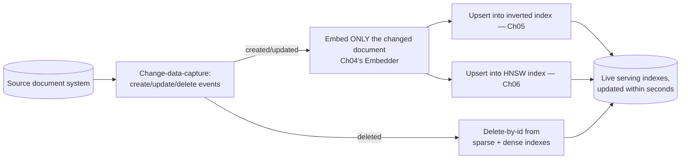
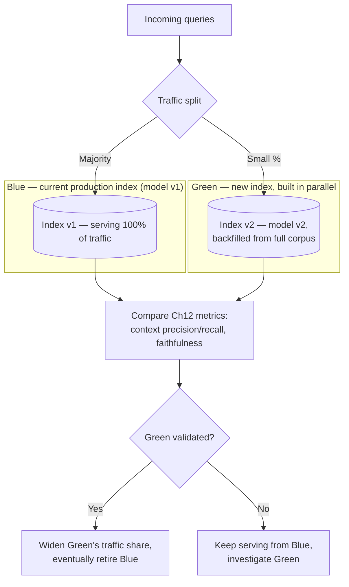
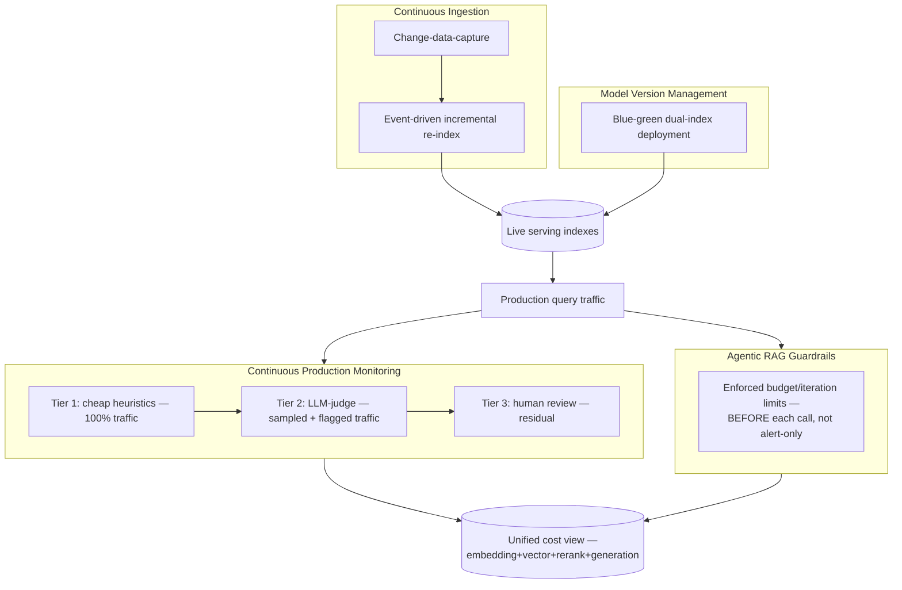
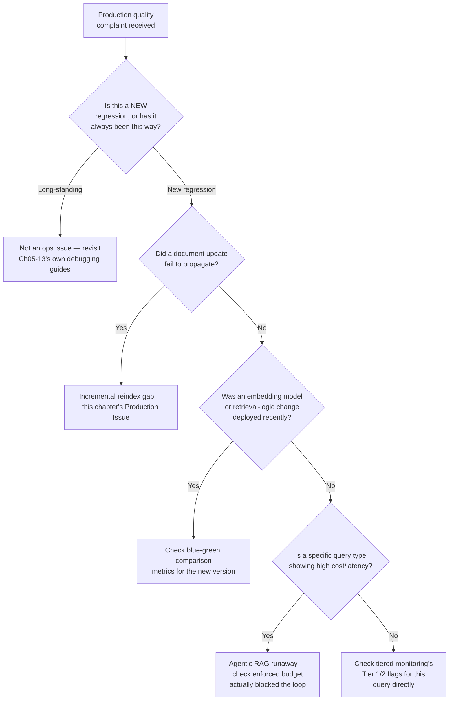

# Chapter 14 — Production RAG Architecture and Operations

> "Passing Chapter 12's evaluation suite tells you the system is correct today. It says nothing about whether it's still correct in six months, once the corpus, the embedding model, and the traffic have all quietly changed underneath it."

**Learning Objectives**

By the end of this chapter, you will be able to:

- Explain why a system that passed evaluation (Ch12) and enforces trustworthiness (Ch13) at launch still needs ongoing operational discipline to stay correct over time.
- Implement event-driven, incremental re-indexing so document changes propagate to sparse and dense indexes within seconds, without a full corpus rebuild.
- Detect and manage embedding/model version drift using blue-green dual-index deployment, avoiding the trap of re-embedding a live corpus in place.
- Wire tiered production monitoring that catches retrieval-quality regressions without labeled ground truth, combining cheap heuristics, sampled LLM-judge scoring, and human review.
- Bound agentic RAG's retrieval loops with structurally enforced limits — not alerts that fire after the damage is already done.
- Roll out a retrieval pipeline change safely using shadow deployment before canary release, comparing per-step behavior rather than only final answers.
- Choose between self-hosting the full retrieval stack and adopting a managed RAG-as-a-service platform, based on scale and operational maturity.
- Track a production RAG system's total operational cost as one unified, system-level view rather than siloed per-component dashboards.

**Prerequisites**

- Chapters 01–13 completed — this chapter operates the complete stack built across this course: retrieval (Ch05–11), evaluation (Ch12), and trustworthy grounding (Ch13).
- Comfortable Python and SQL; familiarity with basic deployment concepts (containers, traffic routing).
- No new API dependencies beyond what prior chapters already established.

**Estimated Reading Time:** 80–90 minutes
**Estimated Hands-on Time:** 4–5 hours

---

## ⚡ Fast Read

> **Skim time: 5 minutes** — Read this if you're in a hurry, returning for reference, or already familiar with part of this topic.

- **What it is:** The operational discipline that keeps a RAG system correct over time — incremental re-indexing, embedding-model version management, production monitoring without labeled ground truth, and bounded agentic retrieval.
- **Why it matters:** Chapters 12 and 13 made the system correct and trustworthy *at launch*. Neither one keeps it that way as the corpus changes daily, an embedding model vendor ships a new version, and traffic patterns drift — that's an entirely different, ongoing engineering problem, one this course has flagged repeatedly (Ch06's stale vectors, Ch09's parsing accuracy, Ch12's golden-set drift) without yet giving you the unified operational architecture to handle all of it at once.
- **Key insight:** "No alerts fired" is not the same as "nothing went wrong" — a documented, illustrative case of an agentic RAG pipeline running for 264 hours and costing $47,000 traced back to exactly this gap: alerts existed, but nothing in the system actually *blocked* the next call before it fired. Observability without enforcement is a dashboard, not a control.
- **What you build:** An event-driven incremental re-indexer, a blue-green dual-index rollout for an embedding model upgrade, a tiered production monitoring pipeline, and enforced budget/iteration guardrails for agentic retrieval.
- **Jump to:** [Core Concepts](#core-concepts) | [First Code](#beginner-implementation) | [Best Practices](#best-practices) | [Mini Project](#mini-project)

---

## Why This Topic Exists

Every chapter since Chapter 06 has, at some point, flagged a version of the same unfinished business: Chapter 06 built a `DenseRetriever` and warned that a vector index is a "derived, synchronized copy of the source corpus" requiring an explicit sync path, or it silently goes stale. Chapter 09 warned that parsing accuracy needs periodic revalidation against real documents. Chapter 12 built an evaluation harness and warned that a golden set is "a living artifact requiring continuous refresh," not a one-time deliverable. Each of those was a specific, local instance of the same larger truth: everything built in this course is a *live system*, not a one-time build-and-ship artifact, and none of Chapters 01–13 gave you the unified operational architecture to run it that way over months and years.

This chapter is where that operational architecture finally gets built, all at once, instead of chapter-by-chapter as an afterthought. And it adds one genuinely new risk this course hasn't confronted yet: **agentic RAG** — a system where an LLM decides, itself, how many retrieval steps to take and when to stop — introduces a failure mode none of Chapters 05–13's single-pass retrieval pipelines could produce: an unbounded, silently expensive retrieval loop that a monitoring dashboard can observe perfectly and still fail to stop, because observing a problem and preventing it are not the same capability.

---

## Real-World Analogy

**CI/CD Discipline vs. Site Reliability Engineering**

Chapters 01 through 13 built and tested a car: designed it, ran it through every safety check, confirmed it drives correctly on a known test track (Chapter 12's evaluation), and confirmed its safety systems work (Chapter 13's trustworthiness enforcement). That's real, necessary work — and it's also fundamentally a pre-purchase inspection, a snapshot of correctness at one point in time.

This chapter is the discipline of actually *owning* that car for the next ten years: noticing the engine starting to run rough before it strands you on the highway (production monitoring, not just pre-launch evaluation), knowing exactly how to swap in a new engine without leaving you carless for a week (blue-green model deployment), and — critically — never handing a new, inexperienced driver the keys without a hard, structural limit on how far they can go before checking back in, rather than trusting them to remember the rules on their own (agentic RAG's enforced budget caps). CI/CD discipline gets the car built and inspected correctly. Site Reliability Engineering discipline is what keeps it running correctly, indefinitely, as the road, the weather, and the car itself all keep changing.

---

## Core Concepts

### Index Drift

- **Technical definition:** The gradual degradation of retrieval quality over time even when the embedding model and index infrastructure remain completely unchanged, caused by the source corpus's content and terminology evolving away from what the index was originally built to represent — distinct from Chapter 04's embedding-model-mismatch failure, which is a sudden, discrete break rather than a slow, silent one.
- **Simple definition:** Retrieval quality slowly getting worse over months, not because anything technically broke, but because what your documents are actually about has quietly shifted since the index was built.
- **Analogy:** A library's card catalog that was perfectly accurate the day it was built, slowly becoming less useful as the library's actual collection and the way patrons describe what they're looking for both evolve, with no single moment where anything visibly "broke."

### Event-Driven Incremental Re-indexing

- **Technical definition:** An ingestion architecture that reacts to individual document change events (create, update, delete — typically captured via change-data-capture, CDC, from a source system) and updates only the affected entries in the sparse and dense indexes, rather than periodically rebuilding the entire index from scratch.
- **Simple definition:** Updating just the one document that changed, the moment it changes, instead of waiting for a scheduled job to rebuild everything from zero.
- **Analogy:** A spreadsheet with live formulas that recalculate only the cells actually affected by an edit, versus a spreadsheet that only updates its numbers if you manually recalculate the entire sheet on a schedule.

### Blue-Green / Dual-Index Deployment

- **Technical definition:** A deployment pattern for changing an embedding model (or any retrieval-logic component) that builds a completely separate, parallel index under the new configuration, routes a controlled portion of traffic to it for comparison, and only fully cuts over once the new index's metrics are validated — never modifying the live, serving index in place.
- **Simple definition:** Building the new version of your index entirely separately, testing it side by side with the old one on real traffic, and only switching over once you're confident — instead of trying to upgrade the live index while it's still serving users.
- **Analogy:** Building an entirely new highway bridge alongside the old one, routing some traffic across it to confirm it holds up, and only demolishing the old bridge once the new one's been proven under real load — never trying to renovate the only bridge while cars are still driving across it.

### Shadow Deployment vs. Canary Release

- **Technical definition:** Shadow deployment runs a new retrieval-logic version on 100% of real production traffic in parallel with the live system, logging its outputs for comparison without ever showing them to users; canary release routes a small percentage of *real, user-facing* traffic to the new version once shadow testing has built confidence, widening the rollout as metrics hold up.
- **Simple definition:** Shadow testing lets the new version see everything real users ask, quietly, with zero risk to any actual user; canary release is the first time the new version is allowed to actually answer a small slice of real users, before trusting it with everyone.
- **Analogy:** A trainee air traffic controller who first watches every real flight pass through a simulated console with zero actual control (shadow), and only later gets to handle a small number of real, low-stakes flights under supervision (canary) before taking a full shift alone.

### Tiered Production Monitoring

- **Technical definition:** A monitoring strategy that applies cheap, deterministic checks to 100% of production traffic (retrieval score thresholds, citation presence, refusal rate), a more expensive LLM-as-judge evaluation to a smaller sampled percentage (typically 5–10%, plus any traffic already flagged by the cheap checks), and human review to the smallest residual fraction — rather than applying the most expensive check uniformly, or skipping expensive checks entirely.
- **Simple definition:** Cheap automatic checks on everything, a smarter (but pricier) automatic check on a sample, and an actual human looking only at the small, genuinely uncertain remainder — instead of either checking everything the expensive way or checking nothing beyond the cheapest signal.
- **Analogy:** An airport's baggage screening — a fast X-ray scan on every single bag, a more thorough secondary scan on a flagged subset, and a human physically inspecting only the small number of bags that still look uncertain after that.

### Enforced Budget / Iteration Limits (Agentic RAG)

- **Technical definition:** A structural, pre-call check — not a post-hoc alert — that blocks an agentic retrieval loop's next tool call or retrieval step once a configured hard limit (maximum iterations, maximum cumulative cost, maximum elapsed time) has been reached, guaranteeing termination regardless of the agent's own reasoning about whether to continue.
- **Simple definition:** A hard stop that physically prevents the next retrieval step from running once a budget is used up — not a dashboard that would have told someone about it afterward.
- **Analogy:** A parking garage's boom barrier that physically stops your car once you've reached the height limit for that level, versus a sign warning you about the height limit that you could, in principle, ignore and hit the ceiling anyway.

---

## Architecture Diagrams

### Diagram 1 — Event-Driven Incremental Re-indexing



### Diagram 2 — Blue-Green Deployment for an Embedding Model Upgrade



---

## Flow Diagrams

### Agentic RAG's Cost Runaway, and the Enforced Fix

```mermaid
sequenceDiagram
    participant Agent as Agentic Retrieval Loop
    participant Monitor as Observability Dashboard
    participant Budget as Enforced Budget Check (this chapter's fix)

    Agent->>Agent: Iteration 1: retrieve, evaluate, decide to continue
    Agent->>Agent: Iteration 2: retrieve, evaluate, decide to continue
    Note over Agent,Monitor: Naive setup: dashboard tracks cost and iteration count,<br/>alerts fire past a threshold — but nothing BLOCKS the next call
    Agent->>Agent: Iteration 47... 132... 250...
    Monitor-->>Agent: Alert fired hours ago — no one saw it in time
    Note over Agent: An illustrative, real-shaped scenario: a 4-agent pipeline<br/>ran 264 hours and accumulated $47,000 in cost —<br/>observability existed; enforcement did not

    Agent->>Budget: Iteration N: about to make another retrieval call
    Budget->>Budget: Check cumulative cost/iteration count<br/>against hard limit BEFORE allowing the call
    Budget-->>Agent: Limit reached — call BLOCKED, loop terminates
```

---

## Beginner Implementation

We start with event-driven incremental re-indexing — reacting to individual document change events instead of a scheduled full rebuild — and measure directly how its cost scales with the *rate of change*, not the size of the corpus.

```python
# Learning example — beginner_incremental_reindex.py
# Reacts to document change events (create/update/delete) and updates
# ONLY the affected entries in sparse and dense indexes — no full
# corpus rebuild, regardless of corpus size.

from dataclasses import dataclass
from enum import Enum

class ChangeType(Enum):
    CREATED = "created"
    UPDATED = "updated"
    DELETED = "deleted"

@dataclass
class DocumentChangeEvent:
    doc_id: str
    change_type: ChangeType
    new_text: str | None = None   # None for DELETED events

def handle_change_event(event: DocumentChangeEvent, sparse_index, dense_index, embedder) -> None:
    """
    The core discipline this chapter's Core Concepts describe: react to
    ONE document's change, touch ONLY that document's entries. Compare
    this against a full reindex, which would re-embed and re-insert
    every document in the corpus regardless of how many actually changed.
    """
    if event.change_type == ChangeType.DELETED:
        # Delete-by-id — most vector/sparse index libraries support this
        # directly (Ch05/Ch06's stores both do); no rebuild required.
        sparse_index.delete(event.doc_id)
        dense_index.delete(event.doc_id)
        return

    # CREATED or UPDATED: for an update, remove the old entry first so a
    # changed document doesn't leave a stale copy alongside the new one.
    if event.change_type == ChangeType.UPDATED:
        sparse_index.delete(event.doc_id)
        dense_index.delete(event.doc_id)

    embedding = embedder.embed([event.new_text])[0]
    sparse_index.upsert(event.doc_id, event.new_text)
    dense_index.upsert(event.doc_id, event.new_text, embedding)

def measure_reindex_cost(events: list[DocumentChangeEvent], corpus_size: int) -> dict:
    """
    THE POINT of this function: incremental re-indexing's cost scales
    with len(events) — the CHANGE rate — completely independent of
    corpus_size. A full nightly rebuild's cost scales with corpus_size
    directly, regardless of how many documents actually changed that day.
    """
    incremental_cost = len(events)              # proportional to CHANGE rate
    full_rebuild_cost = corpus_size              # proportional to CORPUS SIZE
    return {
        "incremental_embed_calls": incremental_cost,
        "full_rebuild_embed_calls": full_rebuild_cost,
        "savings_factor": full_rebuild_cost / max(incremental_cost, 1),
    }

if __name__ == "__main__":
    # A realistic day: out of a 500,000-document corpus, only 340
    # documents actually changed.
    result = measure_reindex_cost(events=[None] * 340, corpus_size=500_000)
    print(f"Incremental: {result['incremental_embed_calls']} embed calls")
    print(f"Full rebuild: {result['full_rebuild_embed_calls']} embed calls")
    print(f"Incremental is {result['savings_factor']:.0f}x cheaper this day")
```

**Walking through what's actually happening:**

- `handle_change_event` never touches any document except the one named in the event — this is the direct code expression of this chapter's Core Concepts: cost scales with what actually changed, not with how large the corpus has grown to be.
- The `UPDATED` case deletes before re-inserting deliberately — without this, an updated document would leave its *old* content still searchable alongside the new content, a subtle variant of Chapter 06's stale-vector concern, now happening even though the sync mechanism itself is working correctly.
- Run `measure_reindex_cost` with realistic numbers from your own corpus's actual daily change rate, and the savings factor becomes concrete: a corpus with even modest daily churn relative to its total size makes full nightly rebuilds an increasingly wasteful default as the corpus grows, not just a slower one.

---

## Intermediate Implementation

Now blue-green deployment for an embedding model upgrade, plus tiered production monitoring — the two mechanisms this chapter relies on to detect and safely respond to drift without waiting for a full-blown incident.

```python
# Learning example — intermediate_blue_green_deployment.py
# Blue-green dual-index deployment for an embedding model upgrade, plus
# tiered production monitoring (cheap heuristics -> sampled LLM-judge
# -> human review) for catching quality regressions without ground truth.

import random
from dataclasses import dataclass

@dataclass
class IndexVersion:
    name: str
    embedding_model: str
    embedding_dims: int

class BlueGreenRouter:
    """
    Never re-embeds the LIVE index in place. Instead, a completely
    separate 'green' index is built under the new model, and a small,
    configurable fraction of traffic is routed to it for comparison —
    exactly the pattern this chapter's Core Concepts describe, and the
    direct fix for the "silent retrieval failure" risk Ch04 first
    flagged for embedding model mismatches.
    """

    def __init__(self, blue_retriever, green_retriever, green_traffic_fraction: float = 0.05):
        self.blue_retriever = blue_retriever    # current production index
        self.green_retriever = green_retriever  # new model, parallel index
        self.green_traffic_fraction = green_traffic_fraction

    def retrieve(self, query: str, k: int) -> tuple[list, str]:
        if random.random() < self.green_traffic_fraction:
            return self.green_retriever.retrieve(query, k), "green"
        return self.blue_retriever.retrieve(query, k), "blue"

def tiered_production_check(query: str, retrieved_chunks: list, answer: str, judge_llm=None) -> dict:
    """
    Tier 1 (100% of traffic): cheap, deterministic heuristics — no LLM
    call at all. Tier 2 (sampled, or triggered by Tier 1 flags): LLM-as-
    judge, reusing Ch12's verification machinery. Tier 3 (the small
    residual): human review, via Ch13's escalation queue.
    """
    # Tier 1 — cheap heuristics, applied to every single request
    cheap_flags = []
    if not retrieved_chunks:
        cheap_flags.append("no_retrieval_results")
    if max((c.score for c in retrieved_chunks), default=0.0) < 0.3:
        cheap_flags.append("low_retrieval_confidence")
    if len(answer.strip()) == 0:
        cheap_flags.append("empty_answer")

    should_sample_for_judge = bool(cheap_flags) or random.random() < 0.08  # 8% baseline sample rate

    tier_2_result = None
    if should_sample_for_judge and judge_llm:
        # Reuses Ch12's verify_answer / entailment-checking machinery —
        # not a new evaluation mechanism, the SAME one from evaluation,
        # now applied continuously to live production traffic instead
        # of only to a fixed golden set.
        tier_2_result = judge_llm.verify_answer(answer, retrieved_chunks)

    needs_human_review = bool(cheap_flags) or (tier_2_result and not tier_2_result.get("fully_grounded", True))

    return {
        "cheap_flags": cheap_flags,
        "judge_sampled": should_sample_for_judge,
        "judge_result": tier_2_result,
        "route_to_human_review": needs_human_review,
    }

if __name__ == "__main__":
    blue = IndexVersion(name="prod_v1", embedding_model="text-embedding-3-small", embedding_dims=1536)
    green = IndexVersion(name="candidate_v2", embedding_model="voyage-4-large", embedding_dims=2048)
    print(f"Blue (current): {blue}")
    print(f"Green (candidate): {green}")
    print("Route 5% of traffic to green, compare Ch12 metrics before any cutover.")
```

**What changed, and why each change matters:**

1. **`BlueGreenRouter` never modifies `blue_retriever` at all** — this is deliberate: the entire safety property of blue-green deployment comes from the old, known-good system remaining completely untouched while the new one is validated in parallel, exactly like this chapter's bridge analogy.
2. **`tiered_production_check`'s cheap heuristics run on every single request, with zero LLM cost** — this is what makes continuous production monitoring economically viable at all; if every request required an LLM-judge call, monitoring cost would scale linearly with traffic volume in a way that quickly becomes prohibitive.
3. **The sampling rate isn't fixed — cheap-tier flags force a Tier 2 check regardless of the random sample.** A request that already tripped a cheap heuristic (empty answer, near-zero retrieval confidence) always gets the more expensive judge check, rather than potentially skipping it by random chance — the sampling budget is spent where it's most likely to matter.
4. **`tiered_production_check` deliberately reuses Chapter 12's verification logic rather than building a separate one** — production monitoring and pre-launch evaluation are the same underlying question (is this grounded?) applied at different points in time; maintaining two separate implementations of that question would be pure duplication risk.

---

## Advanced Implementation

Production operations means enforced (not just observed) guardrails on agentic retrieval, a shadow-deployment harness for safely testing retrieval-logic changes on live traffic, and a unified cost view spanning every stage of the pipeline — embedding, vector search, re-ranking, and generation together.

```python
# Production example — advanced_production_ops.py
# Enforced agentic RAG budget/iteration limits (blocking, not alerting),
# a shadow-deployment harness, and unified per-query cost tracking
# across every pipeline stage.

from __future__ import annotations
from dataclasses import dataclass, field
import time

class BudgetExceededError(Exception):
    """Raised to physically HALT an agentic loop — not logged and
    continued past, the way an alert-only system would."""

@dataclass
class QueryCostTracker:
    """Unified, per-query cost view spanning EVERY stage — the direct
    fix for the common production mistake of tracking generation cost
    alone while embedding, vector search, and re-ranking costs stay
    invisible in a separate dashboard, or no dashboard at all."""
    embedding_cost: float = 0.0
    vector_search_cost: float = 0.0
    rerank_cost: float = 0.0
    generation_cost: float = 0.0
    iteration_count: int = 0
    start_time: float = field(default_factory=time.monotonic)

    @property
    def total_cost(self) -> float:
        return self.embedding_cost + self.vector_search_cost + self.rerank_cost + self.generation_cost

    @property
    def elapsed_seconds(self) -> float:
        return time.monotonic() - self.start_time

class EnforcedAgenticBudget:
    """
    THE fix for the agentic-RAG cost-runaway failure mode this chapter's
    Flow Diagram illustrates. Every check here runs BEFORE the next
    retrieval/tool call is allowed to fire — an alert-only system, by
    contrast, can observe a runaway loop perfectly and still fail to
    stop it, because observing and blocking are different capabilities.
    """

    def __init__(self, max_iterations: int = 12, max_cost_dollars: float = 2.0, max_elapsed_seconds: float = 30.0):
        self.max_iterations = max_iterations
        self.max_cost_dollars = max_cost_dollars
        self.max_elapsed_seconds = max_elapsed_seconds

    def check_before_next_call(self, tracker: QueryCostTracker) -> None:
        """Called BEFORE every single retrieval/tool call in an agentic
        loop — raises immediately, physically preventing the call,
        rather than logging a warning and letting the loop continue."""
        if tracker.iteration_count >= self.max_iterations:
            raise BudgetExceededError(f"Max iterations ({self.max_iterations}) reached — call blocked")
        if tracker.total_cost >= self.max_cost_dollars:
            raise BudgetExceededError(f"Max cost (${self.max_cost_dollars}) reached — call blocked")
        if tracker.elapsed_seconds >= self.max_elapsed_seconds:
            raise BudgetExceededError(f"Max elapsed time ({self.max_elapsed_seconds}s) reached — call blocked")

def agentic_retrieve_with_enforcement(query: str, retriever, budget: EnforcedAgenticBudget) -> dict:
    tracker = QueryCostTracker()
    all_results = []

    while True:
        # THE enforced check — happens BEFORE the call it's guarding,
        # not after. This ordering is the entire point.
        budget.check_before_next_call(tracker)

        results = retriever.retrieve(query, k=5)
        tracker.iteration_count += 1
        tracker.vector_search_cost += 0.001   # illustrative per-call cost
        all_results.extend(results)

        if _agent_decides_sufficient(all_results):   # the agent's own judgment — NOT trusted alone
            break

    return {"results": all_results, "cost_tracker": tracker}

def _agent_decides_sufficient(results: list) -> bool:
    return len(results) >= 20  # illustrative stopping heuristic

class ShadowDeploymentHarness:
    """Runs a candidate retrieval-logic change against 100% of real
    traffic, in parallel, with results logged but NEVER shown to users
    — zero user-facing risk, used to validate before any canary rollout."""

    def __init__(self, production_pipeline, candidate_pipeline, evaluator):
        self.production_pipeline = production_pipeline
        self.candidate_pipeline = candidate_pipeline
        self.evaluator = evaluator   # Ch12-style evaluation, applied per shadow trace

    def handle_query(self, query: str) -> dict:
        production_result = self.production_pipeline.answer(query)   # what the user actually sees

        # Every shadow trace MUST be scored at ingest — never store
        # unscored shadow traffic, or the comparison silently rots into
        # an unexamined log nobody actually reviews.
        candidate_result = self.candidate_pipeline.answer(query)
        comparison = self.evaluator.compare(production_result, candidate_result)
        self._log_shadow_comparison(query, production_result, candidate_result, comparison)

        return production_result  # the candidate NEVER reaches the user during shadow testing

    def _log_shadow_comparison(self, query, production_result, candidate_result, comparison) -> None:
        pass  # persisted to the audit/comparison store, per this chapter's SQL example
```

```sql
-- Production example — ops_registry.sql
-- Index-version registry and unified cost tracking, extending Ch06 and
-- Ch13's schemas — the concrete artifact this chapter's blue-green and
-- cost-tracking mechanisms actually write to.

CREATE TABLE index_versions (
    id                  bigserial PRIMARY KEY,
    version_name        text NOT NULL,          -- 'prod_v1', 'candidate_v2_2026-08'
    embedding_model      text NOT NULL,
    embedding_dims       int NOT NULL,
    traffic_fraction     numeric(4,3) NOT NULL DEFAULT 0.0,  -- 0.05 = 5% of traffic
    status               text NOT NULL DEFAULT 'shadow',      -- 'shadow', 'canary', 'live', 'retired'
    created_at           timestamptz NOT NULL DEFAULT now()
);

CREATE TABLE query_cost_log (
    id                  bigserial PRIMARY KEY,
    query                text NOT NULL,
    embedding_cost       numeric(10,6) NOT NULL DEFAULT 0,
    vector_search_cost   numeric(10,6) NOT NULL DEFAULT 0,
    rerank_cost          numeric(10,6) NOT NULL DEFAULT 0,
    generation_cost      numeric(10,6) NOT NULL DEFAULT 0,
    iteration_count      int NOT NULL DEFAULT 1,
    index_version_id     bigint REFERENCES index_versions(id),
    created_at           timestamptz NOT NULL DEFAULT now()
);

-- The single query that answers "what is this system actually costing
-- us, end to end, per day" — across every stage, not just generation.
CREATE VIEW daily_total_cost AS
SELECT
    date_trunc('day', created_at) AS day,
    SUM(embedding_cost + vector_search_cost + rerank_cost + generation_cost) AS total_cost,
    AVG(iteration_count) AS avg_iterations_per_query
FROM query_cost_log
GROUP BY 1
ORDER BY 1 DESC;
```

**Why this shape earns its complexity:**

- **`EnforcedAgenticBudget.check_before_next_call` runs BEFORE the call it guards, not after** — this ordering is not a style preference, it's the entire mechanism. An alert-only system can detect a runaway loop with perfect accuracy and still cost $47,000, because detection and prevention are structurally different capabilities, and only prevention actually stops the bleeding.
- **`ShadowDeploymentHarness` never lets the candidate pipeline's answer reach the user** — this is what makes shadow testing genuinely zero-risk, as opposed to canary release's small, deliberate, monitored risk. Every shadow comparison being scored at ingest (not stored and reviewed "later") is called out explicitly because unscored shadow logs are a well-documented way this pattern quietly stops delivering value.
- **`QueryCostTracker` sums cost across all four pipeline stages into one number** — this is the direct fix for the common mistake of tracking generation cost alone; embedding, vector search, and re-ranking costs are real and, left untracked, can silently become a large fraction of total spend without anyone noticing until a bill arrives.
- **The SQL schema's `index_versions.status` column moves through `shadow → canary → live → retired`** — this is the concrete, auditable trail of exactly this chapter's blue-green deployment lifecycle, letting anyone reconstruct, after the fact, which index version served which traffic and when.

> **Currency Note:** Production RAG operations tooling moves quickly, and several specifics here were verified only as of mid-2026: streaming/event-driven ingestion architectures (change-data-capture connected directly to embedding pipelines) have displaced nightly batch reindexing as the recommended default for corpora with meaningful daily change rates. Dagster is commonly favored for asset-lineage-heavy RAG ingestion; Airflow remains dominant for batch-style DAG orchestration; Temporal is specifically recommended for durable, multi-step agentic workflows rather than batch ingestion. Arize Phoenix, Langfuse, LangSmith, and Galileo are current leading production RAG observability platforms, each with a different ecosystem fit. Amazon Bedrock's Managed Knowledge Base reached general availability in June 2026, offering a genuine managed-RAG alternative to self-hosting the full stack. **One specific, illustrative scenario in this chapter — the 264-hour, $47,000 agentic RAG runaway — is drawn from a single, uncorroborated source and should be treated as a realistic, illustrative case shape, not a verified, named incident.** What's stable: the underlying architectural principle (enforcement, not just observation, prevents runaway cost) doesn't depend on whether that specific figure is accurate.

---

## Production Architecture



The architectural point unifying every mechanism in this chapter: **operating a production RAG system means treating "correct at launch" as the starting condition, not the finish line** — every component here exists specifically to detect and respond to the ways a correct-at-launch system can quietly stop being correct, without requiring a human to notice by accident.

---

## Best Practices

1. **Re-index incrementally via change-data-capture, not scheduled full rebuilds**, once corpus size makes a full rebuild's cost meaningfully larger than its actual daily change rate justifies.
2. **Never re-embed a live corpus in place for a model upgrade.** Build a parallel index, validate it against Chapter 12's metrics on a small traffic fraction, and only then cut over — the blue-green pattern this chapter builds in full.
3. **Continue Chapter 04's version-tagging discipline as an ongoing operational practice, not a launch-time check.** Alert on any mismatch between a query-time embedding model and its index's recorded version, continuously.
4. **Apply tiered monitoring — cheap heuristics on all traffic, sampled LLM-judge on a subset, human review on the residual.** Neither "check everything expensively" nor "check nothing beyond a dashboard" scales as a production monitoring strategy.
5. **Never trust an alert alone to prevent an agentic RAG cost runaway.** Enforce hard iteration, cost, and time limits as pre-call checks that physically block the next step — observability and enforcement are different capabilities, and only enforcement actually stops a runaway loop.
6. **Validate any retrieval-logic change via shadow deployment before canary release.** Shadow testing on 100% of real traffic, with zero user-facing risk, should always precede exposing even a small percentage of real users to an unvalidated change.
7. **Track cost as one unified view spanning embedding, vector search, re-ranking, and generation** — not as siloed dashboards per component, which reliably hides where money is actually going.
8. **Choose managed RAG-as-a-service deliberately, based on your team's actual operational maturity and scale**, not as a reflexive default in either direction — self-hosting the full stack built across this course is a real, valid choice at the scale and control level many teams need, and a managed platform is a real, valid choice for teams without the operational capacity (or need) to run it themselves.

---

## Security Considerations

- **Shadow and canary traffic logs need the same access-control discipline as production query logs.** A team standing up a shadow-deployment harness for the first time can easily treat its logged comparisons as "just test data" and apply weaker protections than production logs receive — but shadow traffic is, by definition, a complete copy of real user queries and real retrieved content, deserving identical safeguards, a direct extension of Chapter 05's original query-log security concern.
- **Unbounded agentic retrieval loops are a defensive concern, not just a cost concern.** A malicious or simply malformed query that triggers many retrieval iterations can be used to degrade service for other users or run up costs deliberately — the same enforced budget limits this chapter builds for cost control double as a defense against this specific form of resource-exhaustion abuse.

---

## Cost Considerations

| Approach | Cost model | Notes |
|---|---|---|
| Self-hosted full stack (Ch01–13's retrieval, evaluation, and trustworthy-RAG components) | Infrastructure + engineering operational cost | Full control, requires the operational maturity this chapter describes |
| Managed RAG-as-a-service (e.g., Amazon Bedrock Managed Knowledge Base) | Per-query pricing plus a backing infrastructure floor | Removes most of this chapter's operational burden at a real, ongoing per-query cost; confirm current pricing directly |
| Production monitoring overhead | Roughly 15–30% added to base inference cost, per current industry reporting | A real, worthwhile cost given what it prevents — not a corner to cut |
| Agentic RAG without enforced budgets | Effectively unbounded, worst-case | The entire reason this chapter treats enforcement as mandatory, not optional |

The overall shape worth internalizing: **production RAG cost is a system-level FinOps problem** — embedding, vector database, re-ranking, and generation costs together, not any one of them tracked in isolation — and the single highest-leverage cost control available is preventing an agentic loop from running unbounded in the first place, not optimizing any individual component's per-call price.

---

## Production Issue: Incremental Re-index Misses Updated Documents

**Symptoms**
Users report that the assistant keeps citing an old version of a policy, price, or specification that was updated days or weeks ago — the document itself was clearly updated in the source system, but the assistant behaves as though the update never happened.

**Root Cause**
The event-driven re-indexing pipeline either never received the change event for this specific document (a dropped or unprocessed CDC event), or received it but failed the upsert silently (a transient error swallowed without alerting) — leaving the sparse and/or dense index holding the pre-update content indefinitely, with no visible symptom until a user notices the stale answer.

**How to Diagnose It**
1. Compare the document's `updated_at` timestamp in the source system against the corresponding entry's last-modified timestamp in the sparse and dense indexes directly.
   ```sql
   SELECT id, updated_at FROM chunks WHERE source = 'policy-doc-142';
   ```
2. Check the CDC/event pipeline's own logs for this document's ID around the time of the source update — confirm whether the event was ever emitted, or emitted but failed processing.
3. Confirm whether a reconciliation job (comparing index content against source content periodically) exists at all — its absence is itself diagnostic.

**How to Fix It**
```python
# Wrong: no reconciliation check — a dropped event is invisible forever
def handle_change_event(event):
    process_event(event)  # if this silently fails, nothing ever notices

# Right: a periodic reconciliation job independent of the event pipeline,
# catching drift the event stream itself missed
def reconcile_index_with_source(source_system, index) -> list[str]:
    drifted_doc_ids = []
    for doc in source_system.all_documents():
        indexed_version = index.get_version(doc.id)
        if indexed_version is None or indexed_version < doc.updated_at:
            drifted_doc_ids.append(doc.id)
            handle_change_event(DocumentChangeEvent(doc.id, ChangeType.UPDATED, doc.text))
    return drifted_doc_ids
```

**How to Prevent It in Future**
Run a periodic reconciliation job, independent of the event-driven pipeline itself, that directly compares index content against source-system content and re-processes any drift it finds — treating the event stream as the fast path, not the only path. Alert explicitly when reconciliation finds drift, since a healthy event pipeline should find nothing to reconcile most of the time, making any nonzero drift count itself a meaningful signal.

---

## Production Issue: Agent Retrieves Unboundedly, Never Terminates

**Symptoms**
A specific query type triggers unusually high latency and cost, disproportionate to typical traffic — in the worst case, a single query's processing time stretches into hours, with a corresponding cost far exceeding what any individual query should reasonably require, and no natural termination point reached.

**Root Cause**
An agentic retrieval loop was implemented with the agent's own judgment as the *only* stopping condition — no structural, enforced limit on iteration count, cumulative cost, or elapsed time exists to guarantee termination regardless of what the agent decides. Monitoring may well have detected the anomaly and fired an alert, but nothing in the system actually prevented the next call from firing once the alert did.

**How to Diagnose It**
1. Check `QueryCostTracker.iteration_count` and `total_cost` for the affected query — an unusually high value confirms a runaway loop, not a single expensive-but-bounded query.
2. Confirm whether `EnforcedAgenticBudget.check_before_next_call` (or an equivalent enforced check) was actually wired into the loop, or whether only an alerting/logging mechanism existed.
3. Review the agent's own stopping logic directly — a stopping condition that can be satisfied by content the agent itself is generating (rather than an externally-verifiable signal) is a common, subtle cause of a loop that never naturally terminates.

**How to Fix It**
```python
# Wrong: only the agent's own judgment decides when to stop — no
# externally enforced limit exists at all
while not agent_decides_done(results):
    results.extend(retriever.retrieve(query, k=5))

# Right: an enforced check runs BEFORE every call, guaranteeing
# termination regardless of the agent's own reasoning
while not agent_decides_done(results):
    budget.check_before_next_call(tracker)  # raises and halts if exceeded
    results.extend(retriever.retrieve(query, k=5))
    tracker.iteration_count += 1
```

**How to Prevent It in Future**
Treat enforced budget/iteration limits as a mandatory, non-optional component of any agentic retrieval implementation from the very first version shipped — never as a hardening step added after an incident. Load-test agentic retrieval paths specifically against adversarial or malformed queries designed to trigger many iterations, confirming the enforced limit actually halts execution before deploying to real traffic.

---

## Common Mistakes

**Mistake 1 — Full corpus reindex on every document change.**
```python
# Wrong: rebuilds everything, regardless of how many documents changed
def on_document_change(doc):
    rebuild_entire_index(all_documents_in_corpus)

# Right: incremental, event-driven — touches only the changed document
def on_document_change(event: DocumentChangeEvent):
    handle_change_event(event, sparse_index, dense_index, embedder)
```

**Mistake 2 — Re-embedding a live corpus in place for a model upgrade.**
```python
# Wrong: overwrites the live, serving index directly — no validation,
# no rollback path if the new model performs worse
for doc in all_documents:
    live_index.update(doc.id, new_embedder.embed(doc.text))

# Right: build a separate index, validate on a small traffic fraction,
# cut over only once confirmed (blue-green)
green_index = build_parallel_index(all_documents, new_embedder)
router = BlueGreenRouter(blue_retriever=live_index, green_retriever=green_index, green_traffic_fraction=0.05)
```

**Mistake 3 — Trusting an alert alone to control agentic RAG cost.**
```python
# Wrong: alert fires, but nothing stops the next call from executing
if tracker.total_cost > budget_limit:
    send_alert("Cost limit exceeded")   # loop continues regardless

# Right: the check BLOCKS the call — this chapter's enforced pattern
if tracker.total_cost > budget_limit:
    raise BudgetExceededError("Cost limit exceeded — call blocked")
```

**Mistake 4 — Full cutover for a retrieval-logic change, skipping shadow/canary.**
```python
# Wrong: a new reranker deployed directly to 100% of production traffic
production_pipeline.reranker = new_reranker  # immediate, full exposure

# Right: shadow first (zero user-facing risk), then canary (small,
# monitored exposure), only THEN full cutover
shadow_harness = ShadowDeploymentHarness(production_pipeline, candidate_pipeline, evaluator)
# ...validate shadow results, THEN...
canary_router = BlueGreenRouter(production_pipeline, candidate_pipeline, green_traffic_fraction=0.02)
```

**Mistake 5 — Tracking generation cost alone, ignoring embedding/vector-search/rerank cost.**
```python
# Wrong: only the LLM API bill is monitored — embedding, vector DB, and
# reranking costs remain invisible until a much larger bill arrives
monthly_cost = sum(generation_api_costs)

# Right: unified tracking across every pipeline stage
monthly_cost = sum(
    q.embedding_cost + q.vector_search_cost + q.rerank_cost + q.generation_cost
    for q in all_queries_this_month
)
```

---

## Debugging Guide



| Symptom | Likely cause | First thing to check |
|---|---|---|
| Assistant cites outdated content for a recently-updated document | Incremental re-index gap | Compare source `updated_at` against the index's stored version directly |
| Retrieval quality degrading slowly, no single cause visible | Index drift (content/terminology shift, model unchanged) | Compare current retrieval metrics against launch-time baseline over the full period |
| A specific query type shows disproportionate cost/latency | Agentic retrieval running unbounded | Check `QueryCostTracker.iteration_count` for that query pattern directly |
| Retrieval quality dropped right after a deployment | An unvalidated retrieval-logic change went straight to full traffic | Confirm whether shadow/canary validation actually ran before this deployment |
| Total infrastructure cost rising faster than traffic volume | Siloed cost tracking hiding a specific stage's growth | Check the unified per-stage cost view, not just the generation API bill |

---

## Performance Optimisation

| Technique | What it improves | Illustrative trade-off | Notes |
|---|---|---|---|
| Event-driven incremental re-indexing over full rebuilds | Re-indexing cost and latency | Cost scales with change rate, not corpus size | Requires a reliable CDC/event source from the document system |
| Blue-green deployment for model upgrades | Safety of embedding-model changes | Requires running two indexes in parallel temporarily | Directly prevents a bad model upgrade from silently degrading all traffic at once |
| Tiered production monitoring | Monitoring cost, relative to full LLM-judge coverage | Some regressions may be caught later than under 100% judge coverage | A validated, cost-proportionate default given production traffic volume |
| Enforced (not alert-only) agentic budget limits | Worst-case cost/latency bound | None significant — this closes an unbounded failure mode, not a trade-off | The single highest-leverage safeguard in this chapter |

*As with prior chapters, validate against your own corpus and evaluation harness (Chapter 12) rather than assuming these figures transfer directly.

---

## Decision Framework — Self-Hosted vs. Managed RAG-as-a-Service

| Situation | Recommendation |
|---|---|
| Team has the operational maturity and scale to justify running the full Ch05-13 stack directly | Self-hosted — full control over every retrieval, evaluation, and trustworthiness component |
| Team is small, or RAG is a secondary capability rather than the core product | Managed RAG-as-a-service (e.g., Amazon Bedrock Managed Knowledge Base) — trades some control for dramatically less operational burden |
| Deploying a small, low-risk retrieval-logic change | Shadow deployment may be sufficient before a direct, carefully-monitored rollout |
| Deploying an embedding model upgrade, a new fusion strategy, or anything touching the majority of queries | Full shadow-then-canary-then-cutover sequence, never a direct full deployment |
| Agentic retrieval is being considered for the first time | Enforced budget/iteration limits are non-negotiable from the first version shipped, regardless of hosting choice |

---

## Technology Comparison — Production RAG Operations Tooling

| Category | Options | Notable strengths (as of this writing) | Best for |
|---|---|---|---|
| Ingestion orchestration | Dagster, Airflow, Temporal | Dagster: asset-lineage-heavy pipelines; Airflow: mature batch/DAG orchestration; Temporal: durable, replay-safe multi-step agentic workflows | Choose based on whether your pipeline is batch-oriented (Airflow), asset-lineage-oriented (Dagster), or durable-agentic-workflow-oriented (Temporal) |
| Production observability | Arize Phoenix, Langfuse, LangSmith, Galileo | Phoenix: OSS, OpenTelemetry-native; Langfuse: OSS, self-hostable, tracing+eval+prompt management combined; LangSmith: unified cost across LLM+retrieval+tool calls; Galileo: real-time scoring at high traffic volume | Choose based on OSS/self-hosting needs vs. managed convenience |
| Managed RAG-as-a-service | Amazon Bedrock Managed Knowledge Base | GA as of June 2026; native connectors, hybrid search, multimodal support, agentic retrieval integration | Teams wanting to skip self-hosting the full retrieval stack entirely |
| Cost/gateway aggregation | Vercel AI Gateway | Unified embeddings + reranking across providers, cost/latency dashboards | Teams wanting one endpoint across multiple model providers, not a full managed-RAG replacement |

> **Currency Note:** Every tool and pricing detail in this table is a mid-2026 snapshot in a fast-moving space — confirm current versions, pricing, and feature sets directly against each vendor's documentation before a production decision.

---

## Interview Questions

1. **"Why isn't passing Chapter 12's evaluation suite at launch sufficient for long-term production correctness?"** — Expect: the corpus, embedding models, and traffic patterns all continue changing after launch — evaluation is a point-in-time snapshot, not an ongoing guarantee.
2. **"Explain blue-green deployment for an embedding model upgrade, and why you'd never re-embed a live index in place."** — Expect: build a parallel index under the new model, validate on a small traffic fraction, cut over only once confirmed — re-embedding in place removes any safe rollback path and risks degrading all traffic at once.
3. **"How do you monitor retrieval quality in production without labeled ground truth?"** — Expect: tiered monitoring — cheap heuristics on all traffic, sampled LLM-judge on a subset (plus any flagged traffic), human review on the smallest residual.
4. **"Why is 'no alerts fired' not proof that an agentic RAG system is under control?"** — Expect: alerts are an observability signal, not an enforcement mechanism — a runaway loop can be perfectly observed and still not stopped unless something structurally blocks the next call before it fires.
5. **"What's the difference between shadow deployment and canary release, and why use both?"** — Expect: shadow runs on 100% of real traffic with zero user-facing risk; canary exposes a small percentage of real users to the new version — shadow validates safety before canary takes on any real, if small, risk.
6. **"Why should RAG operational cost be tracked as one unified view rather than per-component dashboards?"** — Expect: embedding, vector search, re-ranking, and generation costs together represent the system's true cost — tracking generation alone (a common mistake) hides where money is actually going.

---

## Exercises

1. **(20 min)** Run `measure_reindex_cost` using your own corpus's realistic daily change rate and total size, and calculate the actual savings factor incremental re-indexing would provide over a full nightly rebuild.
2. **(30 min)** Implement `BlueGreenRouter` with two retrievers from your own course work (e.g., different embedding models from Chapter 04), and route a small traffic fraction to the "green" one — compare a handful of queries' results side by side.
3. **(30 min)** Implement `tiered_production_check` and run it against 10 real query/answer pairs from your corpus. Confirm the cheap-heuristic tier correctly flags at least one deliberately-constructed bad case (empty answer, or very low retrieval confidence) for Tier 2 review.
4. **(45 min)** Implement `EnforcedAgenticBudget` and confirm, with a deliberately-constructed agentic loop that would otherwise never terminate, that the enforced check actually halts execution at the configured limit.
5. **(60 min, harder)** Design a `ShadowDeploymentHarness` comparison for one specific retrieval-logic change you'd consider making to your own pipeline (a new fusion weight, a different reranker). Run it against at least 10 real queries and document where the candidate and production pipelines agree and disagree.

---

## Quiz

1. **Why does a system that passed Chapter 12's evaluation at launch still need ongoing operational discipline?**
   *The corpus, embedding models, and traffic patterns all continue to change after launch — evaluation is a point-in-time snapshot, not a permanent guarantee.*
2. **What does event-driven incremental re-indexing's cost scale with, and how does that differ from a full rebuild?**
   *It scales with the RATE of document change, independent of corpus size; a full rebuild's cost scales with total corpus size regardless of how much actually changed.*
3. **What is blue-green deployment, and why is it used for embedding model upgrades specifically?**
   *Building a parallel index under the new configuration and validating it on a small traffic fraction before cutover — it avoids re-embedding a live corpus in place, which would remove any safe rollback path.*
4. **What are the three tiers of production monitoring described in this chapter?**
   *Cheap heuristics on all traffic, sampled LLM-judge evaluation on a subset (plus flagged traffic), and human review on the smallest residual fraction.*
5. **Why is an alert alone insufficient to prevent an agentic RAG cost runaway?**
   *Alerting is an observability signal, not an enforcement mechanism — a runaway loop can be detected perfectly and still not be stopped unless something structurally blocks the next call before it executes.*
6. **What's the difference between shadow deployment and canary release?**
   *Shadow deployment runs a new version on 100% of real traffic with zero user-facing exposure; canary release exposes a small percentage of real users to the new version's actual output.*
7. **Why must every shadow-deployment comparison be scored at ingest time, rather than stored for later review?**
   *Unscored shadow traffic silently accumulates without ever being examined, which is a well-documented way this pattern stops delivering any actual value.*
8. **What is index drift, and how does it differ from the embedding-model-mismatch failure covered in Chapter 04?**
   *A slow, silent degradation in retrieval quality caused by corpus content/terminology evolving even with the SAME embedding model — distinct from Chapter 04's sudden, discrete failure caused by a version mismatch.*
9. **Why should RAG operational cost be tracked as a unified, system-level view?**
   *Embedding, vector search, re-ranking, and generation costs together represent the true cost — tracking generation cost alone (a common mistake) hides where a large fraction of spend may actually be going.*
10. **Why is unbounded agentic retrieval a security concern, not just a cost concern?**
    *A malicious or malformed query triggering many retrieval iterations can be used to degrade service for other users or run up costs deliberately — the same enforced budget limits that control cost also defend against this form of resource-exhaustion abuse.*

---

## Mini Project

**Build:** An incremental re-indexing pipeline and a blue-green deployment router applied to your own corpus.

**Acceptance criteria:**
- [ ] `handle_change_event` correctly processes create, update, and delete events against your Chapter 05/06 indexes, confirmed by testing all three change types directly.
- [ ] `measure_reindex_cost` is run against your own corpus's realistic change rate, with the savings factor documented.
- [ ] `BlueGreenRouter` is implemented with two different embedding-model-backed retrievers, and you've compared at least 5 real queries' results side by side across both.
- [ ] `tiered_production_check` is run against at least 10 real query/answer pairs, with at least one deliberately-flawed case correctly routed to Tier 2/3 review.

**Time estimate:** 2–3 hours.

---

## Production Project

**Build:** Extend the Mini Project into a fully-operational production RAG service with enforced agentic guardrails and unified cost tracking.

**Acceptance criteria:**
- [ ] `EnforcedAgenticBudget` is implemented and confirmed, via a deliberately-constructed non-terminating agentic loop, to actually halt execution at the configured limit — not just log a warning.
- [ ] `ShadowDeploymentHarness` is implemented for at least one candidate retrieval-logic change, run against at least 20 real queries, with results documented before any canary consideration.
- [ ] The unified cost-tracking schema (this chapter's SQL example) is implemented, and a query confirms total cost breakdown across all four pipeline stages for a sample of real queries.
- [ ] A periodic reconciliation job (this chapter's Production Issue fix) is implemented and confirmed to detect at least one deliberately-introduced index/source drift case.
- [ ] A short `RUNBOOK.md` documenting: how to execute a blue-green embedding model upgrade end to end, how to diagnose an agentic RAG cost anomaly (referencing this chapter's Debugging Guide), and the criteria for choosing self-hosted vs. managed RAG-as-a-service at your team's current scale.

**Time estimate:** 1–2 days.

---

## Key Takeaways

- Passing evaluation (Ch12) and enforcing trustworthiness (Ch13) at launch is a starting condition, not a finish line — this chapter's operational discipline is what keeps a correct system correct over time.
- Event-driven incremental re-indexing scales with document change rate, not corpus size, making full nightly rebuilds an increasingly wasteful default as a corpus grows.
- Blue-green dual-index deployment is the safe way to upgrade an embedding model — never re-embed a live, serving index in place.
- Production monitoring without labeled ground truth requires a tiered strategy: cheap heuristics on all traffic, sampled LLM-judge on a subset, human review on the residual.
- Observability and enforcement are different capabilities — an alert that fires after a runaway agentic loop has already spent thousands of dollars was, functionally, useless; enforced pre-call checks are what actually prevent it.
- Shadow deployment (zero user-facing risk) should always precede canary release (small, deliberate, monitored risk) for any retrieval-logic change.
- RAG operational cost must be tracked as one unified view across embedding, vector search, re-ranking, and generation — siloed per-component tracking reliably hides where money is actually going.
- Managed RAG-as-a-service is a legitimate choice for teams without the operational maturity or need to self-host the full stack this course built — not a lesser option, a different trade-off.
- Unbounded agentic retrieval is both a cost risk and a security risk, and the same enforced budget mechanism defends against both.

---

## Chapter Summary

| Concept | Key Takeaway |
|---|---|
| Index Drift | Slow, silent retrieval-quality degradation from corpus/terminology shift, even with an unchanged model |
| Event-Driven Incremental Re-indexing | Cost scales with change rate, not corpus size — the default over scheduled full rebuilds |
| Blue-Green / Dual-Index Deployment | Validate a new embedding model in parallel before cutover — never re-embed in place |
| Shadow vs. Canary Deployment | Zero-risk validation on real traffic (shadow) before small, monitored real-user exposure (canary) |
| Tiered Production Monitoring | Cheap heuristics + sampled LLM-judge + human review, not one uniform check applied to everything |
| Enforced Agentic Budgets | Pre-call blocking limits, not alert-only observability, to guarantee termination |

---

## Resources

- [Amazon Bedrock Managed Knowledge Base documentation](https://aws.amazon.com/bedrock/knowledge-bases/) — the managed RAG-as-a-service platform referenced in this chapter's Decision Framework.
- [Arize Phoenix documentation](https://arize.com/docs/phoenix/) and [Langfuse documentation](https://langfuse.com/docs) — leading open-source production RAG observability platforms.
- [LangGraph documentation](https://langchain-ai.github.io/langgraph/) — a structured, state-machine approach to agentic retrieval considered architecturally safer than open-ended agent loops for exactly this chapter's reasons.
- Volume 2, Chapter 14 — Deploying MCP Servers at Scale, the same deployment discipline this chapter applies specifically to a RAG service.
- Volume 3, Chapter 06 — Dense Retrieval, which first introduced the vector-index-as-derived-copy concept this chapter's incremental re-indexing formalizes operationally.

---

## Glossary Terms Introduced

| Term | One-line definition |
|---|---|
| Index Drift | Slow, silent retrieval-quality decline from corpus/terminology shift, distinct from a sudden model mismatch |
| Event-Driven Incremental Re-indexing | Updating only changed documents via change-data-capture, rather than scheduled full rebuilds |
| Blue-Green / Dual-Index Deployment | Validating a new index configuration in parallel before cutover, never modifying the live index in place |
| Shadow Deployment / Canary Release | Zero-risk full-traffic validation, followed by small, monitored real-user exposure |
| Tiered Production Monitoring | Cheap heuristics, sampled LLM-judge, and human review applied at different traffic volumes |
| Enforced Budget / Iteration Limits | Pre-call blocking checks guaranteeing termination, distinct from post-hoc alerting |

---

## See Also

| Chapter | Why it's relevant |
|---|---|
| Vol 3, Ch 04 — Embedding Models | The version-tagging discipline this chapter extends into an ongoing operational practice |
| Vol 3, Ch 06 — Dense Retrieval | The vector-index-as-derived-copy concept this chapter formalizes into a full operational architecture |
| Vol 3, Ch 12 — RAG Evaluation | The metrics and verification logic this chapter's tiered production monitoring directly reuses |
| Vol 3, Ch 13 — Trustworthy RAG for High-Stakes Domains | The human-review escalation queue this chapter's monitoring routes flagged traffic into |
| Vol 3, Ch 15 — Capstone | The complete system this chapter's operational discipline is applied to in full, end-to-end |
| Volume 2, Ch 14 — Deploying MCP Servers at Scale | The deployment discipline this chapter applies specifically to a RAG service |

---

## Preparation for Next Chapter

Chapter 15, the Capstone, assembles everything built across this entire course — ingestion, chunking, embeddings, sparse/dense/hybrid retrieval, re-ranking, structured/multi-modal/graph retrieval, evaluation, trustworthy grounding, and this chapter's operational discipline — into one complete, production-grade Document Intelligence RAG system.

**Technical checklist:**
- [ ] Have every component built across Chapters 01–14 on hand and working: the full retrieval stack, your evaluation harness, your trustworthy-RAG pipeline, and this chapter's operational mechanisms.
- [ ] Review your notes from each chapter's "Preparation for Next Chapter" section — several of them (Ch09's table-aware ingestion, Ch11's graph retrieval, Ch13's citation enforcement) will be directly assembled into the Capstone's architecture.

**Conceptual check:**
- If you had to explain, in one paragraph, why THIS course's specific sequence of chapters (sparse and dense before fusion, fusion before re-ranking, structured documents before multi-modal, evaluation before trustworthy grounding, trustworthy grounding before production operations) builds toward a coherent system rather than a loose collection of techniques — what would you say?
- Which single component built across this course would you consider the *hardest* to get right for a genuinely high-stakes, regulated document domain — and why?

**Optional challenge:** Sketch, on paper, the complete architecture diagram for your own Capstone system — every component from Chapters 01–14, connected — before Chapter 15 walks through building it in full. Compare your sketch against what the Capstone actually builds, and note where your instincts matched and where they didn't.
