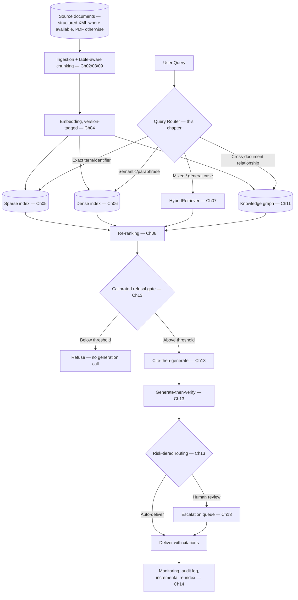
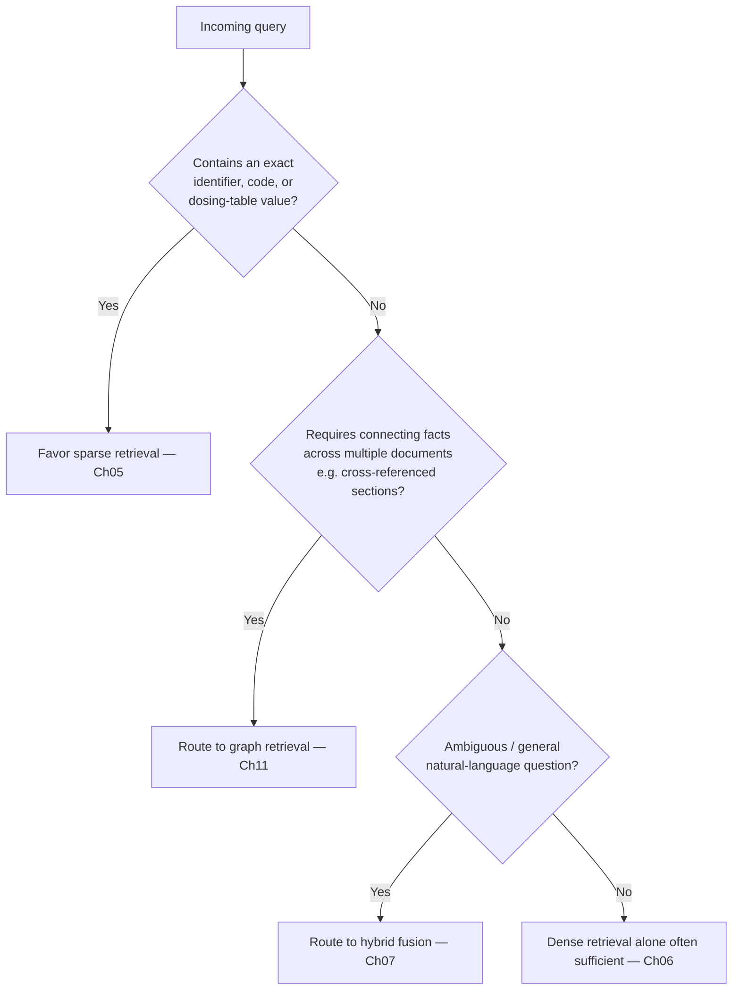
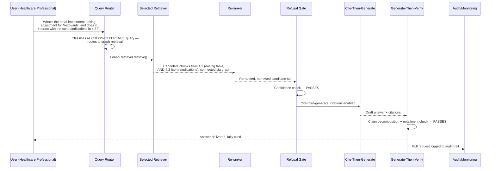
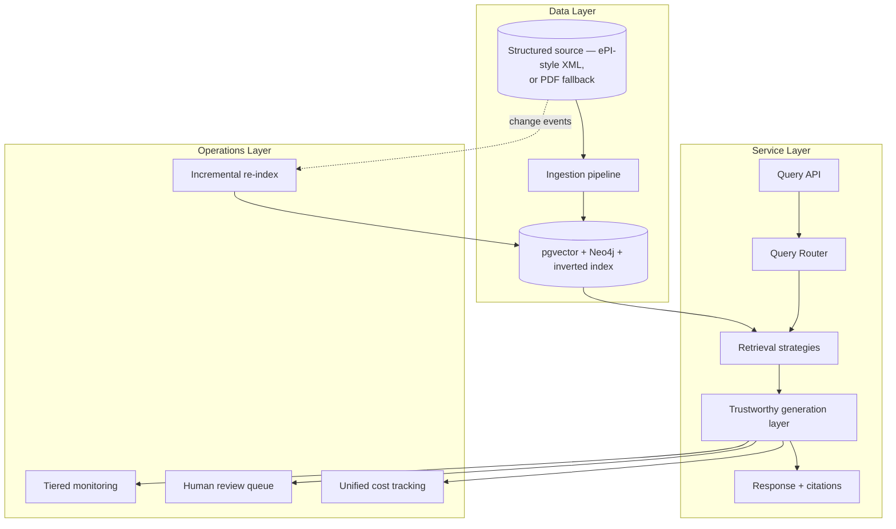
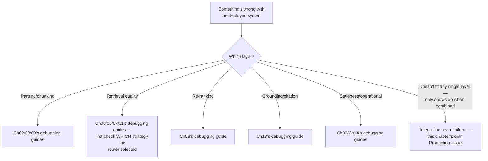

# Chapter 15 — Capstone: Production Document Intelligence RAG System

> "Every chapter in this course built and tested one module in isolation. This is the chapter where those fourteen modules become one application — and get handed to someone who is trusting it with something that actually matters."

**Learning Objectives**

By the end of this chapter, you will be able to:

- Assemble every component built across this course — ingestion, chunking, embeddings, sparse/dense/hybrid/graph retrieval, re-ranking, evaluation, trustworthy grounding, and production operations — into one coherent, working Document Intelligence system.
- Build a query router that deliberately selects among sparse, dense, hybrid, and graph retrieval per query, rather than defaulting to whichever technique feels most sophisticated.
- Apply this course's full stack to a genuinely hard, safety-critical, structured document domain — a corpus of drug product information documents — while confirming every technique still generalizes to legal, financial, or technical document domains unchanged.
- Design an ingestion pipeline that anticipates a shift toward structured, machine-readable source formats rather than only scraping static documents.
- Wire citation enforcement, calibrated refusal, and risk-tiered human escalation into a single generation layer appropriate for a domain where a wrong answer has real consequences.
- Identify and defend against integration-level security gaps — failures that occur only at the *seams* between correctly-functioning components, not within any single one.
- Validate, with actual evidence rather than assertion, that this architecture genuinely generalizes across structured-document domains by testing it against a second, different domain.
- State honestly, in the system's own design, exactly what this system is — and is not — qualified to do autonomously.

**Prerequisites**

- Chapters 01–14 completed in full — this chapter assumes and directly reuses every component, class, and pattern built across this entire course, without reintroducing any of them from scratch.
- All tooling and API access established across prior chapters (an LLM provider, a vector database, an evaluation framework).
- No new dependencies beyond what Chapters 01–14 already required.

**Estimated Reading Time:** 90–100 minutes
**Estimated Hands-on Time:** 6–8 hours

---

## ⚡ Fast Read

> **Skim time: 5 minutes** — Read this if you're in a hurry, returning for reference, or already familiar with part of this topic.

- **What it is:** The complete assembly of every technique built across this course into one production Document Intelligence RAG system, worked through using a corpus of drug product information documents — chosen specifically because it's the hardest version of the general problem, not because this system only works for medicine.
- **Why it matters:** Fourteen chapters built and individually validated fourteen separate capabilities. None of them, alone, is a system. This chapter is where "the reranker works" and "the citation enforcement works" and "the incremental re-indexing works" become one thing a real user can actually depend on.
- **Key insight:** The hardest bugs in this system won't come from any single component — every one of them was already tested in its own chapter. They'll come from the *seams* between components, where an assumption one component's author made turns out not to hold once it's connected to a different component someone else built — access control enforced independently in retrieval but not in graph traversal, for instance, is a gap neither component's own tests could ever catch.
- **What you build:** A query router selecting among every retrieval strategy this course built, a fully assembled `DocumentIntelligenceSystem` combining ingestion through operational monitoring, and direct evidence — not just an architectural claim — that the same system generalizes to a second, different structured-document domain.
- **Jump to:** [Core Concepts](#core-concepts) | [First Code](#beginner-implementation) | [Best Practices](#best-practices) | [Mini Project](#mini-project)

---

## Why This Topic Exists

Look back at what's actually been built. Chapter 02 parses documents. Chapter 03 chunks them without destroying their structure. Chapter 04 embeds them, version-tagged. Chapters 05 through 08 retrieve, fuse, and re-rank. Chapter 09 handles tables without losing row-to-header association. Chapter 10 handles genuinely visual content. Chapter 11 handles relationships that span documents. Chapter 12 measures whether any of this actually works. Chapter 13 makes sure a wrong answer doesn't quietly reach a user who trusted it. Chapter 14 keeps all of it correct for years, not just on launch day. Every single one of these was built, tested, and evaluated as its own thing.

A real Document Intelligence system is not fourteen separate things. It's one thing, and the fourteen components have to work *together*, under one router that decides which retrieval strategy actually applies to a given query, one citation layer that survives whichever retrieval path was taken, one operational discipline that watches the whole assembled pipeline rather than each piece in isolation. This chapter builds that one thing.

It's worked through here using a corpus of drug product information documents — regulatory documents describing an approved medicine's indications, dosing, contraindications, and warnings — specifically because this domain concentrates every hard problem this course has covered into one corpus: dense, weight-based dosing tables (Chapter 09's exact concern), mandatory cross-references baked directly into the document's own required structure (Chapter 11's exact use case), a strict, dated notion of document currency where an outdated answer is a genuine safety risk (Chapters 06 and 14's exact concern), and consequences serious enough that Chapter 13's entire trustworthiness apparatus stops being optional. **None of this makes the architecture medicine-specific.** Everything built in this chapter maps directly onto a corpus of legal contracts, financial filings, or technical safety manuals — swap the corpus, keep the system, exactly as this course's domain thread promised from Module 3 onward. This chapter proves that claim with evidence, not just an assertion, in its Production Project.

> **A note on the example corpus:** This chapter uses a fictional medicine, **Nexovantil**, built to follow the real, current structural conventions of an EMA-governed Summary of Product Characteristics (SmPC) — the same section numbering, the same kind of dosing table, the same kind of cross-reference pattern real SPCs actually use. This mirrors exactly how Chapters 01–08 used a fictional company ("Aperture Cloud") rather than a real one — the goal throughout has been to teach document *structure* and *system architecture*, not to state facts about any specific real medicine's actual approved dosing, which this chapter is careful never to do.

---

## Real-World Analogy

**Fourteen Libraries, One Application**

Every chapter in this course has been, in a real sense, building and testing one well-scoped library: a parsing library, a chunking library, a retrieval library (four different retrieval strategies, in fact), a re-ranking library, an evaluation library, a trustworthiness library, an operations library. Each one has its own tests, its own documentation, its own README explaining exactly what it does and doesn't guarantee.

None of that is a shipped application. An application is what happens when a team wires those fourteen libraries together, behind one API, with one router deciding which retrieval library actually applies to a given request, one authentication layer that has to be consistent across every library's own idea of "authorized," and one on-call rotation responsible for the whole thing when it breaks at 2 a.m. — not for any one library in isolation. The hardest bugs a team like that ever ships are almost never inside any single library; they're at the boundaries, where library A's assumption about what library B already checked turns out to be wrong. This chapter is that integration work, done deliberately, for the first time in this course.

---

## Core Concepts

### Document Intelligence System

- **Technical definition:** The complete, assembled application this chapter builds — every retrieval strategy, the query router selecting among them, citation enforcement, calibrated refusal, risk-tiered escalation, and operational monitoring, wired into one coherent service over a structured document corpus.
- **Simple definition:** The one working application that all fourteen of this course's separate capabilities become, once they're actually connected together and pointed at a real corpus.
- **Analogy:** The shipped application built from fourteen individually-tested libraries — the thing a user actually interacts with, not any one library on its own.

### Query Router

- **Technical definition:** The system-level component that classifies an incoming query and dispatches it to the retrieval strategy (sparse, dense, hybrid, or graph) actually suited to it — informed directly by Chapter 07's finding that fusion isn't universally superior to its components and Chapter 11's finding that graph retrieval can underperform plain vector retrieval on simple lookups.
- **Simple definition:** The dispatcher deciding, for each individual question, which of this course's four retrieval strategies actually has the best shot at answering it correctly.
- **Analogy:** A hospital's triage desk directing a patient to the right specialist rather than sending every single patient to the most equipped (and most expensive, slowest) specialist in the building by default.

### Domain Generalization

- **Technical definition:** The property that an architecture designed and validated against one structured-document domain (here, drug product information) produces correct, comparable results when the same architecture — unchanged in its logic — is pointed at a structurally similar but topically unrelated corpus (legal contracts, financial filings), demonstrating that the architecture generalizes rather than having been implicitly tuned to one domain's specifics.
- **Simple definition:** Proof, not just a claim, that swapping the corpus really does work without touching the system's actual logic.
- **Analogy:** A well-designed accounting system that works correctly for a bakery and a law firm without being rewritten — the underlying logic (debits, credits, ledgers) is genuinely general, even though the specific numbers flowing through it look completely different.

### Structured Source Ingestion

- **Technical definition:** An ingestion architecture designed to consume a document domain's source content in its *most structured available form* (e.g., machine-readable XML under a defined schema) rather than only the least structured, most lossy form (a rendered PDF or scraped web page) — anticipating a regulatory or industry shift toward structured publishing rather than retrofitting for it after the fact.
- **Simple definition:** Building your ingestion pipeline to read the cleanest, most structured version of a document's source that actually exists or is coming soon — not just whatever's easiest to scrape today.
- **Analogy:** Designing a shipping system to read a supplier's structured EDI data feed directly, rather than building increasingly elaborate scrapers to parse the PDF invoices the supplier happens to email today, when a structured feed is already on the supplier's own roadmap.

### Integration Seam Failure

- **Technical definition:** A failure mode that occurs specifically at the boundary between two independently-correct components — where an assumption one component relies on (e.g., "authorization was already checked upstream") isn't actually guaranteed by the specific component connected to it, even though each component individually passes its own tests and its own security review.
- **Simple definition:** A bug that isn't really *in* any single piece — it's in the gap between two pieces that each work fine on their own, but were never actually tested together.
- **Analogy:** Two departments in a company, each following their own process correctly, where a customer's cancellation request gets lost specifically because each department assumed the *other* one would log it — no individual department did anything wrong, and the failure only exists in the handoff between them.

---

## Architecture Diagrams

### Diagram 1 — The Complete, Assembled System



### Diagram 2 — Query Router Decision Logic



---

## Flow Diagrams

### One Query, End to End Through the Entire System



---

## Beginner Implementation

We start with the simplest possible end-to-end assembly — every component's simplest form, wired together over a small, illustrative Nexovantil excerpt — so the shape of the full system is visible before any production concerns are added.

```python
# Learning example — beginner_end_to_end.py
# The simplest possible complete pipeline: parse, chunk, embed, retrieve
# (sparse only), and generate WITH citations — every stage from an
# earlier chapter, wired together for the first time.

from dataclasses import dataclass

@dataclass
class Chunk:
    chunk_id: str
    text: str
    source: str
    score: float = 0.0

# A small, illustrative excerpt reflecting REAL SmPC structural
# conventions (section numbering, dosing-table format, cross-reference
# style) for a FICTIONAL medicine — never a real approved drug's actual
# dosing information.
NEXOVANTIL_EXCERPT = {
    "4.2_posology": (
        "| Renal Function | Creatinine Clearance | Dose Adjustment |\n"
        "| --- | --- | --- |\n"
        "| Normal | >90 mL/min | 10 mg once daily |\n"
        "| Mild impairment | 60-89 mL/min | 10 mg once daily |\n"
        "| Moderate impairment | 30-59 mL/min | 5 mg once daily |\n"
        "| Severe impairment | <30 mL/min | Not recommended — see section 4.3 |\n"
    ),
    "4.3_contraindications": (
        "Nexovantil is contraindicated in patients with severe renal "
        "impairment (creatinine clearance <30 mL/min) due to increased "
        "risk of accumulation. See section 4.2 for dose adjustment guidance."
    ),
}

def naive_chunk_by_section(document: dict[str, str], source: str) -> list[Chunk]:
    """The simplest possible chunking — one chunk per section, preserving
    Ch09's table-aware discipline (the dosing table stays intact, with
    its header, as ONE chunk) without yet adding the full table-aware
    splitting logic Ch09 built for LARGER tables."""
    return [Chunk(chunk_id=f"{source}_{key}", text=text, source=source) for key, text in document.items()]

def simple_sparse_retrieve(query: str, chunks: list[Chunk], k: int = 2) -> list[Chunk]:
    """A minimal keyword-overlap retriever standing in for Ch05's full
    BM25 implementation — sufficient to demonstrate the END-TO-END shape
    of the pipeline without re-deriving Ch05's own content here."""
    scored = []
    query_terms = set(query.lower().split())
    for chunk in chunks:
        overlap = len(query_terms & set(chunk.text.lower().split()))
        scored.append((chunk, overlap))
    scored.sort(key=lambda x: -x[1])
    return [c for c, _ in scored[:k]]

if __name__ == "__main__":
    chunks = naive_chunk_by_section(NEXOVANTIL_EXCERPT, source="nexovantil_smpc_v3")
    query = "What is the dose adjustment for severe renal impairment?"
    retrieved = simple_sparse_retrieve(query, chunks)

    print("Retrieved chunks:")
    for c in retrieved:
        print(f"  [{c.chunk_id}]\n{c.text}\n")
    # Notice: the dosing table (4.2) is retrieved, and its "Not
    # recommended — see section 4.3" note is a CROSS-REFERENCE this
    # simple sparse retriever has no way to follow on its own — exactly
    # the gap Ch11's graph retrieval, added later in this chapter, closes.
```

**Walking through what's actually happening:**

- `NEXOVANTIL_EXCERPT` deliberately reproduces two real, load-bearing SmPC conventions confirmed by this chapter's own research: a weight/renal-function-based dosing table (Chapter 09's exact concern) in section 4.2, and an explicit, structurally mandatory cross-reference from 4.2 to 4.3 — the kind of connection Chapter 11's graph retrieval exists specifically to follow.
- `naive_chunk_by_section` keeps the dosing table intact as one chunk, honoring Chapter 09's table-aware discipline at the simplest possible scale — a full production version, built later in this chapter, uses Chapter 09's actual row-boundary splitting logic for tables too large to fit in one chunk.
- Run this and notice the retrieved dosing-table chunk contains the phrase "see section 4.3" — a plain-text pointer this simple retriever has no ability to actually *follow*. That gap, made visible here in the simplest possible pipeline, is exactly what the rest of this chapter's assembly closes.

---

## Intermediate Implementation

Now the query router — the first genuinely new piece of logic in this chapter, since no single earlier chapter built the component deciding *among* every retrieval strategy this course built.

```python
# Learning example — intermediate_query_router.py
# Classifies a query and routes it to the retrieval strategy actually
# suited to it — informed directly by Ch07's and Ch11's own findings
# that neither fusion nor graph retrieval is universally superior.

import re
from enum import Enum

class RetrievalStrategy(Enum):
    SPARSE = "sparse"       # Ch05 — exact identifiers, codes, precise terms
    DENSE = "dense"         # Ch06 — paraphrased, semantic queries
    HYBRID = "hybrid"       # Ch07 — the general-case default
    GRAPH = "graph"         # Ch11 — cross-document/cross-section relationships

# Patterns suggesting an exact-identifier query (Ch05's exact-match strength)
IDENTIFIER_PATTERN = re.compile(r"\b\d+(\.\d+)*\b|\b[A-Z]{2,}-?\d+\b")

# Phrases suggesting the query needs to connect information ACROSS
# sections or documents — Ch11's exact use case, not a simple lookup.
CROSS_REFERENCE_SIGNALS = [
    "interact with", "relate to", "cross-referenc",
    "in conjunction with", "together with", "combined with",
]

def classify_query(query: str) -> RetrievalStrategy:
    """
    This function is the direct code answer to a question this course
    has asked repeatedly, at increasing scale: Ch07 asked "sparse or
    dense or both, for THIS query?"; Ch11 asked "graph or hybrid, for
    THIS query?". This function asks both at once, over the FULL set
    of strategies this course built.
    """
    query_lower = query.lower()

    if any(signal in query_lower for signal in CROSS_REFERENCE_SIGNALS):
        return RetrievalStrategy.GRAPH

    if IDENTIFIER_PATTERN.search(query):
        return RetrievalStrategy.SPARSE

    # Default to hybrid, not dense-alone or sparse-alone — Ch07's
    # finding that fusion is the safest general-case default still
    # holds at the FULL system level, not just within Ch07's own scope.
    return RetrievalStrategy.HYBRID

def route_and_retrieve(query: str, retrievers: dict[RetrievalStrategy, object], k: int = 10) -> list[Chunk]:
    strategy = classify_query(query)
    retriever = retrievers[strategy]
    return retriever.retrieve(query, k)

if __name__ == "__main__":
    test_queries = [
        "What is dosing code REF-4471 for?",                                          # SPARSE
        "How does the renal dosing adjustment relate to the contraindications?",       # GRAPH
        "What are the common side effects patients report?",                           # HYBRID
    ]
    for q in test_queries:
        print(f"{q!r} -> {classify_query(q).value}")
```

**What changed, and why each change matters:**

1. **`classify_query` is checking for cross-reference signals FIRST, before identifier patterns.** This ordering matters: a query like "how does the renal dosing adjustment relate to the contraindications" doesn't contain an exact identifier at all, but a query mentioning BOTH a specific code AND a cross-reference phrase should still be recognized as needing graph traversal — the relationship, not the identifier, is the harder part of that query.
2. **This function does not reach for graph retrieval by default, or even often** — it's checked first specifically because it's the most expensive strategy (Chapter 11's own cost research), and the router's job is finding queries that specifically justify that cost, not routing generously toward the most sophisticated available tool.
3. **`route_and_retrieve` takes a dictionary of already-built retrievers**, not a hardcoded choice — this is the direct integration point where Chapters 05, 06, 07, and 11's retrievers, built independently across the course, become interchangeable options behind one dispatcher, exactly matching the `Retriever` Protocol discipline Chapter 01 established specifically to make this kind of composition possible.
4. **Run the test queries and confirm each one routes where you'd expect** — this is the first real integration test in this chapter: not whether any single retriever works (already proven, chapter by chapter), but whether the *decision* about which one to use is being made correctly.

---

## Advanced Implementation

Production assembly means one `DocumentIntelligenceSystem` combining every component this course built — ingestion through operational monitoring — with the query router deciding retrieval strategy and Chapter 13's full trustworthiness layer guarding every answer regardless of which path produced it.

```python
# Production example — advanced_document_intelligence_system.py
# The complete, assembled Document Intelligence system — every
# component from Ch02 through Ch14, wired together behind one interface.

from __future__ import annotations
from dataclasses import dataclass, field
from enum import Enum

class RiskTier(Enum):
    AUTO_DELIVER = "auto_deliver"
    HUMAN_REVIEW = "human_review"
    AUTO_REFUSE = "auto_refuse"

@dataclass
class SystemResult:
    answer: str | None
    citations: list[dict]
    retrieval_strategy_used: str
    risk_tier: RiskTier
    unsupported_claims: list[dict] = field(default_factory=list)

class DocumentIntelligenceSystem:
    """
    The complete assembly. Every dependency here is a class ALREADY
    built, chapter by chapter, across this course — this class contains
    almost no new retrieval, generation, or verification logic of its
    own. Its entire job is composition: routing, sequencing, and making
    sure every path through the system passes through the SAME
    trustworthiness and operational gates, regardless of which
    retrieval strategy was actually used.
    """

    def __init__(
        self,
        sparse_retriever,      # Ch05
        dense_retriever,       # Ch06
        hybrid_retriever,      # Ch07
        graph_retriever,       # Ch11
        reranker,              # Ch08
        trustworthy_rag,       # Ch13's TrustworthyRAG — refusal gate, cite-then-generate, generate-then-verify
        cost_tracker_factory,  # Ch14 — per-query QueryCostTracker
        high_impact_domains: set[str],
    ):
        self.retrievers = {
            RetrievalStrategy.SPARSE: sparse_retriever,
            RetrievalStrategy.DENSE: dense_retriever,
            RetrievalStrategy.HYBRID: hybrid_retriever,
            RetrievalStrategy.GRAPH: graph_retriever,
        }
        self.reranker = reranker
        self.trustworthy_rag = trustworthy_rag
        self.cost_tracker_factory = cost_tracker_factory
        self.high_impact_domains = high_impact_domains

    def answer(self, query: str, query_domain: str | None = None) -> SystemResult:
        tracker = self.cost_tracker_factory()

        # STEP 1 — route (this chapter's new integration logic)
        strategy = classify_query(query)
        retriever = self.retrievers[strategy]

        # STEP 2 — retrieve wide, then re-rank narrow (Ch01's original
        # discipline, honored at the full-system level)
        candidates = retriever.retrieve(query, k=40)
        tracker.vector_search_cost += 0.002
        reranked = self.reranker.rerank(query, candidates, top_n=10)
        tracker.rerank_cost += 0.001

        # STEP 3 — the ENTIRE Ch13 trustworthiness layer, applied
        # IDENTICALLY regardless of which retrieval strategy was used.
        # This uniformity is the whole point: a graph-retrieved answer
        # and a sparse-retrieved answer face the EXACT SAME refusal
        # gate, citation enforcement, and verification pass.
        trust_result = self.trustworthy_rag.answer_with_chunks(query, reranked, query_domain)
        tracker.generation_cost += 0.01

        # STEP 4 — risk classification, informed by domain impact
        is_high_impact = query_domain in self.high_impact_domains
        risk_tier = RiskTier.AUTO_REFUSE if trust_result.answer is None else (
            RiskTier.HUMAN_REVIEW if (not trust_result.fully_grounded or is_high_impact)
            else RiskTier.AUTO_DELIVER
        )

        return SystemResult(
            answer=trust_result.answer,
            citations=trust_result.citations,
            retrieval_strategy_used=strategy.value,
            risk_tier=risk_tier,
            unsupported_claims=trust_result.unsupported_claims,
        )
```

```sql
-- Production example — capstone_schema.sql
-- The complete, unified schema — extending every prior chapter's own
-- schema addition into ONE coherent set of tables, rather than
-- treating each chapter's schema change as a separate, disconnected
-- artifact.

CREATE EXTENSION IF NOT EXISTS vector;

CREATE TABLE chunks (
    id                  bigserial PRIMARY KEY,
    chunk_id            text UNIQUE NOT NULL,        -- Ch07: stable identity for fusion
    text                text NOT NULL,
    source              text NOT NULL,
    section_number      text,                         -- e.g. '4.2', '4.3' — SmPC-style structure
    element_type        text NOT NULL DEFAULT 'text',  -- Ch09: 'text', 'table', 'key_value'
    modality            text NOT NULL DEFAULT 'text',  -- Ch10: 'text', 'image', 'both'
    embedding           vector(1536),
    embedding_model     text NOT NULL,                 -- Ch04: version-tagged, checked every query
    document_revision_date date NOT NULL,               -- SmPC section 10 equivalent — currency tracking
    updated_at          timestamptz NOT NULL DEFAULT now()
);

CREATE INDEX chunks_embedding_hnsw_idx ON chunks USING hnsw (embedding vector_cosine_ops) WITH (m = 16, ef_construction = 128);
CREATE INDEX chunks_element_type_idx ON chunks (element_type);

-- Ch14's operational registry, extended with a pointer back to the
-- document domain — so a blue-green rollout can be scoped to ONE
-- domain's corpus without affecting others sharing the same system.
CREATE TABLE index_versions (
    id                  bigserial PRIMARY KEY,
    version_name        text NOT NULL,
    embedding_model      text NOT NULL,
    document_domain      text NOT NULL,   -- 'smpc', 'legal_contracts', 'financial_filings' — Domain Generalization proof point
    status               text NOT NULL DEFAULT 'shadow',
    created_at           timestamptz NOT NULL DEFAULT now()
);

-- Ch13's audit log, now explicitly tying every outcome back to WHICH
-- retrieval strategy this chapter's router selected — the concrete
-- data needed to validate the router's own decisions after the fact.
CREATE TABLE audit_log (
    id                      bigserial PRIMARY KEY,
    query                    text NOT NULL,
    retrieval_strategy_used  text NOT NULL,
    answer                   text,
    risk_tier                text NOT NULL,
    unsupported_claims       jsonb,
    reviewed_by              text,
    created_at               timestamptz NOT NULL DEFAULT now()
);
```

```yaml
# Deployment example — docker-compose.yml
# The complete local development stack — pgvector for the primary
# retrieval store (Ch06) and Neo4j for the knowledge graph (Ch11),
# brought up together as this chapter's actual runnable environment.
services:
  postgres:
    image: pgvector/pgvector:pg17
    environment:
      POSTGRES_PASSWORD: dev_password_change_me
      POSTGRES_DB: document_intelligence
    ports: ["5432:5432"]
    volumes: [pgdata:/var/lib/postgresql/data]
  neo4j:
    image: neo4j:5-community
    environment:
      NEO4J_AUTH: neo4j/dev_password_change_me
      NEO4J_PLUGINS: '["graph-data-science"]'
    ports: ["7474:7474", "7687:7687"]
    volumes: [neo4j_data:/data]
volumes:
  pgdata:
  neo4j_data:
```

**Why this shape earns its complexity:**

- **`DocumentIntelligenceSystem` deliberately contains almost no new retrieval, generation, or verification logic** — every one of those was already built and tested in its own chapter. Its only real job is *composition*: routing to the right retriever, and guaranteeing the *same* trustworthiness gate applies no matter which retriever answered the routing question.
- **Step 3's uniformity is the single most important design decision in this entire chapter.** A query routed to `GraphRetriever` and a query routed to `SparseRetriever` both pass through the identical `TrustworthyRAG` instance — there is no code path where a "more sophisticated" retrieval strategy gets to skip the refusal gate, citation enforcement, or verification pass that a simpler one has to pass through.
- **The SQL schema's `document_domain` column on `index_versions` exists specifically to make Domain Generalization checkable, not just claimed** — the Production Project below uses exactly this column to run the same system against a second corpus and compare results directly.
- **The Docker Compose file brings up both Postgres/pgvector and Neo4j together** — this is the concrete, runnable expression of "every retrieval strategy this course built is genuinely available in one environment," not a diagram-only claim.

> **Currency Note:** This chapter's SPC structural conventions (section numbering, the QRD template's clinical-particulars subsections) reflect the currently published EMA template version as of this writing; a newer version was in public consultation at the time of this chapter's research, with its finalization status unconfirmed — confirm the current template version directly against EMA's own documentation before using this chapter's structure as a literal reference for real regulatory work. The EU AI Act's classification of health-related AI systems as high-risk, and its associated obligation timeline, is also current as of this writing and subject to regulatory change — any real deployment in a regulated domain requires direct legal and compliance review, not reliance on this chapter's general-awareness framing.

---

## Production Architecture



This is deliberately the same shape Volume 2's MCP server deployment discipline established — a data layer, a service layer, and an operations layer, cleanly separated — applied here specifically to a RAG service rather than an MCP tool server. The separation matters for the same reason it always does: each layer can be scaled, deployed, and operated independently, and a change to the query router doesn't require redeploying the ingestion pipeline.

---

## Best Practices

1. **Route queries deliberately among retrieval strategies — never default to the most sophisticated one available.** This chapter's router checks for graph-worthy signals specifically because graph retrieval is the most expensive strategy this course built, not because it's the "best" one in some absolute sense.
2. **Preserve citation provenance end to end**, from the specific document element Chapter 09's parser identified through to the exact span Chapter 13's citation mechanism displays — a broken link anywhere in that chain breaks the entire trustworthiness guarantee.
3. **Design ingestion anticipating the most structured source format realistically available**, not just whatever's easiest to scrape today — a regulated domain moving toward structured, machine-readable publishing (as this course's research found for SmPC content specifically) rewards this choice directly.
4. **Never assume individually-tested components compose correctly without integration testing the full request path.** Every retrieval strategy, the reranker, and the trustworthiness layer each passed their own chapter's tests — that guarantees nothing about whether they behave correctly *together*.
5. **Enforce the regulatory/human-oversight boundary in code, not just in a compliance document.** `RiskTier` and `high_impact_domains` are executable, testable enforcement — a policy that only exists in a document nobody's code actually reads is not enforcement.
6. **Validate the "swap the corpus" claim directly, with a second domain, before believing it.** This chapter's Production Project requires exactly this — an architectural claim without evidence is still just a claim.
7. **Instrument the fully-assembled system with Chapter 14's operational layer from the first deployment**, not as a retrofit once something's already gone wrong in production.
8. **State this system's actual scope explicitly, in its own outputs** — decision support for a qualified professional, not an autonomous authority — rather than leaving that boundary only in internal documentation a user never sees.

---

## Security Considerations

- **Integration seams are where this system's real, novel security risk lives.** Every individual chapter's security section — corpus poisoning, prompt injection, citation-based data leaks, retrieval pivot attacks — still applies, all simultaneously, but the assembled system introduces a *new* category on top of all of them: a document correctly access-controlled for one retrieval path (say, text-based hybrid retrieval) may not have equivalent access control enforced for a different path connected to the same underlying content (its graph-traversal-reachable connections, or its multimodal image representation) — because each retrieval strategy's own chapter tested its own access-control enforcement in isolation, never against the other strategies it's now composed with. This is not a recap of any single earlier chapter's security section; it's a genuinely new risk that only exists once components are actually assembled.
- **A full security review of the assembled system must therefore explicitly test every combination of retrieval paths a single document could reach through**, not just each path independently — the union of every earlier chapter's own security considerations is the necessary floor, not the whole story.

---

## Cost Considerations

| Layer | Cost driver | Notes |
|---|---|---|
| Ingestion & parsing (Ch02, 09) | Per-document parsing/OCR/VLM cost | Structured-source ingestion (ePI-style XML) reduces this substantially where available |
| Embeddings (Ch04) | Per-chunk embedding API cost, one-time plus incremental | Version-tagged; re-embedding only on model upgrade (Ch14's blue-green pattern) |
| Sparse + dense + hybrid retrieval (Ch05-07) | Near-zero marginal query cost (sparse), HNSW query cost (dense) | The cheapest layer of the whole system, per query |
| Graph retrieval (Ch11) | Entity extraction/resolution cost at ingestion, graph query cost at retrieval | Reserved by the router for genuinely relationship-spanning queries only |
| Re-ranking (Ch08) | Per-query cross-encoder or API cost | Applied only to the router-selected strategy's narrowed candidate pool |
| Generate-then-verify (Ch13) | Roughly doubles generation-stage cost | Non-negotiable for a high-impact domain, per Chapter 13's own framing |
| Monitoring overhead (Ch14) | Roughly 15-30% added to base inference cost, per current industry reporting | The cost of actually knowing whether the system still works |

The overall shape worth internalizing, one final time: **this system's total cost is the sum of every layer above, not any single one of them** — exactly the unified, system-level FinOps view Chapter 14 argued for, now applied to the fully assembled system rather than described in the abstract.

---

## Production Issue: An Integration Seam Grants Access Neither Component Intended

**Symptoms**
A user with limited access permissions (say, access to general product information but not to a restricted internal annotation) receives an answer that references or reveals content they should not have been able to see — even though the document's access-control rules were correctly enforced by the retriever that directly serves that user's typical query type.

**Root Cause**
The document's access rule was correctly enforced by, say, the `HybridRetriever` (Chapter 07), which the user's queries normally hit. But the same document also has entries in the knowledge graph (Chapter 11) and possibly a multimodal image representation (Chapter 10) — each built and access-controlled by its own chapter's own logic, tested only against that chapter's own retriever. When the query router (this chapter) sends a *different* query from the *same* user to the graph retriever instead, the graph traversal's own access-control enforcement — built and tested independently, in isolation, back in Chapter 11 — turns out not to match the hybrid retriever's rules exactly, and the mismatch was never caught because no single chapter's own test suite ever exercised this specific combination.

**How to Diagnose It**
1. Identify which retrieval strategy actually served the leaking response — check `SystemResult.retrieval_strategy_used` in the audit log.
2. Compare that strategy's access-control enforcement directly against the strategy the user's queries normally use, for the *same* document and the *same* user's permission level.
3. Confirm whether an integration test exists that exercises this specific combination (this user's permission level, this document, this non-default retrieval strategy) — its absence is itself diagnostic.

**How to Fix It**
```python
# Wrong: each retriever enforces access control independently, with no
# shared, single source of truth checked identically across all of them
class HybridRetriever:
    def retrieve(self, query, k):
        return [c for c in self._search(query, k) if self._own_access_check(c)]

class GraphRetriever:
    def retrieve(self, query, k):
        return [c for c in self._traverse(query, k) if self._different_access_check(c)]

# Right: a single, shared authorization check applied UNIFORMLY at the
# system level, after ANY retriever returns results — not trusted to
# be consistently reimplemented inside every individual retriever
def enforce_uniform_authorization(chunks, requesting_user) -> list:
    return [c for c in chunks if shared_authorization_service.check(c.source, requesting_user)]

# In DocumentIntelligenceSystem.answer():
candidates = retriever.retrieve(query, k=40)
candidates = enforce_uniform_authorization(candidates, requesting_user)  # applied to EVERY strategy identically
```

**How to Prevent It in Future**
Enforce authorization once, centrally, as a post-retrieval filter applied identically regardless of which retrieval strategy produced the candidates — never trust each retrieval strategy to reimplement the same access rule correctly and consistently on its own. Build integration tests specifically covering every combination of retrieval strategy and permission level, not just each strategy's own default-path tests — this is precisely the class of test no single earlier chapter's own test suite could have caught, because it only exists once components are assembled.

---

## Common Mistakes

**Mistake 1 — Deploying every sophisticated technique by default, without validating each one earns its cost for this specific corpus.**
```python
# Wrong: graph retrieval, multimodal retrieval, and agentic retrieval
# all enabled unconditionally, regardless of whether this corpus and
# query distribution actually benefit from any of them
system = DocumentIntelligenceSystem(use_graph=True, use_multimodal=True, use_agentic=True)

# Right: validate each capability against Ch12's evaluation harness on
# THIS corpus before enabling it
if evaluation_harness.compare_strategies(...)["graph"] > evaluation_harness.compare_strategies(...)["hybrid"]:
    enable_graph_retrieval()
```

**Mistake 2 — Assuming individually-tested components compose correctly without integration testing.**
```python
# Wrong: each component's own chapter-level tests are treated as
# sufficient proof the ASSEMBLED system works correctly
assert sparse_retriever.passes_ch05_tests()
assert graph_retriever.passes_ch11_tests()
# ...and the system is shipped, untested as a WHOLE

# Right: a dedicated integration test suite exercising the FULL request
# path, across every retrieval strategy and permission combination
test_full_pipeline_end_to_end(query, expected_strategy, expected_access_result)
```

**Mistake 3 — Treating "swap the corpus" as automatically true without testing it.**
```python
# Wrong: assuming the architecture generalizes because it was designed
# to, with no actual test against a second domain
claim_domain_general_architecture()  # no evidence

# Right: run the SAME system against a second, different domain and
# compare results directly (this chapter's Production Project)
smpc_results = system.evaluate_on_domain("smpc_corpus")
legal_results = system.evaluate_on_domain("legal_contracts_corpus")
compare_and_document(smpc_results, legal_results)
```

**Mistake 4 — Building the trustworthiness layer as a bolt-on afterthought.**
```python
# Wrong: citation enforcement and refusal gating added AFTER the
# retrieval and generation pipeline is already built and deployed
deploy(retrieval_pipeline)
# ...later... add_citations_because_users_complained()

# Right: Ch13's trustworthiness layer is a first-class, non-optional
# stage from the FIRST version of the assembled system
system = DocumentIntelligenceSystem(..., trustworthy_rag=trustworthy_rag)  # never optional
```

**Mistake 5 — Leaving a new integration seam unreviewed for security consistency.**
```python
# Wrong: a new retrieval strategy is added to the router without
# re-reviewing access control across every OTHER strategy it now composes with
router.add_strategy(RetrievalStrategy.NEW_STRATEGY, new_retriever)  # no security review

# Right: any new component added to the assembled system triggers a
# review of access-control consistency across every existing strategy
add_strategy_with_integration_security_review(new_retriever)
```

---

## Debugging Guide

This chapter's debugging guide is deliberately a **master index** — a pointer to the specific earlier chapter's own debugging guide for each layer, since the individual failure modes were already covered in full depth there.



| Symptom | Likely cause | First thing to check |
|---|---|---|
| Wrong retrieval strategy seems to have been used | Query router misclassification | Check `SystemResult.retrieval_strategy_used` and compare against `classify_query`'s expected behavior |
| A failure that no single chapter's debugging guide explains | Integration seam — a gap between two correctly-functioning components | Review this chapter's Production Issue directly |
| Everything else | The specific layer's own, previously-built debugging guide | Match the symptom to the layer using the flowchart above |

---

## Performance Optimisation

A final synthesis of where this course's biggest wins actually came from, in rough order of leverage for a typical production deployment:

| Technique | Chapter | Why it's high-leverage |
|---|---|---|
| Widening the fusion candidate window before re-ranking | Ch07/08 | Directly prevents documents ranked well by only one signal from being excluded before they get a fair chance |
| Enforced (not alert-only) agentic budget limits | Ch14 | Closes an unbounded-cost failure mode entirely, not just a trade-off |
| Event-driven incremental re-indexing over full rebuilds | Ch14 | Cost scales with change rate, not corpus size — compounds as a corpus grows |
| Query routing among retrieval strategies | This chapter | Avoids paying graph/multimodal cost on queries that don't need it |
| Table-aware chunking | Ch09 | Directly prevents a specific, high-consequence class of wrong answer |

---

## Decision Framework — Applying This Architecture to a Different Domain

| Domain | Table-aware chunking (Ch09) | Graph retrieval's expected value (Ch11) | Multi-modal retrieval (Ch10) | Notes |
|---|---|---|---|---|
| Medical SmPC (this chapter's example) | Essential — dense dosing tables | High — mandatory structural cross-references | Moderate — some charts/diagrams in labeling | The hardest version of the problem, per this course's design |
| Legal contracts | Essential — schedules, fee tables | High — cross-contract counterparty/clause tracing | Low — mostly prose | Graph retrieval's cross-document strength maps directly |
| Financial filings | Essential — dense financial tables | Moderate — cross-filing analysis, less structurally mandatory than SmPC's cross-references | Moderate — charts in investor materials | Validate graph retrieval's value against Ch12's harness rather than assuming |
| Technical manuals | Essential — spec tables | Low-to-moderate — depends on cross-referencing conventions | High — diagrams, schematics | Multi-modal retrieval often earns its cost here more than graph retrieval does |

The point of this table is not to prescribe a fixed answer per domain — it's to demonstrate that the *architecture* (query router, table-aware ingestion, citation-enforced generation, tiered monitoring) stays identical across every row, while which optional capabilities (graph, multi-modal) actually earn their cost varies, and should be validated with Chapter 12's evaluation harness for each new domain, not assumed from this table.

---

## Technology Comparison — Self-Hosted Capstone vs. a Managed-Platform-Heavy Alternative

| Consideration | Self-hosted full stack (this chapter) | Managed-platform-heavy (Ch14's Bedrock Managed Knowledge Base, etc.) |
|---|---|---|
| Control over retrieval strategy selection | Full — this chapter's router is entirely custom | Limited to whatever the managed platform exposes |
| Auditability for regulatory review | Full visibility into every stage, often mandatory in regulated domains | Depends on the platform's own audit/logging exposure |
| Operational burden | Requires Chapter 14's full operational discipline, in-house | Substantially reduced, at a real per-query cost |
| Time to initial deployment | Longer — this chapter's full assembly | Shorter, for teams without existing retrieval infrastructure |

For a genuinely high-stakes, regulated deployment, the auditability and control the self-hosted approach provides is often not optional — but this is a real trade-off to make deliberately, per Chapter 14's Decision Framework, not a default in either direction.

---

## Interview Questions

1. **"Walk me through what happens to a single query, end to end, through this system."** — Expect: router classification, strategy-specific retrieval, uniform re-ranking, uniform trustworthiness gating (refusal, citation, verification) regardless of retrieval strategy, risk-tiered delivery, and operational logging.
2. **"Why does the query router check for cross-reference signals before checking for exact identifiers?"** — Expect: because graph retrieval is the most expensive strategy, and the router's job is finding queries that specifically justify that cost, not routing generously toward sophistication.
3. **"What's an integration seam failure, and why can't any single component's own tests catch it?"** — Expect: a failure at the boundary between two independently-correct components, where an assumption isn't actually guaranteed by the specific component connected to it — each component's own tests only ever tested that component in isolation.
4. **"How would you actually validate that this architecture generalizes to a different document domain, rather than just claiming it does?"** — Expect: run the identical system, unchanged, against a second domain's corpus, and compare results using the same evaluation harness — evidence, not assertion.
5. **"Why does the same trustworthiness layer need to apply uniformly regardless of which retrieval strategy was used?"** — Expect: without uniformity, a "more sophisticated" retrieval path could bypass refusal gating or citation enforcement simply because it wasn't tested against those gates as rigorously as the default path was.
6. **"When would you choose a managed RAG-as-a-service platform over this chapter's self-hosted architecture for a regulated domain?"** — Expect: when the team's operational maturity or scale doesn't justify Chapter 14's full operational discipline in-house, accepting reduced control and auditability in exchange for substantially lower operational burden — a real, deliberate trade-off.

---

## Exercises

1. **(30 min)** Run this chapter's Beginner Implementation end to end on the Nexovantil excerpt, and confirm the retrieved dosing-table chunk contains an unresolved cross-reference to section 4.3.
2. **(30 min)** Extend the query router with at least 5 additional test queries from your own domain, and confirm each one routes to the strategy you'd expect, adjusting `classify_query`'s logic if it doesn't.
3. **(45 min)** Implement `DocumentIntelligenceSystem.answer()` against a small corpus combining at least two retrieval strategies (e.g., hybrid and graph), and confirm the SAME `TrustworthyRAG` instance gates both paths identically.
4. **(60 min)** Deliberately construct the integration-seam failure this chapter's Production Issue describes: build two retrievers with subtly different access-control logic over the same document, and confirm the failure occurs — then implement `enforce_uniform_authorization` and confirm it's fixed.
5. **(90 min, harder)** Take a second, genuinely different document domain from your own work or interests (legal, financial, technical). Run this chapter's exact architecture — unchanged — against a small corpus from that domain, and document what worked without modification and what, if anything, needed adjustment.

---

## Quiz

1. **Why is a Document Intelligence system not simply "fourteen separate chapters, deployed"?**
   *Because the components have to work correctly TOGETHER — under one router, one uniform trustworthiness gate, one operational discipline — and that composition introduces failure modes none of the individual chapters' own tests could catch.*
2. **Why does the query router check for cross-reference signals before checking for exact-identifier patterns?**
   *Graph retrieval is the most expensive strategy this course built; the router's job is finding queries that specifically justify that cost, checked first so it isn't accidentally missed by a query that also happens to contain an identifier.*
3. **What is an integration seam failure?**
   *A failure occurring specifically at the boundary between two independently-correct components, where an assumption one relies on isn't actually guaranteed by the other — invisible to either component's own isolated tests.*
4. **Why must the SAME trustworthiness layer apply regardless of which retrieval strategy answered a query?**
   *Without uniformity, a more sophisticated retrieval path could bypass refusal gating or citation enforcement simply by not being tested against those gates as rigorously as the default path.*
5. **How would you actually prove an architecture generalizes across document domains, rather than just claiming it?**
   *Run the identical, unchanged system against a second domain's corpus and compare results using the same evaluation harness — evidence, not assertion.*
6. **Why does this chapter use a fictional medicine rather than a real one, despite CLAUDE.md's rule that SPCs are safe public documents to reference directly?**
   *To teach document structure and system architecture without risking stating anything inaccurate about a real medicine's actual approved dosing — the same discipline this course used with the fictional "Aperture Cloud" company throughout Modules 1-2.*
7. **What's the risk of enabling every sophisticated retrieval capability (graph, multi-modal, agentic) by default?**
   *Paying each capability's real cost on queries that don't actually benefit from it — Chapter 12's evaluation harness exists specifically to validate whether a given capability earns its cost for a specific corpus, rather than assuming it universally does.*
8. **Why does this chapter's SQL schema include a `document_domain` column on `index_versions`?**
   *To make Domain Generalization directly checkable — scoping a deployment or comparison to a specific domain's corpus, rather than leaving the generalization claim untestable.*
9. **What should this system's outputs state explicitly about its own scope and authority?**
   *That it is decision support for a qualified professional, not an autonomous authority — stated in the system's own outputs, not left only in internal documentation.*
10. **Why is the union of every earlier chapter's security considerations described as "the necessary floor, not the whole story"?**
    *Because assembling components introduces genuinely new risks at their seams — access-control inconsistency across retrieval strategies being the specific example this chapter identifies — that no single component's own security review could have anticipated.*

---

## Mini Project

**Build:** The simplest complete, end-to-end Document Intelligence pipeline over a small, illustrative corpus.

**Acceptance criteria:**
- [ ] At least 3 documents (real or realistic, from your own domain or a fictional one following this chapter's discipline) are ingested, chunked with table-aware handling where relevant, and embedded.
- [ ] `classify_query` correctly routes at least 5 test queries — including at least one identifier-heavy, one cross-reference, and one general natural-language query — to the strategy you'd expect.
- [ ] The full pipeline, for at least one query, produces a cited answer that has passed through Chapter 13's calibrated refusal gate and generate-then-verify check.
- [ ] You can point to the specific chapter responsible for each stage of your pipeline, by name, when asked.

**Time estimate:** 3–4 hours.

---

## Production Project

**Build:** The complete `DocumentIntelligenceSystem`, deployed, monitored, and validated against a second domain.

**Acceptance criteria:**
- [ ] `DocumentIntelligenceSystem` is implemented with at least three retrieval strategies wired behind the query router, confirmed via the audit log that different query types actually route differently.
- [ ] The integration-seam failure from this chapter's Production Issue is deliberately reproduced and then fixed via `enforce_uniform_authorization`, with a test confirming the fix holds.
- [ ] Chapter 14's full operational layer (incremental re-indexing, tiered monitoring, enforced agentic budgets if any agentic component is used) is wired into the assembled system, not tested separately from it.
- [ ] **Domain Generalization is validated with evidence**: the identical system is run against a second, different document domain's corpus, and results are documented — including anything that needed adjustment, honestly reported rather than glossed over.
- [ ] A complete `RUNBOOK.md` for the assembled system, consolidating the operational guidance from every relevant earlier chapter into one document: how to diagnose a failure by layer (this chapter's master debugging index), how to execute a blue-green model upgrade, how to validate a new domain before onboarding it, and this system's explicitly stated scope and limitations.

**Time estimate:** 3–5 days.

---

## Key Takeaways

- A Document Intelligence system is the composition of every technique this course built, not any single one of them — and composition itself introduces failure modes that no individual chapter's own testing could have caught.
- A query router that deliberately selects among retrieval strategies — rather than defaulting to the most sophisticated one available — directly applies Chapter 07's and Chapter 11's own findings that neither fusion nor graph retrieval is universally superior.
- The trustworthiness layer (Chapter 13) must apply identically regardless of which retrieval strategy answered a query — uniformity here is what prevents a "more sophisticated" path from silently bypassing safety guarantees the default path enforces.
- Integration seam failures — bugs that exist only at the boundary between correctly-functioning components — are this chapter's genuinely new contribution, distinct from anything covered by any single earlier chapter's own security or debugging content.
- "Swap the corpus, keep the system" is a claim that requires evidence, not just architectural intent — this chapter's Production Project exists specifically to generate that evidence.
- Every layer built across this course — ingestion, retrieval, generation, and operations — contributes to one unified cost model, not a set of independently-optimized line items.
- This system should state its own scope explicitly, as decision support for a qualified professional rather than an autonomous authority, in its outputs — not only in documentation a user may never read.
- The architecture built in this chapter, worked through using a genuinely hard, safety-critical medical document domain specifically because it's the hardest version of the problem, maps directly onto legal, financial, and technical document domains without any change to its underlying logic.

---

## Chapter Summary

| Concept | Key Takeaway |
|---|---|
| Document Intelligence System | The complete assembly of every technique this course built, not any one of them in isolation |
| Query Router | Deliberately selects among retrieval strategies — checking for the most expensive one's justification first |
| Domain Generalization | A claim requiring direct evidence from a second domain, not an architectural assertion alone |
| Structured Source Ingestion | Designing for the most structured source format realistically available, anticipating industry shifts |
| Integration Seam Failure | A genuinely new failure category, existing only at the boundaries between individually-correct components |

---

## Resources

- Every resource listed across Chapters 01–14 — this chapter assembles their content rather than introducing new sources of its own.
- [EMA — QRD templates for human medicines](https://www.ema.europa.eu/en/human-regulatory-overview/marketing-authorisation/product-information-requirements/product-information-qrd-templates-human) — the real structural conventions this chapter's fictional Nexovantil example follows.
- [EMA — Electronic Product Information (ePI)](https://www.ema.europa.eu/en/human-regulatory-overview/marketing-authorisation/product-information-requirements/electronic-product-information-epi) — the structured-source shift this chapter's ingestion design anticipates.
- Volume 2, Chapter 14 — Deploying MCP Servers at Scale, the deployment discipline this chapter's Production Architecture directly mirrors.

---

## Glossary Terms Introduced

| Term | One-line definition |
|---|---|
| Document Intelligence System | The complete, assembled application combining every retrieval, generation, and operational component this course built |
| Query Router | The component classifying and dispatching queries to the appropriate retrieval strategy |
| Domain Generalization | Evidence (not just architectural claim) that a system works unchanged across different document domains |
| Structured Source Ingestion | Designing ingestion around the most structured source format realistically available |
| Integration Seam Failure | A failure existing only at the boundary between two independently-correct components |

---

## See Also

| Chapter | Why it's relevant |
|---|---|
| Vol 3, Ch 01 — RAG Architecture Deep Dive | The `Retriever`/`Reranker`/`Generator` Protocols making this chapter's entire composition possible |
| Vol 3, Ch 07 — Hybrid Search; Ch 11 — Graph RAG | The "not universally superior" findings this chapter's query router directly operationalizes |
| Vol 3, Ch 09 — Structured Documents | The table-aware chunking discipline essential to this chapter's dosing-table handling |
| Vol 3, Ch 12 — RAG Evaluation | The evaluation harness needed to actually validate this chapter's Domain Generalization claim |
| Vol 3, Ch 13 — Trustworthy RAG | The uniform citation/refusal/verification layer every retrieval path in this chapter passes through |
| Vol 3, Ch 14 — Production RAG Architecture and Operations | The operational discipline keeping this chapter's assembled system correct over time |
| Volume 2, Ch 14 — Deploying MCP Servers at Scale | The deployment layering this chapter's Production Architecture mirrors directly |

---

## Course Completion

There is no Chapter 16 in this volume — this chapter is where Volume 3 ends. In place of a "Preparation for Next Chapter" section, here's what to actually do with what you've built.

**Technical checklist:**
- [ ] You have a working, assembled `DocumentIntelligenceSystem`, validated against at least one real or realistic corpus of your own, with every layer from ingestion through operations actually wired together and running.
- [ ] You've validated Domain Generalization directly, with evidence, against a second document domain — not just this chapter's claim that it should work.
- [ ] You have a `RUNBOOK.md` for your own system that a colleague could actually follow without you in the room.

**Conceptual check:**
- If you had to onboard a completely new structured-document domain onto this architecture next month, which chapter would you re-read first, and why?
- What's the single component in your own assembled system you'd trust least without further validation — and what would that validation actually look like?

**Optional challenge:** Take your assembled `DocumentIntelligenceSystem` and point it at a real corpus you actually care about — your own team's documentation, a public dataset in a domain you find genuinely interesting, or a structured-document collection from your own work. Run it end to end. Where it breaks, you now know exactly which of this course's fifteen chapters to go back to.

This volume assumed you'd completed Volumes 1 and 2 — basic RAG, agents, and MCP server engineering. If you haven't yet, Volume 4 (AI Agent Engineering) and the rest of the AI Engineering Handbook series continue directly from here.
